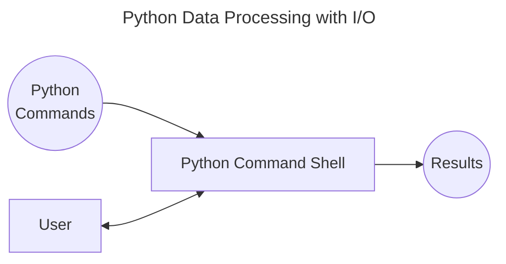

# Chapter 3: Python Program Structure

- [Notes](#notes)
  - [Write Your First Python Program](#write-your-first-python-program)
    - [Running a Python Program](#running-a-python-program)
      - [**Make Something Happen**: Run a Python
        Program](#make-something-happen-run-a-python-program)
    - [Get Program output using the `print`
      function](#get-program-output-using-the-print-function)
      - [**Make Something Happen**: Work with `print` in a
        program](#make-something-happen-work-with-print-in-a-program)
  - [Use Python Libraries](#use-python-libraries)
    - [The `random` library](#the-random-library)
      - [**Make Something Happen**: Investigate the `random`
        Library](#make-something-happen-investigate-the-random-library)
    - [The `time` library](#the-time-library)
      - [Example: Using `sleep`](#example-using-sleep)
        - [**Make Something Happen**: Make an Egg
          Timer](#make-something-happen-make-an-egg-timer)
  - [Python Comments](#python-comments)
  - [Delay the End of a Program](#delay-the-end-of-a-program)
  - [Adding some `Snaps`](#adding-some-snaps)
    - [Adding the `pygame` library](#adding-the-pygame-library)
    - [Snaps function](#snaps-function)
      - [Display Text](#display-text)
      - [Display Images](#display-images)
      - [Making Sounds](#making-sounds)
    - [Using `snaps` in your program](#using-snaps-in-your-program)
      - [Exercise: Improved Egg Timer](#exercise-improved-egg-timer)
      - [**Make Something Happen**:
        High-Low](#make-something-happen-high-low)
      - [**Make Something Happen**: Nerves of
        Steel](#make-something-happen-nerves-of-steel)
- [Summary](#summary)
- [Question and Answers](#question-and-answers)

## Notes

### Write Your First Python Program

- A program is a sequence of actions performed in order
  - A script is a type of program that often repeats a series of simple
    tasks
- Python programs are stored as text files, traditionally with a `.py`
  extension

#### Running a Python Program

- To run a program, you first need to write it. Any text editor should
  do.

##### **Make Something Happen**: [Run a Python Program](./Examples/01_FirstProgram/first_program.py)

*Open a text editor and enter the following into the file*,

``` python
2+2
```

*Save the file somewhere appropriate with a name and the .py extension.
Then run the program, if you have* `IDLE` *you can run it through that.
I personally use the command line as*

``` shell
python path-to-file
```

*You may need to use `python3` or `python3.X` depending on how your
environment is setup where `X` is the python subversion. The code should
execute but produce no output*

#### Get Program output using the `print` function

- Why did the example produce an empty output when run as a program, but
  $4$ when run through the interpreter?
  - Program returns $4$ to the caller, which for the program, is the
    shell that executes it
  - What we really want is to output to the user



- We want the program to be able to interact with the user to provide
  output, and request input
  - The first such function we need is `print`

##### **Make Something Happen**: Work with `print` in a program

*Write a python file
([`using_print.py`](./Examples/02_UsingPrint/using_print.py)) with the
following contents*

``` python
print(2+2)
```

    4

*Now run the program. It should produce the same output as above* ($4$).
*On my machine, running the following in terminal, leads to the output*
$4$ *as expected*

``` bash
python using_print.py
4
```

*Now create a new file
([using_print2.py](./Examples/02_UsingPrint/using_print2.py)) with the
following contents*

``` python
print('The answer is: ')
print(2 + 2)
```

    The answer is:
    4

*Save and run this file. The output should match the above*

*Observe here that the program automatically adds a new line, if we want
to avoid that we can instead write*

``` python
print('The answer is:', 2+2)
```

    The answer is: 4

*Write and run a new file
([using_print3.py](./Examples/02_UsingPrint/using_print3.py)) containing
the above line and check the output matches the above.*

*Here we see that one of the ways to call `print` is to provide a comma
seperated list of values. By default `print` adds a space between these
elements*

> [!CAUTION]
>
> There are several ways a python program can fail, for example
>
> ``` python
> print('The answer is: '}
> ```
>
>     SyntaxError: closing parenthesis '}' does not match opening parenthesis '(' (816620756.py, line 1)
>       Cell In[4], line 1
>         print('The answer is: '}
>                                ^
>     SyntaxError: closing parenthesis '}' does not match opening parenthesis '('
>
> leads to a syntax error, because the wrong parentheses have been used.
> Or,
>
> ``` python
> Print(2 + 2)
> ```
>
>     NameError: name 'Print' is not defined
>     ---------------------------------------------------------------------------
>     NameError                                 Traceback (most recent call last)
>     Cell In[5], line 1
>     ----> 1 Print(2 + 2)
>
>     NameError: name 'Print' is not defined
>
> leads to a `NameError` because function names are case sensitive, and
> we have put `Print` not `print`. Proper use of tooling can catch these
> syntax and other errors before you run the code, however sometimes
> errors slip through and you end up with errors occuring at run time!

### Use Python Libraries

- Libraries provide additional built in functions, like `ord` and `chr`
  already seen
- Libraries can be supplied *built-in*, i.e. supplied with the python
  install, or installed later

#### The `random` library

- Provides a source of random numbers
- To add a library we use the `import` command, e.g. `import random`
  - i.e. `import` then the name of the library
- We can then use functions from the library with the format,
  `module_name.function_name(arguments)`
  - e.g. for `random` we can use `randint` as `random.randint(1,6)` to
    generate a random number from $1$ to $6$

##### **Make Something Happen**: [Investigate the `random` Library](./Examples/03_InvestigateRandom/throw_die.py)

*Write and run a python program containing the following lines*

``` python
import random
print('You have rolled:', random.randint(1,6))
```

    You have rolled: 6

*Try running this program multiple times and see what the output is*

> [!CAUTION]
>
> **Modules and the Interpreter**
>
> If we try calling `random.randint` without importing `random` we will
> get a `NameError` since neither `random` or `randint` will be
> recognised by the interpreter.
>
> If we get the name of the module wrong, e.g. `import Random`, then we
> should get a `ModuleNotFoundError`

- The python shell and most modern text editors can access documentation
  about pythons functions to help you with using them
- Typically this is obtained by hovering over the function name. Try
  this in your setup, in mine I get the documentation:

``` python
def randint(a : int, b : int) -> int
Return random integer in range [a,b], including both end points
```

#### The `time` library

- The `time` function contains functions for managing dates and times
- The `sleep` function lets a program for a given time period
  - Tells the operating system to pause execution of the program for a
    set time period
  - Other programs continue running as normal

##### Example: [Using `sleep`](./Examples/04_Sleep/sleep.py)

*Write and execute the following program*

``` python
import time
print('I will need to think about that...')
time.sleep(5)
print('The answer is: 42')
```

    I will need to think about that...
    The answer is: 42

*You should see the program print the first line, pause for about* $5$
*seconds, then print the second line. The above cell should show the
code after all lines have run*

###### **Make Something Happen**: [Make an Egg Timer](./Exercises/01_EggTimer/egg_timer.py)

*Make an egg timer program. The program should allow the user to time a
5-minute boiled egg. You can do this by modifying the [example sleep
program](#example-using-sleep) which paused for* $5$ *seconds. For extra
style points, you could make the program print, “Nearly cooked, get your
spoon ready,”* $30$ *seconds before the* $5$*-minute deadline. You could
even expand this into an interactive recipe program that describes the
steps to be performed at each point in the recipe and then pauses until
the next step is performed*

Currently we haven’t been show a way to get input from the user so we
can’t add that final step of interactivity. But the first two are fairly
simple. There are $300$ seconds in $5$ minutes. So we want to tell the
user to put the egg in, then sleep for $270$ seconds, then print our
message to get ready, sleep for another $30$ seconds then tell the user
to remove the egg.

The final code is then, (with sample output)

``` python
import time

print('Make sure the water is boiling!!!')
print('Drop the egg in...')
time.sleep(270)
print('Nearly cooked, get your spoon ready')
time.sleep(300)
print('Egg cooked, remove now.')
```

    Make sure the water is boiling!!!
    Drop the egg in...
    Nearly cooked, get your spoon ready
    Egg cooked, remove now.

### Python Comments

- Comments are used to add *metadata* to code, i.e. extra information
  that does not impact how the code is run
- e.g. version numbers, authorship attribution, modification dates
- A comment is marked with a `#` and extends to the end of the line

``` python
# Exercise 3.1 Egg Timer Program

import time

print("Make sure the water is boiling!!!")
print("Drop the egg in...")
time.sleep(270)
print("Nearly cooked, get your spoon ready")
time.sleep(300)
print("Egg cooked, remove now.")
```

- Comments can be added at the end of statements, e.g.

``` python
time.sleep(300) #sleep while egg cooks (300 seconds or 5 minutes)
```

- The above comment is good because it explains why the function is
  called
- A bad comment simply repeats the code
- Comments have a maintainence overhead, you must keep them consistent
  with the surrounding code or they will generate confusion

### Delay the End of a Program

- You can use `sleep` to delay the end of a program. This can be useful
  in some environments where the calling window automatically closes
  after the program finishes execution, `sleep` lets you actually see
  the output

### Adding some `Snaps`

- `snaps` is a library provided with the book code that provides simple
  functions for working with text, images and sound
- Uses the `pygame` library

#### Adding the `pygame` library

- Pygame is a not packaged with python: we have to install it
- Normally this is done through a *package manager*, **pip** is a python
  package manager provided with python
- In a terminal run one of the following lines,

``` {bash}
py -m pip install pygame --user #Windows
python -m pip install pygame --user #Mac or Linux
```

- You may need to use `python3` instead of `python`

> [!TIP]
>
> **Installing and Managing Packages**
>
> Installing python packages and python package management is a whole
> issue. In general one should prefer virtual environments, user
> installations to isolate packages to the specific project. A program
> that I use that assists with all of this is called `uv`. In `uv` a
> package is added with the command `uv add package-name`. Package
> management and `uv` is a complicated topic, but to get started look at
> their [homepage](https://docs.astral.sh/uv/) which is quite well
> documented.

#### Snaps function

- The `snaps` library, is a python file contained in the provided book
  [sample code](https://github.com/Begintocodewithpython/samples), in
  each chapter folder with examples.
  - If you want to use `snaps` we could *install* it, but this is a bit
    more involved than where we are at right now
  - Instead simply copy it into the same folder as any python file that
    wants to use it

##### Display Text

- snaps contains a `display_message` function that takes a string of
  text and displays it on the screen

- The [first example](./Examples/05_DisplayingText/displayText.py) uses
  the most basic form of `display_message`

``` python
# Example 3.5.1 Displaying Text via Snaps

import time

from snaps import *

display_message("hello world")
time.sleep(5)  # add a sleep so the window doesn't autoclose
```

- The above creates a window with red text saying ‘Hello World’.
  - We’ve added the `sleep` so the window doesn’t automatically close -
    see discussion about [Delaying the end of a
    program](#delay-the-end-of-a-program)
- The `from snaps import *` is an alternate import structure
  - It tells us from the module `snaps` import everything (`*`)
  - This means we don’t need to use the `snaps` prefix
  - Generally avoid doing this as it can mean that different packages
    with the same function names will cause naming clashes
- Python functions support optional arguments
  - These are arguments that have some default supplied value
  - We can customise these to change function behaviour
- The [second example](./Examples/05_DisplayingText/displayText2.py)
  uses these optional arguments to change the size, colour and alignment
  of the text

``` python
# Example 3.5.2 Displaying Text via Snaps
#
# Extends the previous example by demonstrating
# adding color, size, text position

import time

import snaps

snaps.display_message(
    "This is smaller text in green on the top left",
    color=(0, 255, 0),
    size=50,
    horiz="left",
    vert="top",
)
time.sleep(5)  # add a sleep for 5 seconds so the window doesn't autoclose
```

##### Display Images

- Like `display_message`, the `display_image` function in `snaps` can be
  used to display an image file.
- Function takes the path to the image and can be an png or jpeg
- Text can be overlayed on an image by calling `display_message` *after*
  `display_image`
- For example: [Displaying
  Images](./Examples/06_DisplayingImages/displayImage.py)
- Here we use `display_image` to render a jpeg, with some overlayed text

``` python
# Example 3.6 Display Image
#
# display an image using snaps library

import time

import snaps

snaps.display_image("Housemartins.jpg")
snaps.display_message("Hull Rocks", color=(255, 255, 255), vert="top")

time.sleep(5)
```

- Again note, that `sleep` is used to prevent the window from closing
- The order of the display messages matters, try changing the order and
  seeing the result

##### Making Sounds

- We have text and images, the last we need is *sound*, `snaps` has the
  `play_sound` function for this purpose
- See the example in [Playing
  Sounds](./Examples/07_PlaySound/playSound.py)
- Here we use `play_sound` to play a `.wav` audio file

``` python
# Example 3.7 Play Sound
#
# play an audio file using snaps

import time

import snaps

snaps.play_sound("ding.wav")
time.sleep(5)
```

- Again, note we need to use `sleep` to prevent the program immediately
  ending, which will make it seem like the sound doesn’t play!
- If you want to work with audio files, a commonly used program is
  [Audacity](https://www.audacityteam.org/)

#### Using `snaps` in your program

- You can use the `snaps` program to add visuals and sound to some of
  the previous examples

##### Exercise: [Improved Egg Timer](./Exercises/02_GUIEggTimer/eggTimer.py)

Lets use the `snaps` program to make a GUI version of our [egg timer
program](#make-something-happen-make-an-egg-timer)

Our implementation essentially replaces the `print` with `snaps`
`display_message`

``` python
# Exercise 3.2 Improved Egg Timer
#
# Reimplements the Egg Timer Exercise using the snaps library
# to add a visual and audio component

import time

import snaps

snaps.display_image("egg_timer_background.png")
snaps.display_message(
    "Drop the egg in boiling water", color=(255, 0, 0), vert="top", size=100
)
time.sleep(270)
snaps.display_message(
    "Nearly cooked, get your spoon ready!", color=(0, 0, 255), size=100
)
time.sleep(30)
snaps.play_sound("ding.wav")
snaps.display_message(
    "Egg cooked, remove now.", color=(0, 255, 0), vert="bottom", size=100
)
time.sleep(30)
```

- We first set the background using `display_image`
  - This means the text will appear over the top of the background image
- We then display the initial message
  - This is displayed in red, at the top, we adjust the size of the text
    to $100$ so the text fits on the window
- We then sleep for the first $4.5$ minutes
- We then inform the user that there is $30$ seconds to go, like in the
  original code.
  - This time the text is displayed in blue, and migrates to the middle
    of the screen
- We then sleep again for the last $30$ seconds
- Finally we first play a sound to alert the user
- We then display the message that the egg is ready
  - This time at the bottom and in red
- We then sleep for $30$ seconds so the user has time to notice and hear
  the sound

##### **Make Something Happen**: [High-Low](./Exercises/03_HighLow/highLow.py)

*Use the random number generator and sleep to make a high-low party
game. The game works like this,*

1. *The program displays a number between* $1$ *and* $10$ *inclusive*
2. *The program then sleeps for* $20$ *seconds. While the program is
    asleep, the players are invited to decide if the next number is
    higher or lower than the number just printed. Players who chose
    **high** stand on the right. Players who chose **low** stand on the
    left*
3. *The program then displays a second number between* $1$ *and* $10$*,
    and anyone who was wrong is eliminated from the game. The program is
    then re-run with the players that are left until you have a winner*

For fun we use `snaps` for our implementation to make this visual

``` python
# Exercise 3.3 High-Low
#
# Implements the High-Low Party game
# Generates a random number in the interval [1, 10]
# Sleeps for a period of time
# Shows another number
# Players are asked to guess if this second number will be higher or lower

import random
import time

import snaps

snaps.display_message("The first number is...")
time.sleep(5)  # sleep so people can read the first message
snaps.display_message(random.randint(1, 10))
time.sleep(3)  # leave time to read the number
snaps.display_message("Will the next be higher or lower?")

# sleep for 20 seconds total, with a message to raise the tension with 5s left
time.sleep(15)
snaps.display_message("The second number is...")
time.sleep(5)

snaps.display_message(random.randint(1, 10))
time.sleep(10)  # leave time for the players to read
```

- Observe that we have to wrap the `display_message` calls with calls to
  `sleep` to ensure that there is time for the user to read the messages
- The output of (a terminal implementation of the program) should look
  something like,

<!-- -->

    The first number is:  1
    Will the next be higher or lower?
    The second number is:  7

##### **Make Something Happen**: [Nerves of Steel](./Exercises/04_NervesOfSteel/nervesOfSteel.py)

*Use the random number generator and `sleep` to make a Nerves of Steel
game. This game works like this*

1. *The program displays “Players Stand”*
2. *The program sleeps for a random time between* $5$ *and* $20$
    *seconds. While the program is sleeping, players can sit down. Keep
    track of the last person to sit down*
3. *The program displays “Last to sit down wins.” Players still
    standing are eliminated, and the winner is the last person to sit
    down*

Again for fun we’ll use `snaps` to make a basic window.

``` python
# Exercise 3.4 Nerves of Steel
#
# Implements the Nerves of Steel Party Game
# Players stand
# Generates a random time interval
# All players standing after the time interval expires lose
# Last to sit down before the interval expires wins

import random
import time

import snaps

snaps.display_message("Players Stand")
time.sleep(random.randint(5, 20))
snaps.display_message("Last to sit down wins", color=(0, 255, 0))

time.sleep(5)  # so program doesn't immediately end
```

- We add a sleep at the end so the players have time to read the text.
  We also switch the final text from the initial red to green to
  celebrate the winner
- The output of a terminal-based implementation might look like,

<!-- -->

    Players Stand
    Last to sit down wins

## Summary

- Python code can be run line by line through a shell, or as a program
- A program is a sequence of statements stored in one or more files
- The `print` functions lets a program display output to the user as
  text
- Libraries contain other useable functions
  - They are accessed via `import`
  - `random` is library for random numbers
    - `randint` generates random integers over an interval
  - `time` manages dates and times
    - `sleep` lets a program pause for a specified number of seconds
- Programs can and should contain comments
  - Comments are ignored by the interpreter
  - Provide valuable metadata to the reader
  - Comments start with `#` and continue to the end of the line

## Question and Answers

1. *Would a user ever use the Python Command Shell?*
    - The command shell is very useful for programmers. Programmers can
      toy with code to check the output. Typically a user won’t interact
      with the shell but a program instead
2. *What would happen if two libraries contain a function with the same
    name?*
    - If we use the `import library` approach nothing. Since functions
      are *namespaced* by their library we would simply have
      `library1.function` and `library2.function`
    - e.g. we might have `user.menu` and `system.menu`
    - If we use the `from library import *` function then we might have
      an issue as the names will clash
3. *Can I make comments more than one line long?*
    - Several languages support multiline comments (e.g. Java, C, C#),
      these are comments that by default span multiple lines
    - Python requires you to use multiple `#`, i.e. one for each line
      - This is referred to as only supporting single line comments
    - Later we’ll see a syntax for adding multiline strings that can be
      used for documentation in a similar way to multiline comments
4. *Can a python program run on any computer?*
    - Yes and No. If a computer has a python interpreter installed then
      code should be able to run on it. However, there are caveats, the
      computer might require the same version of python and any
      libraries used some of which may be hardware or software
      dependent, e.g. a library might be specifically written to utilise
      the Windows API
5. *Is the python language the same on every machine?*
    - Again Yes and No. Every computer should have the same core
      language, however different computers may have different versions
      of the same language which have slightly different feature sets.
      In fact it is often common for the same computer to manage several
      different python versions in different *virtual environments*
    - More common is for different computers to rely on libraries, that
      may not be commonly shared and may rely on hardware or software
      specific features to run.
6. *Can I use Snaps in my program?*
    - Yes, it is provided by the book author to be used
