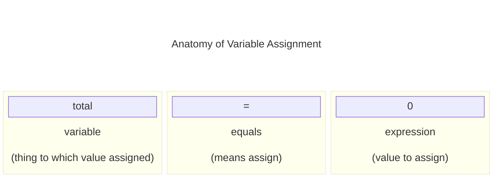

# Chapter 4: Working with Variables

## Examples

## Exercises

## Notes

### Variables in Python

- Variables let us add *memory* to python
  - Can be viewed as an alias for a storage location
- Variables in python are created by defining a name, and providing a value, e.g. the below defines a variable `total` and assigns it the value $0$

    ```python
    total = 0
    ```



- The above diagramatically breaks down variable assignment. On the left we have the variable, then `=`  which means *assignment*, followed by the expression to assign
- The assignment expression does not need to be made of simple primitives, e.g. `total = us_sales + world_wide_sales` defines the variable `total` to be equal to the sum of the variables `us_sales` and `world_wide_sales`

## Summary

## Questions and Answers