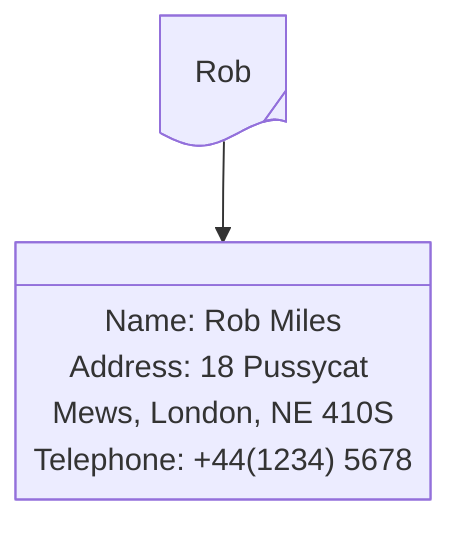
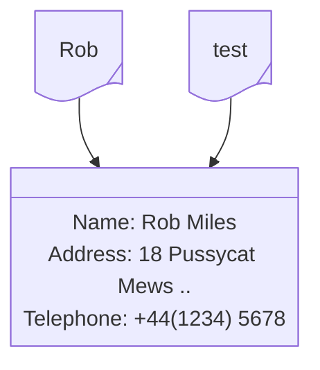
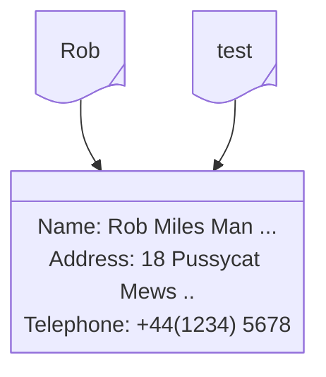
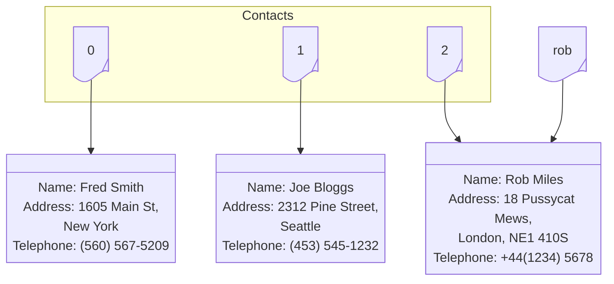
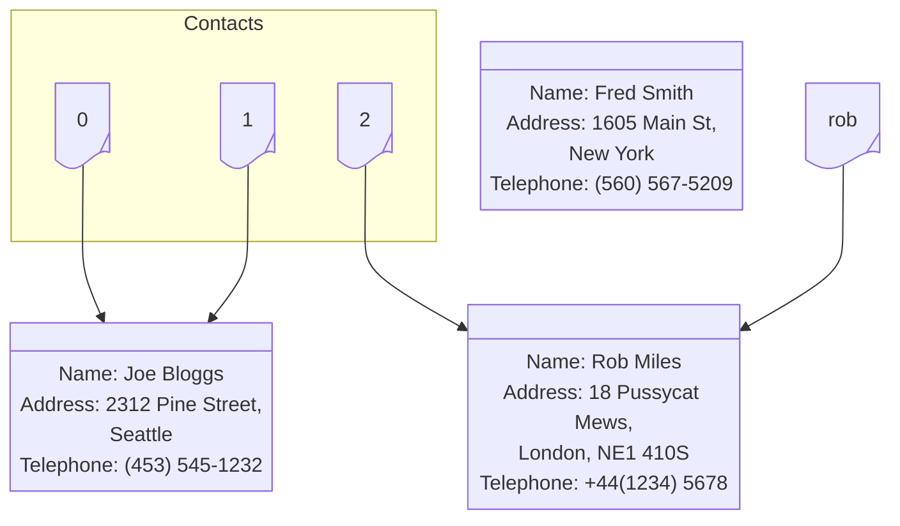
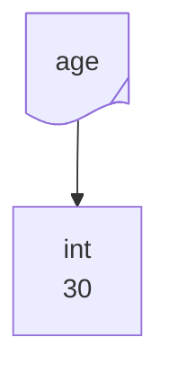
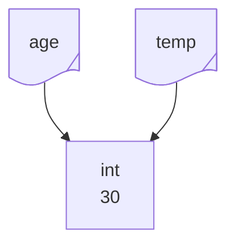
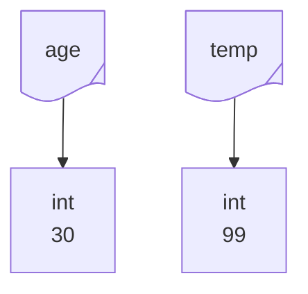

# Chapter 9: Use Classes to Store Data

- [Notes](#notes)
  - [Make a Tiny Contacts App](#make-a-tiny-contacts-app)
    - [Make a Prototype](#make-a-prototype)
      - [Example: The Contacts Application
        Prototype](#example-the-contacts-application-prototype)
    - [Store Contact Details in Seperate
      Lists](#store-contact-details-in-seperate-lists)
      - [Example: The `find_contact`
        Function](#example-the-find_contact-function)
    - [Use a Class to Store Contact
      Details](#use-a-class-to-store-contact-details)
      - [Example: Creating a Class](#example-creating-a-class)
    - [Use the `Contact` class in the Tiny Contacts
      Program](#use-the-contact-class-in-the-tiny-contacts-program)
      - [Example: The class-based `find_contact`
        function](#example-the-class-based-find_contact-function)
      - [Exercise: Duplicate Names](#exercise-duplicate-names)
    - [Edit Contacts](#edit-contacts)
      - [Refactor the Tiny Contacts
        Program](#refactor-the-tiny-contacts-program)
        - [Example: The refactored `find_contact`
          function](#example-the-refactored-find_contact-function)
      - [Contact Objects and
        References](#contact-objects-and-references)
        - [Example: Understanding Lists and
          References](#example-understanding-lists-and-references)
        - [Immutability](#immutability)
      - [Edit a Contact](#edit-a-contact)
    - [Save Contacts in a File using
      `pickle`](#save-contacts-in-a-file-using-pickle)
    - [Load Contacts from a file using
      `pickle`](#load-contacts-from-a-file-using-pickle)
      - [Example: Loading Data using
        `pickle`](#example-loading-data-using-pickle)
    - [Add `save` and `load` to Tiny
      Contacts](#add-save-and-load-to-tiny-contacts)
      - [Example: Saving and Loading
        Contacts](#example-saving-and-loading-contacts)
    - [Setup Class Instances](#setup-class-instances)
      - [The Python Initialiser Method](#the-python-initialiser-method)
        - [Exercise: Create an
          Initialiser](#exercise-create-an-initialiser)
        - [Example: Parameters and the `__init__`
          method](#example-parameters-and-the-__init__-method)
      - [Use Default Arguments in a
        Constructor](#use-default-arguments-in-a-constructor)
  - [Dictionaries](#dictionaries)
    - [Creating a Dictionary](#creating-a-dictionary)
    - [Dictionary Management](#dictionary-management)
    - [Return a Dictionary from a
      Function](#return-a-dictionary-from-a-function)
    - [Use a Dictionary to Store
      Contacts](#use-a-dictionary-to-store-contacts)
  - [Exercise: The Final Tiny Contacts
    Refactor](#exercise-the-final-tiny-contacts-refactor)
  - [Further Exercises](#further-exercises)
    - [Music Tracks](#music-tracks)
    - [Recipe Register](#recipe-register)
- [Summary](#summary)
- [Questions and Answers](#questions-and-answers)

## Notes

### Make a Tiny Contacts App

- Let’s develop a lightweight program to store contact details

  1. Names
  2. Addresses
  3. Telephone Numbers

- We storyboard the interface

  ``` text
    Tiny Contacts

    1. New Contact
    2. Find Contact
    3. Exit Program

    Enter your command:
  ```

- We then want to extend the storyboard to the different interface
  options

  ``` text
    Create new contact

    Enter the contact name: Rob Miles
    Enter the contact address: 18 Pussycat Mews, London, NE1 410S
    Enter the contact phone: +44(1234) 56789

    Contact record stored for Rob Miles
  ```

- The matching storyboard for find is then,

  ``` text
    Find Contact

    Enter the contact name: Rob Miles
    Name: Rob Miles
    Address: 18 Pussycat Mews, London, NE1 410S
    Phone: +44(1234) 56789
  ```

  - With a matching storyboard for a contact not existing

    ``` text
        Find Contact

        Enter the contact name: Fred Bloggs
        This name was not found
    ```

#### Make a Prototype

- We start by making a prototype
  - We stub out the functions with mock messages
- This is good for demoing to the customer for their feedback
  - Also helps to start working out how the structure should flow

  ``` python
    # Example 9.1 Tiny Contacts Prototype
    #
    # Simple stub implementation of the Tiny Contacts Prototype

    import BTCInput


    def new_contact():
        """
        Creates and adds a new contact to the contact book

        Returns
        -------
        None
        """
        print("Create the new contact")
        BTCInput.read_text("Enter the contact name: ")
        BTCInput.read_text("Enter the contact address: ")
        BTCInput.read_text("Enter the contact phone: ")


    def find_contact():
        """
        Prompts the user for a name, and searches the contacts list.
        If the contact is found in the list, their full contact details
        are displayed

        Returns
        -------
        None
        """
        print("Find contact")
        name = BTCInput.read_text("Enter the contact name: ")
        if name == "Rob Miles":
            print("Name: Rob Miles")
            print("Address: 18 Pussycat News, London, NE1 410S")
            print("Phone: +44(1234) 56789")
        else:
            print("This name was not found.")


    menu = """Tiny Contacts

    1. New Contact
    2. Find Contact
    3. Exit Program

    Enter your command:"""

    while True:
        command = BTCInput.read_int_ranged(prompt=menu, min_value=1, max_value=3)
        if command == 1:
            new_contact()
        elif command == 2:
            find_contact()
        elif command == 3:
            break
        else:
            raise ValueError("Unexpected command id found: " + str(command))
  ```

##### Example: The Contacts Application Prototype

*The code above doesn’t introduce any new concepts, but it’s worth
examining in detail to make sure you understand how all the parts work.
Work through the following questions.*

1. *Is this code familiar?*
    - *It should be!, It is very similar to the
      [ride-selector](../../01_ProgrammingFundamentals/05_MakingDecisions/Chapter_05.qmd#use-decisions-to-make-an-application)
      and [Ice Cream
      Sales](../../01_ProgrammingFundamentals/08_StoringCollectionsOfData/Chapter_08.qmd#lists-and-tracking-sales)
      programs*
    - *This menu structure is very common for imperative programs*
2. *The value returned by the* `read_text` *functions are ignored by
    the program. Is this legal?*
    - *Yes, it is perfectly legal.*
    - `read_text` *is from the
      [BTCInput](../../01_ProgrammingFundamentals/07_UsingFunctions/Chapter_07.qmd#build-reusable-functions)
      library, it returns a user-provided string*
      - *We have yet to decide how we store this, so we simply discard
        it*
      - *We emulate the behaviour of getting a contact, but not the
        process of storing it yet*
3. *How does the program stop?*
    - *The main loop contains a special option that is used for exiting
      the program. This is achieved by calling* `break` *to get out of
      the loop, after which the program will finish*
4. *Isn’t the prototype a bit basic? Why don’t you make it store data?*
    - *The prototype is not designed to be functional*
      - *We minimise the initial work so that if the customer backs out
        we haven’t wasted too much time*
      - *We want to make it clear that the program is a prototype, so
        that the customer won’t immediately want to use it*
5. *How is the telephone number stored?*
    - *Our plan is store the number as a string*
    - *While referred to as a number, telephone numbers typically have
      additional characters that make them much more like strings
      (e.g. +)*

#### Store Contact Details in Seperate Lists

- Start with storing Contact Details

- Simplest implementation is to maintain a list for each different type
  of information we store

  - the $i$-th contact them has it’s details in the $i$-th index of each
    list

  ``` python
    names = []
    addresses = []
    telephones = []

    def new_contact():
        """
        Creates and adds a new contact to the contact book

        Returns
        -------
        None
        """
        print("Create the new contact")
        names.append(BTCInput.read_text("Enter the contact name: "))
        addresses.append(BTCInput.read_text("Enter the contact address: "))
        telephones.append(BTCInput.read_text("Enter the contact phone: "))
  ```

- To find items we then get the index from the `names` list and use that
  to access the corresponding indices in the `addresses` and
  `telephones`

  ``` python
    def find_contact():
        """
        Prompts the user for a name, and searches the contacts list.
        If the contact is found in the list, their full contact details
        are displayed

        Returns
        -------
        None
        """
        print("Find contact")
        search_name = BTCInput.read_text("Enter the contact name: ")
        search_name = search_name.strip()
        search_name = search_name.lower()
        name_index = 0
        for name in names:
            name = name.strip()
            name = name.lower()
            if name == search_name:
                break
            name_index = name_index + 1

        if name_position < len(names):
            print("Name: ", names[name_index])
            print("Address: ", addresses[name_index])
            print("Telephone: ", telephones[name_index])
        else:
            print("This name was not found")
  ```

- You can view the complete program all put together in
  [TinyContactsParallelLists.py](./Examples/02_TinyContactsParallelLists/TinyContactsParallelLists.py)

##### Example: The `find_contact` Function

*The* `find_contact` *function is probably one of the more sophisticated
pieces of code we’ve written. Work through the following questions to
make sure you understand what is going on.*

1. *How does this code work?*
    - *We look through the* `names` *list until we find a match, once
      we’ve found it we can immediately stop looking keeping track of
      the index that we’ve been looking at*
2. *What is the* `name_index` *variable used for?*
    - *The* `name_position` *variable is used to track which index of
      the* `names` *list matches the name we’re trying to find*
    - *We use this to then grab the address and phone from the*
      `addresses` *and* `telephones` *arrays*
    - *This technique is called **parallel lists***
3. *How does the function know if a name has been found?*
    - *If we reach the end of the list without finding a match, then*
      `name_index` *ends the loop as one past the actual last valid
      index of the loop. We can check this with* `len`
    - *We use an* `if` *condition to check this*
4. *What do the calls of* `strip` *and* `lower` *do?*
    - *These functions normalise the input, so that any extra whitespace
      or variations in upper and lower case are removed*
5. *Can we save the user from having to type in all the names when they
    search?*
    - *Yes, we can. We could use* `startswith` *to find a name that
      starts with whatever the user inputs. This means they might only
      need to put in the first name*

    - *There are more sophisticated search techniques that we could use,
      but they are outside the scope of this discussion*

      ``` python
        if name.startswith(search_name):
            break
      ```

      - *The above is integrated into the complete program in
        [TinyContactsQuickSearch.py](./Examples/03_TinyContactsQuickSearch/TinyContactsQuickSearch.py)*

#### Use a Class to Store Contact Details

- An issue with this set-up is we have to ensure that the parallel lists
  stay aligned
- For example if we sort the `names` list alphabetically, we have to
  ensure we make the same transformations to the `addresses` and
  `telephones` lists
- We instead would prefer to have *one* object or *container* that holds
  all three values together
- One option is to use a tuple or a list
  - But then we have to remember how values are stored
- Alternative is the *class*
- In object-oriented programming we use *classes* to define and
  construct *objects*
  - A class is a type, an object is the instance

##### Example: Creating a Class

*Open the python interpreter and work through the following steps and
questions to understand classes*

*Enter the statements below*

``` python
class Contact:
    pass
```

*The line* `class Contact:` *begins a class definition* - *The class
contents is given as an indented block* - *We use* `pass` *To make an
empty placeholder class*

1. *Why does the name* `Contact` *begin with a capital letter?*
    - *It’s convention, in python*
      - *Variables and functions start with lowercase letters*
      - *Classes start with uppercase letters*
2. *Why does the* `Contact` *class contain a Python* `pass`
    *statement?*
    - *The class definition expects an indented block. We haven’t yet
      decided the contents of the class so we use* `pass` *to give an
      placeholder statement*

    - *We can create an instance of a* `Contact` *with*

      ``` python
        x = Contact()
      ```

3. *This looks like a function call. Are we calling a function here?*
    - *Technically this is a call to a function called a constructor.
      Which is responsible for creating an intance of a* `Contact`
    - *By using capital letters it’s clear that this is an object
      instantiation*
4. *What’s an instance?*
    - *An instance is the **realisation** of a class*

    - *Class is the design, object is the actual thing*

    - *You can add data attributes to an instance*

      ``` python
        x.name = "Rob Miles"
      ```

5. *What’s a data attribute?*
    - *Provide information about a specific instance*

    - *For a contact we would want it to have* `name`*,* `address`*,
      and* `phone`

    - *methods can also be thought of as attributes*

    - *You can use and manipulate data attributes*

      ``` python
        print(x.name)
        x.name = x.name + " is a star"
        print(x.name)
      ```

          Rob Miles
          Rob Miles is a star

> [!NOTE]
>
> **Attributes in Python classes can be confusing**
>
> The ability to add attributes to an instance is not common across
> programming languages. For example Java, c# and c++ all prevent this.
>
> In these languages a class definition must be fully specified
> including the attributes before it can be instantiated.
>
> Both this static definition and pythons dynamic definitions have it’s
> advantages and disadvantages. The latter is easier for prototyping and
> development, but the former is much more type-safe

#### Use the `Contact` class in the Tiny Contacts Program

- We can use the `Contact` class to eliminate the needs for multiple
  lists (see
  [TinyContactsClass.py](./Examples/04_TinyContactsClass/TinyContactsClass.py)
  highlighted below)

  ``` python
    contacts = []


    def new_contact():
        """
        Creates and adds a new contact to the contact book

        Returns
        -------
        None
        """
        print("Create the new contact")
        new_contact = Contact()
        new_contact.name = BTCInput.read_text("Enter the contact name: ")
        new_contact.address = BTCInput.read_text("Enter the contact address: ")
        new_contact.telephone = BTCInput.read_text("Enter the contact phone: ")
        contacts.append(new_contact)


    def find_contact():
        """
        Prompts the user for a name, and searches the contacts list.
        If the contact is found in the list, their full contact details
        are displayed

        Returns
        -------
        None
        """
        print("Find contact")
        search_name = BTCInput.read_text("Enter the contact name: ")
        search_name = search_name.strip()
        search_name = search_name.lower()
        result = None
        for contact in contacts:
            name = contact.name
            name = name.strip()
            name = name.lower()
            if name.startswith(search_name):
                result = contact
                break
  ```

##### Example: The class-based `find_contact` function

*Answer the following questions about the new* `find_contact`
*implementation*

1. *How does this code work?*
    - *This functions like the previous search, we look for a contact
      that has a match to the search name.*
    - *Rather than use the index of the match, we set a reference to the
      object itself iin the variable* `result`
    - *We use* `None` *to indicate no match was found*
2. *What does the value* `None` *mean?*
    - `None` *in python is used to refer to a value that does not exist*
    - *Semantically here it is used to indicate that no match was found*

##### Exercise: Duplicate Names

*This program has a fault in that if multiple contacts have the same
name as an existing one only the first one will be returned. Modify the
program to correct this problem*

We have two solutions that we could use,

1. When a duplicate name is encountered we simply replace the old one
    - This is the simplest approach, however it is quite common for
      people to have the same names
2. The program returns all the valid matches
    - This is a bit more complicated

    - Our search function now rather than returning one `Contact`
      returns a list containing all matching Contacts

    - We only have to change the `find_contacts` function (the full code
      is given in
      [TinyContactsDuplicates.py](./Exercises/01_TinyContactsDuplicates/TinyContactsDuplicates.py))

      ``` python
        def find_contact():
            """
            Prompts the user for a name, and searches the contacts list.
            If the contact is found in the list, their full contact details
            are displayed

            Returns
            -------
            None
            """
            print("Find contact")
            search_name = BTCInput.read_text("Enter the contact name: ")
            search_name = search_name.strip()
            search_name = search_name.lower()
            results = []
            for contact in contacts:
                name = contact.name
                name = name.strip()
                name = name.lower()
                if name.startswith(search_name):
                    results.append(contact)

            if len(results) > 0:
                for result in results:
                    print("Name: ", result.name)
                    print("Address: ", result.address)
                    print("Telephone: ", result.telephone, "\n")
            else:
                print("This name was not found")
      ```

> [!IMPORTANT]
>
> **Look for problems when you receive the specification**
>
> When you discuss a specification there’s no guarantee ambiguities like
> how to deal with duplicate names will be discussed. You will need to
> consider cases like this that may arise and define the behaviour for
> them. This behaviour will need to match what the client expects to
> happen. The best way to make sure that happens is to make sure that is
> included in the specification

#### Edit Contacts

- It might be quite common for contacts to change their contact details

- We would like to be able to update an existing contact

- The new interface

  ``` text
    Tiny Contacts

    1. New Contact
    2. Find Contact
    3. Edit Contact
    4. Exit Program

    Enter your command:
  ```

- We then storyboard out the program,

  - Our storyboard will be slightly different to the book implementation
    to better handle duplicates

  ``` text
    Edit Contact
    Enter the contact name: Rob
    Found 1 match

    Name: Robert Miles
    Address: 18 Pussycat News, London, NE1 410S
    Telephone: +44(1234) 56789

    Edit this contact? (1 - Yes, 0 - No): 1

    Enter new name or . to leave unchanged: .
    Enter new address or . to leave unchanged: .
    Enter new telephone or . to leave unchanged: +44 (1482) 465079
  ```

- The edit program first needs us to find search for the contact we wish
  to edit

- We then report the number of matches found

- For each match, we then print the current details and ask the user if
  this is the contact they want to edit

- We then give the user the option of editing each attribute or leaving
  it unchanged with `.`

##### Refactor the Tiny Contacts Program

- Our program is starting to get some structure

  - Good time to consider a refactor

- We now have two features that need to search for a contact by name

  1. Find and *display* a contact
  2. Find and *edit* a contact

- One option is to copy the `find_contact` for `edit_contact` and
  replace the display code by the edit code

  - Now we have to maintain two different copies of the search
    functionality
  - Easy for these to become desynchronised if in the future we want to
    change how the search works (or need to fix a book)

- For our refactor, we’ll do the following

  1. Factor out a core `find_contacts` function that takes a search
      name and returns the matches
  2. Change the name of the old `find_contact` function to
      `display_contacts` function

- Here’s the book’s implementation, (we’ll use something different in
  [our
  implementation](./Examples/05_TinyContactsRefactor/TinyContactsRefactor.py)
  to account for duplicates)

  ``` python
    def find_contact(search_name):
        """
        Finds the contacts with the matching name

        Params
        ------
        search_name : str
            Name to search for

        Returns
        -------
        Contact | None
            Returns the first matching contact if it exists, else
            None
        """
        search_name = search_name.strip().lower()
        result = None
        for contact in contacts:
            name = contact.name.strip().lower()
            if name.startswith(search_name):
                return result
        return None
  ```

###### Example: The refactored `find_contact` function

*Answer the following questions, about this new version of*
`find_contact`

1. *Why does the function contain two* `return` *statements?*
    - *Only one return will actually be executed*
    - *If a match is found then the match is returned*
    - *If not then the program will exit the* `for` *loop at which point
      it encounters the second return and returns* `None`
2. *What would happen if another program tried to use the return value
    of the* `find_contact` *function, and the* `find_contact` *function
    had returned* `None`
    - *Depends on what the function tries to do*

    - *If the function tried to something with that value, then an
      exception is thrown*

      ``` python
        x = None #emulate failed find from find_contact
        print(x.address)
      ```

          AttributeError: 'NoneType' object has no attribute 'address'
          ---------------------------------------------------------------------------
          AttributeError                            Traceback (most recent call last)
          Cell In[5], line 2
                1 x = None #emulate failed find from find_contact
          ----> 2 print(x.address)

          AttributeError: 'NoneType' object has no attribute 'address'

    - *Since* `find_contact` *documents that it can return* `None` *it
      is the responsibility of the consumer of the function to ensure
      they don’t misuse the* `None`

##### Contact Objects and References

- `find_contact` searches through contacts for a match
- Returned object is a *reference* to the memory object
- e.g. `rob = find_contact("Rob Miles")` graphically looks like,



- We have multiple references to an object, e.g. `test = rob` creates a
  new reference `test`



- Changes from one reference to the underlying memory object are seen in
  the other references
- e.g. `test.name = "Robert Miles Man of Mystery"` gives the state as,



- This behaviour is sometimes referred to as shallow copying since we
  have multiple copies of the object, but they are not distinct, changes
  are propagated between all the references
  - There is only one memory object

###### Example: Understanding Lists and References

*The figure below illustrates how lists and references work. It shows a
Tiny Contacts data store with three contacts registered. Each of the
tags in the contacts list refers to a different Contact instance in the
memory. Work through the following questions to develop your
understanding of references*



1. *The diagram contains four references. How many data objects does it
    contain?*

    - *There are three data objects, the* `Contact` *items themselves.
      One (Rob Miles) is referenced by the list index* $2$ *and the
      variable* `rob`

2. *What would happen if the program performed the following
    statement?*

    ``` python
     contacts[0] = contacts[1]
    ```

    - *The* $0$ *index in the list now references the same memory object
      as that in the* $1$ *index, the state now looks like,*



- *Looping through the list would thus refer to the Joe Bloggs Contact
  twice*
- *Note that we have now lost the reference to Fred Smith, **we can
  never get it back!***
  - *Unreferenced memory objects will be removed by python in a process
    called **garbage collection***
- References make it easy to work with large data objects
  - Avoid the need to create expensive copies

###### Immutability

- Everything in Python is an object

- `30` is an instance of an `int`

- The following creates a *reference* `age` to `30`

  ``` python
    age = 30
  ```

- Which we can visualise,



- and verify,

  ``` python
    type(age)
  ```

      int

- `type` is a built-in function

  - Takes a reference as an argument
  - Returns the type of the referenced object

- Now, suppose we define another reference `temp` via

  ``` python
    temp = age
  ```

- Which we can again visualise as,



- `age` and `temp` now refer to the same object instance

- What happens if we assign `temp` a new value?

  ``` python
    temp = 99
    print(age)
    print(temp)
  ```

      30
      99

- So we have the final state,



- `age` has not been modified

- Instead a new `int` with a value of $99$ was created

- This is because `int` is an *immutable* type

  - i.e. once an `int` has been created its value can’t be reassigned
  - Value assignments thus create a *new* instance of an `int`

- `string` is also an immutable type

  ``` python
    name = "Rob"
    temp = name
    print("temp is", temp, "name is", name)
    temp = "Fred"
    print("temp is now", temp, "name is now", name)
  ```

      temp is Rob name is Rob
      temp is now Fred name is now Rob

1. *Why does python use immutable data types?*
    - *For some procedures, like simple numerical calculations, treating
      variables as values is often the most desired approach, e.g.*

      ``` python
        pi = 3.1415
        x = pi
        x = 99.99
      ```

    - We don’t want the above to accidently change the value of the
      constant `pi`

> [!IMPORTANT]
>
> **Programming Languages work with values differently**
>
> Languages handle the distinction between references and values
> differently. References make it easy to work with large data as the
> objects remain stationary in memory. However value types make it easy
> to perform data manipulation with types such as `int`, `bool`, `float`
> and `string`
>
> C# has a similar concept of *value types*. Java has *primitive types*,
> C++ has *references*. Python implements `int`, `bool`, `float` and
> `string` are immutable types, and behave like values
>
> Remember that the `tuple` collection type is also immutable

##### Edit a Contact

- Once we have found a reference we can read and modify the attributes

- Our program implementation, uses a simple interface optionally modify
  each attribute one at a time

  - Need to read a user string for each modifiable atttribute
  - [Our duplicates
    implementation](./Examples/06_TinyContactsWithEdit/TinyContactsWithEdit.py)
    also needs to read an int to indicate if we want to modify a
    specific contact (and print the current contact)

- The book implementation is,

  ``` python
  def edit_contact():
    """
    Reads in a name to search for an then allows the user
    to edit the details of that contact. If there is no
    contact, the function displays a message indicating
    that the name was not found
    """

    print("Edit Contact")
    search_name = read_text("Enter the contact name: ")
    contact=find_contact(search_name)
    if contact != None:
        print("Name: ", contact.name)
        new_name = read_text("Enter new name or . to leave unchanged")
        if new_name != '.':
            contact.name = new_name
        new_address = read_text("Enter new address or . to leave unchanged")
        if new_address != '.':
            contact.address = new_address
        new_phone = read_text("Enter new phone or . to leave unchanged")
        if new_phone != '.':
            contact.telephone = new_phone
    else:
        print("This name was not found")
  ```

- Editing as configured performs modifications of the live data

  - Referred to as *in-place* because it occurs on the original object
    not a copy

- Can’t easily rollback if there is an error or ask the user wishes to
  cancel

- To do so, `edit_contact` would need to work on a copy of the data

> [!WARNING]
>
> **Missing Attributes**
>
> `edit_function` calls `find_contact` to match a given name.
> `find_contact` returns `None` if no match is found. However, another
> possible fault in a contact is returned without all the attributes
> defined, e.g. a contact with a name but no address. Then the program
> would fail, as the code below demonstrates
>
> ``` python
> class Contact:
>     pass
>
> # fake contact "returned without address"
> contact = Contact()
> contact.name = "Hello"
>
> # Attempt to access address
> print("contact address is", contact.address)
> ```
>
>     AttributeError: 'Contact' object has no attribute 'address'
>     ---------------------------------------------------------------------------
>     AttributeError                            Traceback (most recent call last)
>     Cell In[11], line 9
>           6 contact.name = "Hello"
>           8 # Attempt to access address
>     ----> 9 print("contact address is", contact.address)
>
>     AttributeError: 'Contact' object has no attribute 'address'
>
> Some programming languages e.g. Java, C#, C++ check for these errors
> before a program executes. Python does not. This means that minor
> typos e.g. writing `adress` instead of `address` can lead to runtime
> errors

#### Save Contacts in a File using `pickle`

- We saw in [Chapter
  8](../../01_ProgrammingFundamentals/08_StoringCollectionsOfData/Chapter_08.qmd#store-data-in-a-file)
  that we can save and load data to files

  - There we used a human-readable text representation

- We could replicate this for large class based structures

  - e.g. write out all attributes as comma, seperated values

- Python provides a process called *pickling* for storing large data
  structures

  - pickled data is stored as *binary*
  - Data is therefore computer-readable and more compressed than human
    text

- Pickling is done through the `pickle` library, import it to use it

  ``` python
    import pickle
  ```

- jpeg, mp3, zip are all different formats of binary data

  - Commonly a *file extension* is used to identify what a binary file
    represents
  - e.g.
    1. myhouse.jpg
    2. track1.mp3
  - Different programs are written to work with different binary file
    formats

- `.txt` defines a generic text file

- `.py` defines a text file that is valid python code

- Technically text is also a binary file, just with those binary values
  associated to human-readable characters

- Python programs can use the `b` mode flag to read files as binary,
  e.g.

  ``` python
    out_file = open("contacts.pickle", "wb")
  ```

  - The above opens the file `contacts.pickle` for writing (`w`) as a
    binary file (`b`)
  - `.pickle` indicates the file is a pickled python data object

- pickle supplies the `dump` function to write a data structure to a
  file

  - The file must be opened for writing in binary

  ``` python
    pickle.dump(contacts, out_file)
  ```

  - `contacts` is the variable to pickle
  - `out_file` is the variable storing the file save the data to

- You can open and modify pickle files

  - While they may contain some readable text, they will also contain a
    mix of improperly rendered binary
    - (Unless you have a specially set up text editor like a hexadecimal
      reader)


> [!CAUTION]
>
> **Be careful modifying pickle files by hand**
>
> Pickle files are not designed to be human-readable. While most text
> editors will happily let you edit and save a pickle file this is very
> likely to end up in you breaking the binary format and the file no
> longer loading properly

- `save_contacts` below saves the `contacts` list into a given file
  (passed as a path name)
  - As in [Chapter 8 we use
    `with`](../../01_ProgrammingFundamentals/08_StoringCollectionsOfData/Chapter_08.qmd#use-the-with-construction-to-tidy-up-file-access)
    to handle managing the file access

  ``` python
  def save_contacts(file_name):
    """
    Saves the contacts to the given file name
    Contacts are stored in binary as a pickled file
    Exceptions will be raised if the save fails
    """
    print("save contacts")
    with open(file_name, "wb") as out_file:
        pickle.dump(contacts, out_file)
  ```

  - This function does not perform any exception handling
  - This will cause the program to crash if the save fails
    - Probably fine for a program of this size
    - **Note:** You should never hide a failed save from the user!
  - If we wanted to handle exceptions, we would do that in the code
    outside `save_contacts`

#### Load Contacts from a file using `pickle`

- pickle provides `load` to read a pickle file

  - returns the reconstructed data object
  - As a result, needs only the file

- file needs to be open for reading `r` and in binary mode `b`

  ``` python
    def load_contacts(file_name):
        """
        Loads the contacts from the given file name
        Contacts are stored in binary as pickled file
        Exceptions will be raised if the load fails
        """
        global contacts #connect to the global contacts variable
        print("load contacts")
        with open(file_name, "rb") as input_file:
            contacts=pickle.load(input_file)
  ```

##### Example: Loading Data using `pickle`

*Work through the following questions to make sure you understand how*
`load_contacts` *works*

1. *What does the* `global contacts` *statement do? Why do we need it
    only in the* `load` *function and not the* `save` *function?*
    - *The* `load_contacts` *function is used to modify the values of
      the* `contacts` *variable*
    - *The* `contacts` *holds all the current contacts, held in the
      program*
    - `save_contacts` *needs the reference to find the list*
      - *Does not modify the list itself*
    - `load_contacts` *does modify the* `contacts` *list*
      - *Need to explicitly link to the global variable to write to it*
2. *How does the pickle* `load` *function know what kind of data to
    make when loading?*
    - *The information is encoded in the pickle file*
    - *In a pickle file you should be able to identify the data
      attributes (*`name` *etc.) and their values*
    - *Also contains the class name*
    - `load` *looks for matching classes in the program loading the
      data*
      - *Constructs object instances based on those classes*
      - *Means the class* `Contact` *must be defined before pickle is
        used to load any contact data*

> [!TIP]
>
> **Version Control**
>
> Pickle is a tool called a *serialiser* because it converts a data
> structure is a *serial stream* (i.e. ordered sequence of data) that
> can be sent to another program and/or stored in a file.
>
> This introduces the need for *version control.* If the design of a
> class e.g. `Contact` (say we added an email attribute) then all
> previously pickled data may no longer load since the class definition
> is mismatched. To resolve this you need to version control both the
> version of the class and the pickled files so that data can be
> migrated (or converted) between versions

#### Add `save` and `load` to Tiny Contacts

- Let’s add the `save` and `load` functionality to the Tiny Contacts
  Program

- There are two options for how we implement this,

  1. The user manually declares they want to save and load
  2. We hardcode a data file
      - Load from this file on program start
      - Save to this file as part of the exit process

- For a small contacts app the user probably doesn’t want to manually
  have to handle saving and loading files

- More likely to want to have it “just work”

  - We’ll go with option 2

- The new interface now looks like below (see our [full
  implementation](./Examples/07_TinyContactsWithLoadAndSave/TinyContactsWithLoadAndSave.py)
  which contains an [example pickle
  file](./Examples/07_TinyContactsWithLoadAndSave/contacts.pickle))

  ``` python
    # Example 9.7 Tiny Contacts with Load and Save
    import pickle

    #Load contacts from file or create empty list if it fails to load
    file_name = "contacts.pickle"
    try:
        load_contacts(file_name)
    except:
        print("Contacts file not found")
        contacts=[]

    while True:
        command = BTCInput.read_int_ranged(prompt=menu, min_value=1, max_value=4)
        if command == 1:
            new_contact()
        elif command == 2:
            display_contact()
        elif command == 3:
            edit_contact()
        elif command == 4:
            save_contacts(file_name) #save contacts on exit
            break
        else:
            raise ValueError("Unexpected value encountered")
  ```

##### Example: Saving and Loading Contacts

*Consider the following questions about the code above*

1. *What happens if the* `load_contacts` *function raises an
    exception?*
    - `load_contacts` *raises an exception if the contacts file can’t be
      found, or if the* `load` *function in* `pickle` *fails*
    - *In this case the exception is caught, an error message is printed
      and an empty contacts list is created*
2. *Why does the program not catch the exceptions raised by*
    `save_contacts`*?*
    - *You could add this if you wanted*
    - *If the program crashes, the user should probably expect the save
      failed*
    - *Since they were trying to quit anyway they probably don’t care*
    - My implementation adds `try...except` block that prints an error
      message if the save fails (as the book suggests you consider)
3. *Why does the program use a variable for the file name of the
    pickled file?*
    - *The contacts are held in a file called* `contacts.pickle`
    - *This file is used in two places* `load_contacts` *and*
      `save_contacts`
      - *We could put the string literal in both places*
      - *Instead use a variable*
      - *Means we can change the file name in one place and the program
        works*

> [!TIP]
>
> **Avoiding Magic Constants**
>
> A magic constant is a literal value that appears in multiple places in
> code without an apparent reason. For example if we just used
> `contacts.pickle` that would be a magic constant. The string is a
> constant but there is no context to explain what the value means.
> Magic constants are problematic because they are hard to find and if
> we want to change them we have to find all the places they’re used and
> then resolve the issue of does *this* `2` correspond to *this* magic
> constant or *another* magic constant
>
> It is a good idea to instead put these constants in a variable so that
> we need only change the value in one place and we can clearly explain
> *what* the constant means

#### Setup Class Instances

- Tiny Contacts builds the `Contact` instance after we create one

  ``` python
    new_contact = Contact()
    new_contact.name = BTCInput.read_text("Enter the contact name: ")
    new_contact.address = BTCInput.read_text("Enter the contact address: ")
    new_contact.telephon = BTCInput.read_text("Enter the contact phone: ")
  ```

- This makes the program fragile

  - We could misspell an attribute
  - Forget to set one

- Ideally want to create a `Contact` and ensure values are set as part
  of creation

- We can do so with a *Constructor*, a special method called to create
  the object

  - Also sometimes called an *initialiser* method

- A method attribute is like a data attribute but as an attached
  function

##### The Python Initialiser Method

- Held inside a python class
- Named `__init__`
  - python uses “dunder methods” marked `__function_name__` to mark
    special functions defined by the language

###### Exercise: Create an Initialiser

*Open the python interpreter and work through the following steps to
create an understand an initialiser, answering the questions*

*Type the below code in to define a class*

``` python
class InitPrint:
    def __init__(self):
        print("you made an InitPrint instance")
```

*The above defines the class* `InitPrint` *it defines an initialiser
method that prints a method. Note the double underscore* *before and
after the* `init` *are required, as is the parameter* `self`*. The last
line of the class is an empty line*

1. *The initialiser looks remarkably like a function why is that?*
    - An initialiser is a function that is called when a class instance
      is created.

    - *Type in the code below, which creates an instance of* `InitPrint`
      *and assigns it to the variable* `x`*,observe that the* `__init__`
      *method is called even without us explicitly putting it*

      ``` python
        x = InitPrint()
      ```

          you made an InitPrint instance
2. *How is the* `__init__` *function made to run?*
    - It is handled by the python interpreter and how objects are
      constructed
    - It will run each time an instance of the `InitPrint` class is
      created

- *Now define the* `InitName` *class as below*

  ``` python
    class InitName:
        def __init__(self, new_name):
            self.name = new_name
  ```

  - *The initialiser can take arguments like any other function, here it
    takes* `new_name`

  - *Initialiser no longer prints a message but rather sets a* `name`
    *attribute on the variable* `self`

  - `self` *is a reference to the object running the method*

    - *In the initialiser this is the object being created*
    - `self` *is always the first parameter of a method, and must be
      included*

  - *Now replicate the code below to see how the new* `__init__` *method
    works*

    ``` python
      x = InitName("Fred")
      print(x.name)
    ```

        Fred

  - *When creating an* `InitName` *object we now have to pass the*
    `new_name` *parameter*

  - *Observe we don’t explicitly pass* `self`

- *Once an initialiser is defined, it is the only way to create an
  instance*

  - *Attempting otherwise leads to an error, e.g. if we exclude the*
    `new_name`

  ``` python
    y = InitName()
  ```

      TypeError: InitName.__init__() missing 1 required positional argument: 'new_name'
      ---------------------------------------------------------------------------
      TypeError                                 Traceback (most recent call last)
      Cell In[16], line 1
      ----> 1 y = InitName()

      TypeError: InitName.__init__() missing 1 required positional argument: 'new_name'

- *This is a way of enforcing that an object is created with a full set
  of attributes*

- Our `Contact` class, should accept three parameters

  ``` python
    class Contact:
        def __init__(self, name, address, telephone):
            self.name = name
            self.address = address
            self.telephone = telephone
  ```

###### Example: Parameters and the `__init__` method

*Work through the following questions to ensure you understand the*
`__init__` *method*

1. *It looks like you’ve written the assignments in the initialiser so
    that a value is assigned to itself. What’s going on?*
    - *Consider a statement*

      ``` python
        self.telephone = telephone
      ```

    - *This looks like assigning* `telephone` *to* `telephone`*it, does
      not*

    - *The left is the* `telephone` *atrribute* on the `self` *object*

    - *The right is the* `telephone` *parameter passed to the
      initialiser*

    - *Python variable names are* **namespaced**

      - *namespaces are regions in which names are uniquely identified*

    - *One namespace is the local namespace of the* `__init__` *method*

    - *The other namespace is the attribute namespace of the* `self`
      *object*

    - *namespaces allow different contexts to use the same variable name
      distinct from each other*

    - *Generally it is convention to give initialiser parameters the
      same name as their associated object attributes*
2. *What happens if the user of the constructor supplies silly
    arguments to it?*
    - *Currently the constructor doesn’t validate the input*
    - *e.g. we could pass* `name` *a number, empty string or even*
      `None`
      - *Still generates a* `Contact`
    - *You can add error handling code to the constructor and raise
      exceptions if the provided values are invalid*
      - *For a more robust application this might be required*
      - *For a small toy program we can generally expect valid input*

- If we want to create a new `Contact` now we can just call,

``` python
    rob = Contact(name = "Rob Miles", address="18 Pussycat Mews, London, NE1 410S", telephone="+44(1234) 56789")
```

- We can integrate this into [our Tiny Contacts
  implementation](./Examples/08_TinyContactsWithConstructor/TinyContactsWithConstructor.py)

  ``` python
    def new_contact():
        """
        Reads in a new contact and stores it
        """
        print("Create new contact")
        name = BTCInput.read_text("Enter the contact name: ")
        address = BTCInput.read_text("Enter the contact address: ")
        telephone = BTCInput.read_text("Enter the contact phone: ")
        new_contact = Contact(name=name, address=address, telephone=telephone)
        contacts.append(new_contact)
  ```

##### Use Default Arguments in a Constructor

- The `__init__` method supports default arguments

- For example if we don’t want to make the telephone mandatory we could
  write

  ``` python
    class Contact:
        def __init__(self, name, address, telephone="No Telephone"):
            self.name = name
            self.address = address
            self.telephone = telephone
  ```

- We could then create create a `Contact` as,

  ``` python
    rob = Contact(name="Rob Miles", address="18 Pussycat Mews, London, NE1 410S")
    print(rob.telephone)
  ```

      No Telephone

  - Observe that the `telephone` attribute still exists and has the
    default value `"No Telephone"`

### Dictionaries

- A *Dictionary* is another collection type like `list` and `tuple`
- Dictionaries store data as *key-value* pairs
  - A *value* is looked up by its *key*
  - You can think of a `list` as a dictionary where the *key* is the
    index

#### Creating a Dictionary

- Let’s consider creating a dictionary for a coffee shop

- We want to key coffee products to their price (value)

- We create an empty dictionary using `{}`

  ``` python
    prices = {}
  ```

- Items can be added using the indexing operator to assign a value,

  ``` python
    prices["latte"] = 3.5
    prices["latte"]
  ```

      3.5

- We can see `prices` has the key `latte` and the associated value of
  $3.5$

- We can redefine dictionary values as for lists

  ``` python
    prices["latte"] = 3.6
    prices["latte"]
  ```

      3.6

- Keys are case-sensitive and must be spelled correctly, else a
  `KeyError` occurs,

  ``` python
    prices["Latte"]
  ```

      KeyError: 'Latte'
      ---------------------------------------------------------------------------
      KeyError                                  Traceback (most recent call last)
      Cell In[24], line 1
      ----> 1 prices["Latte"]

      KeyError: 'Latte'

- We can search a dictionary for keys using the `in` operator

  ``` python
    print('latte' in prices)
    print('flat white' in prices)
  ```

      True
      False

- We can print an entire dictionary just like with lists and tuples

  ``` python
    prices["espresso"] = 3.0
    prices["tea"] = 2.5
    prices
  ```

      {'latte': 3.6, 'espresso': 3.0, 'tea': 2.5}

- Observe that the *key-value* pairs are printed with the format
  `key : value`

- We can also create a dictionary with value using the same syntax like
  the printed output

  ``` python
    prices = {'Latte' : 3.6, 'Espresso' : 3.0, "Tea" : 2.5, "Americano" : 2.5}
  ```

#### Dictionary Management

- Dictionary elements use the `"key:item"` format

- Keys and values can be a mix of types, e.g. `str`, `int`, `float`
  e.g.,

  ``` python
    access_control = {1234 : "complete", 1111 : "limited", 4342 : "limited"}
  ```

- Values can be duplicated

- **But** keys must be unique

- Consider a dictionary that controls access to a burglar alarm

  - Users provide an access code
  - Code keys a dictionary
  - Access is determined by the value in the dictionary
  - A missing key (code) indicates no access permissions

  ``` python
    # Example 9.9 Alarm Access Control
    #
    # Demonstrates the use of a dictionary as a lookup table to translate
    # keys into associated values

    import BTCInput

    access_control = {1234: "complete", 1111: "limited", 4342: "limited"}

    access_code = BTCInput.read_int("Enter your access code: ")
    if access_code in access_control:
        print("You have", access_control[access_code], "access")
    else:
        print("You are not allowed access")
  ```

- We can delete dictionary entries using the `del` keyword, e.g.

  ``` python
    del(access_control[1111])
    print(access_control[1111])
  ```

      KeyError: 1111
      ---------------------------------------------------------------------------
      KeyError                                  Traceback (most recent call last)
      Cell In[29], line 2
            1 del(access_control[1111])
      ----> 2 print(access_control[1111])

      KeyError: 1111

- The `KeyError` above shows that the key-value has been eliminated

- `del` can also be used to remove elements of a list

- `del` will raise an exception if the object being deleted doesn’t
  exist

#### Return a Dictionary from a Function

- We’ve seen that programs can use dictionaries as lookup tables
- Can also return a dictionary from a function
  - e.g. our Pirates Treasure map from [Chapter
    8](../../01_ProgrammingFundamentals/08_StoringCollectionsOfData/Chapter_08.qmd#tuples)
    could use a `dict` instead

  ``` python
    # Example 9.10: Pirate Treasure Dictionary
    #
    # Implementation of the Pirates Treasure map that uses a
    # dictionary rather than a tuple to provide contextual
    # key-value pairs


    def get_treasure_location():
        """
        Get the location of the treasure

        Returns
        -------
        dict[str, str | int]
            Dictionary containing the location of the treasure
            dict["start"] : str
                landmark to start at
            dict["n"] : int
                number of paces to walk north relative to the
                start
            dict["e"] : int
                number of paces to walk east relative to the
                start
        """
        return {"start": "The old oak tree", "n": 20, "e": 30}


    location = get_treasure_location()
    print(
        "Start at",
        location["start"],
        "walk",
        location["n"],
        "paces north, and",
        location["e"],
        "paces east",
    )
  ```

      Start at The old oak tree walk 20 paces north, and 30 paces east
- Dictionaries let us assign contextual meaning to the returned
  parameters
- Harder to work with than tuple unpacking though

#### Use a Dictionary to Store Contacts

- We could use dictionaries to store contacts in Tiny Contacts
  - Rather than use a class we could represent a contact with a
    dictionary like

    ``` python
      rob_contact = {"name" : "Rob Miles", "address" : "18 Pussycat Mews", "telephone" : "+44(1234) 56789"}
    ```

    - But the we lost some of the nice class behaviours
      - like attributes being accessible via `Contact.name` etc. and we
        would instead have to use the string literal keys everywhere

  - Another option is storing the contacts themselves in a dictionary
    rather than a list

    ``` python
     contact_dictionary = {}
     rob = Contact(name = "Rob Miles", address = "18 Pussycat Mews", telephone = "+44(1234) 56789")
     contact_dictionary[rob.name] = rob
     print(contact_dictionary)
    ```

        {'Rob Miles': <__main__.Contact object at 0x7efe48091d00>}

  - We can then search for a contact by just querying the key

    ``` python
      contact_dictionary["Rob Miles"]
    ```

        <__main__.Contact at 0x7efe48091d00>

  - However the user would have to type the correct full name

    - Also case sensitive
    - We could fix the case sensitivity by rather than using the name
      directly using a normalised key
      - such as by using `strip().lower()` to strip excess whitespace
        and convert to lowercase

  - Our current implementation uses `startswith` to provide more
    flexible matching

  - In general though, dictionaries provide fast queries for finding
    objects when we can easily use the key as a unique identifier

### Exercise: The Final Tiny Contacts Refactor

*The Tiny contacts program is a useful template for any kind of program
that stores data and lets a user work with it. You can even add some of
the sorting and data-processing features from the ice-cream sales
program to make applications that not only store data but let you do
interesting things with it.*

*Expand on the Tiny Contacts Program to implement the following,*

1. *The Tiny Contacts program will print all contacts if the
    `find_contacts` search string is blank, document this for the user*
2. *Add the sorting features from the ice-cream sales program to print
    contacts in alphabetical order*
3. *Identify more common between functions in Tiny Contacts and see
    what further refactors you can make*

The first step is straightforward. We update the program is two places.
First we document the behaviour in the responsible function,
`find_contacts`

``` python
def find_contacts(search_name):
    """
    Finds the contacts with the matching name

    If the empty string is given, all contacts
    are matched

    Params
    ------
    search_name : str
        Name to search for

    Returns
    -------
    list[Contact]
        list of contacts matching the name, if no
        matches exist the list is empty
    """
    search_name = search_name.strip().lower()
    results = []
    for contact in contacts:
        name = contact.name.strip().lower()
        if name.startswith(search_name):
            results.append(contact)
    return results
```

This helps anyone who in the future has to edit or maintain our code.
However it doesn’t provide much help to the user of the program. So we
also document this in the user facing code (`display_contacts`)

``` python
def display_contacts():
    """
    Prompts the user for a contact name and
    displays all matching contacts

    Returns
    -------
    None
    """
    print("Find contact")
    contacts = find_contacts(
        BTCInput.read_text("Enter the contact name (Press enter to display all): ")
    )
    if len(contacts) > 0:
        for contact in contacts:
            display_contact(contact)
    else:
        print("This name was not found")
```

The relevant line being,

``` python
    BTCInput.read_text("Enter the contact name (Press enter to display all): ")
```

To add the sorting functionality we first need to put the sorting code
in,

``` python
def sort_contacts():
    """
    sorts the contacts list into alphabetical order

    Returns
    -------
    None
    """
    print("Sort contacts")
    for sort_pass in range(0, len(contacts)):
        done_swap = False
        for count in range(0, len(contacts) - 1 - sort_pass):
            if contacts[count].name > contacts[count + 1].name:
                temp = contacts[count]
                contacts[count] = contacts[count + 1]
                contacts[count + 1] = temp
                done_swap = True
        if not done_swap:
            break
```

This code is basically the same as the sorting code in the ice-cream
stand example except there might be something that looks odd. namely the
line

``` python
contacts[count].name > contacts[count + 1].name
```

This is because we want to sort the `Contact` objects alphabetical on
the `name` field. So we have to compare against this field.
`contacts[count]` *is a reference* to the `Contact` object stored at the
index `count` so we can access the attributes on the underlying object

We then need to include the sorting option in the display menu

``` python
menu = """Tiny Contacts

1. New Contact
2. Find Contact
3. Edit Contact
4. Sort Contacts
5. Exit Program

Enter your command: """

file_name = "contacts.pickle"
try:
    load_contacts(file_name)
except:  # noqa: E722
    print("Contacts file not found")
    contacts = []

while True:
    command = BTCInput.read_int_ranged(prompt=menu, min_value=1, max_value=5)
    if command == 1:
        new_contact()
    elif command == 2:
        display_contacts()
    elif command == 3:
        edit_contacts()
    elif command == 4:
        sort_contacts()
    elif command == 5:
        try:
            save_contacts(file_name)
        except:  # noqa: E722
            print("Contacts failed to save")
        break
    else:
        raise ValueError("Unexpected command id found: " + str(command))
```

To answer the final question of what functionality we can pull out we
can see that both `display_contacts` and `edit_contacts` contain code
for displaying an individual `Contact`. We can pull this code out into a
distinct `display_contact` function responsible for displaying a single
`Contact`. We can then update `display_contacts` and `edit_contacts` to
defer the display functionality to `display_contact`

``` python
def display_contact(contact):
    """
    Displays the Contact details for the supplied contact

    Params
    ------
    contact : Contact
        contact to display

    Returns
    -------
    None
    """
    print("Name:", contact.name)
    print("Address:", contact.address)
    print("Telephone:", contact.telephone, "\n")
```

The new `display_contacts` now looks like,

``` python
def display_contacts():
    """
    Prompts the user for a contact name and
    displays all matching contacts

    Returns
    -------
    None
    """
    print("Find contact")
    contacts = find_contacts(
        BTCInput.read_text("Enter the contact name (Press enter to display all): ")
    )
    if len(contacts) > 0:
        for contact in contacts:
            display_contact(contact)
    else:
        print("This name was not found")
```

and `edit_contacts` looks similar

### Further Exercises

This Chapter also contains two further examples which demonstrate
building data storage applications that handle more functionality than
tiny contacts.

Due to the size of the discussion required for each exercise they are
linked on [a seperate page](./Chapter_09_ExtensionExercises.qmd)

#### [Music Tracks](./Chapter_09_ExtensionExercises.qmd#exercise-music-storage-app)

Focuses on demonstrating adding additional functionality to a basic
storage application for data interrogation

- Develops an application that can store music tracks
- Implements searching and sorting based on length of the track
- Supports the ability to create and save playlists
- Playlists can be interrogated for their total length
- The program can suggest playlists that match the user’s target runtime

#### [Recipe Register](./Chapter_09_ExtensionExercises.qmd#exercise-recipe-storage-app)

Demonstrates working with larger more complicated objects in data
storage

- Develops and application for storing recipes
- Users can search for recipes by their name or their ingredients
- Supports different mechanisms for viewing details about a recipe
  1. Viewing the ingredients
  2. Viewing the steps
  3. Steping through the recipe, step by step

You are encouraged to work through or examine these exercises

## Summary

- Python lets you define Classes
  - Classes can have data attributes
  - data attributes can be defined at construction via a *constructor*
  - data attributes can be added dynamically at runtime
  - classes may define a constructor via `__init__` to control how they
    are created
- Python variables are references to memory objects
  - If there are multiple references to one object then changing the
    object via one reference will be propagated to the other references
- Some fundamental python types `int`, `str`, `float`, are immutable
  - Assigning a value to a variable holding an immutable type creates a
    new memory object with that value
    - Other references to the original object are untouched
  - This allows them to be manipulated as simple values
- `pickle` is a library for serialising python objects as binary data
- Python provides a dictionary data object that can be used to store a
  collection of *key-value* pairs

## Questions and Answers

1. *If an object has* `name`*,* `address` *and* `telephone` *attributes
    can a program treat it as a* `Contact` *instance?*
    - Yes, Python uses what is called duck-typing
      - “If it walks like a duck, quacks like a duck, it is a duck”
      - Means that if it behaves like a `Contact` it can be used as a
        `Contact`
      - If the programmer makes a mistake however, a runtime exception
        is created
    - This means we could define a `Customer` with the same fields and
      treat it as a `Contact`
    - Python does provide mechanisms for explicit type checking
      - We’ve seen one for example (`type`)
    - Other languages have different rules
    - Java, C# and C++ are “Strongly Typed”
      - The type of the variable is fixed and we can only work with
        objects, functions and operators that support that type
    - “Strongly Typed” languages typically allow you catch mismatched
      type errors at compile-time before a program is run
2. *Can an object contain a reference to itself?*
    - Yes, though this is usually not a good idea
    - Typically objects are daisy-chained together
      - Object A references Object B references Object C etc.
      - The most basic structure is called a *linked list*
      - More complex structures like trees have more complicated
        referential structures
3. *Is an object forced to have a constructor / initialiser?*
    - No, we saw this with the first `Contact` which was a simple blank
      class
    - `__init__` provides greater ability to ensure that objects are
      created properly though
4. *Can you stop a program from adding new attributes to an object?*
    - No
    - This has the impact of allowing us to create incompatible and
      distinct instances of the same class where for some reason one has
      been argumented with an additional attribute
5. *Can you remove attributes from an object?*
    - Yes, you can use the `del` operator to delete an attribute

      ``` python
        del(rob.name)
        print(rob.address)
        rob.name
      ```

          18 Pussycat Mews

          AttributeError: 'Contact' object has no attribute 'name'
          ---------------------------------------------------------------------------
          AttributeError                            Traceback (most recent call last)
          Cell In[34], line 3
                1 del(rob.name)
                2 print(rob.address)
          ----> 3 rob.name

          AttributeError: 'Contact' object has no attribute 'name'
6. *What is immutable again?*
    - immutable means an unchangeable object
    - When we try to change an immutable object python instead creates a
      copy with the new values
    - immutability improves data storage especially for primitive types
    - e.g. We might have a story of one million words
      - The story string itself consists of words stored as strings
        which are immutable
      - A list of words uses references to refer to each word
      - Certain words are probably referred to multiple times (e.g. the)
      - Since the words are immutable we can reference *one* instance of
        the string `"the"` rather than having a distinct memory object
        for each instance (which we would need if they were mutable)
7. *How does the operating system know its storing a binary file?*
    - It doesn’t
    - Really all files are binary
    - File system simply responsible for locating and retrieving files
    - Programs are the ones that impose meaning on a file
      - file extensions are there to help an operating system or user
        associate different file formats with their respective programs
8. *Can two items in a dictionary have the same key?*
    - Strictly no, if you wish to store multiple objects with the same
      key you would have to use a dictionary where the value was some
      form of collection e.g. a list or tuple.
    - You would then access the list via the dictionary key
      - Then have to search through the list to get the specific value
        you were interested in
