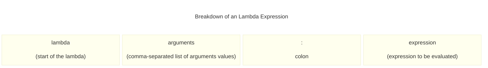
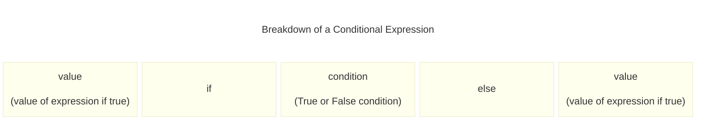

# Chapter 12: Python Applications

- [Notes](#notes)
  - [Advanced Functions](#advanced-functions)
    - [References to Functions](#references-to-functions)
      - [Use Function References in the BTCInput
        Module](#use-function-references-in-the-btcinput-module)
      - [Code Analysis: Function
        References](#code-analysis-function-references)
      - [Exercise: Write a Roman Numeral
        Converter](#exercise-write-a-roman-numeral-converter)
    - [Build Lists of Function
      References](#build-lists-of-function-references)
    - [Use Lambda Expressions](#use-lambda-expressions)
      - [Make Something Happen: Make a Lambda
        Expression](#make-something-happen-make-a-lambda-expression)
      - [Code Analysis: Lambda
        Expressions](#code-analysis-lambda-expressions)
    - [Iterator Functions and the `yield`
      Statement](#iterator-functions-and-the-yield-statement)
      - [Make Something Happen: Investigating
        `yield`](#make-something-happen-investigating-yield)
      - [Create a Test Data Generator using
        `yield`](#create-a-test-data-generator-using-yield)
      - [Code Analysis: Using `yield` to Generate Test
        Contacts](#code-analysis-using-yield-to-generate-test-contacts)
    - [Functions with an Arbitrary Number of
      Arguments](#functions-with-an-arbitrary-number-of-arguments)
      - [Make Something Happen: Investigating Arbitrary
        Arguments](#make-something-happen-investigating-arbitrary-arguments)
  - [Modules and Packages](#modules-and-packages)
    - [Python Modules](#python-modules)
      - [Add a `readme` Function to
        BTCInput](#add-a-readme-function-to-btcinput)
      - [Run a Module as a Program](#run-a-module-as-a-program)
      - [Detect when a Module is Executed as a
        Program](#detect-when-a-module-is-executed-as-a-program)
        - [Make Something Happen: Checking Program
          Context](#make-something-happen-checking-program-context)
    - [Create a Python Package](#create-a-python-package)
      - [Code Analysis: Making Modules](#code-analysis-making-modules)
    - [Import Modules from Packages](#import-modules-from-packages)
      - [Make Something Happen: Use Classes as
        Values](#make-something-happen-use-classes-as-values)
      - [Code Analysis: References to
        Classes](#code-analysis-references-to-classes)
  - [Program Testing](#program-testing)
    - [The Python `assert` Statement](#the-python-assert-statement)
      - [Code Analysis: Python
        Assertions](#code-analysis-python-assertions)
    - [The Python `unittest` Module](#the-python-unittest-module)
      - [Test for Exceptions](#test-for-exceptions)
    - [Create Tests](#create-tests)
    - [Exercise: Complete the Testing of
      `StockItem`](#exercise-complete-the-testing-of-stockitem)
    - [Exercise: Refactoring Ride Selector to Support
      Testing](#exercise-refactoring-ride-selector-to-support-testing)
  - [View Program Documentation](#view-program-documentation)
    - [Make Something Happen: Explore
      `pydoc`](#make-something-happen-explore-pydoc)
- [Summary](#summary)
- [Questions and Answers](#questions-and-answers)

## Notes

### Advanced Functions

- Python functions are powerful and can be used in some interesting ways

#### References to Functions

- We’ve seen that we can use references to functions much like variables

- e.g. `map` in [Chapter
  10](../10_UseClassesToCreateActiveObjects/Chapter_10.qmd#the-python-map-function)
  took a reference to a function and applied it element-wise to a list

  - Another example was
    [`filter`](../11_ObjectBasedSolutionDesign/Chapter_11.qmd#filter-on-tags)

- Let’s explore this in more detail, consider the following code snippet
  (see
  [SimpleFunctionReferences.py](./Examples/01_SimpleFunctionReferences/SimpleFunctionReferences.py))

  ``` python
    # Example 12.1 Simple Function References

    def func_1():
        print("Hello from function 1")

    def func_2():
        print("Hello from function 2")

    x = func_1
    x()
    x = func_2
    x()
  ```

      Hello from function 1
      Hello from function 2

- We have two functions `func_1` and `func_2`

- We can assign the variable `x` to refer to and call each of these in
  turn

  - The dereference operator `()` called on `x` resolves to the function
    it references

- The variable is effectively another name for the function

- We still have to call it properly, e.g. (see
  [InvalidFunctionReferences.py](./Examples/02_InvalidFunctionReferences/InvalidFunctionReferences.py))

  ``` python
    # Example 12.2 Invalid Function References

    def func_1():
        print("Hello from func_1")

    x = func_1
    x(99)
  ```

      TypeError: func_1() takes 0 positional arguments but 1 was given
      ---------------------------------------------------------------------------
      TypeError                                 Traceback (most recent call last)
      Cell In[62], line 7
            4     print("Hello from func_1")
            6 x = func_1
      ----> 7 x(99)

      TypeError: func_1() takes 0 positional arguments but 1 was given

- The above generates an error as expected, because `x` is given an
  argument `99`

- `func_1` takes no arguments

- The error resolves to the original function name (here `func_1`)

##### Use Function References in the BTCInput Module

- Recall back in [Chapter
  7](../../01_ProgrammingFundamentals/07_UsingFunctions/Chapter_07.qmd)
  we created a module for getting validated user input,
  [BTCInput](../../01_ProgrammingFundamentals/07_UsingFunctions/Chapter_07.qmd#build-reusable-functions)

- We wrote code for reading integers and floating points with an
  additional ranged API

- Both functions pretty much looked the same except one used `int()` to
  convert user input, the other used `float()`

- As a refresher here is `read_int`

  ``` python
    def read_int(prompt):
        while True:
            try:
                # read in the number
                number_text = read_text(prompt)
                # perform conversion to int
                result = int(number_text)
                break
            except ValueError:
                print("Please enter an integer")
        return result
  ```

- We could combine these two functions into one by using a
  function-valued variable

- i.e. the function now accepts as a argument a function that takes in a
  string and converts the result to the appropriate type of number

  ``` python
    def read_number(prompt, number_converter):
        """
        Read and convert a user-provided number

        User is prompted for a number, and the resulting
        string is converted by the supplied `number_converter`
        function

        Parameters
        ----------
        prompt : str
            string to display to the user when asking for input
        number_converter : Callable[[[str], int | float]
            function that converts a string to a number. Must
            raise a `ValueError` on invalid input

        Returns
        -------
        int | float
            User input converted to a number
        """
        while True:
            try:
                number_text = read_text(prompt)
                result = number_converter(number_text)
                break
            except ValueError:
                print("Please enter a number")
        return result
  ```

- Now the call to `int` or `float` is instead replaced with a call to
  `number_converter`

- As part of the documentation we have to specify the required behaviour
  of the `number_converter` function

  - Here we need it to be a one parameter function that accepts a string
  - The returned result should be an `int` or `float`
  - Additionally a *key* requirement is that any failed conversion
    raises a `ValueError` so that the error-handling code in
    `read_number` catches it

- `read_number` is a great function from our programmer perspective

  - But not necessarily the cleanest implementation for a downstream
    user
  - They would still likely just want to call `read_int` or `read_float`
  - We’ll provide wrapper functions `read_int` and `read_float` that
    pass the appropriate parameters through to `read_number`
    - We’ll make them match the old API for input so a downstream user
      sees no change

  ``` python
    def read_float(prompt):
        return read_number(prompt=prompt, number_converter=float)
  ```

- *Observe* when we pass a function we just pass the name, don’t use
  `()`

##### Code Analysis: Function References

*Function references are complicated, work through the following
questions to help your understanding*

1. *What is a function reference?*

    - One piece of a program telling another what to do
    - `read_number` is given a prompt, and a function
      - The function tells `read_number` how to convert to a number

2. *Why is using function references like this a good idea?*

    - Makes code more maintainable
    - Rather than having basically the same code in two places
      `read_int` and `read_float` we have it in one place
    - If we later need to modify the code, we can now do it in one place
      `read_number` rather than making sure both functions remain
      consistent

3. *If I wrote a function that converted Roman numerals into a numeric
    result, could I use `read_number` to read Roman Numbers?*

    - Yes, as long as that function matches the requirements for
      `number_converter`

    - i.e. Only takes in a string

      - Easy enough, this should be the roman numerals

    - Returns either an `int` or `float`

      - Easy again Roman numerals convert to integers

    - Raises a `ValueError` if an invalid Roman numeral is encountered

    - If we meet this API we could then use `read_number e.g.`

      ``` python
        number = read_number("Enter your age in roman numerals: ", number_converter=roman_converter)
      ```

    - There is in fact nothing (other than the name `read_number`) that
      prevents us from using this function more generally

    - We could let `number_converter` be *any* function that takes a
      string argument, and returns a value, raising a `ValueError` on
      invalid input

      - e.g. we could write `date_converter` that asks the user for a
        valid date string (e.g. `12/10/2017`)
      - Could convert this into a `date` object

    - Function parameters are thus a form of abstraction

      - We step away from a more concrete implementation (`read_int`,
        `read_float` etc)
      - Use a more general solution `read_number`
      - We may then find that our solution is more general then we
        thought
        - e.g. `read_number` actually provides a structure to parse a
          lot of input depending on the provided parsing function
          (`number_converter`)
        - i.e. we might instead call `read_number` as `parse_input`

##### Exercise: Write a Roman Numeral Converter

*Write a function that takes a string representing roman numerals and
converts it to an integer. Make this function work with the*
`read_number` *API*

First lets set out some ground rules. The valid roman numerals are:

| **Symbol** | I   | V   | X   | L   | C   | D   | M    |
|------------|-----|-----|-----|-----|-----|-----|------|
| **Value**  | 1   | 5   | 10  | 50  | 100 | 500 | 1000 |

The standard form for the roman numerals is given by,

|     | Thousands | Hundreds | Tens | Ones |
|-----|-----------|----------|------|------|
| 1   | M         | C        | X    | I    |
| 2   | MM        | CC       | XX   | II   |
| 3   | MMM       | CCC      | XXX  | III  |
| 4   |           | CD       | XL   | IV   |
| 5   |           | D        | L    | V    |
| 6   |           | DC       | LX   | VI   |
| 7   |           | DCC      | LXX  | VII  |
| 8   |           | DCCC     | LXXX | VIII |
| 9   |           | CM       | XC   | IX   |

To create a value we append the appropriate thousands, hundreds, tens,
and ones.

e.g. $3698 = MMM + DC + XC + VIII = MMMDCXCVIII$

The basic conversion rules are as follows,

1. Read from left to right

2. Consider a “digit”.

    - If the next digit is the same value or less, then it is added to
      the total
      - e.g. in $II$ and $XI$, we read these as $1 = 1$, and $10 > 1$,
        so the running total is $1$ and $10$ respectively
    - If the next digit is a greater value, then we subtract from the
      total
      - e.g. in $IV$ we read this as $1 < 4$, so the running total is
        $-1$
    - If there is no next digit, then the value is added

This is the basic ruleset, we could write a function to convert using
these rules and be perfectly happy with it. However, in many modern use
cases there are stricter syntax rules which for fun we’ll also
implement, namely

1. $M$, $C$, $X$, $I$ can be repeated no more than three times
    sequentially, e.g. $IIII$ is invalid
2. $V$, $L$, $D$ can’t be sequentially repeated, e.g. $VV$ is invalid
3. There can be no repeated sequence of the same value before a
    subtraction, i.e. $IIV$ is invalid because this should translate to
    $5 - 2$.
4. There are precedence rules
    - “Tens”-like values can only precede smaller or the next two
      largest valued characters
      - e.g. $IV$ or $IX$ are valid, but not $IM$
      - e.g. $XL$ or $XC$ are valid, but not $XD$
    - “Fives”-like can values can only precede smaller
      - e.g. $VI$ is valid, but not $VX$
      - e.g. $LI$ and $LX$ are valid, but not $LD$

Let’s now plan out our algorithm, before considering valid syntax the
basic structure will be as follows,

1. set a running total to $0$

2. Iterate over each character

    1. Convert the character to their integer value
    2. If the next character exists and it’s value is larger subtract
        the current value from the total
    3. Else, add the current value

3. Once all the characters have been processed return the total

The easiest way to do this would be to use a dictionary lookup. We can
directly convert the symbol to a value. Now let’s go one step further.
We’ll define a lightweight class `RomanNumeral` this holds the symbol,
the value and importantly also a set bookkeeping what other roman
numerals this one is allowed to precede

``` python
class RomanNumeral:
    """
    Lightweight class representing a roman numeral

    Attributes
    ----------
    symbol : str
        latin character symbolising the roman numeral
    value : int
        numeric value of a roman numeral
    precedes : set[str]
        set of strings representing other roman numerals this numeral may precede
    """

    def __init__(self, symbol, value, precedes):
        """
        Create a new `RomanNumeral` Instance

        Parameters
        ----------
        symbol : str
            latin character symbolising the roman numeral
        value : int
            numeric value of a roman numeral
        repetition_limit : int
            maximum number of times the same numeral can be repeated
        precedes : set[str]
            set of strings representing other roman numerals this numeral may precede
        """
        self.symbol = symbol
        self.value = value
        self.precedes = precedes

    def may_precede(self, roman_numeral):
        """
        Checks if this numeral may precede another

        Parameters
        ----------
        roman_numeral : str
            character representing roman numeral to check if we can precede

        Returns
        -------
        `True` if `self` may precede `roman_numeral` else, `False`
        """
        return roman_numeral in self.precedes
```

- We define one helper function `may_precede` which is used to check if
  one symbol may precede another
- We then define at the start of our function a dictionary containing
  the valid roman numerals

``` python
def roman_numeral_converter(number_string):
    """
    Convert a number written in roman numerals to an int

    The string must be a valid roman numeral in `standard format`__

    Parameters
    ----------
    number_string : str
        A valid roman numeral expression

    Returns
    -------
    int
        Result of converting the roman numeral to an int

    Raises
    ------
    ValueError
        Raised if `number_string` is not a valid roman numeral

    .. _standard format: https://en.wikipedia.org/wiki/Roman_numerals#Standard_form
    """
    roman_numerals = {
        "I": RomanNumeral("I", 1, {"I", "V", "X"}),
        "V": RomanNumeral("V", 5, {"I"}),
        "X": RomanNumeral("X", 10, {"I", "X", "L", "C"}),
        "L": RomanNumeral("L", 50, {"I", "V", "X"}),
        "C": RomanNumeral("C", 100, {"I", "V", "X", "L", "C", "M"}),
        "D": RomanNumeral("D", 500, {"C", "L", "X", "V", "I"}),
        "M": RomanNumeral("M", 1000, {"I", "V", "X", "L", "C", "D", "M"}),
    }

    def get_roman_numeral(numeral):
        """
        Returns the `RomanNumeral` corresponding to the provided string

        Parameters
        ----------
        numeral : str
            character representing a roman numeral digit

        Returns
        -------
        RomanNumeral
            object describing the corresponding roman numeral

        Raises
        ------
        ValueError
            The provided character is not a valid roman numeral digit

        """
        try:
            return roman_numerals[numeral]
        except KeyError:
            raise ValueError(numeral, "is not a valid character for a roman numeral")
```

- The function `get_roman_numeral` is a helper function defined inside
  our converter
  - It wraps the error handling of getting the roman numeral from the
    dictionary
  - It’s main purpose is to convert a `KeyError` for an invalid
    character into a `ValueError` as required by the `read_number`
    interface
- Now lets work through our previous algorithm and add in the syntax
  checking at the appropriate steps

1. set a running total to $0$, and previous to `None`

2. Iterate over each character

    1. If the character doesn’t exist, a `ValueError` is raised
    2. If this character is the same as the previous increment the
        number of repetitions
        - If it’s more than three, raise a `ValueError` for violation of
          the repetition rule
        - Else reset the number of repetitions
    3. Check if we’re at the end of the string
        - If so, add the current character’s value to the total and
          return
        - Else, attempt to get the next character’s roman numeral data
          - Again raise a `ValueError` if it doesn’t exist
    4. Check that the current character is allowed to precede the next
        character
        - Raise a `ValueError` if it can’t
    5. Check the next character’s value is larger
        - If it is
          - Check if the number of repetitions is greater than $1$
            - If it is, raise a `ValueError` since there can be no
              repetitions before a subtraction
            - Else subtract the value of the current character from the
              total
        - Else
          - Add the value to the current total
    6. Set the previous to the current character

The complete implementation is given by,

``` python
def roman_numeral_converter(number_string):
    """
    Convert a number written in roman numerals to an int

    The string must be a valid roman numeral in `standard format`__

    Parameters
    ----------
    number_string : str
        A valid roman numeral expression

    Returns
    -------
    int
        Result of converting the roman numeral to an int

    Raises
    ------
    ValueError
        Raised if `number_string` is not a valid roman numeral

    .. _standard format: https://en.wikipedia.org/wiki/Roman_numerals#Standard_form
    """
    roman_numerals = {
        "I": RomanNumeral("I", 1, {"I", "V", "X"}),
        "V": RomanNumeral("V", 5, {"I"}),
        "X": RomanNumeral("X", 10, {"I", "X", "L", "C"}),
        "L": RomanNumeral("L", 50, {"I", "V", "X"}),
        "C": RomanNumeral("C", 100, {"I", "V", "X", "L", "C", "M"}),
        "D": RomanNumeral("D", 500, {"C", "L", "X", "V", "I"}),
        "M": RomanNumeral("M", 1000, {"I", "V", "X", "L", "C", "D", "M"}),
    }

    def get_roman_numeral(numeral):
        """
        Returns the `RomanNumeral` corresponding to the provided string

        Parameters
        ----------
        numeral : str
            character representing a roman numeral digit

        Returns
        -------
        RomanNumeral
            object describing the corresponding roman numeral

        Raises
        ------
        ValueError
            The provided character is not a valid roman numeral digit

        """
        try:
            return roman_numerals[numeral]
        except KeyError:
            raise ValueError(numeral, "is not a valid character for a roman numeral")

    total = 0
    previous = None
    n_reps = 0
    number_string = number_string.upper().strip()
    max_repeats = 3

    for i, ch in enumerate(number_string):
        # get the roman numeral associated with the next character
        numeral = get_roman_numeral(ch)
        if numeral.value == previous:
            # check that we haven't repeated this numeral too many times
            n_reps += 1
            if n_reps > max_repeats:
                raise ValueError(
                    ch,
                    "repeated {0} times, maximum is {1}".format(n_reps, max_repeats),
                )
        else:
            n_reps = 1
        if i + 1 == len(number_string):  # reached the end and stop
            return total + numeral.value
        else:
            next_numeral = get_roman_numeral(number_string[i + 1])

            if not numeral.may_precede(next_numeral.symbol):
                raise ValueError(
                    "Invalid roman numeral: {0} may not precede {1}".format(
                        numeral.symbol, next_numeral.symbol
                    )
                )
            # if next is larger perform subtraction if valid
            if next_numeral.value > numeral.value:
                if n_reps > 1:
                    raise ValueError(
                        "Invalid roman numeral: cannot repeat digits for subtraction"
                    )
                else:
                    total -= numeral.value
            else:
                total += numeral.value
        previous = numeral.value
    return total
```

Which we can see on some sample valid inputs,

``` python
print("I: Expected: 1, Received: {0}".format(roman_numeral_converter("I")))
print("V: Expected: 5, Received: {0}".format(roman_numeral_converter("V")))
print("X: Expected: 10, Received: {0}".format(roman_numeral_converter("X")))
print("II: Expected: 2, Received: {0}".format(roman_numeral_converter("II")))
print("III: Expected: 3, Received: {0}".format(roman_numeral_converter("III")))
print(
    "MMMDCXCVIII: Expected: 3698, Result: {0}".format(
        roman_numeral_converter("MMMDCXCVIII")
    )
)
```

    I: Expected: 1, Received: 1
    V: Expected: 5, Received: 5
    X: Expected: 10, Received: 10
    II: Expected: 2, Received: 2
    III: Expected: 3, Received: 3
    MMMDCXCVIII: Expected: 3698, Result: 3698

And on a sample invalid input,

``` python
    print(
        "VV: Expected: Invalid Number, Received: {0}".format(
            roman_numeral_converter("VV")
        )
    )
```

    ValueError: Invalid roman numeral: V may not precede V
    ---------------------------------------------------------------------------
    ValueError                                Traceback (most recent call last)
    Cell In[66], line 3
          1 print(
          2     "VV: Expected: Invalid Number, Received: {0}".format(
    ----> 3         roman_numeral_converter("VV")
          4     )
          5 )

    Cell In[64], line 84, in roman_numeral_converter(number_string)
         81 next_numeral = get_roman_numeral(number_string[i + 1])
         83 if not numeral.may_precede(next_numeral.symbol):
    ---> 84     raise ValueError(
         85         "Invalid roman numeral: {0} may not precede {1}".format(
         86             numeral.symbol, next_numeral.symbol
         87         )
         88     )
         89 # if next is larger perform subtraction if valid
         90 if next_numeral.value > numeral.value:

    ValueError: Invalid roman numeral: V may not precede V

A more comprehensive set of tests can be found in the [complete
program](./Exercises/01_RomanNumeralConverter/RomanNumeralConverter.py)

> [!NOTE]
>
> **Trusting vs Checking the Input**
>
> You can see that compared to the simple algorithm outlined for the
> case were we assumed the input was valid, the final algorithm is a lot
> longer. This is most due to it performing syntax validation at the
> same time as it calculates the result.
>
> This is a common philosophical argument. Should
> `roman_numeral_converter` validate it’s input. In principle we could
> write a function `validate_roman_numeral` which would check that the
> string is valid. Doing it this way means we could make
> `roman_numeral_converter` itself quite lean. This has the downside
> that we would need to make two passes through the string now. The
> first to validate and the second to convert it.
>
> There are two sides here, the safer version of
> `roman_numeral_converter` can be used anywhere and always ensures it’s
> input is valid. This comes at the cost that for valid input we are
> doing extra work checking it. Thus it’s a tradeoff, if we expect to
> receive valid input then we can use the fast version (and if there is
> perhaps a separate path that can supply invalid input we might use
> `validate_roman_numeral`), but if not we should use a protected
> version.
>
> Since our implementation is designed to be for parsing user input,
> I’ve combined the code into one function. In the future if the design
> requirements changed I might revisit this choice

There’s another more simple implementation of this. If we restrict
ourselves as above to the standard form then we can only represent $1$
to $3999$, and each has a unique representation. Thus we could create an
explicit conversion dictionary that makes the string representation to
the integer representation. This is a form of lookup table. We set the
lookup table to be generated when the roman numeral conversion code is
loaded.

``` python
# Exercise 12.1b Roman Numeral Converter
#
# Write a function that converts strings of roman numerals to an integer
#
# This implementation uses a lookup table

import itertools

import BTCInput

thousands = {"": 0, "M": 1000, "MM": 2000, "MMM": 3000}
hundreds = {
    "": 0,
    "C": 100,
    "CC": 200,
    "CCC": 300,
    "CD": 400,
    "D": 500,
    "DC": 600,
    "DCC": 700,
    "DCCC": 800,
    "CM": 900,
}
tens = {
    "": 0,
    "X": 10,
    "XX": 20,
    "XXX": 30,
    "XL": 40,
    "L": 50,
    "LX": 60,
    "LXX": 70,
    "VXXX": 80,
    "XC": 90,
}
ones = {
    "": 0,
    "I": 1,
    "II": 2,
    "III": 3,
    "IV": 4,
    "V": 5,
    "VI": 6,
    "VII": 7,
    "VIII": 8,
    "IX": 9,
}


roman_numeral_dictionary = {}

for p in itertools.product(
    thousands.items(), hundreds.items(), tens.items(), ones.items()
):
    key = ""
    value = 0
    for symbol_value_pair in p:
        key += symbol_value_pair[0]
        value += symbol_value_pair[1]
    roman_numeral_dictionary[key] = value

roman_numeral_dictionary.pop("")
```

We define component dictionaries for each valid roman numeral that is
purely a thousands, hundreds, tens or singles expression. Any valid
expression is then given by the concatenation of the strings and
addition of the values. The valid expressions are thus all possible
pairings which is given by the cartesian product of all the
dictionaries. (We add the empty string as a key to give a $0$ value to
represent not choosing from a given set)

Once we generated all the possible pairings we then build the dictionary
by iterating over the pairings and concatenating the string components
to create the string. The value is similarly created by adding all the
value components.

Our actual implementation of the roman numeral lookup parser is simple,
we normalise the input (convert to upper case and strip whitespace), and
then simply try to get the value from the dictionary. As before we
convert `KeyError` for missing values to `ValueError` to comply with the
`read_number` interface

``` python
def roman_numeral_converter(number_string):
    """
    Convert a number written in roman numerals to an int

    The string must be a valid roman numeral in `standard format`__

    Parameters
    ----------
    number_string : str
        A valid roman numeral expression

    Returns
    -------
    int
        Result of converting the roman numeral to an int

    Raises
    ------
    ValueError
        Raised if `number_string` is not a valid roman numeral

    .. _standard format: https://en.wikipedia.org/wiki/Roman_numerals#Standard_form
    """
    try:
        return roman_numeral_dictionary[number_string.upper().strip()]
    except KeyError:
        raise ValueError("{0} is not a valid roman numeral".format(number_string))
```

If we wanted to make this even faster, we could have used a python
program to generate the dictionary, print that out and copy the lookup
table into the file. However for demonstration purposes seeing how it’s
generated is useful

This implementation is found in
[RomanNumeralLookupTable.py](../12_PythonApplications/Exercises/01_RomanNumeralConverter/RomanNumeralLookupTable.py)
and passes all the same tests as the previous one

#### Build Lists of Function References

- Function references can be used as any other references
- For example, we can create collections

``` python
# Example 12.3 Robot Dancer
#
# Demonstrates creating collections of function references

import time


def forward():
    print("Robot moving forward")
    time.sleep(1)


def back():
    print("Robot moving backwards")
    time.sleep(1)


def left():
    print("Robot moving left")
    time.sleep(1)


def right():
    print("robot moving right")
    time.sleep(1)


dance_moves = [forward, back, left, right]

print("Dance starting")
for move in dance_moves:
    move()
print("Dance over")
```

    Dance starting
    Robot moving forward
    Robot moving backwards
    Robot moving left
    robot moving right
    Dance over

- We define a set of functions
- Then create a collection referencing them
- Here they represent a robot performing a sequence of dance moves
- A longer program can then be created by increasing the length of the
  function

#### Use Lambda Expressions

- A lambda function is like a tiny one line function
- Has the following structure



- Colon separates arguments (supplied values) from expression (results
  coming out), e.g.

``` python
def increment(x):
    return x + 1
```

- Is equivalent to,

``` python
increment = lambda x : x + 1
print(increment(1))
```

    2

- We can see this is called like a function, and returns the increment
  of the provided value

##### Make Something Happen: Make a Lambda Expression

*Work through the following steps to understand lambda expressions*

1. *Enter the following statement*

    ``` python
     numbers = [1, 2, 3, 4, 5, 6, 7, 8]
    ```

    - This creates some sample data to work with
    - Let’s say we want to increment very value of `numbers` by $1$
    - We could do this normally by defining a function and using `map`

2. *Define a function* `increment` *as below, and run the following
    code*

    ``` python
     def increment(x):
         return x + 1

     new_numbers = map(increment, numbers)
     print(list(new_numbers))
    ```

        [2, 3, 4, 5, 6, 7, 8, 9]

    - This works, but has two downsides
    - One have to name and define a function `increment`
    - The function then exists for the remaining lifetime of the scope
    - This is a natural use for a lambda
      - No need to associate a name
      - existence is restricted to the use of `map`

3. *Repeat the previous steps, but use a lambda as below instead of an
    explicit function*

    ``` python
     new_numbers = map(lambda x : x + 1, numbers)
     print(list(new_numbers))
    ```

        [2, 3, 4, 5, 6, 7, 8, 9]

    - The same behaviour is observed
    - But the code is more compact, and the behaviour is localised to
      the map

4. *Create the following lambda*

    ``` python
     adder = lambda x, y : x + y
    ```

    - `addr` is a lambda expression that takes two arguments and adds
      them
    - We can now use the lambda as we want

5. *Run the following expressions to demonstrate using the lambda*

    ``` python
     adder(1, 2)
    ```

        3

    - We can see this evaluates like any other function call

##### Code Analysis: Lambda Expressions

*Consider the following questions about lambda expressions*

1. *What are lambda expressions?*

    - Can think of them as data representing an operation to perform
    - Rather than passing a function reference we create a *value*
      containing that behaviour
    - lambda expressions are sometimes called *anonymous functions*
      - They are functional behaviour without a named handle

2. *Must I use lambda expressions in my programs?*

    - No
    - Lambdas don’t add any new behaviour over defining functions
    - However, they can make code cleaner or more compact
    - They are especially useful for defining small temporary functions
      that are passed to things like `map` and `filter`

3. *Can a lambda function contain more than one action?*

    - No
    - The active part of a lambda function is a single expression that
      calculates a return value

4. *Can a lambda expression accept multiple arguments?*

    - Yes, we saw this with the `addr` lambda which took two arguments
    - Lambda’s can also technically take no arguments

5. *Can a lambda expression make decisions?*

    - A lambda could return `True` or `False`

    - Can then use as a condition in programs

    - We can define *conditional expressions* to choose a value to
      return

      ``` python
        hour = 8
        print("morning" if hour < 12 else "afternoon")
      ```

          morning

    - Functions as an in line if statement

      - First value returned if condition evaluates true, else false



    - Conditional expressions can be used anywhere an expression can be
    - A lambda can thus return a conditional expression

``` python
    day_prompt = lambda hour : "morning" if hour < 12 else "afternoon"
    print("{0} is during the day: {1}".format(8, day_prompt(8)))
    print("{0} is during the day: {1}".format(13, day_prompt(13)))
```

    8 is during the day: morning
    13 is during the day: afternoon

> [!NOTE]
>
> **Don’t worry if you don’t get lambda expressions the first time you
> see them**
>
> Lambda expressions can be difficult to understand at first. They blur
> the lines between data and program code. Our previous programs
> seperate the data (as values) from the code (as functions). A lambda
> expression is code as data. Sometimes it’s useful to be able to pass
> behaviours around as data and lambdas provide a way to do that

#### Iterator Functions and the `yield` Statement

- Recall python has a concept of an *iterator*

- Generally when we encounter iterators we work through the values they
  generate

- `range` is an example, e.g. creating a sequence of numbers

  ``` python
    for i in range(1, 5):
        print(i)
  ```

      1
      2
      3
      4

- `range` returns a result that is an iterator producing the values $1$
  to $4$.

- When then *consume* the values to print them in order

  - Remember `range` does not include the end point

- Iterators can be made by using the `yield` keyword

  - A `yield` is like a function `return` but the function remembers its
    state
  - functions that `yield` can be used to create a sequence of values

##### Make Something Happen: Investigating `yield`

*Use an interpreter to work through the following steps to learn about
the* `yield` *keyword*

1. *Enter the following into the interpreter*

    ``` python
     def my_yield():
         yield 1
         yield 2
         yield 3
         yield 4
    ```

    - The function `my_yield` contains four yield statements
    - Each returns a value
    - Let’s see what happens when we now loop over the function

2. *Define and run the following loop*

    ``` python
     for i in my_yield():
         print(i)
    ```

        1
        2
        3
        4

    - We can see that the value returned by each `yield` is printed out
      in turn
    - We could also convert this to a list

3. *Define and run the following*

    ``` python
     list(my_yield())
    ```

        [1, 2, 3, 4]

    - `list` accepts an iterator and converts it to list

##### Create a Test Data Generator using `yield`

- `yield` can be used to make a flexible test data generator
  - e.g. for [Time
    Tracker](../10_UseClassesToCreateActiveObjects/Chapter_10.qmd#create-a-time-tracker)
  - e.g. If we want to do load testing for when we have hundreds of
    contacts rather than say tens

> [!TIP]
>
> **Using a program to create test data is a great idea**
>
> If you find yourself entering lots of test data into your programs,
> you should write a program to do the work for you. Remember that
> computers were created to spare us from drudgery, not create more of
> it

``` python
# Example 12.5 Test Contact Generator
#
# Demonstrates using yield to generate test Contacts for the
# time tracker application


class Contact:
    def __init__(self, name, address, telephone):
        self.name = name
        self.address = address
        self.telephone = telephone
        self.hours_worked = 0

    @staticmethod
    def create_test_contacts():
        phone_number = 1000000
        hours_worked = 0
        for first_name in ("Rob", "Mary", "Jenny", "Davis", "Chris", "Imogen"):
            for second_name in ("Miles", "Brown"):
                full_name = first_name + " " + second_name
                address = full_name + "'s house"
                telephone = str(phone_number)
                telephone = telephone + str(1)
                contact = Contact(full_name, address, telephone)
                contact.hours_worked = hours_worked
                hours_worked = hours_worked + 1
                yield contact
```

- The test data generation is implemented as a static method
  - Let’s us access and set hidden attributes on the `Contact` class
- Implementation (`make_test_contacts`) cycles through a set of first
  and last names
  - Contacts are then generated with a generated name, a simplified
    address (we simply append `'s house'` to the end of the name), a
    telephone number and `hours_worked`
  - Each iteration increases the telephone number and hours worked by
    one
- We can the use the method as a iterator, see

``` python
for contact in Contact.create_test_contacts():
    print(contact.name)

contacts = list(Contact.create_test_contacts())

for contact in contacts:
    print(
        """{0}
Address: {1}
Telephone: {2}
Hours worked: {3}
""".format(contact.name, contact.address, contact.telephone, contact.hours_worked)
    )
```

    Rob Miles
    Rob Brown
    Mary Miles
    Mary Brown
    Jenny Miles
    Jenny Brown
    Davis Miles
    Davis Brown
    Chris Miles
    Chris Brown
    Imogen Miles
    Imogen Brown
    Rob Miles
    Address: Rob Miles's house
    Telephone: 10000001
    Hours worked: 0

    Rob Brown
    Address: Rob Brown's house
    Telephone: 10000001
    Hours worked: 1

    Mary Miles
    Address: Mary Miles's house
    Telephone: 10000001
    Hours worked: 2

    Mary Brown
    Address: Mary Brown's house
    Telephone: 10000001
    Hours worked: 3

    Jenny Miles
    Address: Jenny Miles's house
    Telephone: 10000001
    Hours worked: 4

    Jenny Brown
    Address: Jenny Brown's house
    Telephone: 10000001
    Hours worked: 5

    Davis Miles
    Address: Davis Miles's house
    Telephone: 10000001
    Hours worked: 6

    Davis Brown
    Address: Davis Brown's house
    Telephone: 10000001
    Hours worked: 7

    Chris Miles
    Address: Chris Miles's house
    Telephone: 10000001
    Hours worked: 8

    Chris Brown
    Address: Chris Brown's house
    Telephone: 10000001
    Hours worked: 9

    Imogen Miles
    Address: Imogen Miles's house
    Telephone: 10000001
    Hours worked: 10

    Imogen Brown
    Address: Imogen Brown's house
    Telephone: 10000001
    Hours worked: 11

##### Code Analysis: Using `yield` to Generate Test Contacts

*Answer the following questions about the previous bits of code*

1. *Why is* `create_test_contacts` *a static method?*

    - We don’t want to ask a specific `Contact` for test information
    - We want to generate a *new* `Contact` as test data
    - Belongs with the `Contact` class itself

2. *What is the difference between* `yield` *and* `return`*?*

    - `yield` pauses function execution and bookmarks where it is,
      returning the `yield`

      - Subsequent call follows on from this position

    - `return` returns the value and ends function execution

      - All subsequent executions will begin from the start of the
        function

    - `return` does not support iteration

    - Consider the following,

      ``` python
        def yield_return():
            yield 1
            yield 2
            return 3
            yield 4

        for i in yield_return():
            print(i)
      ```

          1
          2

    - The iteration only prints `1` and `2` since the third iteration
      encounters a `return` which ends the iteration (and is not
      included)

      - We never reach the `yield 4` statement

3. *Does a function using* `yield` *have to* `return`*?*

    - No

    - An iterator using `yield` could in theory run forever, e.g.

      ``` python
        def forever_tens():
            result = 0
            while True:
                yield result
                result = result + 10
      ```

    - This creates an infinitely long iteration

    - Each value is ten times larger than before

      ``` python
        for result in forever_tens():
            print(result)
            if result > 100:
                break
      ```

          0
          10
          20
          30
          40
          50
          60
          70
          80
          90
          100
          110

    - Loop continues until the result returned by the iterator is too
      large

4. *What happens to local variables in a yielded function?*

    - Local variables are retained when the function yields a result
    - e.g. `forever_tens()` relies on the value of `result` being
      preserved between calls to generate the continuing sequence

#### Functions with an Arbitrary Number of Arguments

- We’ve seen functions like `print` which seem to accept a variety of
  arguments, e.g.

  ``` python
    print("a")
    print("a", "b")
  ```

      a
      a b

- When we’ve written functions, we’ve been able to define *optional* or
  *default*-valued parameters

- However, we’ve always had to specify the number of variables

- `print` accepts an *arbitrary* number of arguments

##### Make Something Happen: Investigating Arbitrary Arguments

*Let’s learn about arbitrary-argument functions by working through the
following steps in the interpreter*

1. *Define the following function*

    ``` python
     def add_function(x, y):
         return x + y
    ```

    - This is a function that adds two numbers

      ``` python
        add_function(1, 2)
      ```

          3

    - However if we tried to add *three* numbers,

      ``` python
        add_function(1, 2, 3)
      ```

          TypeError: add_function() takes 2 positional arguments but 3 were given
          ---------------------------------------------------------------------------
          TypeError                                 Traceback (most recent call last)
          Cell In[88], line 1
          ----> 1 add_function(1, 2, 3)

          TypeError: add_function() takes 2 positional arguments but 3 were given

    - We see that we get an error because there’s a mismatch between the
      number of arguments required and supplied

- It might make sense to have a function like `add_function` that
  accepts an arbitrary number of numbers and adds them all together

- We can specify to a python function that an arbitrary number of
  arguments are accepted with the `*` identifier, e.g.

  ``` python
    def add_function(*values):
        total = 0
        for value in values:
            total = total + value
        return total
  ```

- The above could accept any number of arguments, including zero

  ``` python
    print(add_function())
    print(add_function(1))
    print(add_function(1,2))
    print(add_function(1,2,3))
  ```

      0
      1
      3
      6

- A parameter indicating an arbitrary number of parameters may be
  preceded by normal parameters

- For example, if we wanted to force the `add_function` to receive at
  least one value

  ``` python
    def add_function(start, *values):
        total = start
        for value in values:
            total = total + value
        return total

    print(add_function(1))
    print(add_function(1,2))
  ```

      1
      3

- If we try and pass nothing to the above, we get an error

  ``` python
        add_function()
  ```

      TypeError: add_function() missing 1 required positional argument: 'start'
      ---------------------------------------------------------------------------
      TypeError                                 Traceback (most recent call last)
      Cell In[92], line 1
      ----> 1 add_function()

      TypeError: add_function() missing 1 required positional argument: 'start'

- What happens if the user already has an arbitrary number of values
  stored in a collection?

- How do they translate a tuple say `x = (1,2,3, 4)` into the correct
  call structure?

  - Can’t just write `add_function(x)` since that will treat `x` as one
    variable

- Need a way to *unpack* the contents

- This is provided by the `*` operator

  - Unpacks a collection

- For example,

  ``` python
    numbers = (1, 2, 3, 4)
    add_function(0, *numbers)
  ```

      10

- Each element in numbers is *unpacked* out into their own argument

> [!WARNING]
>
> **The** `*` **Character in function arguments can cause confusion with
> C and C++ syntax**
>
> As discussed in python `*` is used to represent unpacking a collection
> into it’s constituent values. Other languages may use `*` for
> different meanings. An example is C and C++ where `*` is used to
> handle and manipulate pointers (memory addresses). Something to learn
> as you work with multiple languages - be careful not to get your
> syntax’s confused.

- Python provides an inbuilt function that performs the functionality of
  the `add_function` called `sum`
  - `sum` expects its arguments to passed as an iterable though

  ``` python
    sum(numbers)
  ```

      10
- Some sample code for arbitrary argument functions is provided in
  [ArbitaryArgumentFunctions.py](./Examples/06_ArbitraryArgumentFunctions/ArbitraryArgumentFunctions.py)

### Modules and Packages

We’ve already seen that we can build python programs out of multiple
source files. In this section we’ll look more closely at ways of
structuring large python projects split across multiple files through
the concepts of modules and packages

#### Python Modules

- A python module is essentially a python file

- For example the file `BTCInput.py` is a file that contains function
  definitions for reading valid input

  - We also call it a module

- Typically the difference between a *module* and a *script* is that a
  module is designed to be imported by another program

  - A script typically runs standalone
  - This is just a heuristic though

- We’ve seen that we can include a module using the `import` statement

- So if we wanted to use `BTCInput` to read an integer restricted to a
  range, we write

  ``` python
    import BTCInput

    age = BTCInput.read_int_ranged(prompt="Enter age: ", min_value=5, max_value=95)
    print("Your age is: ", age)
  ```

- A sample interaction might then be,

      Enter age:  31
      Your age is: 31

- Python will execute and obey all statements in a module when a module
  is imported

- For `BTCInput` these are function definitions

- A module could also define variables or other code that should be
  executed on load-

##### Add a `readme` Function to BTCInput

- We could add a `readme` function to `BTCInput` that describes the
  modules contents

  ``` python
    VERSION = "1.0.0"


    def readme():
        print(
            """Welcome to the BTCInput functions module version {0}

    BTCInput provides functions for reading numbers and strings and validating the
    user input.

    The functions are used as follows:
    text = read_text(prompt)
    int_value = read_int(prompt)
    int_float = read_float(prompt)
    int_value = read_int_ranged(prompt, min_value, max_value)
    float_value = read_float_ranged(prompt, min_value, max_value)

    BTCInput also provides read_number and read_number_ranged which can be
    used in conjunction with a user-defined function to provide custom
    number parsing behaviour

    Have fun with them.
    Rob Miles""".format(VERSION)
        )
  ```

- `readme` displays a string which provides the user with some basic
  usage information

- We’ve added a little variable that tracks the version of the file -
  automatically updated in the documentation

- The user has to manually call the `readme` though

- Later we’ll see how to generate the description text directly from the
  code docstring ([View Program
  Documentation](#view-program-documentation))

##### Run a Module as a Program

- Python modules are files like any other
- They can be run by the python interpreter
- For example, we might add a call to `readme`
  - So someone running `BTCInput` automatically sees the documentation

  ``` python
    # all the BTCInput functions go here
    # end of the file
    readme()
  ```

      Welcome to the BTCInput functions module version 1.0.0

      BTCInput provides functions for reading numbers and strings and validating the
      user input.

      The functions are used as follows:
      text = read_text(prompt)
      int_value = read_int(prompt)
      int_float = read_float(prompt)
      int_value = read_int_ranged(prompt, min_value, max_value)
      float_value = read_float_ranged(prompt, min_value, max_value)

      BTCInput also provides read_number and read_number_ranged which can be
      used in conjunction with a user-defined function to provide custom
      number parsing behaviour

      Have fun with them.
      Rob Miles
- Recall: on importing python executes all the statements in a file
- This means the readme is displayed even when the user imports the
  module
  - Probably not the desired behaviour

##### Detect when a Module is Executed as a Program

- Printing the `readme` is useful when the actual module is executed

- However, would like a way to turn this off when the module is imported

- Python provides the `__name__` variable

  - Helps define the context in which the program is running

- If a module is imported, `__name__` is set to the name of the module

- If a module is running as the original code that started the program,
  then `__name__` is set to `__main__`

- Can thus be used to restrict code that we don’t want to run outside of
  the `__main__` context (or alternatively on import)

  ``` python
    if __name__ == "__main__":
        readme()
  ```

###### Make Something Happen: Checking Program Context

*Click here to access the updated version of*
[`BTCInput`](./Examples/07_BTCInputWithReadme/BTCInput.py)

*Run the file through the interpreter, you should see the `readme` be
displayed. Then replace the implementation of* `BTCInput` *in one of the
previous examples with this new implementation and run that program. You
should see that the the readme will not be displayed even though the
file is imported*

- Often useful to write modules also provide functionality as a program
- For example, you may provide documentation as above, demonstrate
  examples alternatively a module may be designed to perform some basic
  functionality on user input (e.g. a mathematical program might read
  numbers and perform a calculation) and be imported by more complex
  programs

#### Create a Python Package

- Large programs may contain many different program files
- At that point we might want to start thinking about how we organise
  files, rather than have everything in one folder
- This is the point at which packages can help
- A common organisation pattern (that we’ve previously utilised) is to
  put every major component in it’s own file
- For example in our [Fashion
  Shop](../11_ObjectBasedSolutionDesign/Chapter_11.qmd#fashion-shop-application)
  we created two types of classes
  1. Those that handled the data (`StockItem`, `FashionShop`)
  2. Those that handled the UI (`FashionShopApplication`)
- Each of these components was written as it’s own file, and we wrapped
  the entry point in our `FashionShopApplication.py`
  - `FashionShopApplication.py` imported `StockItem.py` and
    `FashionShop.py` to get the associated class components
- An alternative arrangement might be to formulate the *data* components
  as one *package* and the *UI* components as another
- A (local) python package is a directory containing a set of python
  source files
  - An `__init__.py` file is used to mark a package
- Below show’s how we could restructure the fashion shop application to
  use a package structure

``` {shell}
.
├── Data
│   ├── FashionShop.py
│   ├── StockItem.py
│   └── __init__.py
├── FashionShopShellUI.py
└── UI
    ├── BTCInput.py
    ├── FashionShopApplication.py
    └── __init__.py
```

1. `UI` contains the classes responsible for handling the user

    - Currently these are all shell-based

    - If in the future we introduce a GUI option we might create
      subpackages for UI

      1. `ShellUI` for shell-based interactivity
      2. `GUI` for graphical-based interactivity

    - Also contains an `__init__.py` file

2. `Data` contains the classes responsible for handling the fashion
    shop data

    - This is the `StockItem` class, and the `FashionShop` container
      class
    - Again, we need the `__init__.py`

3. Outside the class structure we define a `FashionShopShellUI.py`
    which is the entry point file

    - Consumes the classes in the subpackages
    - This is not a package itself, so no need for an `__init__.py`

##### Code Analysis: Making Modules

*Consider the following questions about modules*

1. *How do I decide which module goes in which package?*

    - Related classes and functions should be in the same package

    - For the fashion shop as we’ve identified the types of modules are

      1. Those that handle the user interaction
          (`FashionShopApplication.py` and `BTCInput.py`)
      2. Those that handle the data representation of the fashion shop
          (`FashionShop` and `StockItem`)

2. *What does the* `__init__.py` *file in a package do?*

    - `__init__.py` controls how a package is loaded
    - `__init__.py` is ran when a package is first opened
      - Like the constructor for a package
      - Can set up resources, e.g. a help string, global constants etc.

#### Import Modules from Packages

- Modules can be imported from packages

  - Syntax is like that for importing a single class, function or
    variable from a module

  ``` python
    from Data import FashionShop
  ```

- Contents of the `FashionShop` module now available

- Can be used as we’ve seen before

  ``` python
    shop = FashionShop.FashionShop()
  ```

- As we’ve talked before the `FashionShop` class is namespaced by the
  module `FashionShop.py` (minus the .py extension)

- If there was another `FashionShop` defined in another package (say
  `DataStorage.py`) we can differentiate them, e.g.

  ``` python
    shop2 = DataStorage.FashionShop()
  ```

- We could also just import the higher level package (`Data`) like a
  module, i.e.

  ``` python
    import Data
  ```

- Contents of the `Data` package now available

  - Adds another level of namespacing, e.g. setting accessing the
    `FashionShop` class is now

    ``` python
      shop = Data.FashionShop.FashionShop()
    ```

##### Make Something Happen: Use Classes as Values

*Classes can be used as values just as we’ve seen with functions. Work
through the following steps in the python interpreter to understand how
this works*

1. *Enter the statements below into the python interpreter*

    ``` python
     class VarTest:
         def __init__(self):
             print("making a VarTest")
    ```

    - This creates a class `VarTest` with a constructor

    - Constructor simply prints a message

    - We can create a `VarTest` instance easily enough

      ``` python
        x = VarTest()
      ```

          making a VarTest

    - We can see the `__init__` method is called and we create a new
      `VarTest` instance, referenced by `x`

2. *Now assign the class definition itself to a variable, as in the
    statement below*

    ``` python
     y = VarTest
    ```

    - Observe no parentheses around `VarTest`

    - Mirrors the case where we want a reference to a function

    - `y` has the value of `VarTest` which is the class definition
      itself

    - `y` is effectively an alias for `VarTest` and can be used the same
      way, e.g.

      ``` python
        z = y()
      ```

          making a VarTest

    - We can see that this creates a new `VarTest` instance and assigns
      it to `z`

      - As if we had written `z = Vartest()` directly

- Class references can be treated as any other data, including

  1. Being used in collections (e.g. lists, dictionaries)
  2. Passed as arguments to function calls

- The statement below sets the variable `shop` to the class definition
  of the `FashionShop`

  ``` python
    shop = FashionShop.FashionShop
  ```

- Our UI shouldn’t need to know about the underlying data representation
  directly

  - Should just now the interface it needs to work with
  - Then we can have it accept any implementation that obeys this
    interface
  - We could say then pass `shop` as an argument

##### Code Analysis: References to Classes

*Work through the following questions to understand how class references
work*

1. *What are the benefits of using class references?*

    - Class references allow to define common implementations and then
      change the underlying implementation
      - We might replace the shell interface with a GUI
      - We might replace the FashionShop in-memory data storage with a
        database
    - If we can make the new implementations conform to the interface
      then all we need to do is change the class reference
      - Reduces the coupling between components
      - Makes the implementation easier to manage

- How do we introduce class references in a program?

- We’ll write a program `FashionShopShellUI.py` that handles connecting
  the components together

  - Creates the UI and displays it
  - Start by importing our modules

  ``` python
    # Example 12.8a Modular Fashion Shop
    #
    # Provides the entry point and coordinating behaviour for a modularised
    # implementation of the Fashion Shop Application


    from Data import FashionShop
    from UI import FashionShopApplication

    # load the UI implementation
    ui = FashionShopApplication.FashionShopApplication

    # load the data management implementation
    shop = FashionShop.FashionShop

    app = ui(filename="fashionshop.pickle", storage_class=shop)
  ```

- We start by defining on `ui` and `shop` classes which take the UI
  implementation in `FashionShopApplication` and `FashionShop`
  respectively

- We then have to create our application

  - We create an instance of the application (using the reference `ui`)
    - We pass `shop` to define how the data is managed
    - Observe that this is a new change to the API of
      `FashionShopApplication` we’ll have to implement

- Let’s update the `FashionShopApplication` API

  - We want to accept a class reference now when we construct the object
  - So we have to add one to the `__init__` method
  - We then want to replace explicit calls to `FashionShop` with calls
    to this class reference

  ``` python
    class FashionShopApplication:
        """
        Provides a text-based interface for Fashion Shop inventory management
        """
        def __init__(self, filename, storage_class):
            """
            Creates a new `FashionShopApplication`

            Attempts to load a `FashionShop` from the provided file. Otherwise
            an empty instance is created

            Parameters
            ----------
            filename : str
                path to a file containing pickled `FashionShop` data
            storage_class : Data Manager
                class that supports the Fashion Shop Data Management API

            See Also
            --------
            FashionShop : Main class for handling inventory management
            """
            FashionShopApplication.__filename = filename
            try:
                self.__shop = storage_class.load(filename)
            except:  # noqa: E722
                print("Failed to load Fashion Shop")
                print("Creating an empty Fashion Shop")
                self.__shop = storage_class()
  ```

  - We’ve changed the API on the `__init__` so we have to make sure we
    update the docstring appropriately

- Now we want to start running the program as before

  ``` python
    app.main_menu()
  ```

- There is one small step as well which is to update the import
  statements in `FashionShopApplication.py`

  - No longer explicitly requires `FashionShop`

  - Needs to import `StockItem` from the `Data` package

  - Needs to import `BTCInput` from the `UI` package

    ``` diff
      - import BTCInput
      + from UI import BTCInput
      - import StockItem
      + from Data import StockItem
      - import FashionShop
    ```

> [!WARNING]
>
> **Python imports can be Confusing**
>
> An annoying feature of python import statements is that they are
> resolved relative to the directory where the entry point is. This
> means that even though `BTCInput` is in the same package as
> `FashionShopApplication` we can’t write
>
> ``` python
>     import BTCInput
> ```
>
> but instead have to write
>
> ``` python
>     from UI import BTCInput
> ```
>
> This is rather annoying because in theory `FashionShopApplication`
> shouldn’t need to care what folder it’s located in, let alone where
> the starting point is. If we wanted to write another higher level
> program that contained our entire fashion shop application as a
> package this would break the imports. The way to resolve this is to
> *install* the packages, but that’s beyond the scope for now

- You can find the modularised implementation in
  [08_FashionShopApp](./Examples/08_FashionShopApp)
- As an aside in the future as we add implementations we would likely
  rename `FashionShopApplication` to something more descriptive like
  `FashionShopShell`

> [!IMPORTANT]
>
> **Using classes as values is an extremely powerful programming
> technique**
>
> The technique of passing functions or classes as arguments to
> higher-level classes or functions is called *dependency injection*.
> The idea is that if a class or function uses the interface of another
> class or function rather than hardcoding what the implementation of
> that interface is, we allow the implementation to be passed in as an
> argument (i.e. we inject the behaviour we want to implement)
>
> The idea is to let us change how the behaviours specified by an API
> are implemented, for example we can use this to switch between a basic
> shell ui, a terminal-based ui or a full graphical ui. We might also
> want to switch our data storage layer from an in-memory approach to
> one that uses a database. If we hardcode the higher level
> implementation (i.e. a class that uses an in-memory loader and a shell
> ui) then we have to create many new implementations to support the
> desired behaviour. For example if we implement all the above options
> as hard coded classes we would have,
>
> 1. in-memory loader + shell UI
> 2. in-memory loader + terminal UI
> 3. in-memory loader + graphical UI
> 4. database loader + shell UI
> 5. database loader + terminal UI
> 6. database loader + graphical UI

In other words, we created three new classes (2 new UI classes and one
data storage class) but then had to define *five* additional classes to
handle creating our application. With dependency injection there is no
need to define new classes, we just swap out what class references we
are using and pass them through to the high level application
constructor.

This design also makes it much easier to test large components because
we can inject a test implementation.

### Program Testing

- Testing is part of the process of validating that a program meets
  requirements

- Tests should be

  - Repeatable (we can conduct the same test multiple times)
  - Documented (they clearly indicate what they test and the results)
  - Automatic (tests should be an integrated part of development)

- Let’s consider implementing tests for the `StockItem` from the
  [Fashion Shop
  Application](../11_ObjectBasedSolutionDesign/Chapter_11.qmd#fashion-shop-application)

- We need to start by defining what features we want to test

  - Validate that newly constructed `StockItem` instances have correctly
    set values for their attributes
  - Attempts to create an invalid `StockItem` are rejected
  - `StockItem` methods behave as expected

- We could start with manual testing

  - i.e. create a `StockItem` using the interpreter and check the
    behaviours

- However this is clearly not automatic

- It is difficult to repeat since we have to follow the steps clearly

- Hard to document

  - Ideally the documentation should be colocated with the test
  - The same way we colocate documentation with a function (docstrings)
  - Clearly not the case if we’re manually entering values

- Better is to write code that automatically tests the class

  - We’ve seen similar before where we’ve written `print` statements
    that output an expected versus actual value
  - See [Roman Numeral
    Converter](#exercise-write-a-roman-numeral-converter) for an example
  - This still has the downside that we need to manually parse the
    output to check the tests passed
  - Would be good to automate this part of the process as well!

- An improvement might be to use exceptions, e.g.

  ``` python
    item = StockItem(stock_ref="Test", price=10, tag="test:tag")
    if item.stock_level != 0:
        raise Exception("Initial Stock level not 0")
  ```

- This means that any failed test will stop the program and alert the
  user

- How could we test code that *is* supposed to throw an exception?

- We could write a wrapper, e.g.

  ``` python
    excepted = False
    try:
        """
        Test behaviour that
        should raise an exception
        goes here
        """
    except: # ideally specify the exact exception we expect
        excepted = True

    if not excepted:
        raise Exception("Test Failed: No Exception raised")
  ```

- Ideally define lots of small tests

- Repeat the relevant tests each time part of a program is updated

- On large programs tests might be run automatically every day, night
  etc.

- Python provides some tools for making testing easier to implement

#### The Python `assert` Statement

- Python defines the `assert` keyword

- Let’s programs test as they run

- Assert means “ensure this is true”

- We can rewrite the previous test using `assert`

  ``` python
    item = StockItem(stock_ref="Test", price=10, tags="test:tag")
    assert item.stock_level == 0
  ```

- Let’s see what happens if the assert fails

  - We’ll define a dummy `StockItem` class with a non-zero starting
    stock level

  ``` python
    class StockItem:
        def __init__(self, stock_ref, price, tags):
            self.stock_level = 1

    item = StockItem(stock_ref="Test", price=10, tags="test:tag")
    assert item.stock_level == 0
  ```

      AssertionError:
      ---------------------------------------------------------------------------
      AssertionError                            Traceback (most recent call last)
      Cell In[102], line 6
            3         self.stock_level = 1
            5 item = StockItem(stock_ref="Test", price=10, tags="test:tag")
      ----> 6 assert item.stock_level == 0

      AssertionError:

- As we can see an `AssertionError` is raised

  - Just like any other form of exception

##### Code Analysis: Python Assertions

*Work through the following questions about* `assert` *statements*

1. *How many* `assert` *statements can a program contain?*

    - There is no limit

2. *Does the program continue after an assertion has failed?*

    - Depends on how the program handles it
    - If there’s no exception handling then the program will be stopped
    - A `try...catch` block may allow the program to recover

#### The Python `unittest` Module

- `assert` lets us write checks that execute in code
  - Can be used to halt a program if an invalid state in encountered
    during execution
  - Doesn’t intrinsically help us write many, small, independent tests
- Python provides a framework for automating the construction and
  execution of *unit tests*
- Unit tests are small, self-contained test designed to verify *one*
  behaviour (a unit)
- Unit tests for a component should be created alongside the component
  itself
  - In *test-driven development* the tests are written before the
    components themselves
    - Or at least *defined* until we stabilise the API
    - Code is written such that by implementing the behaviour to pass
      every more sophisticated tests we create a working component
- `unittest` is provided as part of the python standard installation
  - Imported the usual way

    ``` python
      import unittest
    ```

- Recall our complete (tag-based) `StockItem` implementation

``` python
class StockItem:
    """
    Represents a single inventory item

    Attributes
    ----------
    stock_ref : str
        reference id of the stock item
    tags : set[str]
        set of tags describing the stock item

    Class Attributes
    ----------------
    show_instrumentation : bool
        Indicates if instrumentation should be printed
    max_stock_add : int
        maximum amount of stock that can be added to an item's stock level at a time
    min_price : int | float
        minimum price of any stock item
    max_price : int | float
        maximum price of any stock item
    """

    show_instrumentation = True

    max_stock_add = 10

    min_price = 0.5
    max_price = 500

    def __init__(self, stock_ref, price, tags):
        """
        Creates a `StockItem` instance

        Parameters
        ----------
        stock_ref : str
            stock reference id
        price : int | float
            stock price
        tags : set[str]
            set of tags describing the stock item
        """
        if StockItem.show_instrumentation:
            print("**StockItem __init__ called")
        self.stock_ref = stock_ref
        self.__price = price
        self.tags = tags
        self.__stock_level = 0
        self.__StockItem_version = 4

    def __str__(self):
        if StockItem.show_instrumentation:
            print("**StockItem __str__ called")
        template = """Stock Reference: {0}
Price: {1}
Stock level: {2}
Tags: {3}"""
        return template.format(self.stock_ref, self.price, self.stock_level, self.tags)

    @property
    def price(self):
        """
        price : int | float
            dress price
        """
        if StockItem.show_instrumentation:
            print("**StockItem get price called")
        return self.__price

    @property
    def stock_level(self):
        """
        stock_level : int
            amount of stock in inventory
        """
        if StockItem.show_instrumentation:
            print("**StockItem get stock_level called")
        return self.__stock_level

    def check_version(self):
        """
        Checks the version of a `StockItem` instance and upgrades it if required

        Returns
        -------
        None
        """
        if StockItem.show_instrumentation:
            print("**StockItem check_version called")
        if self.__StockItem_version != 4:
            print("Stock item uses old data model, please recreate this item")

    def add_stock(self, count):
        """
        Add stock to an item

        Parameters
        ----------
        count : int
            amount of stock to add to an item

        Returns
        -------
        None

        Raises
        ------
        Exception
            raised if `count` < 0 or `count` > `StockItem.max_stock_add`

        See Also
        --------
        StockItem.max_stock_add : maximum amount of stock that can be added to a `StockItem`
        """
        if StockItem.show_instrumentation:
            print("**StockItem add_stock called")
        if count < 0 or count > StockItem.max_stock_add:
            raise Exception("Invalid add amount")
        self.__stock_level = self.__stock_level + count

    def sell_stock(self, count):
        """
        Sell stock of an item

        Decreases the item's stock level

        Parameters
        ----------
        count : int
            amount of stock to sell

        Returns
        -------
        None

        Raises
        ------
        Exception
            raised if `count` < 1 or `count` is greater than the available stock
        """
        if StockItem.show_instrumentation:
            print("**StockItem sell_stock called")
        if count < 1:
            raise Exception("Invalid number of items to sell")
        if count > self.__stock_level:
            raise Exception("Not enough stock to sell")
        self.__stock_level = self.__stock_level - count
```

- Let’s use `unittest` to write some unit tests

- `unittest` provides a class (`TestCase`) that acts as a superclass for
  tests

- We create our tests by subclassing `TestCase`

  - We populate the class with method which implement our tests

- First we’ll write a test for the initializer

  ``` python
    class TestStockItem(unittest.TestCase):

        def test_StockItem_init(self):
            item = StockItem(stock_ref="Test", price=10, tags="test:tag")
            self.assertEqual(item.stock_ref, "Test")
            self.assertEqual(item.price, 10)
            self.assertEqual(item.stock_level, 0)
            self.assertEqual(item.tags, "test:tag")
  ```

- `TestStockItem` is our test class

  - The method `test_StockItem_init` tests the `__init__` correctly sets
    the values on a `StockItem` instance

- `self.assertEqual` is a method inherited from the `TestCase`
  superclass

  - Performs the test
  - Functions like an `assert` in that it checks that the value passed
    as the first argument matches the value in the second argument
    - If equal the test passes
    - Else, test fails

- We can run the test by calling the `main` method for the `unittest`
  module

  ``` python
    unittest.main()
  ```

<!-- -->

    .
    ----------------------------------------------------------------------
    Ran 1 test in 0.001s

    OK

    **StockItem __init__ called
    **StockItem get price called
    **StockItem get stock_level called

    <unittest.main.TestProgram at 0x7cf4d45b5760>

- The above should show that our test executed successfully
- If we want more detail we can use the `verbosity` parameter
  - Integer number which represents the level of output detail

``` python
    unittest.main(verbosity=2)
```

    test_StockItem_init (__main__.TestStockItem.test_StockItem_init) ... ok

    ----------------------------------------------------------------------
    Ran 1 test in 0.001s

    OK

    **StockItem __init__ called
    **StockItem get price called
    **StockItem get stock_level called

    <unittest.main.TestProgram at 0x7cf4d45b52e0>

- We can now see the name and status of each individual test

> [!WARNING]
>
> **Attempting to run** `unittest` **in an IPython Notebook may cause
> issues**
>
> For IPython Notebooks such as the ones I have used to type up these
> notes, calling `unittest.main()` as written above fails to work due to
> intricacies with how the IPython works. The correct usage in that case
> is,
>
> ``` python
> unittest.main(argv=['first-arg-is-ignored'], exit=False)
> ```
>
> See [Stack
> Overflow](https://stackoverflow.com/questions/37895781/unable-to-run-unittests-main-function-in-ipython-jupyter-notebook)
> for an explanation

- What happens if a test fails?

  ``` python
      class TestAlwaysFails(unittest.TestCase):

        def test_that_fails(self):
            self.assertEqual(1, 0)
  ```

- The above defines a test that trivially fails, if we run our unit
  tests then

  ``` python
    unittest.main()
  ```

<!-- -->

    F.

    **StockItem __init__ called
    **StockItem get price called
    **StockItem get stock_level called


    ======================================================================
    FAIL: test_that_fails (__main__.TestAlwaysFails.test_that_fails)
    ----------------------------------------------------------------------
    Traceback (most recent call last):
      File "/tmp/ipykernel_17817/3483629732.py", line 4, in test_that_fails
        self.assertEqual(1, 0)
    AssertionError: 1 != 0

    ----------------------------------------------------------------------
    Ran 2 tests in 0.002s

    FAILED (failures=1)

    <unittest.main.TestProgram at 0x7cf4d45adc70>

- The output indicates that tests have failed

- Also specifies the specific failed test

- There are a range of possible assertion conditions for statements

  - See the table below

| Test Function | Test Action | Use Case |
|----|----|----|
| `assertEqual(a,b)` | Asserts that `a` is the same as `b` | Test that two values are the same |
| `assertNotEqual(a, b)` | Asserts that `a` is not the same as `b` | Test that two values differ |
| `assertTrue(a)` | Asserts that `a` is `True` | Test a boolean expression is true |
| `assertFalse(b)` | Asserts that `b` is `False` | Test a boolean expression is false |
| `assertIs(a, b)` | Assert that `a` and `b` refer to the *same object* | Test if two references (variables) refer to the same underlying memory object |
| `assertIsNot(a, b)` | Assert that `a` and `b` refer to *different objects* | Test two references refer to different memory objects |
| `assertIsNone(a)` | Assert that `r` is `None` | Test a variable is explicitly the `None` value |
| `assertIsNotNone(a)` | Assert that `a` is *not* `None` | Test a variable is explicitly *not* the `None` value |
| `assertIn(a, b)` | Assert that `a` is in the collection `b` | Test a value is in a collection |
| `assertNotIn(a, b)` | Assert that `a` is *not* in the collection `b` | Test a value is *not* in a collection |
| `assertIsInstance(a, b)` | Assert that `a` is an instance of *type* `b` | Test that a reference refers to an object of a specific type |
| `assertNotIsInstance(a, b)` | Assert that `a` is *not* an instance of *type* `b` | Test a reference does not refer to a particular object type |

##### Test for Exceptions

- The above table shows how we perform a value-based unit test
  - i.e we execute a statement and check it’s value or type against an
    expected result
- What is want to perform a behaviour based unit test?
  - e.g. What if we want to test that code correctly throws an
    exception?
  - For example the code below attempts to add negative stock
    - Should raise an exception!

    ``` python
      item = StockItem(stock_ref="Test", price=10,  tags="test:tag")
      item.add_stock(-1)
    ```

- We can use `assertRaises` to test for exceptions, e.g.

``` python
import unittest

class TestStockItem(unittest.TestCase):

    def test_StockItem_invalid_sell_stock_raises_exception(self):
        item = StockItem(stock_ref="Test", price=10, tags="test:tag")
        with self.assertRaises(Exception):
            item.add_stock(-1)
```

- Running the unit test (hidden)

<!-- -->

    .
    ----------------------------------------------------------------------
    Ran 1 test in 0.001s

    OK

    **StockItem __init__ called
    **StockItem add_stock called

    <unittest.main.TestProgram at 0x7cf4d4562930>

- If we wanted to test for specific exceptions we can pass them to
  `assertRaises` as arguments
- Note that `assertRaises` works slightly differently to the other tests
- We have to wrap the functionality we want to test in the
  `assertRaises` context manager using the `with` keyword
  - `assertRaises` then attempts to catch the exception specified in
    it’s initializer
- If the exception is not raised the test will fail

#### Create Tests

- `unittest` makes it very easy to add tests to a project
- Tests force you to think about *how* a component should behave
- Tests might need you to clarify requirements with a client
  - e.g. We might ask our client to define a maximum amount of stock
    that could be added
    - Then implement a test to check that behaviour
- First step is to test that an object is created correctly
- After that can test specific behaviours
  - e.g. we want to test that the normal process of adding and selling
    stock works

  ``` python
    class TestStockItem(unittest.TestCase):

        def test_StockItem_add_and_sell_stock(self):
            item = StockItem(stock_ref="Test", price=10, tags="test:tag")
            self.assertEqual(item.stock_level, 0)
            item.add_stock(10)
            self.assertEqual(item.stock_level, 10)
            item.sell_stock(2)
            self.assertEqual(item.stock_level, 8)
  ```

- Which should pass when run,

``` python
    unittest.main(verbosity=2)
```

    test_StockItem_add_and_sell_stock (__main__.TestStockItem.test_StockItem_add_and_sell_stock) ... ok

    ----------------------------------------------------------------------
    Ran 1 test in 0.001s

    OK

    **StockItem __init__ called
    **StockItem get stock_level called
    **StockItem add_stock called
    **StockItem get stock_level called
    **StockItem sell_stock called
    **StockItem get stock_level called

    <unittest.main.TestProgram at 0x7cf4d45b6000>

- `unittest` can be used to create more complex testing scenarios
  - [Read the docs at the python
    website](https://docs.python.org/3/library/unittest.html)
- The tests shown above are implemented in
  [TestStockItem.py](./Examples/09_StockItemWithTests)

> [!CAUTION]
>
> **Tests only prove the existence of faults**
>
> Tests are important and should always be included when making a
> program. Test’s do not guarantee that a program is correctly
> implemented, just that it passes the specific tests. It is typically
> impossible to test all possible paths through a program. Bugs can
> therefore exist even for extensive testing suites. You should form a
> habit of reviewing your code to ensure it works, *alongside* using
> automated testing to provide an additional layer of protection

#### Exercise: Complete the Testing of `StockItem`

*The provided example tests, check only a limited portion of the*
`StockItem` *functionality. First remove the automatically failing test,
then implement additional tests to check more features of* `StockItem`*.
For example, you should check that an exception is raised if*
`sell_stock` *is passed a value greater than the current value of*
`stock_level`

We’ll try and implement a logical sequence of tests, such that each
test, tests one functionality, and relies only on functionality that is
tested by another test. In general we want to typically only have a
single assert in a test, so that we can clearly identify the failure
point. Let’s go through method by method

``` python
class TestStockItem(unittest.TestCase):
    def test_init(self):
        item = StockItem.StockItem(stock_ref="Test", price=10, tags="test:tag")
        self.assertEqual(item.stock_ref, "Test")
        self.assertEqual(item.price, 10)
        self.assertEqual(item.stock_level, 0)
        self.assertEqual(item.tags, "test:tag")
```

- We don’t need to modify this `__init__` check, it checks all the
  attributes

  - Except the version, but this is a private variable so not easy to
    check
  - No methods let us interrogate the value
    - Not easy to test!
    - When things are hard to test, its generally a sign that they are
      not implemented in a very robust way
    - Right now version checking is a manual warning, but in future
      updates, we might seek to change this API to a more testable
      interface

- Next we want to test the `__str__` method

  ``` python
    def test_str(self):
        item = StockItem.StockItem(stock_ref="Test", price=10, tags="test:tag")
        expected_str = """Stock Reference: Test
  Price: 10
  Stock level: 0
  Tags: test:tag"""
        self.assertEqual(str(item), expected_str)
  ```

  - We rely on the fact that `__init__` has been tested
  - Then explicitly write out what the filled in string template should
    look like
  - Finally call `assertEqual` on the `str(item)` call, and then
    `expected_str`

- Now lets test the `add_stock` method

- There are three cases to consider here

  1. The normal case - stock is added as expected
  2. Trying to add more than the maximum - an exception is raised
  3. Trying to add negative stock - an exception is raised

- Let’s implement these as three distinct tests

  ``` python
    def test_add_stock(self):
        item = StockItem.StockItem(stock_ref="Test", price=10, tags="test:tag")
        item.add_stock(10)
        self.assertEqual(item.stock_level, 10)

    def test_add_stock_greater_than_maximum_raises_exception(self):
        item = StockItem.StockItem(stock_ref="Test", price=10, tags="test:tag")
        with self.assertRaises(Exception):
            item.add_stock(StockItem.StockItem.max_stock_add + 1)

    def test_add_negative_stock_raises_exception(self):
        item = StockItem.StockItem(stock_ref="Test", price=10, tags="test:tag")
        with self.assertRaises(Exception):
            item.add_stock(-1)
  ```

  - Each test checks one case
  - Makes each test small and easy to understand
  - Let’s us write long, descriptive names for all of them

- Now lastly, we have to implement the corresponding checks for
  `sell_stock`

  1. Selling stock $<$ current stock level and $> 0$ - stock is reduced
      as expected
  2. Selling $0$ stock - an exception is raised
  3. Selling negative stock - an exception is raised
  4. Selling stock $>$ current stock level - an exception is raised

- Again we’ll implement these as independent tests

  ``` python
      def test_sell_stock(self):
        item = StockItem.StockItem(stock_ref="Test", price=10, tags="test:tag")
        item.add_stock(10)
        item.sell_stock(2)
        self.assertEqual(item.stock_level, 8)

    def test_sell_zero_stock_raises_exception(self):
        item = StockItem.StockItem(stock_ref="Test", price=10, tags="test:tag")
        item.add_stock(10)
        with self.assertRaises(Exception):
            item.sell_stock(0)

    def test_sell_negative_stock_raises_exception(self):
        item = StockItem.StockItem(stock_ref="Test", price=10, tags="test:tag")
        item.add_stock(10)
        with self.assertRaises(Exception):
            item.sell_stock(-1)

    def test_sell_stock_greater_than_stock_level_raises_exception(self):
        item = StockItem.StockItem(stock_ref="Test", price=10, tags="test:tag")
        with self.assertRaises(Exception):
            item.sell_stock(1)
  ```

  - These all follow a similar structure to those for `add_stock`
  - For `test_sell_zero_stock_raises_exception` and
    `test_sell_negative_stock_raises_exception` we use `add_stock`
    - `add_stock` is tested, so we know it won’t break these tests
    - Let’s us be sure that these tests fail because the specific
      scenario is violated and not because of a different overlapping
      fail case (e.g. selling more stock than we have)

- We can then run these tests,

``` python
unittest.main(verbosity=2)
```

    test_add_negative_stock_raises_exception (__main__.TestStockItem.test_add_negative_stock_raises_exception) ... ok
    test_add_stock (__main__.TestStockItem.test_add_stock) ... ok
    test_add_stock_greater_than_maximum_raises_exception (__main__.TestStockItem.test_add_stock_greater_than_maximum_raises_exception) ... ok
    test_init (__main__.TestStockItem.test_init) ... ok
    test_sell_negative_stock_raises_exception (__main__.TestStockItem.test_sell_negative_stock_raises_exception) ... ok
    test_sell_stock (__main__.TestStockItem.test_sell_stock) ... ok
    test_sell_stock_greater_than_stock_level_raises_exception (__main__.TestStockItem.test_sell_stock_greater_than_stock_level_raises_exception) ... ok
    test_sell_zero_stock_raises_exception (__main__.TestStockItem.test_sell_zero_stock_raises_exception) ... ok
    test_str (__main__.TestStockItem.test_str) ... ok

    ----------------------------------------------------------------------
    Ran 9 tests in 0.010s

    OK

    <unittest.main.TestProgram at 0x7cf4d4562930>

#### Exercise: Refactoring Ride Selector to Support Testing

*In Chapter 5 we designed the [Ride Selector
Program](../../01_ProgrammingFundamentals/05_MakingDecisions/Chapter_05.qmd#use-decisions-to-make-an-application).
When designing the UI, we considered how we would implement testing.
Update the program to use* `unittest`*. You may need to refactor the
code to introduce testability*

The most recent version of Ride Selector is given as an exercise in
[Chapter
7](../../01_ProgrammingFundamentals/07_UsingFunctions/Chapter_07.qmd#make-something-happen-add-btcinput-to-your-existing-programs)
so we’ll use that version as our starting point.

As noted, the program as written is not amenable to testing. Everything
is one big nested loop and the outputs printed directly to the terminal.
We first need to refactor this program into one suitable for testing.

Let’s first start by defining a lightweight `Ride` class. Looking at our
code we can see a ride has a name, and then optionally a maximum or
minimum age. There is also a global minimum and maximum age limit.

``` python
class Ride:
    """
    A class representing a theme park amuse ride rider limitations

    Attributes
    ----------
    name : str
        name of the ride

    min_age : int
        minimum age in years to ride

    max_age : int
        maximum age in years to ride, must be greater than or equal to `min_age`

    Class Attributes
    ----------------
    ride_min_age : int
        minimum `min_age` for any ride

    ride_max_age : int
        maximum `max_age` for any ride

    """

    ride_min_age = 1
    ride_max_age = 95

    @staticmethod
    def is_valid_age_limit(age):
        """
        Check a proposed ride age limit is valid

        Parameters
        ----------
        age : int
            proposed age limit in years

        Returns
        -------
        bool
            `True` if `age` is an allowed age limit, else `False`

        See Also
        --------
        Ride.ride_min_age : minimum valid age limit for a ride
        Ride.ride_max_age : maximum valid age limit for a ride
        """
        return Ride.ride_min_age <= age <= Ride.ride_max_age

    def __init__(self, name, min_age, max_age):
        """
        Creates a new `Ride` instance

        Parameters
        ----------
        name : str
            name of the ride
        min_age : int
            minimum age (inclusive) to ride in years
        max_age : int
            maximum age to ride (inclusive) to ride in years.
            `max_age` must be `>= min_age`

        Raises
        ------
        ValueError
            Raised if `max_age` is `< min_age`
        ValueError
            Raised if `min_age` or `max_age` is not a valid age limit

        See Also
        --------
        Ride.is_valid_age_limit : Checks that ages are valid
        """
        if not Ride.is_valid_age_limit(min_age):
            raise ValueError(
                "{0} is not a valid age for the minimum age limit".format(min_age)
            )
        if not Ride.is_valid_age_limit(max_age):
            raise ValueError(
                "{0} is not a valid age for the maximum age limit".format(max_age)
            )
        if max_age < min_age:
            raise ValueError(
                "maximum age ({0}) must be greater than or equal to minimum age ({1})".format(
                    max_age, min_age
                )
            )
        self.name = name
        self.min_age = min_age
        self.max_age = max_age

    def __str__(self):
        return str(self.name)

    def in_age_limit(self, age):
        """
        Validate that an age is within the limits of the ride

        Parameters
        ----------
        age : int
            age in years to validate is within the age limit

        Returns
        -------
        bool
            `True` if the age is within the ride limits, else `False`
        """
        return self.min_age <= age <= self.max_age
```

- The resulting class is lightweight

- We define class variables `ride_min_age` and `ride_max_age` for the
  global minimum and maximum ages

- We provide a function, `is_age_valid_age_limit` as a static method
  that checks a provided age is within these limits

  - `Ride` uses this internally to validate the `min_age` and `max_age`
    passed in `__init__`
  - Can also be used externally to check if an age is allowed on any
    ride

- Defining our tests for `is_age_valid_age_limit`

  ``` python
    class TestRide(unittest.TestCase):
    """
    Test class implementing unit tests for the `Ride` class
    """

        # Test case for `is_valid_age_limit`

        def test_is_valid_age_accepts_normal_age(self):
            self.assertTrue(RideSelector.Ride.is_valid_age_limit(always_valid_middle_age))

        def test_is_valid_age_accepts_min_age(self):
            self.assertTrue(
                RideSelector.Ride.is_valid_age_limit(RideSelector.Ride.ride_min_age)
            )

        def test_is_valid_age_accepts_max_age(self):
            self.assertTrue(
                RideSelector.Ride.is_valid_age_limit(RideSelector.Ride.ride_max_age)
            )

        def test_is_valid_age_rejects_less_than_min_age(self):
            self.assertFalse(
                RideSelector.Ride.is_valid_age_limit(RideSelector.Ride.ride_min_age - 1)
            )

        def test_is_valid_age_rejects_greater_than_max_age(self):
            self.assertFalse(
                RideSelector.Ride.is_valid_age_limit(RideSelector.Ride.ride_max_age + 1)
            )
  ```

  - We can see there a range of test cases

    1. Test a standard value within the range is accepted
    2. Test the boundary values (`ride_min_age` and `ride_max_age`) are
        accepted
    3. Test values outside the boundaries are rejected

- Next we can define our `__init__` and `__str__` methods

``` python
    def __init__(self, name, min_age, max_age):
        """
        Creates a new `Ride` instance

        Parameters
        ----------
        name : str
            name of the ride
        min_age : int
            minimum age (inclusive) to ride in years
        max_age : int
            maximum age to ride (inclusive) to ride in years.
            `max_age` must be `>= min_age`

        Raises
        ------
        ValueError
            Raised if `max_age` is `< min_age`
        ValueError
            Raised if `min_age` or `max_age` is not a valid age limit

        See Also
        --------
        Ride.is_valid_age_limit : Checks that ages are valid
        """
        if not Ride.is_valid_age_limit(min_age):
            raise ValueError(
                "{0} is not a valid age for the minimum age limit".format(min_age)
            )
        if not Ride.is_valid_age_limit(max_age):
            raise ValueError(
                "{0} is not a valid age for the maximum age limit".format(max_age)
            )
        if max_age < min_age:
            raise ValueError(
                "maximum age ({0}) must be greater than or equal to minimum age ({1})".format(
                    max_age, min_age
                )
            )
        self.name = name
        self.min_age = min_age
        self.max_age = max_age

    def __str__(self):
        return str(self.name)
```

- The `__init__` checks that the passed `min_range` and `max_range` are
  valid

  - Then checks that `min_range` and `max_range` follow the correct
    ordering

- Once the input is validated just sets the appropriate data values

  - We’re leaving them public for the simplicity of demonstration

- Our `__str__` method is defined to simply return `self.name` as a
  string

- We have a few tests here

  1. Test that we can construct an object normally and have the values
      set
  2. Test that an invalid `min_age` is rejected
  3. Test that an invalid `max_age` is rejected
  4. Test that `min_age` may not be greater than `max_age`
  5. Check that the appropriate string is returned

``` python
    # Test cases for init

    def test_init_sets_attributes_correctly(self):
        ride = RideSelector.Ride(
            "Test", min_age=always_valid_middle_age, max_age=always_valid_middle_age
        )
        self.assertEqual(ride.name, "Test")
        self.assertEqual(ride.min_age, always_valid_middle_age)
        self.assertEqual(ride.max_age, always_valid_middle_age)

    def test_init_raises_valueerror_on_invalid_min_age(self):
        with self.assertRaises(ValueError):
            ride = RideSelector.Ride(  # noqa: F841
                "Test",
                min_age=RideSelector.Ride.ride_min_age - 1,
                max_age=always_valid_middle_age,
            )

    def test_init_raises_valueerror_on_invalid_max_age(self):
        with self.assertRaises(ValueError):
            ride = RideSelector.Ride(  # noqa: F841
                "Test",
                min_age=always_valid_middle_age,
                max_age=RideSelector.Ride.ride_max_age + 1,
            )

    def test_init_raises_value_error_if_max_age_less_than_min_age(self):
        with self.assertRaises(ValueError):
            ride = RideSelector.Ride(  # noqa: F841
                "Test",
                min_age=RideSelector.Ride.ride_max_age + 1,
                max_age=RideSelector.Ride.ride_min_age - 1,
            )

    def test_str_returns_ride_name(self):
        ride = RideSelector.Ride(
            "Test",
            min_age=always_valid_middle_age,
            max_age=always_valid_middle_age,
        )
        self.assertEqual(str(ride), "Test")
```

- The last method on `Ride` is one that now checks if a given age is
  accepted by the specific `Ride` instance

``` python
    def in_age_limit(self, age):
        """
        Validate that an age is within the limits of the ride

        Parameters
        ----------
        age : int
            age in years to validate is within the age limit

        Returns
        -------
        bool
            `True` if the age is within the ride limits, else `False`
        """
        return self.min_age <= age <= self.max_age
```

- We pretty much want to test the same cases as for `is_valid_age_limit`

  ``` python
        def test_in_age_limit_accepts_valid_age(self):
        ride = RideSelector.Ride(
            "Test",
            min_age=always_valid_middle_age,
            max_age=always_valid_middle_age,
        )
        self.assertTrue(ride.in_age_limit(always_valid_middle_age))

    def test_in_age_limit_rejects_too_small_age(self):
        ride = RideSelector.Ride(
            "Test",
            min_age=always_valid_middle_age,
            max_age=always_valid_middle_age,
        )
        self.assertFalse(ride.in_age_limit(ride.min_age - 1))

    def test_in_age_limit_rejects_too_large_age(self):
        ride = RideSelector.Ride(
            "Test",
            min_age=always_valid_middle_age,
            max_age=always_valid_middle_age,
        )
        self.assertFalse(ride.in_age_limit(ride.max_age + 1))
  ```

- Next we construct our `RideSelector` class

  - For simplicity this implementation mixes some of the container
    management aspects with the UI presentation aspects
  - Since some of the functionality requires user input or provides
    output to the user, we can’t test absolutely everything
  - Goal is to factor out the individual steps into functions that
    accept arguments and return values
  - These can then be tested against

- `RideSelector` starts with a basic `__init__` method that populates it
  with a preset lookup table of rides

- The `__str__` method converts the tuple of rides into an indexed list
  as a string

- We’ll ignore testing the `__init__` method for now

  - Since it’s not interesting

- `__str__` uses a quite complicated `lambda` though to perform it’s
  magic

  - The idea is to map the tuple elements to their enumerated pair
    - i.e. a tuple containing the index and the value
  - We then write use a lambda that maps the enumerated pair to the form
    `x. value` where `x` is the $index + 1$ (since we want to convert
    from $0$-indexed to $1$-indexed) and `value` is the actual value
  - We then use `map` to apply the lambda to all elements of the
    `enumerate` object
  - Lastly convert into our string using `"\n".join`
  - This is quite a complicated set of steps and so should be tested

- We’ll define a new test class for the `RideSelector` tests

  - This is to make them distinct
  - In a bigger program we would probably separate out each components
    tests into their own test file
  - Our `__str__` test will take define an expected string and compare
    this to the result of calling the `__str__` method

  ``` python
    class TestRideSelector(unittest.TestCase):
    """
    Test cases for the `RideSelector` class
    """

    # test str method
        def test_str_creates_enumerated_table(self):
            ride_selector = RideSelector.RideSelector()
            expected_str = """1. Scenic River Cruise
    2. Carnival Carousel
    3. Jungle Adventure Water Splash
    4. Downhill Mountain Run
    5. The Regurgitator"""
            self.assertEqual(str(ride_selector), expected_str)
  ```

- Next we define a `get_ride` method that converts a user selection of a
  ride into the corresponding ride object

- This has a simple implementation

  ``` python
        def get_ride(self, index):
        """
        Get's the ride associated with a given index

        Parameters
        ----------
        index : int
            integer greater than zero corresponding a ride index

        Returns
        -------
        Ride
            the ride stored by the given index

        Raises
        ------
        ValueError
            Raised if `index <= 0`
        IndexError
            Raised if the no ride exists for the given index
        """
        if index <= 0:
            raise ValueError("index must be a positive integer")
        return self._rides[index - 1]
  ```

- There are clear cases to test here

  1. That a valid index returns the correct `Ride` instance
  2. That a non-positive index returns a `ValueError`
  3. That an invalid index returns an `IndexError`

  ``` python
    # test get_ride method

    def test_get_ride_returns_expected_ride(self):
        ride_selector = RideSelector.RideSelector()
        ride = ride_selector.get_ride(1)
        self.assertEqual(str(ride), "Scenic River Cruise")

    def test_get_ride_raises_valueerror_on_zero_index(self):
        ride_selector = RideSelector.RideSelector()

        with self.assertRaises(ValueError):
            ride_selector.get_ride(0)

    def test_get_ride_raises_valueerror_on_invalid_index(self):
        ride_selector = RideSelector.RideSelector()

        with self.assertRaises(IndexError):
            ride_selector.get_ride(99)
  ```

- Our last testable component in then, `check_age_against_ride`

  - This takes in an age and a ride
  - Checks in a person of that age can ride the ride
  - This has two stages
    1. First validate that person can ride *any* ride
        - Using `Ride.is_valid_age_limit`
    2. Validate that person can ride the specific ride they selected
        - Using that ride’s `in_age_limit` method
  - Returns a string to display to the caller the outcome

  ``` python
    def check_age_against_ride(self, ride, age):
        """
        Provides a string describing in a rider of `age` years can ride the Ride `ride`

        Parameters
        ----------
        ride : Ride
            ride to check the age against
        age : int
            age of the prospective rider in years

        Returns
        -------
        str
            string describing if a rider of `age` years can ride `ride`
        """
        if age < Ride.ride_min_age:
            return "You are too young to go on any rides"
        elif age > Ride.ride_max_age:
            return "You are too old to go on any rides"
        elif age < ride.min_age:
            return "Sorry, you are too young"
        elif age > ride.max_age:
            return "Sorry, you are too old"
        else:
            return "You can go on the ride"
  ```

  - We want to test these strings are returned correctly

  - There are a few cases

    1. Too young to go on any ride
    2. Too young to go on this specific ride
    3. Too old to go on any ride
    4. Too old to go on this specific ride
    5. Able to go on the ride

  - Luckily since string literals are returned, we can check this easily

  ``` python
        # test check age against ride

    def test_too_young_for_any_ride(self):
        ride_selector = RideSelector.RideSelector()
        ride = ride_selector.get_ride(1)
        self.assertEqual(
            "You are too young to go on any rides",
            ride_selector.check_age_against_ride(
                ride, RideSelector.Ride.ride_min_age - 1
            ),
        )

    def test_too_old_for_any_ride(self):
        ride_selector = RideSelector.RideSelector()
        ride = ride_selector.get_ride(1)
        self.assertEqual(
            "You are too old to go on any rides",
            ride_selector.check_age_against_ride(
                ride, RideSelector.Ride.ride_max_age + 1
            ),
        )

    def test_too_young_for_specific_ride(self):
        ride_selector = RideSelector.RideSelector()
        ride = ride_selector.get_ride(5)
        self.assertEqual(
            "Sorry, you are too young",
            ride_selector.check_age_against_ride(ride, ride.min_age - 1),
        )

    def test_too_old_for_specific_ride(self):
        ride_selector = RideSelector.RideSelector()
        ride = ride_selector.get_ride(5)
        self.assertEqual(
            "Sorry, you are too old",
            ride_selector.check_age_against_ride(ride, ride.max_age + 1),
        )

    def test_valid_age_is_accepted(self):
        ride_selector = RideSelector.RideSelector()
        ride = ride_selector.get_ride(5)
        self.assertEqual(
            "You can go on the ride",
            ride_selector.check_age_against_ride(ride, ride.min_age),
        )
  ```

- The last step is to the then run the tests

``` python
unitttest.main()
```

    ...............................
    ----------------------------------------------------------------------
    Ran 31 tests in 0.019s

    OK

    <unittest.main.TestProgram at 0x7cf4d6613290>

> [!NOTE]
>
> **Be careful with how you design your tests**
>
> Tests are designed generally to test expected behaviours. This is why
> test-driven development typically expects you to write the test before
> the implementation. The idea being that by first defining the
> behaviour you want rather than testing a specific implementation you
> avoid coupling your test directly to your implementation.
>
> This can be hard to avoid to some degree when dealing with unit tests
> because by their nature they test a specific unit. However, let’s look
> at our tests and some of the design choices. One of the main things I
> have done for some of the tests is to parameterise the values being
> tested, rather than hard-coding values. There is a trade-off here. The
> tests are a bit more opaque but are in theory flexible to changes. For
> example I have used the `Ride.ride_min_age` and `Ride.ride_max_age`
> points are:
>
> 1. By using the values, we make the tests test the behaviour rather
>     than the specific chosen values
> 2. We couple the test to the implementation providing those class
>     attributes
> 3. If we change those values we *might* actually want the tests to
>     fail, so that we can then manually ensure that the change is
>     correct
>     - Then update the test
>     - However, this has the problem, that our test is then being
>       dictated by the implementation
>     - If we revert a change we would have to again rework the tests
>
> The notion of using parameters versus specific-values is a choice in
> testing, the above is just an example of how to think about how to
> test. The other consideration is if the testing framework fits with
> the design of your program. In rewiring the ride selector program
> we’ve arguably made it more complex and harder to reason about by
> trying to fit it into the individual component model that `unittest`
> expects. For Ride Selector which provides a fairly simple user
> interface where we mostly care about the user receiving the correct
> response a better testing implementation might actually be to test the
> program *externally*. By this we mean, we generate a test set of
> inputs, feed them into the program and record the outputs. We then
> compare these outputs to the expected outputs.
>
> Doing the testing this way has some tradeoffs. By testing the system
> as a whole it’s harder to identify where the sources of failures
> arise. However, the overall program doesn’t need to be refactored into
> a more complicated form just to facilitate the tests

### View Program Documentation

- We saw that you could add docstrings to functions to describe their
  behaviour
- Implicitly in the examples you’ve also seen these added to classes
- Modules can also have docstrings too!
  - The only rule across all three is that the docstring is the first
    statement after the start
    - i.e. for a function, after the function definition
    - for a class, after the class definition
    - for a module, the first statement in the file

#### Make Something Happen: Explore `pydoc`

`Pydoc` *is a program written in python that can be run from the command
line. Work through the following steps to see how it works*

1. *Navigate to the folder
    [10_FashionShopWithDocumentation](./Examples/10_FashionShopWithDocumentation/)*

2. *Open a terminal in this folder (or navigate to this folder in the
    terminal)*

3. *Run the* `pydoc` *module, by executing the following command,*

    ``` shell
     python -m pydoc
    ```

    - The `-m` following the call to python means “execute the following
      module”

    - Running on `pydoc` with no additional arguments we can see it
      provides documentation about `pydoc` itself

      ``` python
        ! python -m pydoc
      ```

          pydoc - the Python documentation tool

          pydoc <name> ...
              Show text documentation on something.  <name> may be the name of a
              Python keyword, topic, function, module, or package, or a dotted
              reference to a class or function within a module or module in a
              package.  If <name> contains a '/', it is used as the path to a
              Python source file to document. If name is 'keywords', 'topics',
              or 'modules', a listing of these things is displayed.

          pydoc -k <keyword>
              Search for a keyword in the synopsis lines of all available modules.

          pydoc -n <hostname>
              Start an HTTP server with the given hostname (default: localhost).

          pydoc -p <port>
              Start an HTTP server on the given port on the local machine.  Port
              number 0 can be used to get an arbitrary unused port.

          pydoc -b
              Start an HTTP server on an arbitrary unused port and open a web browser
              to interactively browse documentation.  This option can be used in
              combination with -n and/or -p.

          pydoc -w <name> ...
              Write out the HTML documentation for a module to a file in the current
              directory.  If <name> contains a '/', it is treated as a filename; if
              it names a directory, documentation is written for all the contents.

    - We can see from the output that `pydoc` is a documentation tool

    - There a number of different arguments we can supply that modify
      how it runs

4. *For now we want to start a webpage to read our documentation.
    Reading the documentation we can see this can be done using the*
    `-b` *flag. Enter the following*

    ``` python
     python -m pydoc -b
    ```

    - `pydoc` will then start a website that can be used to view the
      documentation

    - The result should look something like the screenshot below

      

    - We can see the site contains links to python’s built-in modules

    - But there is also a section for our own documented modules,

      - I’ve included the generated html so you can interact with them
        directly
        1. [Data](./Examples/10_FashionShopWithDocumentation/Docs/Data.html)
        2. [FashionShopShellUI](./Examples/10_FashionShopWithDocumentation/Docs/FashionShopShellUI.html)
        3. [RunTests](./Examples/10_FashionShopWithDocumentation/Docs/RunTests.html)

## Summary

## Questions and Answers
