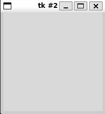
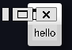
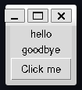
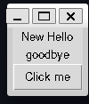
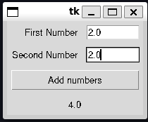
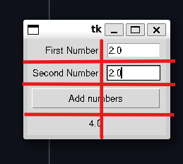
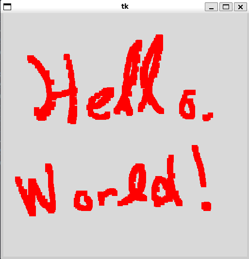

# Chapter 13: Python and Graphical User Interfaces

- [Notes](#notes)
  - [Create a Graphical User Interface with
    Tkinter](#create-a-graphical-user-interface-with-tkinter)
    - [Make Something Happen: Build our First User
      Interface](#make-something-happen-build-our-first-user-interface)
    - [Code Analysis: Building a Graphical User
      Interface](#code-analysis-building-a-graphical-user-interface)
  - [Create a Graphical Application](#create-a-graphical-application)
    - [Lay out a Grid](#lay-out-a-grid)
      - [Use Sticky Formatting](#use-sticky-formatting)
      - [Use Padding](#use-padding)
      - [Span Grid Cells](#span-grid-cells)
    - [Create an Event Handler
      Function](#create-an-event-handler-function)
    - [Code Analysis: Writing an Event
      Handler](#code-analysis-writing-an-event-handler)
    - [Create a Main Loop](#create-a-main-loop)
  - [Handle Errors in a Graphical User
    Interface](#handle-errors-in-a-graphical-user-interface)
  - [Make Something Happen: Fahrenheit to Centigrade and
    Back](#make-something-happen-fahrenheit-to-centigrade-and-back)
  - [Draw on a Canvas](#draw-on-a-canvas)
    - [Make Something Happen: Investigate Events and
      Drawing](#make-something-happen-investigate-events-and-drawing)
  - [Tkinter Events](#tkinter-events)
  - [Create a Drawing Program](#create-a-drawing-program)
    - [Code Analysis: Drawing on a
      Canvas](#code-analysis-drawing-on-a-canvas)
    - [Make Something Happen: Make the Drawing Program Draw
      Ovals](#make-something-happen-make-the-drawing-program-draw-ovals)
  - [Enter Multiline Text](#enter-multiline-text)
    - [Make Something Happen: Investigate the Text
      Object](#make-something-happen-investigate-the-text-object)
  - [Group Display Elements in
    Frames](#group-display-elements-in-frames)
  - [Create an Editable `StockItem` Using a
    GUI](#create-an-editable-stockitem-using-a-gui)
    - [Code Analysis: Creating a
      `StockItemEditor`](#code-analysis-creating-a-stockitemeditor)
    - [Code Analysis: The `load_into_editor`
      Method](#code-analysis-the-load_into_editor-method)
    - [Code Analysis: The `get_from_editor`
      Method](#code-analysis-the-get_from_editor-method)
    - [Code Analysis: Editing Stock
      Items](#code-analysis-editing-stock-items)
  - [Create a Listbox Selector](#create-a-listbox-selector)
    - [Make Something Happen: Investigating the `Listbox`
      Object](#make-something-happen-investigating-the-listbox-object)
    - [Create a `StockItem` Selector](#create-a-stockitem-selector)
      - [Code Analysis: Selecting Stock
        Items](#code-analysis-selecting-stock-items)
  - [An Application with a Graphical User
    Interface](#an-application-with-a-graphical-user-interface)
    - [Setting up the File Structure and the Basic Graphical User
      Interface](#setting-up-the-file-structure-and-the-basic-graphical-user-interface)
    - [Adding Selection and Editing](#adding-selection-and-editing)
      - [Adding Editing](#adding-editing)
      - [Setup Selector](#setup-selector)
      - [Setting up a Stock Level Adjuster
        Component](#setting-up-a-stock-level-adjuster-component)
    - [Code Analysis: Complete Fashion Shop
      Program](#code-analysis-complete-fashion-shop-program)
  - [Make Something Happen: Build Your Own
    Application](#make-something-happen-build-your-own-application)
    - [Design Considerations](#design-considerations)
- [Summary](#summary)
- [Questions and Answers](#questions-and-answers)

## Notes

### Create a Graphical User Interface with Tkinter

- Our previous programs have been text-based interfaces
- Python lets us create *Graphical* user interfaces
- Graphical UI’s typically consist of buttons, text fields etc.
  - This is called the *front-end*
  - Connects to behaviours in the underlying program (the *back-end*)
- Graphical User Interfaces are typically implemented by representing
  graphical elements as objects
  - Interactions translate to method calls
    - e.g. changing a label text
- Tkinter is a built-in module in python for designing a user interface
  - Represents UI elements through a class hierarchy
  - Tkinter itself wraps a library called Tk
  - Tk is a user interface toolkit

#### Make Something Happen: Build our First User Interface

*Familiarise yourself with the basics of TKinter and graphical
interfaces by working through the following steps in the python
interpreter*

1. *Enter the following command*

    ``` python
     from tkinter import *
    ```

    - As discussed before this imports everything from the `TKinter`
      module into the main namespace
      - No need to preface the Tkinter components with the `Tkinter`
        namespace
    - Again, you should be careful about using this
      - Increases the chance of naming collisions between different
        parts of the program

2. *Create a* **root** *window by running the following statement*

    ``` python
     root = Tk()
    ```

    - Root window acts as a container for display elements
    - Should create a new window when executed
      - Look’s something like below
      - Tk uses the native OS windowing system
      - So may look different if your OS is different



1. *Create a* `Label` *by executing the following statement*

    ``` python
     hello = Label(root, text="hello")
    ```

    - User’s can’t interact with a `Label`

    - But does display text on a window

    - A program can change the text on a label

      - e.g. in response to user input

    - `Label` has two parameters

      1. parent

          - the object *within* which the label is displayed
          - Here we use the root
          - We can use multiple levels of nesting to create complex
            objects

      2. text

          - the actual text to display on the label

    - Should observe that after executing the above we don’t see the
      label text

    - We have created the label

    - We also need to specify how to display it

    - Two mechanisms

      1. `pack`

          - packs elements together
          - can supply hints e.g. `LEFT` or `TOP` to control where the
            pack occurs

      2. `grid`

          - lay elements out on a grid
          - Does mean you need to plan the UI layout
          - `grid` method on graphical elements lets us specify how to
            place the object on a grid

2. *Display the* `Label` `hello` *on the window by using the* `grid`
    *method as shown below*

    ``` python
     hello.grid(row=0, column=0)
    ```

    - Tells the program to display the `hello` label at the grid
      coordinate `(0, 0)` (top left corner)
    - Should now see the label displayed
    - The window should shrink to the size of the label

    

3. *Add another label* `Goodbye` *by executing the following*

    ``` python
     goodbye = Label(root, text="goodbye")
     goodbye.grid(row=1, column=0)
    ```

    - Display now has two labels
    - Labels are left aligned
    - The hello label is slightly offset more than the goodbye label
      - We can use settings to fix this

    

    - The next step is to allow the user to initiate actions in a
      program
    - E.g. using a button
    - When pressed a button can link to some behaviour to be executed
    - How do we link this behaviour?
      - We create a function encapsulating the behaviour
      - The button is passed the function as a function reference
      - When the button is pressed it calls the function

4. *Define a function for your button. Execute the following commands*

    ``` python
     def been_clicked():
         print("click")
    ```

    - Simple function
    - When called it just prints `click`

5. *Create a button, and connect the* `been_clicked` *function to it.
    Run the following statements*

    ``` python
     btn = Button(root, text="Click me", command=been_clicked)
    ```

    - This creates a `Button` called `btn`
    - We specify it to be attached to the `root` window
    - We set the button text to `"Click me"`
    - We then link the `been_clicked` function via the `command`
      argument
    - Now we add the button to the display

    ``` python
     btn.grid(row=2, column=0)
    ```

    

    - Click the button a few times and you should see output like,

          >>> click
          click
          click

    - Each click results in a call to `been_clicked`

    - We often refer to the functions connected to GUI elements as
      *event handlers*

      - They *handle* the *external events* of the user

6. *How do we modify a widget, such as changing the text? Work through
    the following*

    - Display elements provide a `config` method

    - Can be used to change or configure their attributes

    - We can rename the `hello` label as follows,

      ``` python
        hello.config(text="New Hello")
      ```

      

    - What if we want to read input from the user?

      - We can use an `Entry` widget
      - The `Entry` widget reads a line of text from the user

7. *Create an* `Entry` *widget by executing the following statements*

    ``` python
     ent = Entry(root)
     ent.grid(row=3, column=0)
    ```

    - The `Entry` widget `ent` is created at the bottom of the program

    - The initial text line is empty

      

    - However, we can type something in, say the classic `Hello, World!`

      

    - The next question is how do we read the text into our program?

      - The `Entry` object supports a `get` method

      - `get` returns the text of the element

      - Running this on our `Entry` object we should see,

        ``` python
          print(ent.get())
        ```

            hello world

      - Try playing with this yourself

We’ve combined all these steps into one
[program](./Examples/01_IntroToTkinter/basic_ui.py)

#### Code Analysis: Building a Graphical User Interface

*Consider the following questions about graphical user interfaces*

1. *What happens if we change the size of the window on the desktop?*

    - By default, we can resize a window

    - But the widgets themselves in the window do not resize

    - We can prevent the widget from being resized

      ``` python
        root.resizable(width=False, height=False)
      ```

    - `resizable` method controls if a window can be resized

    - You can also have a window be resizable and have the components
      size and position change automatically

2. *What happens if we close the window we created?*

    - We created our window in the interpreter
      - Window disappears when closed on the desktop
    - For a program
      - Can define ways to get control when the user tries to close the
        program

3. *Will the window look the same on different systems?*

    - No
    - The general UI will look the same
    - However, modern tk uses the windowing system of the host machine
    - These can vary for different systems

4. *What happens if an event handler function connected to a button
    takes a long time to complete?*

    - Function connect to the button runs
    - Button is “stuck down” until the function finishes executing
    - All other controls also not available
    - Generally event handlers should be responsive
      - Python supports *threading* or multiple threads of execution
        which can execute simultaneously
      - Each thread can run a different program
      - An event handler could spawn a separate thread to start a new
        program
    - Threads will not be discussed more broadly in these notes

5. *What happens if I put two items in the same cell in a grid?*

    - The most recent one will be drawn over the older one
    - The new one blocks the old one
    - This is generally a bad idea

6. *Can we update the contents of elements on the screen from within an
    event handler?*

    - Yes
    - This is how applications work

- They key takeaway here is that user interactions are *events*
- These *events* end up as calls to functions inside a program
- This notion of wiring widgets to actions is similar to the idea of
  wiring up an electronic device
- We design the UI then connect the UI components to event handlers

### Create a Graphical Application

- We’ll now demonstrate our first meaningful graphical program

- Let’s create a simple adding program

  - User provides two numbers
  - Program outputs the result

- The full code is given by
  [adder.py](./Examples/02_AddingMachine/adder.py)

  

- User enters two numbers

- Presses the result button

- Result is then displayed below

- We’ll start creating an application

  - We’ll start with an `Adder` class to hold the application

  ``` python
    class Adder:
        """GUI-based adding machine

        Call `display` to initiate the display

        Notes
        -----
        Uses `Tkinter` as the GUI framework
        """

        def display(self):
            """
            Display the user interface

            Returns
            -------
            None
            """
  ```

- `display` provides the method for handling providing the UI

  - We’ll fill this in later

- We’ll add some script code to get this to run as a main program

  ``` python
    if __name__ == "__main__":
        app = Adder()
        app.display()
  ```

- This allows the code to loaded as a module (e.g. for `pydoc`)

- Also executable as a main program

- Now need to implement the adding machine

#### Lay out a Grid

- Let’s plan out the UI as a grid
- The below figure overlays the final grid
  - We can see some of the components seem to span multiple columns
  - We’ll look at how to implement this latter

  
- Let’s look at what widgets we need
  - 3 Labels (first number, second number, result)
  - 2 Entries (first number, second number)
  - 1 Button (Calculate result)
- Let’s build the first *component*
  - Labelling the numbers

  ``` python
    first_number_label = tkinter.Label(root, text="First Number")
    first_number_label.grid(sticky=tkinter.E, padx=5, pady=5, row=0, column=0)

    second_number_label = tkinter.Label(root, text="First Number")
    second_number_label.grid(sticky=tkinter.E, padx=5, pady=5, row=1, column=0)
  ```

- These create and position the number labels
- They are positioned at the top of the widget (row zero and row one
  respectively)
- You can see we have `sticky`, `padx` and `pady` as extra positioning
  parameters to the `grid` call

##### Use Sticky Formatting

- When using grid we often want to combine widgets of different sizes in
  the same columns
- Layout sizes a column to the largest element
- By default items are centre-aligned
- *sticky* lets you define a direction the widget should try to *stick*
  or prioritise
  - Given by compass directions
  - `tkinter.E` stickies the label to the east or close to the adjacent
    `tkinter.Entry` widget
  - To *stretch* a widget you can sticky an item in multiple directions
    - This is because sticky directions can be added together

##### Use Padding

- Padding adds extra space around a component
- Useful to prevent a component being drawn right up against a boundary
- Padding can be defined for both the $x$ and $y$ directions

##### Span Grid Cells

- We need a two column grid to but the number entry labels and entry
  boxes next to each other

- We’d like the calculate result button and the displayed result to take
  up the whole row

- We can merge columns by using the `columnspan` argument

  ``` python
    add_button = tkinter.Button(root, text="Add numbers", command=do_add)
    add_button.grid(sticky=tkinter.E + tkinter.W, row=2, column=0, columnspan=2, padx=5, pady=5)
  ```

- `do_add` is a function we’ll define later to read the two numbers and
  perform the addition

- `columnspan=2` tells the program to draw `add_button` as spanning two
  columns

- By making the button sticky in east and west it will be drawn across
  the entire row

- Last steps are to add the `Entry` widgets and the result `Label`

  ``` python
    first_number_entry = tkinter.Entry(root, width=10)
    first_number_entry.grid(sticky=tkinter.E, padx=5, pady=5, row=0, column=0)

    second_number_entry = tkinter.Entry(root, width=10)
    second_number_entry.grid(sticky=tkinter.E, padx=5, pady=5, row=1, column=0)

    result_label = tkinter.Entry(root, text="Result")
    result_label.grid(sticky=tkinter.E + tkinter.W, padx=5, pady=5, row=3, column=0, columnspan=2)
  ```

#### Create an Event Handler Function

- Now need to define our function connected to the result button
  `do_add`

- We can define this local to `display` since no other part of the
  program needs it

- Event handler needs to read the text from the two number entry widgets

- Then needs to convert these to numbers

- Then add them

- Then update the results label with the result

- The implementation is given below,

  ``` python
    class Adder:
        ...
        def display(self):
            # create the screen elements
            def do_add():
                # get first number
                first_number_text = first_number_entry.get()
                first_number = float(first_number_text)

                # get second number
                second_number_text = second_number_entry.get()
                second_number = float(second_number_text)

                # add them and update the display
                result = first_number + second_number
                result_label.config(text = str(result))
  ```

#### Code Analysis: Writing an Event Handler

*Answer the following questions about an event handler*

1. *Why is the event handler defined inside the display function?*

    - The event handler function (`do_add`) needs access to display
      elements defined in `display`
    - Functions defined inside a function have access to the variables
      of the enclosing scope
    - Could define `do_add` as part of the `Adder` class
      - But would then have to maintain references to all the display
        elements outside of the display function

2. *What happens if the user doesn’t type in a valid number before
    pressing the Add numbers button?*

    - `float` fails to convert the result
    - This raises an exception
    - The user won’t see the exception directly
      - We may see it in logging or debug output
    - The display won’t update properly though because the `do_add`
      method will abort
    - In the future well look at ways to provide the user with warning
      or error popups

#### Create a Main Loop

- In the first shell example, we could see everything just worked
- This was because the shell read input, processed it then waited for
  more input
- If we run our program as written, we’ll see a similar thing where the
  script just ends
  - We can’t just use `sleep` as before because this will freeze the
    program
  - The user should still be able to interact
- To keep the display active we need to set up a *main loop*
  - Code for making the program wait and then respond to user input

    ``` python
      root.mainloop()
    ```

- `mainloop` fetches events and sends it onto functions created to deal
  with events
- When the close button is pressed the `mainloop` ends
- `mainloop` is typically the last statement
  - The program usually ends then too

### Handle Errors in a Graphical User Interface

- Our program works, but it’s simple

- Doesn’t handle invalid input

- If we enter strings the program will appear not work

  - This is because `float` throws an exception trying to convert
    strings

- We could add exception handling as we’ve done before

  ``` python
    def do_add():
        first_number_text = first_number_entry.get()
        try:
            first_number = float(first_number_text)
        except ValueError:
            result_label.config(text="Invalid first number")

        second_number_text = second_number_entry.get()
        try:
            second_number = float(second_number_text)
        except ValueError:
            result_label.config(text="Invalid second number")
  ```

- We could do a something identical for the second number

- This has one problem

  - If both the first and second number are invalid, only the first is
    flagged

- We want to build a more complex error string that reports all the
  errors

  ``` python
    def do_add():
        error_message = ""
        first_number_text = first_number_entry.get()
        try:
            first_number = float(first_number_text)
        except ValueError:
            error_message = "Invalid first number\n"

        second_number_text = second_number_entry.get()
        try:
            second_number = float(second_number_text)
        except ValueError:
            error_message += "Invalid second number"

        if error_message != "":
            result_label.config(text=error_message)
        else:
            result = first_number + second_number
            result_label.config(text = str(result))
  ```

- We can use an empty error string to detect if we’ve encountered an
  error

- This lets different error sections contribute to the overall output

- We can further extend this by providing a visual indicator of where
  the error has occurred

  - For example, by setting the background red, and the text blue

    ``` python
      first_number_entry.config(background="red", foreground="blue")
    ```

  - In this case we also have to remember to reset the background, when
    the user corrects the input

- The final implementation can be found in
  [AddingMachineWithExceptions](./Examples/03_AddingMachineWithExceptions/adder.py)

  

  ### Display a Message Box

- An alternative technique could be to use a message or dialog box

- Forces the user to acknowledge the error

- We can use Tkinter’s `messagebox`

  ``` python
    from tkinter import messagebox
  ```

- `messagebox` has three levels for displaying messages (functions)

  - `showinfo`
  - `showwarning`
  - `showerror`

- Only difference is the icon

- UI is locked until the user clears the message

- All have the same function signature, see below

  ``` python
    messagebox.showinfo("Rob Miles", "Rob Miles is awesome")
  ```

  

- We can add this to our Adder program

  - Instead of setting the result with the error text, we display a
    message box
  - To help the user we’ll also keep the background highlighting

  

### Make Something Happen: Fahrenheit to Centigrade and Back

*In this challenge you will be provided with a half-finished program.
Your goal is to complete the program. The program should allow the user
to convert back and forth between fahrenheit and centigrade. The final
program should look like the below,*


*Currently it looks like*


*The starter code is*

``` python
"""
Exercise 13.1 Fahrenheit to Celsius

Provides a graphical interface for converting between fahrenheit and centigrade
"""

import tkinter


class Converter:
    """
    GUI-based Fahrenheit to Celsius converter (and vice-versa)

    Call `display` to initiate the display

    Notes
    -----
    Uses `Tkinter` as the GUI framework
    """

    def display(self):
        """
        display the user interface

        Returns
        -------
        None
        """
        root = tkinter.Tk()

        cent_label = tkinter.Label(root, text="Celsius:")
        cent_label.grid(row=0, column=0, padx=5, pady=5, stick=tkinter.E)

        cent_entry = tkinter.Entry(root, width=5)
        cent_entry.grid(row=0, column=1, padx=5, pady=5)

        fah_entry = tkinter.Entry(root, width=5)
        fah_entry.grid(row=2, column=1, padx=5, pady=5)

        def fahrenheit_to_celsius():
            """
            Convert from Fahrenheit to celsius and display the result

            Returns
            -------
            None
            """
            fah_string = fah_entry.get()
            fah_float = float(fah_string)
            result = (fah_float - 32) / 1.89
            cent_entry.delete(0, tkinter.END) # remove old text
            cent_entry.insert(0, str(result))

        def celsius_to_fahrenheit():
            """
            Convert from Celsius to Fahrenheit and display the result

            Returns
            -------
            None
            """
            cent_string = cent_entry.get()
            cent_float = float(cent_string)
            result = cent_float * 1.8 + 32

        fahrenheit_to_celsius_button = tkinter.Button(root, text="Fahrenheit to Celsius", command=fahrenheit_to_celsius)
        fahrenheit_to_celsius_button.grid(row=1, column=0, padx=5, pady=5)

        root.mainloop()

if __name__ == "__main___":
    app = Converter()
    app.display()
```

This program uses a new feature, we use an `Entry` element to get the
user specified fahrenheit or celsius temperature. When we click the
appropriate button we need to overwrite what was in the other `Entry`
label.

`Entry` supports sophisticated text editing, but we only want to
overwrite the text. We can’t just redefine the text like we would for a
`Label`

First we use `delete` to remove the old text.

``` python
    cent_entry.delete(0, tkinter.END) # remove the old text
```

The first argument is the index to delete from (inclusive), and the
second is the index to delete to. `tkinter.END` is used to delete up to
the end of the line

We can then add the new text using `insert`

``` python
    cent_entry.insert(0, str(result))
```

This has a slightly different syntax. We indicate the index we want to
insert the string at, and then the string we want to insert

You can find the [starter code
here](./Exercises/01_FahrenheitToCelcius/FahrenheitToCelcius_starter.py),
and should have a go at yourself before reading the solution below

Let’s first tidy up the already implemented Fahrenheit to Celsius code.
We want to add proper error handling code. We’ve already seen how to do
this with the [Message Box](#display-a-message-box).

``` python
        def fahrenheit_to_celsius():
            """
            Convert from Fahrenheit to celsius and display the result

            Returns
            -------
            None
            """
            try:
                fah_string = fah_entry.get()
                fah_entry.config(background="white", foreground="black")
                fah_float = float(fah_string)
            except ValueError:
                tkinter.messagebox.showerror(title="Temperature Converter", message="Fahrenheit must be a number")
                fah_entry.config(background="red", foreground="blue")
                return

            result = (fah_float - 32) / 1.8
            cent_entry.delete(0, tkinter.END) # remove old text
            cent_entry.insert(0, "{0:.2f}".format(result))
            cent_entry.config(background="white", foreground="black")
```

- This should look pretty familiar, we use a `try...except` block to
  catch invalid input
  - On invalid input we display an error box
  - We also set the background for the entry element to be red and the
    text to be blue
  - This means we have to reset the entry element to the normal look
    after a successful read (in case it had been set as an error)
- Once we have validated all the input we can then update the text in
  the other entry box
- Here we have to be careful that if the user was previously typing
  here, then it might to have be set to an error highlight
- So here we also want to set it back to normal
- Lastly you’ll notice we’ve updated the string we pass to `insert` to
  `"{0:.2f}".format(result)`
  - This allows means that the result will only be displayed to two
    decimal places

Next, we want to finish defining the reverse function for converting
celsius to fahrenheit. This is pretty much identical to the previous
function. Just swapping the roles of the entry boxes

``` python
        def celsius_to_fahrenheit():
            """
            Convert from celsius to Fahrenheit and display the result

            Returns
            -------
            None
            """
            try:
                cent_string = cent_entry.get()
                cent_entry.config(background="white", foreground="black")
                cent_float = float(cent_string)
            except ValueError:
                tkinter.messagebox.showerror(title="Temperature Converter", message="Celsius must be a number")
                cent_entry.config(background="red", foreground="blue")
                return
            result = cent_float * 1.8 + 32
            fah_entry.delete(0, tkinter.END)
            fah_entry.insert(0, "{0:.2f}".format(result))
            fah_entry.config(background="white", foreground="black")
```

We then need to add the button to connect to this function

``` python
    celsius_to_fahrenheit_button = tkinter.Button(root, text="Celsius to Fahrenheit", command=celsius_to_fahrenheit)
    celsius_to_fahrenheit_button.grid(row=1, column=1, padx=5, pady=5)

    root.mainloop()
```

Of course the last thing to do is add the Fahrenheit label and then
perform some tidying up. Namely we want the `Entry` boxes to stretch to
fill the whole column (so we use `tkinter.E + tkinter.W` in the `stick`
parameter)

``` python
def display(self):
    """
    display the user interface

    Returns
    -------
    None
    """
    root = tkinter.Tk()

    cent_label = tkinter.Label(root, text="Celsius:")
    cent_label.grid(row=0, column=0, padx=5, pady=5, stick=tkinter.E)

    fah_label = tkinter.Label(root, text="Fahrenheit:")
    fah_label.grid(row=2, column=0, padx=5, pady=5, stick=tkinter.E)

    cent_entry = tkinter.Entry(root, width=5)
    cent_entry.grid(row=0, column=1, padx=5, pady=5, stick=tkinter.E + tkinter.W)

    fah_entry = tkinter.Entry(root, width=5)
    fah_entry.grid(row=2, column=1, padx=5, pady=5, stick=tkinter.E + tkinter.W)
```

The final working implementation can be found in
[FahrenheitToCelsius.py](./Exercises/01_FahrenheitToCelcius/FahrenheitToCelcius.py)

### Draw on a Canvas

- GUI’s typically work by recognising *events* or interactions
- For example, we could recognise when a user has clicked on a screen to
  draw something
- Let’s create a basic drawing program

#### Make Something Happen: Investigate Events and Drawing

*Investigate events in* `Tkinter` *by working through the following
activity. Start by opening the python interpreter*

1. *Import Tkinter*

    ``` python
        import tkinter
    ```

2. *Create a window on the screen*

    ``` python
        root = tkinter.Tk()
    ```

3. *Create a* `Canvas`

    - A `Canvas` is a display component that acts as a container for
      other display elements

    - Elements can be drawn and positioned on a canvas

    - When creating the canvas we need to specify the size

    - *Enter the following to create a canvas*

      ``` python
        c = Canvas(root, width=500, height=500)
      ```

    - *place the canvas on the display, by entering the following*

      ``` python
        c.grid(row=0, column=0)
      ```

4. *Add functionality to the canvas*

    - The canvas currently just appears as a square

    - We need to attach functionality to the canvas

    - Similar to how we attach a function to a button

    - Start by defining our action function

    - *Define the function below*

      ``` python
        def mouse_move(event):
            print(event.x, event.y)
      ```

    - Above function receives a single argument (`event`)

      - `event` has two attributes, `x` and `y`
      - These are the positions of the mouse when the event is triggered

    - This function simply prints out the position of the mouse when the
      event is triggered

    - Now we need to connect the event to this function

      - This process is called *binding*

    - display objects contain a `bind` method used to bind events
      triggered on them to a function

    - *Enter the following to bind the* `<B1-motion>` *event on the
      canvas to your function*

      ``` python
        c.bind("<B1-Motion>", mouse_move)
      ```

    - `<B1-Motion>` corresponds to mouse movement with the `B1` button
      held down (left-button typically)

    - `bind` returns a unique string to identify the binding

      - This string can be used to track and recover a binding later
      - e.g. If we wanted to disable it
      - String’s are typically machine specific

5. *Try out the new functionality*

    - Click and drag your mouse on the canvas
    - You should see a stream of coordinates in the output
    - In graphics typically the top left corner is `(0, 0)`
      - Indices increase *down* the screen and to the *right*

6. *Convert the canvas to a drawing program*

    - We want our canvas to support drawing something!

    - `Canvas` provides a method `create_rectangle` to draw a rectangle
      on a screen

    - *Enter the following to draw a rectangle*

      ``` python
        c.create_rectangle(100, 100, 300, 200, outline="blue", fill="blue")
      ```

    - `create_rectangle` takes four arguments, corresponding to the
      `(x, y)` coordinates of the top left and the bottom right corner
      respectively

    - `outline` lets us optionally set the outline colour of the
      rectangle (default is black)

    - `fill` sets the fill in colour of the block (default black)

    - `create_rectangle` returns an integer

    - This is an id for the drawn rectangle

    - We can use this to manipulate the rectangle

    - *Delete the rectangle*

      ``` python
        c.delete(1)
      ```

    - The ability to manipulate the objects on a canvas is very powerful

    - *Redefine a new function for the mouse press event*

      ``` python
        def mouse_move_draw(event):
            c.create_rectangle(event.x - 5, event.y -5, event.x + 5, event.y + 5, fill="red", outline="red")
      ```

    - The above draws a $10 \times 10$ pixel rectangle centred around
      the mouse click location

    - *Bind this new function to the canvas*

      ``` python
        c.bind("<B1-Motion>", mouse_move_draw)
      ```

    - Now attempt to draw on the canvas, you should see something like
      below

      

The final result can be found in
[Canvas.py](./Examples/05_Canvas/basic_canvas.png)

### Tkinter Events

- Events are powerful and flexible
- Consider the event tag from before `"<B1-Motion>"`
  - It consists of two parts

    1. The first part is the *modifier* (`B1`)
        - Condition required for event to generate
        - Here the condition is that the primary mouse button is clicked
    2. The second part is the *detail*
        - Thing that produces the event (here moving the mouse)

  - We could for example use the event `"<Motion>"`

    - This produces events for every mouse move
- Below is a table of common and useful events and modifiers

| Modifier | Action                     | Detail        | Action                |
|----------|----------------------------|---------------|-----------------------|
| Control  | Control key pressed        | Motion        | Mouse moved           |
| Shift    | Shifty key pressed         | ButtonPress   | Mouse button pressed  |
| B1-B4    | corresponding mouse button | ButtonRelease | Mouse button released |
|          |                            | KeyPress      | Key pressed           |
|          |                            | KeyRelease    | Key released          |
|          |                            | MouseWheel    | Mouse wheel moved     |

- Different actions may create different event information
- Events delivered when a key is pressed identify the key
- Events delivered by the mouse contain its coordinates
- Multiple modifiers can create complex events with multiple modifiers

### Create a Drawing Program

- Let’s create a more sophisticated version of our drawing program

  1. User can draw with a mouse
  2. Change the drawing colour with the keyboard
  3. clear the canvas

``` python
"""
Example 13.6 Drawing Program

A simple drawing program where the user can

1. Draw
2. Change brush colour
3. Clear the canvas
"""

import tkinter


class Drawing:
    """
    GUI element for a drawing program

    Notes
    -----
    Uses `tkinter` for the GUI framework
    """

    def display(self):
        """
        Display the Drawing Program

        Returns
        -------
        None
        """
        root = tkinter.Tk()
        canvas = tkinter.Canvas(root, width=500, height=500)
        canvas.grid(row=0, column=0)

        draw_colour = "red"

        def mouse_move(event):
            """
            Draw a 10 by 10 pixel rectangle centred on the mouse

            Parameters
            ----------
            event
                the triggering event

            Returns
            -------
            None
            """
            canvas.create_rectangle(
                event.x - 5,
                event.y - 5,
                event.x + 5,
                event.y + 5,
                fill=draw_colour,
                outline=draw_colour,
            )

        canvas.bind("<B1-Motion>", mouse_move)

        def key_press(event):
            """
            Change the drawing program state in response to a key press

            Parameters
            ----------
            event
                key press that triggered the function

            Returns
            -------
            None
            """
            nonlocal draw_colour
            ch = event.char.upper()
            if ch == "C":
                canvas.delete("all")
            elif ch == "R":
                draw_colour = "red"
            elif ch == "G":
                draw_colour = "green"
            elif ch == "B":
                draw_colour = "blue"

        canvas.bind("<KeyPress>", key_press)
        canvas.focus_set()

        root.mainloop()


if __name__ == "__main__":
    app = Drawing()
    app.display()
```

The output should look something like this,


and can be found in
[DrawingProgram.py](./Examples/06_DrawingProgram/DrawingProgram.py)

#### Code Analysis: Drawing on a Canvas

*To understand the code above, work through the following questions*

1. *What is the* `draw_colour` *variable used for?*

    - `draw_colour` holds the current draw colour

    - Many colours are recognised by name

    - There are other methods for specifying colours too, such as by
      hexcode

      ``` python
        draw_colour = "#FFFF00"
      ```

      - The hexcode is three two-digit hex values
      - Correspond to the amount of red, green and blue respectively
      - The above corresponds to yellow

    - The Tcl wiki maintains a page with the [colour
      names](https://wiki.tcl-lang.org/page/Color+Names%2C+running%2C+all+screens)

    - The program starts with `draw_colour` corresponding to red, and
      uses the keys `R`, `G`, `B` to switch colours

2. *How do you clear the canvas?*

    - We can delete specific items if we keep track of the ID
    - `delete` can accept `"all"` as its argument
      - In this case all elements are deleted
      - This effectively clears the canvas
    - In our program this is assigned to the `C` key

3. *In the* `key_press` *function, you’ve created a* `nonlocal`
    *variable called* `draw_colour`*. What does this mean?*

    ``` python
        def key_press(event):
            nonlocal draw_colour
    ```

    - `key_press` needs to be able to change the value of `draw_colour`
    - `draw_colour` is declared in the outer `display` function scope
    - `draw_colour` is therefore not a global variable so we can’t use
      `global` to connect the function to the variable
    - `nonlocal` acts similar but means the variable exists in the
      enclosing scope

4. *What does the call of* `focus_set` *do?*

    - By default python doesn’t know what application a key press should
      be sent to
      - Or which component of an application
    - `focus_set` tells python that this component should receive the
      keyboard events
    - This is independent of which window is actually focused
      (i.e. currently being looked at) by the user

#### Make Something Happen: Make the Drawing Program Draw Ovals

*The* `Canvas` *object provides a method called* `create_oval`*, which
can be used to draw ovals. It has a different set of arguments from the*
`create_rectangle` *method. Make a version of the drawing program that
draws ovals. You could even allow the artist to swap between brushes by
pressing S for square brush and O for an oval brush*

Let’s first implement the oval drawing mechanics. From the `tkinter`
website, we can see that `create_oval` has a similar function signature
to create_rectangle, but there is different semantic meaning. The oval
is drawn inscribed in a rectangle defined by the upper left corner (the
first two arguments) and the lower right corner (bottom two arguments).

So we can define a function to draw an oval in response to an event as
follows,

``` python
    def mouse_move_oval(event):
        """
        Draw an oval inscribed in an 10 x 10 pixel rectangle centred on
        the mouse

        Parameters
        ----------
        event
            the triggering event
        """
        canvas.create_oval(
            event.x - size,
            event.y - size,
            event.x + size,
            event.y + size,
            fill=draw_colour,
            outline=draw_colour,
        )
```

Now we need to add the functionality to switch between the two brushes.
By default our program binds the `<B1-Motion>` event to drawing a
square. We need to make this binding change. We’ll add additional
keypress events to the `key_press` function `S` and `O` to switch the
brush. Each of these events will have to rebind the appropriate function
to the `<B1-Motion>` event. To help the user we’ll add a text label
below the canvas that indicates the current brush. For symmetry we’ll
add a second label below this one that indicates the current colour. So
we then need to update the `key_press` function to properly update these
labels.

The final `key_press` function then looks like,

``` python
        def key_press(event):
            """
            Change the drawing program state in response to a key press

            Parameters
            ----------
            event
                key press that triggered the function

            Returns
            -------
            None
            """
            nonlocal draw_colour
            nonlocal size
            ch = event.char.upper()
            if ch == "C":
                canvas.delete("all")
            elif ch == "R":
                draw_colour = "red"
                colour_label.config(text="Colour: {0}".format(draw_colour))
            elif ch == "G":
                draw_colour = "green"
                colour_label.config(text="Colour: {0}".format(draw_colour))
            elif ch == "B":
                draw_colour = "blue"
                colour_label.config(text="Colour: {0}".format(draw_colour))
            elif ch == "S":
                canvas.bind("<B1-Motion>", mouse_move_square)
                brush_label.config(text="Brush: square")
            elif ch == "O":
                canvas.bind("<B1-Motion>", mouse_move_oval)
                brush_label.config(text="Brush: oval")
            elif ch == "+":
                size = min(size + 5, 50)
                size_label.config(text="Size: {0}".format(size))
            elif ch == "-":
                size = max(size - 5, 5)
                size_label.config(text="Size: {0}".format(size))

            elif ch == "H":
                tkinter.messagebox.showinfo(
                    title="Simple Canvas",
                    message="""Controls:
C - clear canvas
R - change colour to red
B - change colour to blue
G - change colour to green
S - change brush to square brush
O - change brush to oval brush
+ - increase brush size
- - decrease brush size

Right click to erase""",
                )
```

You’ll notice that there are three extra bound events that have not been
discussed. The first two are the `+` and `-` keys which we bind the
increasing and decreasing the brush size respectively. Our original
drawing code always draw the box as a $10 \times 10$ box around the
triggering event. We’ll now let the user control that. We make `size` a
variable, and the user can use `+` to increase the brush size in
increments of $5$ up to $50$, and decrease the `size` using `-` down to
$5$. This `size` takes the place of the hardcoded `event.x + 5`
statements in `mouse_move_oval`.

The next addition you should notice is the `H` key. This simply uses
`messagebox` to display a dialog to the user listing out all the
controls.

The last functionalty we want to implement is erasing. We want the user
to be able to erase over previously drawn elements using the right mouse
button. This corresponds to the `<B3-Motion>` event. Now we could try
and right some code that tracks all the drawn elements and tries to
locate which element is being dragged over and delete it, but an easy
work around is to simply paint over the top with a new rectange that
uses the background colour. So in this case, from the `tkinter` docs we
can see that we can set the `Canvas` background colour to white using
`bg="white"` in the `Canvas` constructor. We can then define our `erase`
function as,

``` python
        def erase(event) -> None:
            """
            Erase the canvas

            Parameters
            ----------
            event
                triggering event

            Notes
            -----
            Erase is implemented by drawing a white rectangle centred on the mouse
            """
            canvas.create_rectangle(
                event.x - size,
                event.y - size,
                event.x + size,
                event.y + size,
                fill="white",
                outline="white",
            )
```

We then simply bind this to the the `<B3-Motion>` event and we’ve got
our erase. This fairly straightforward set of steps gives us a fairly
complete and good looking little drawing program. You can see the full
code in
[DrawingProgram.py](./Exercises/02_AdvancedDrawingProgram/DrawingProgram.py).
An example of the program looks like below,


### Enter Multiline Text

- `Entry` only supports a single line of text
- Powerful, but not sophisticated enough for all tasks, e.g. a text
  editor
- `Text` supports pages of text
  - Similar to `Entry`
  - Some differences

#### Make Something Happen: Investigate the Text Object

*Investigate the* `Text` *object using the python interpreter. Work
through the following steps*

1. *Import tkinter*

    ``` python
     import tkinter
    ```

2. *Create a Tkinter window*

    ``` python
     root = tkinter.Tk()
    ```

3. *Create a* `Text` *object*

    ``` python
     t = tkinter.Text(width=80, height=10)
    ```

    - Creates a `Text` object, assigned to `t`

    - `width` and `height` correspond to *characters* (width) and
      *lines* (height) **not** pixels

    - *position the object on the window*

      ``` python
        t.grid(row=0, column=0)
      ```

      

    - `Text` gives a lot of control over editing the content

    - `Text` let’s us extract it’s contents using `get` like `Entry`

      - But has a more sophisticated functions signature

    - Refer to characters by their row and column positions

4. *Demonstrate the use of* `get` *to extract text from the* `Text`
    *widget*

    ``` python
     t.get("1.0", tkinter.END)
    ```

        Hello, World!\nAnother line of text\n

    - This returns all of the text starting at row $1$, column $0$ and
      through the `tkinter.END` of the `Text`.

    - If you want to get a specific slice of text, you can instead pass
      another string of the form `"row.column"`, e.g.

    - To slice the second row, we write

      ``` python
        t.get("2.0", "3.0")
      ```

          Another line of text\n

5. *Demonstrate the use of the* `delete` *method to remove text*

    - `delete` removes text from a `Text` widget

    - Has an identical signature to get, e.g.

      ``` python
        t.delete("1.0", tkinter.END)
      ```

    - deletes all text

6. *Demonstrate the use of the* `insert` *method to add text*

    - We can add text by defining the start position

    - Then supply the string we want to insert, e.g.

      ``` python
        t.insert("1.0", "New line 1\nNew line 2")
      ```

    - This inserts text into the `Text` box at the start, `\n` results
      in splitting the lines

### Group Display Elements in Frames

- `grid` helps us define how we want to layout a complete window
- Often we want to lay out subcomponents on a bigger component first
  - That component is then embedded into the window
- `Frame` is an object for acting as a root for a set of elements
  - Can be used to define how objects are displayed within it
- The goal will be to create a graphical version of our [fashion shop
  program](../../02_AdvancedProgramming/11_ObjectBasedSolutionDesign/Chapter_11.qmd#fashion-shop-application)
- We can use a `Frame` to define a layout for editing a `StockItem`
- The `Frame` object can then be included in higher level graphical
  objects
  - `Frame` acts very similar to the `Tk` object for the main window

  - We can use it in places that need a root window rather than the `Tk`
    object as below

    ``` python
      frame = tkinter.Frame(root)
      stock_ref_label = tkinter.Label(frame, text="Stock ref:")
      stock_ref_label.grid(sticky=tkinter.E, row=0, column=0, padx=5, pady=5)
    ```

  - `stock_ref_label` is now part of the `frame` object

    - Positioned in the top left corner of the frame
    - This frame component can then be reused elsewhere

  - Note that the `stock_ref_label` and other components of the frame
    won’t show up until the frame itself is attached to some other frame
    or window

### Create an Editable `StockItem` Using a GUI

- Now let’s start creating a graphical version of our Fashion Shop
  Program

- First goal is to create an editable `StockItem`

- We need the GUI presentation of it to,

  1. Clear the editor display
  2. Put a `StockItem` on display for editing
  3. Load a `StockItem` from the display after editing

- This object will be called `StockItemEditor`

- Let’s start by stubbinng out the class

``` python
"""
Example 13.8 Stock Item Editor

Implements a graphical editor object for editing `StockItem` objects
"""


class StockItemEditor:
    """
    Graphical Editor for a StockItem

    Notes
    -----
    Implemented as a `Tkinter` Frame
    """

    def __init__(self, root):
        """
        Create a new `StockItemEditor`

        Parameters
        ----------
        root
            Tkinter root frame for the editor
        """
        pass

    def clear_editor(self):
        """
        Clears the editor window

        Returns
        -------
        None
        """
        pass

    def load_into_editor(self, item):
        """
        Load a `StockItem` into the edit display


        Parameters
        ----------
        item : StockItem
            stock reference to be loaded
        """
        pass

    def get_from_editor(self, item):
        """
        Get an updated `StockItem` from the editor

        Parameters
        ----------
        item : StockItem
            stock reference to update

        Raises
        ------
        ValueError
            raised if the price entry cannot be converted to a number
        """
        pass
```

- Implement the methods one by one

- Start with `__init__`

- Needs to

  - Create display objects
  - Add them to the frame

- Editor exists at the start of the program

  - Item’s are loaded into the editor

- An alteranative design might be to load an editor when we bring up an
  item

  ``` python
    def __init__(self, root):
        """
        Create a new `StockItemEditor`

        Parameters
        ----------
        root
            Tkinter root frame for the editor
        """
        self.frame = tkinter.Frame(root)

        stock_ref_label = tkinter.Label(self.frame, text="Stock ref:")
        stock_ref_label.grid(sticky=tkinter.E, row=0, column=0, padx=5, pady=5)
        self._stock_ref_entry = tkinter.Entry(self.frame, width=30)
        self._stock_ref_entry.grid(sticky=tkinter.W, row=0, column=1, padx=5, pady=5)

        price_label = tkinter.Label(self.frame, text="Price:")
        price_label.grid(sticky=tkinter.E, row=1, column=0, padx=5, pady=5)
        self._price_entry = tkinter.Entry(self.frame, width=30)
        self._price_entry.grid(sticky=tkinter.W, row=1, column=1, padx=5, pady=5)

        self._stock_level_label = tkinter.Label(self.frame, text="Stock level: 0")
        self._stock_level_label.grid(row=2, column=0, columnspan=2, padx=5, pady=5)

        tags_label = tkinter.Label(self.frame, text="Tags:")
        tags_label.grid(sticky=tkinter.E + tkinter.N, row=3, column=0, padx=5, pady=5)
        self._tags_text = tkinter.Text(self.frame, width=50, height=5)
        self._tags_text.grid(row=3, column=1, padx=5, pady=5)
  ```

- The `__init__` creates a bunch of elements, namely,

  1. A label, entry pair for the stock item reference number,
  2. A label, entry pair for the stock item price
  3. A label for the current stock level
  4. A label, text pair for the stock item tags

- We can then create and run our program with this element,

  ``` python
    root = tkinter.Tk()
    stock_frame = StockItemEditor(root)
    stock_frame.frame.grid(row=0, column=0)

    root.mainloop()
  ```

#### Code Analysis: Creating a `StockItemEditor`

*Answer the following questions about how* `StockItemEditor` `__init__`
*method*

1. *Why do only some of the display elements have a* `self` *element in
    front of them*

    - We only need to keep a reference to display elements we later want
      to interact with
      - e.g. the various entry boxes and the stock level label
      - The former we’ll want to extract and/or update the text from and
        the later we want to update the text
      - Other display elements like static labels we don’t need to
        change, so no need to keep the reference

2. *What is the frame attribute of the* `StockItemEditor` *class used
    for?*

    - The frame contains the objects that make up the editing display

    - Program creating the display needs to use the frame to position
      the entire component in the larger display

    - `frame` is simply an attribute to hold the `Frame` object
      reference

    - e.g. when we actually position the frame,

      ``` python
        stock_frame.frame.grid(row=0, column=0)
      ```

- Next, the `clear_editor` method

  - Two use cases,
  - Loading a new element (clear any previous element first)
  - When finished editing an element

  ``` python
      def clear_editor(self):
        """
        Clears the editor window

        Returns
        -------
        None
        """
        self._stock_ref_entry.delete(0, tkinter.END)
        self._price_entry.delete(0, tkinter.END)
        self._tags_text.delete("0.0", tkinter.END)
        self._stock_level_label.config(text="Stock level: 0")
  ```

  - Straightforward, justt clear all the text and set the stock level
    label to zero

- Next we implement `load_into_editor` which loads a `StockItem`

- Need to copy the values from the supplied `StockItem` into the editor

  ``` python
    def load_into_editor(self, item):
        """
        Load a `StockItem` into the edit display

        Parameters
        ----------
        item : StockItem
            stock reference to be loaded
        """
        self.clear_editor()
        self._stock_ref_entry.insert(0, item.stock_ref)
        self._price_entry.insert(0, str(item.price))
        self._stock_level_label.config(text="Stock level {0}".format(item.stock_level))
        self._tags_text.insert("0.0", item.text_tags)
  ```

  - We call the method and pass the `StockItem`

  - The editor then reads the values from the item

  - Inserts these into the appropriate text boxes

  - We can then use it as below,

    ``` python
    item = StockItem.StockItem(
        "D001",
        price=120,
        tags="dress,colour:red,loc:shop window,pattern:swirly,size:12,evening,long",
    )

    item.add_stock(5)
    stock_frame.load_into_editor(item)
    ```

#### Code Analysis: The `load_into_editor` Method

*Work through the following questions about the* `load_into_editor`
*method*

1. *What is the purpose of this method?*

    - Used after the user has selected a `StockItem` to edit
    - Needs to load and display the values of the item for the user to
      then modify
      - Compared to our text-based interface which prompted the user to
        edit each attribute in turn for `Contact` objects

2. *Why are some of the items converted to a string before editing?*

    - Attributes internally are not strictly held as strings
    - E.g. the `price` is a number and tags are a `set`
    - `Entry` and `Text` expect strings though, so we have to convert
      back and forth

3. *What is the* `text_tags` *attribute of the a* `StockItem`

    - Good spot!

    - This is a small addition make to the `StockItem` to simply
      conversion of a tags set to a string and back

    - Allows the user to easily supply or receive a set of tags as a
      string of comma-seperated values

      ``` python
        @property
        def text_tags(self):
            """
            text_tags : str
                item tags as a comma separated string
            """
            tag_list = list(self.tags)
            tag_list.sort()
            return ",".join(tag_list)

        @text_tags.setter
        def text_tags(self, tag_string):
            self.tags = set(map(str.strip, str.split(str.lower(tag_string), sep=",")))
      ```

    - We’ve modified the `StockItem` implementation to simply support
      this

    - An alternative would be to provide a wrapper or adaptor

- Last method, is the reverse of the previous. To fetch a `StockItem`
  from the editor

  ``` python
    def get_from_editor(self, item):
        """
        Get an updated `StockItem` from the editor

        Parameters
        ----------
        item : StockItem
            stock reference to update

        Raises
        ------
        ValueError
            raised if the price entry cannot be converted to a number
        """
        item.set_price(self._price_entry.get())
        item.stock_ref = self._stock_ref_entry.get()
        item.text_tags = self._tags_text.get("1.0", tkinter.END)
  ```

  - We now want to link this to a button that the user will press

  ``` python
    def save_edit():
        stock_frame.get_from_editor(item)
        stock_frame.clear_editor()


    save_button = tkinter.Button(root, text="Save", command=save_edit)
    save_button.grid(row=1, column=0)
  ```

  - We can see this updates the item, then clears the editor

  - You might notice a new function on the `StockItem`, `set_price`

  - This simply validates that a given price is a number and then
    updates the price

    ``` python
      def set_price(self, new_price):
          """
          Set a new price on the stock item

          Parameters
          ----------
          new_price : int | float
              new price of the item

          Raises
          ------
          ValueError
              Raised if the price is outside of the valid range
          ValueError
              Raised if the price is not a number

          """
          if StockItem.show_instrumentation:
              print("** StockItem set_price called")
          try:
              new_price = int(new_price)
          except ValueError:
              new_price = float(new_price)
          if new_price < StockItem.min_price or new_price > StockItem.max_price:
              raise ValueError("Price out of range")
          self.__price = new_price
    ```

#### Code Analysis: The `get_from_editor` Method

*Answer the following questions about* `get_from_editor`

1. *What is the purpose of this method?*

    - Takes the edited `StockItem` values and puts them back into a
      `StockItem`
    - Equivalent of saving text in a text editor, your changes are
      written back to the original file

2. *Can this method fail?*

    - Yes
    - Invalid prices will cause the `set_price` method to raise a
      `ValueError`
      - This occurs if the value is not a number or if it’s outside the
        valid range
    - The caller is responsible for handling the exception

- We can write a simple script to check that the `StockItemEditor`
  widget works as expected

``` python
if __name__ == "__main__":
    item = StockItem.StockItem(
        "D001",
        price=120,
        tags="dress,colour:red,loc:shop window,pattern:swirly,size:12,evening,long",
    )

    item.add_stock(5)

    root = tkinter.Tk()
    stock_frame = StockItemEditor(root)
    stock_frame.frame.grid(row=0, column=0)
    stock_frame.load_into_editor(item)

    def save_edit():
        stock_frame.get_from_editor(item)
        stock_frame.clear_editor()

    save_button = tkinter.Button(root, text="Save", command=save_edit)
    save_button.grid(row=1, column=0)

    root.mainloop()
```

- For simplicity this has been written in the same file as the
  [StockItemEditor](./Examples/08_EditableStockItem/StockItemEditor.py)

- The final widget should look something like below

  

- You can also see the updated
  [`StockItem`](./Examples/08_EditableStockItem/StockItem.py)

#### Code Analysis: Editing Stock Items

*Would it not make sense to put the editing behaviour inside the*
`StockItem` *class?*

You can probably make an argument one way or another. The argument in
favour might be that all the functionality of a `StockItem` should be in
the `StockItem` and that by keeping the editing behaviour on the object
we can reduce coupling to another edit object that might need to read
the internals of the `StockItem` class.

The argument against might be that the `StockItem` is supposed to
represent a specific `StockItem` and its associated data. It would be an
additional responsibility for it to also be responsible for editing
itself, as that is effectively taking responsibility for creating
`StockItem` objects.

For this program we decide to go with the second approach, `StockItem`
simply acts as a datastore, and `StockItemEditor` implements the logic
for editing a `StockItem`

### Create a Listbox Selector

- We can now load and edit our stock items
- The thing we need is a way for the user to select a stock item
- We can’t just put a simple button in because the number of stock items
  is dynamic
- One approach would be to use an `Entry` widget to have the user type
  in the reference they want to edit
  - This has the difficulty that the user has to know the stock
    reference beforehand
- A more useful approach might to be have all the stock references
  displayed in a list that we can select from
  - `Listbox` is a widget that lets us do this

#### Make Something Happen: Investigating the `Listbox` Object

*Start by investigating the* `Listbox` *through the python interpreter.
Work through the following steps*

1. *Load tkinter and create a window*

    ``` python
     import tkinter
     root = tkinter.Tk()
    ```

2. *Create a* `Listbox` *and display it*

    ``` python
     lb = tkinter.Listbox(root)
     lb.grid(row=0, column=0)
    ```

    - This creates a `Listbox` assigns it to the variable `lb`
    - Then adds `lb` to the window
    - Screen should now have an empty white list box

3. *Add some items to the box*

    - We can add items using the `insert` method

      ``` python
        lb.insert(0, "hello")
      ```

    - First argument is the index to insert the item

    - Second argument is the text to insert

    - Add some more items,

      ``` python
        lb.insert(1, "goodbye")
        lb.insert(0, "top line")
        lb.insert(tkinter.END, "bottom line")
      ```

    - The final listbox should look like below,

    - We can see that `insert` doesn’t overwrite elements, if we insert
      before another element, everything is shifted down

    - We can use `tkinter.END` to append something to the end

      

    - In our program, we’ll populate the `Listbox` with the stock
      references of our stock items

4. *Define a binding to select items from the* `Listbox`

    - Now we need to be able to select items in the box

    - This is an event to bind against

    - Start by defining the function to bind

      ``` python
        def on_select(event):
            """
            Get's the text associated with a selected Listbox item
            """
            lb = event.widget
            index = int(lb.curselection()[0])
            print(lb.get(index))
      ```

    - Runs when the user clicks on a `Listbox`

    - We first retrieve the widget that triggered the event with
      `event.widget()`

      - In this case it is the listbox

    - We then get the currently selected index in the list box

      - `curselection` returns a tuple of selected elements
      - Since we might have multiple selected
      - We’re not using this, so we only want the first one

    - Then pass this index to the `get` method of the list box

      - The list box `get` returns the text associated with a supplied
        index

    - Now we need to bind this to the listbox

    - The event we want is `"<<ListboxSelect>>"`

    - Enter the following

      ``` python
        lb.bind("<<ListboxSelect>>", on_select)
      ```

- A script version is available in
  [Listbox.py](./Examples/09_Listbox/Listbox.py)

#### Create a `StockItem` Selector

- Now let’s create a `StockItem` Selector component using a `Listbox`

- Our `StockItemSelector` needs to,

  1. Accept `StockItem` objects to define the selection list
  2. Tell the user when an item has been selected from the list

- First step is straightforward

- Second is more complicated

  - How do we make an object tell us something?
  - i.e. the reverse of binding where we do something when something
    else tells us something
  - This is called *message passing*, one part of a program sends a
    message to another
  - Here `StockItemSelector` wants to send a message to tell listeners
    that a `StockItem` has been selected

- Implementing message passing can be done using references

  - Sender takes in a reference to the receiver object
  - Message transmission is then implemented as calling a method on the
    receiver object
  - The receiver object is defined in the initialiser

``` python
class StockItemSelector:
    """
    Widget providing a list selection for StockItem objects
    """

    def __init__(self, root, receiver):
        """
        Create a new `StockItemSelector`

        Parameters
        ----------
        root
            The parent frame or window to attach this component to
        receiver
            Object to send a message to when the selection changes
        """
        self.receiver = receiver
        self.frame = tkinter.Frame()
        self.listbox = tkinter.Listbox(self.frame)
        self.listbox.grid(row=0, column=0)

        def on_select(event):
            """
            Find the selected text in the Listbox and send it to the
            receiving object

            Bound to the `ListboxSelect` event

            Parameters
            ----------
            event
                event that triggered the function

            Returns
            -------
            None
            """
            lb = event.widget
            index = int(lb.curselection()[0])
            receiver.got_selection(lb.get(index))

        self.listbox.bind("<<ListboxSelect>>", on_select)
```

##### Code Analysis: Selecting Stock Items

*Work through the following questions about the code*

1. *What is the following method doing?*

    - Creates an instance of the `StockItemSelector`
    - Designed to display a `Listbox` of `StockItem` objects
    - We want to inform a user-specified receiver object when the
      selection changes
    - `__init__` takes the root window, and the object that should be
      informed (the receiver)
    - `__init__` stores the receiver, creates the `Listbox` and properly
      configures an event handler

2. *What happens if the receiver doesn’t have a* `got_selection`
    *method?*

    - `StockItemSelector` calls the `got_selection` method on the
      receiving object when the selection changes

    - If there is no such method an exception will be thrown

    - We can test if the function exists using,

      ``` python
        assert hasattr(receiver, "got_selection")
      ```

    - `hasattr` accepts two arguments

      1. The object to check
      2. A string identifying the attribute

    - `hasattr` returns `True` if the attribute exists on the object,
      else `False`

    - We can use this to raise an exception in the `__init__` if the
      supplied object doesn’t have the appropriate method

    - This is the appropriate place to put this check (rather than
      making it implicit at the point we call the function)

- The second method to implement is the one that actually populates the
  `Listbox`

  - Should accept a list of `StockItem` objects and add their references
    to the display

  ``` python
      def populate_listbox(self, items):
        """
        Populate the Listbox with a list of StockItem's

        Parameters
        ----------
        items : list[StockItem]
            a list of stock items to add to the selection

        Returns
        -------
        None
        """
        self.listbox.delete(0, tkinter.END)
        for item in items:
            self.listbox.insert(tkinter.END, item.stock_ref)
  ```

- This method is pretty straightforward

- First clear any existing elements in the `Listbox`

- Then iterate over the list inserting the stock references for each
  item

- Finally we’ll add a simple demo script in
  [StockItemSelector.py](./Examples/10_StockItemSelector/StockItemSelector.py)

  ``` python

  if __name__ == "__main__":

    class MessageReceiver:
        def got_selection(self, stock_ref):
            print("stock item selected:", stock_ref)

    stock_list = []

    for i in range(1, 100):
        stock_ref = "D{0}".format(i)
        item = StockItem.StockItem(
            stock_ref,
            120 + (i * 10),
            "dress, colour:red, loc:shop window,pattern:swirly, size:12, evening, long",
        )
        stock_list.append(item)

    receiver = MessageReceiver()
    root = tkinter.Tk()
    stock_selector = StockItemSelector(root, receiver)
    stock_selector.populate_listbox(stock_list)
    stock_selector.frame.grid(row=0, column=0)
    root.mainloop()
  ```

- Which after running should look like,

  

### An Application with a Graphical User Interface

- Our goal now is to put all of the pieces of the previous section
  together to create a full graphical version of the fashion shop
  program

- The user should be able to,

  1. Select Stock Items
  2. Add or sell stock of a selected item
  3. Edit an item
  4. Create a new item
  5. Search for an item by tags

- The final version of the program should look something like this,

  

#### Setting up the File Structure and the Basic Graphical User Interface

- Let’s start by getting our basic set-up working and then add more
  functionality on top

- We want to make our program follow the interface of the shell-based
  fashion shop program, so that we can seamlessly switch between them

- We’ll start with the final implementation found in [Chapter
  12](../../02_AdvancedProgramming/12_PythonApplications/Chapter_12.qmd#exercise-complete-the-testing-of-stockitem)

  - We’ll start by modifying the folder structure, now rather than just
    having a `UI` package, we’ll split that into a `GUI` and a `ShellUI`
    subpackage
    - We move the shell implementation into the `ShellUI` subpackage and
      update / add `__init__.py` files as required
    - We create a new `GUI` subpackage which we’ll use to create our gui
      package
  - Let’s start by copying in the `StockItemEditor` and
    `StockItemSelector` components from the previous section
  - We can remove the demo code from these

- The final directory structure should look like,

  ``` bash
    .
    ├── Data
    │   ├── FashionShop.py
    │   ├── StockItem.py
    │   └── __init__.py
    ├── Docs
    │   ├── Data.FashionShop.html
    │   ├── Data.StockItem.html
    │   ├── Data.html
    │   ├── FashionShopGraphicalUI.html
    │   ├── FashionShopShellUI.html
    │   ├── RunTests.html
    │   ├── UI.GUI.FashionShopGraphicalApplication.html
    │   ├── UI.GUI.StockItemEditor.html
    │   ├── UI.GUI.StockItemSelector.html
    │   ├── UI.GUI.StockItemStockAdjuster.html
    │   ├── UI.GUI.html
    │   ├── UI.ShellUI.BTCInput.html
    │   ├── UI.ShellUI.FashionShopApplication.html
    │   ├── UI.ShellUI.html
    │   └── UI.html
    ├── FashionShopGraphicalUI.py
    ├── FashionShopShellUI.py
    ├── RunTests.py
    ├── UI
    │   ├── GUI
    │   │   ├── FashionShopGraphicalApplication.py
    │   │   ├── StockItemEditor.py
    │   │   ├── StockItemSelector.py
    │   │   ├── StockItemStockAdjuster.py
    │   │   └── __init__.py
    │   ├── ShellUI
    │   │   ├── BTCInput.py
    │   │   ├── FashionShopApplication.py
    │   │   └── __init__.py
    │   └── __init__.py
    └── fashionshop.pickle
  ```

- Now let’s create a `FashionShopGraphicalApplication` this will act
  like the old `FashionShopApplication` but support a GUI

- The start of the class, is below

  - We provide a simple static method for converting between a tag set
    and the text based tag implementation
  - Then define a basic `__init__`
  - To avoid cluttering the `__init__` we define a method
    `self._setup_UI` that contains the user interface setup code

- The rest of the class should look familiar

  - We attempt to load the database from a file
  - This time if we fail, we present the user with a *Warning* message
    box

- We also then set the currently selected item, and the current search
  tags to be empty

``` python
class FashionShopGraphicalApplication:
    """
    Provides a graphical interface for Fashion Shop inventory management
    """

    @staticmethod
    def tag_set_from_text(tag_text):
        """
        Create a set of tags from a comma-separated list

        Tags are normalised as lowercase with leading and
        trailing whitespace stripped

        Parameters
        ----------
        tag_text: str
            comma-separated list of tags

        Returns
        -------
        set
            set containing unique tags. Tags are lowercase with
            no leading or trailing whitespace
        """
        if tag_text == "":
            return set()
        tags = set(map(str.strip, str.split(str.lower(tag_text), sep=",")))
        return tags

    def __init__(self, filename, storage_class):
        """
        Creates a new `FashionShopApplication`

        Attempts to load a `FashionShop` from the provided file. Otherwise
        an empty instance is created

        Parameters
        ----------
        filename : str
            path to a file containing pickled `FashionShop` data
        storage_class : Data Manager
            class that supports the Fashion Shop Data Management API

        See Also
        --------
        FashionShop : Main class for handling inventory management
        """

        # load the storage class
        FashionShopGraphicalApplication.__filename = filename
        try:
            self.__shop = storage_class.load(filename)
        except:  # noqa: E722
            tkinter.messagebox.showwarning(
                title="Mary's Fashion Shop",
                message="Failed to load Fashion Shop\nCreating an empty Fashion Shop",
            )
            self.__shop = storage_class()

        # configure the starting state
        self._current_item = None
        self._search_tags = ""

        # configure the user interface
        self._setup_UI()
```

#### Adding Selection and Editing

- Now we can start setting up our `_setup_UI` method

- It looks like below,

  ``` python
    def _setup_UI(self):
        """
        Setup's and initialises the GUI elements

        Returns
        -------
        None
        """
        self._program_title = "Mary's Fashion Shop"
        self._root = tkinter.Tk()

        title_label = tkinter.Label(self._root, text=self._program_title)
        title_label.grid(
            sticky=tkinter.E + tkinter.W, row=0, column=0, columnspan=2, padx=5, pady=5
        )

        self._setup_editor()
        self._setup_selector()

        self._adjuster = StockItemStockAdjuster.StockItemStockAdjuster(self._root, self)
        self._adjuster.frame.grid(sticky=tkinter.E, row=4, column=1, padx=5, pady=5)
        self._adjuster.current_item = self._current_item
  ```

- We store the program title as a constant, which is then used for a top
  level label

- This `program_title` variable is used whenever we want to title a
  message box

- We then define two functions

  1. `self._setup_editor`
  2. `self._setup.selector`

- These functions set up the UI elements responsible for editing stock
  items and selecting them

- Again just designed to keep the functions small and sell contained so
  they are easy to understand

- The last bit about the `_adjuster` is used to set up the part of the
  UI that handles adjusting stock item inventory levels and we’ll look
  at it later

  - At it’s most basic it creates a `StockItemAdjuster` component
  - Then adds this to the main window in the bottom right corner

##### Adding Editing

- Editing functionality is handled by the `self._setup_editor` method

  ``` python
    def _setup_editor(self):
        """
        Setup and configure the editor component

        Returns
        -------
        None
        """

        # set up the editor
        self._editor = StockItemEditor.StockItemEditor(self._root)
        self._editor.frame.grid(sticky=tkinter.W, row=2, column=1, padx=5, pady=5)

        # set up the editor buttons

        edit_buttons_frame = tkinter.Frame(self._root)
        edit_buttons_frame.grid(sticky=tkinter.E, row=3, column=1, padx=5, pady=5)

        def create_new_stock_item():
            """
            Configure the UI to create a new `StockItem`

            Returns
            -------
            None
            """
            self._current_item = None
            self._adjuster.current_item = self._current_item
            self._editor.clear_editor()

        def save_item():
            """
            Save the details of the item currently under edit

            If there is an actively selected item, then the save overwrites it,
            otherwise a new `StockItem` is created

            Returns
            -------
            None
            """
            try:
                item = StockItem.StockItem("", StockItem.StockItem.min_price, "")
                self._editor.get_from_editor(item)
            except ValueError:
                tkinter.messagebox.showerror(title=self._program_title, message="Failed to create a new item\nPrice invalid")
                return
            if self._current_item is not None and self._current_item.stock_ref == item.stock_ref:
                # edited an item but kept the reference identical
                self.__shop.remove_old_stock_item(self._current_item.stock_ref)
                self.__shop.store_new_stock_item(item)
            else:
                # edited an item to different reference or new - need to check doesn't clash
                try:
                    self.__shop.store_new_stock_item(item)
                    if self._current_item is not None:
                        self.__shop.remove_old_stock_item(self._current_item.stock_ref)
                except KeyError as e:
                    tkinter.messagebox.showerror(title=self._program_title, message=str(e))

            self._filter_stock_items()
            create_new_stock_item()

        create_new_button = tkinter.Button(
            edit_buttons_frame,
            text="Create new item",
            command=create_new_stock_item,
        )
        create_new_button.grid(sticky=tkinter.W, row=0, column=0, padx=5, pady=5)

        save_button = tkinter.Button(edit_buttons_frame, text="Save", command=save_item)
        save_button.grid(sticky=tkinter.E, row=0, column=1, padx=5, pady=5)
  ```

  - We start by creating a new `StockItemEditor` component and placing
    it on the grid

  - You’ve seen this before

  - We premptively put it on row two, because the tags search bar will
    take up row one

  - We then create a frame to hold the edit buttons

  - We have two edit buttons,

    1. Create new item
        - Clears any currently selected item
        - Clears the editor
        - Used to be able to input a new item
    2. Save
        - Save the current state of the editor into an item
        - If there is a currently selected item, it is overwritten
        - Otherwise, a new item is created

  - We can now define the methods for our buttons

  - Since they only be used by the buttons defined here, we will define
    the functions local to the `_setup_editor` function

    - Makes the code cleaner since it avoids polluting the scope of the
      outer `FashionShopGraphicalApplication` class

  - The first function `create_new_stock_item` simply deselects the
    current item and clears the editor

  - The second, `save_item` is more sophisticated

    - There are two cases to consider, when we are adding a new item,
      and when we are editing an old item

    - Let’s refamiliarise ourselves with the code,

      ``` python
        def save_item():
            """
            Save the details of the item currently under edit

            If there is an actively selected item, then the save overwrites it,
            otherwise a new `StockItem` is created

            Returns
            -------
            None
            """
            try:
                item = StockItem.StockItem("", StockItem.StockItem.min_price, "")
                self._editor.get_from_editor(item)
            except ValueError:
                tkinter.messagebox.showerror(title=self._program_title, message="Failed to create a new item\nPrice invalid")
                return
            if self._current_item is not None and self._current_item.stock_ref == item.stock_ref:
                # edited an item but kept the reference identical
                self.__shop.remove_old_stock_item(self._current_item.stock_ref)
                self.__shop.store_new_stock_item(item)
            else:
                # edited an item to different reference or new - need to check doesn't clash
                try:
                    self.__shop.store_new_stock_item(item)
                    if self._current_item is not None:
                        self.__shop.remove_old_stock_item(self._current_item.stock_ref)
                except KeyError as e:
                    tkinter.messagebox.showerror(title=self._program_title, message=str(e))
                    return

            self._filter_stock_items()
            create_new_stock_item()
      ```

    - First we create a new dummy `StockItem` and then attempt to
      populate it with the values from the editor

    - If the editor has invalid data then we will report the error via
      message box and stop

    - Next we have to be careful,

    - The storage class stores items in a key-value store where the key
      is the stock reference

    - For a new item, we have to check that the the key isn’t already in
      use

      - We do this via the catching the `KeyError` from the
        `store_new_stock` method
      - In this case we just don’t add the new item

    - For an edited item, it’s a bit more complicated

      - If we haven’t changed the stock reference we could just get the
        old item and manually copy across the values
      - This is brittle though, and defeats the whole point of copying
        the data from the editor (i.e. the editor is responsible for
        making sure an item has the correct values)
      - We *could* call the `editor.get_from_editor` method again,
        passing in our old item object
        - But we’ve already got the information and done all the
          validation, we don’t want to repeat it
      - The other method would be to delete the old `StockItem` and then
        put the new one in
      - There’s a catch though - If we delete the old item, *then* find
        that the new stock reference is in use, we can’t rollback the
        change
      - We also can’t just add the new item, because if the stock
        reference hasn’t changed we’ll get an error because the key is
        in use by the old version of the item
      - So we have two cases,
        1. If the stock reference is unchanged
            - Delete the old stock item
            - Then add the new one
            - This is guaranteed to succeed because the key must exist
              (it was in use by the same object), and it can’t be in use
              once we delete it
        2. If the stock reference has changed
            - First check that we can add the new item (i.e. attempt to
              add it)
            - Then if that succeeds, delete the old one

    - Finally we have to be careful about what state we’re in

      - It’s possible that the user might now have a current item stored
        which doesn’t actually exist
      - So we reset the state
        - i.e. clear the editor
        - set the current item to `None`
        - handled by calling `create_new_stock_item`
        - We also want to update the displayed items, which is handled
          by `filter_stock_items`
          - We’ll look at this function in the next section

    - There is one downside to this approach

      - Since python dictionaries maintain their insertion order, every
        time an item is edited, it will move to the end of the list

  - Of course we have to add the a method to `FashionShop` to actually
    let us remove items,

    ``` python
      def remove_old_stock_item(self, stock_ref):
          """
          Remove an old item in the reference system

          The provided `item` can be indexed by it's `stock_ref` parameter

          Parameters
          ----------
          item : StockItem
              item to remove from the inventory system

          Returns
          -------
          None

          Raises
          ------
          KeyError
              Raised if the item's `stock_ref` is not registered as a key
          """
          self.__stock_dictionary.pop(stock_ref)
    ```

  - This is a simple wrapper around the dictionary method `pop`

##### Setup Selector

- Selection is handled similarly but is relatively straightforward in
  comparison

``` python
    def _setup_selector(self):
        """
        Configure and set-up the selector components, including
        searching on tags

        Returns
        -------
        None
        """
        self._selector = StockItemSelector.StockItemSelector(self._root, self)
        self._selector.frame.grid(
            sticky=tkinter.N + tkinter.S,
            row=2,
            column=0,
            rowspan=3,
            padx=5,
            pady=5,
        )

        def update_search_tags():
            """
            Updates the search tags and the corresponding list box display

            Returns
            -------
            None
            """
            self._search_tags = self._search_tags_entry.get()
            self._filter_stock_items()

        search_tags_button = tkinter.Button(
            self._root, text="Search tags:", command=update_search_tags
        )
        self._search_tags_entry = tkinter.Entry(self._root, width=40)

        search_tags_button.grid(sticky=tkinter.E, row=1, column=0, padx=5, pady=5)
        self._search_tags_entry.grid(
            sticky=tkinter.E + tkinter.W, row=1, column=1, padx=5, pady=5
        )

        update_search_tags()
```

- This is much more straightforward

- We create a new `StockItemSelector` component

- Add it the main window

- We then define a Button `search_tags_button` and an Entry element
  `search_tags_entry`

  - When `search_tags_button` is pressed it reads the tags from
    `search_tags_entry` and sets them as the search tags
    (`self._search_tags`)

- We then want to update the displayed items to match the tags

- This is handled by the method `self._filter_stock_items`

  - It is used both by the selection widget when the tags are updated
  - and by the editor when we edit items
  - Hence we store it at the object level since it needs to be used by
    multiple components

  ``` python
    def _filter_stock_items(self):
        """
        Populates the list box with item's matching the current search tags

        Returns
        -------
        None
        """
        self._selector.populate_listbox(
            self.__shop.find_matching_with_tags(
                FashionShopGraphicalApplication.tag_set_from_text(self._search_tags)
            )
        )
  ```

- Simply converts the current search tags (as a comma-seperated string)
  to a set of tags

- Then passes this to the `self.__shop` `find_matching_with_tags` method
  to get the subset of matching items

- Then updates the selector

- We *could* in theory cache the conversion to a set when the tags are
  updated, however we make the assumption that the need to filter will
  be infrequent

  - If this assumption is wrong, this is a potential source of
    performance gains

- The method in the `setup_selector` function, `update_search_tags`,
  simply updates the value of `self._search_tags` then calls
  `self._filter_stock_items`

  ``` python
    def update_search_tags():
        """
        Updates the search tags and the corresponding list box display

        Returns
        -------
        None
        """
        self._search_tags = self._search_tags_entry.get()
        self._filter_stock_items()
  ```

- We also have to implement the `got_selection` method that will be
  called by `StockItemSelector` when the selection is changed, it’s
  given below

  ``` python
    def got_selection(self, selection):
        """
        Method to be called when the program detects that the Stock Item selection has changed

        Parameters
        ----------
        selection : str
            The new selection
        """
        self._current_item = self.__shop.find_stock_item(selection)
        self._adjuster.current_item = self._current_item
        self._editor.load_into_editor(self._current_item)
  ```

- This sets the current item to what ever the new selection is and loads
  it into the editor

- It also passes this through to the `StockItemAdjuster` component we’ll
  look at next

##### Setting up a Stock Level Adjuster Component

- In the final product you can see that we have a pair of Button-Entry
  widgets for adding and removing stock

- Really these should be treated all together

- So we band them together as one component

- This will work similar to the selection component

  - It takes in the currently selected item and uses that to validate
    any proposed change in the stock level
  - When the stock level is changed, a receiver object is informed of
    the change so it can properly respond

- The implementation is below

  ``` python
    class StockItemStockAdjuster:
        """
        Graphical Component for adjusting a Stock Item

        Parameters
        ----------

        receiver
            Object to send a message to when the stock changes. Must
            support a method `stock_level_updated()`
        frame: tkinter.Frame
            the tkinter `Frame` this component is contained within

        Notes
        -----
        Implemented as a `tkinter` frame
        """

        def __init__(self, root, receiver):
            """
            Create a new `StockItemAdjuster`

            Parameters
            ----------
            root
                The parent frame or window to attach this component to
            receiver
                Object to send a message to when the stock changes. Must
                support a method `stock_level_updated()`

            Raises
            ------
            AttributeError
                raised if `receiver` does not support `stock_level_updated()`
            """
            if not hasattr(receiver, "stock_level_updated"):
                raise AttributeError(
                    "Supplied receiver does not support stock_level_updated"
                )
            self.receiver = receiver
            self._current_item = None
            self.frame = tkinter.Frame(root)

            self._add_stock_entry = tkinter.Entry(self.frame, width=10)
            self._remove_stock_entry = tkinter.Entry(self.frame, width=10)

            def add_stock():
                """
                binding function for adding stock when the button is pressed

                Returns
                -------
                None
                """
                # Entry box must not be empty
                try:
                    if self._current_item is None:
                        raise ValueError("No stock item currently selected")
                    self._current_item.add_stock(int(self._add_stock_entry.get()))
                    self.receiver.stock_level_updated()
                    self._add_stock_entry.delete(0, tkinter.END)
                except ValueError as e:
                    tkinter.messagebox.showerror(
                        title="Failed to Add Stock", message=str(e)
                    )

            def remove_stock():
                """
                binding function for removing stock when the button is pressed

                Returns
                -------
                None

                Raises
                ------
                ValueError
                    raised if no stock item is selected
                ValueError
                    raised if the value provided stock amount is not a positive
                    whole number, or larger than the maximum allowed to sell
                """
                # Entry box must not be empty
                try:
                    if self._current_item is None:
                        raise ValueError(
                            "Failed to remove stock:\nno stock item currently selected"
                        )
                    self._current_item.sell_stock(int(self._remove_stock_entry.get()))
                    self.receiver.stock_level_updated()
                    self._remove_stock_entry.delete(0, tkinter.END)
                except ValueError as e:
                    tkinter.messagebox.showerror(
                        title="Failed to Remove Stock", message=str(e)
                    )

            add_stock_button = tkinter.Button(
                self.frame, text="Add stock:", command=add_stock
            )
            remove_stock_button = tkinter.Button(
                self.frame, text="Remove stock:", command=remove_stock
            )

            add_stock_button.grid(row=0, column=0, sticky=tkinter.E, padx=5, pady=5)
            self._add_stock_entry.grid(row=0, column=1, sticky=tkinter.E, padx=5, pady=5)
            remove_stock_button.grid(row=1, column=0, sticky=tkinter.E, padx=5, pady=5)
            self._remove_stock_entry.grid(row=1, column=1, sticky=tkinter.E, padx=5, pady=5)

        @property
        def current_item(self):
            """
            current_item : StockItem | None
                The currently active `StockItem`

            Raises
            ------
            TypeError
                raised if `item` is not a `StockItem`
            """
            return self._current_item

        @current_item.setter
        def current_item(self, item):
            if not isinstance(item, StockItem.StockItem) and item is not None:
                raise TypeError("item must be of type StockItem or None")
            self._current_item = item
  ```

- The `__init__` should look very familiar to the `StockItemSelector`

  - Instead of a `got_selection` function, we have a
    `stock_level_changed` function to receive the change
    - This time, because the widget can adjust the stock level via the
      item directly
  - `__init__` will use `hasattr` to check that the passed `receiver`
    has the required `stock_level_changed` attribute

- We then create our buttons and entry widgets for adding and removing
  stock

- The `add_stock` and `delete_stock` widgets are bound to the respective
  buttons

- On being clicked they check that the state is valid, i.e.

  1. There is a currently selected item
  2. There is a value in the respective `Entry` label
  3. It is a positive number that is either less than the current stock
      level (selling stock) or less than the maximum we can add (adding
      stock)

- We then update the stock level as appropriate

- Clear the respective `Entry` label so the user doesn’t accidently
  press the button multiple times

- Call the `stock_level_changed` method on the receiver object

- Lastly changing the `current_item` is implemented via a property

  - Let’s us enforce that the current item is always a `StockItem`
    instance or `None`

- How do we implement this component in the application?

  - Well you already saw in `self._setup_UI` that we added this
    component to the bottom right corner

  - We’ve seen whenever we change the current item, we have to propagate
    that through to the adjuster component

  - Now need to implement the `stock_level_updated` method

  - All this needs to do is reload the current item to update the
    displayed stock level

    ``` python
      def stock_level_updated(self):
      """
      Method to be called when the program detects the the Stock Item's stock level has changed

      Returns
      -------
      None
      """
      self._editor.load_into_editor(self._current_item)  # reload the current item
    ```

    #### Running the Program

- The last step is to implement code to actually run the application

  - Previously we’ve called this `display`, but because we want to be
    consistent with the Shell-based UI, we instead use `main_menu`
  - This is just a wrapper around `root.mainloop` and then a call to
    save the state of the database when the program is closed

  ``` python
    def main_menu(self):
        """
        Run the program

        Notes
        -----
        The function is called `main_menu` to maintain legacy compatibility
        with the `ShellUI` interface for an application
        """
        self._root.mainloop()

        self.__shop.save(FashionShopGraphicalApplication.__filename)
  ```

- We then define our main program, `FashionShopGraphicalUI.py`

  ``` python
    if __name__ == "__main__":
        from Data import FashionShop
        from UI.GUI import FashionShopGraphicalApplication

        # load the UI implementation
        ui = FashionShopGraphicalApplication.FashionShopGraphicalApplication

        # load the data management implementation
        shop = FashionShop.FashionShop

        app = ui(filename="fashionshop.pickle", storage_class=shop)
        app.main_menu()
  ```

- This looks pretty much identical to the previous shell program

- Indeed the only changes are that we change the import to
  `from UI.GUI import FashionShopGraphicalApplication` and the setup of
  the `ui` as
  `ui = FashionShopGraphicalApplication.FashionShopGraphicalApplication`

- The code to then run the program is identical because we made the
  API’s match

- To emphasise this we have included `FashionShopShellUI.py` with some
  minor adjustments to the `FashionShopShellApplication` (to match the
  updated `StockItem` API for handling tags)

  - Both interfaces work on the same underlying data model with no
    issues
  - Use the same Data library code

- We’ve also generated updated documentation and updated the tests

- You might find it useful to look through the full setup

- The original answer provided in the samples code implements the
  solution in a slightly different way

  - There’s value in looking at both approaches
  - Though I would argue that my implementation has much better handling
    of state to avoid bugs

#### Code Analysis: Complete Fashion Shop Program

*Consider the following questions about the Fashion Shop program*

1. *Can we change the size of the text on the screen?*
    - Yes, when you add text you can set the *font* and *text size*
    - Labels can even contain images
2. *Can we stop the Fashion Shop Application from displaying a command
    shell each time it runs?*
    - On windows if you give a python file the extension `.pyw` windows
      interprets it as a *windowed python program*
    - Means it will not spawn a terminal

> [!IMPORTANT]
>
> **Always try the programs you’ve written**
>
> Always try to fully exercise a program you’ve written. This has two
> purposes. First it helps you find any bugs, or where you might need to
> implement stronger testing criteria. Second, it helps you understand
> the ergonomics of the system. For example, it might make sense to
> display a message box whenever an event successfully occurs in our
> program e.g. adding an item, editing an item, changing the stock etc.
> However, after using it for a while you might find that constantly
> having to dismiss messages when the program is working fine to be very
> annoying and that really you only need to be informed when an error
> occurs.
>
> This is another reason why clients should be involved throughout the
> development period, there’s nothing worse than having made a big and
> complicated program only for your client to hate how it works

### Make Something Happen: Build Your Own Application

*The Fashion shop program is a great-jumping off point for any
application that you might like to write to store information about
items. Think of something you’d like to store data about - perhaps
favourite football players, recipes, monster trucks, or whatever -
identify the items about each that you would like to store, and then use
the Fashion Shop code as the basis of an application that can manage
that data*

In this exercise we’ll work on creating a graphical version of our
[banking system
program](../../02_AdvancedProgramming/11_ObjectBasedSolutionDesign/Chapter_11.qmd#exercise-completing-the-banking-application).
Recall that our application has to be able to,

1. Create a new account
2. Deposit into an account
3. Withdraw from an account
4. View an account
5. View all the accounts associated with a user
6. Manage a matured long-term savings account
7. Apply interest to all accounts

We’ll make some simplifications to this model. We’ll assume that the
user has to specify their name (mimicking logging in) and can see the
accounts associated with their name. They cannot see other people’s
accounts, and if they don’t specify a name they can’t see any accounts.
They can then select an account which allows them to see the account
information, and potentially withdraw or deposit into an account. If
that account happens to be a matured long-term savings account then they
can manage it. Lastly we’ll also have the program apply interest to
accounts.

This program ends up being quite complicated but we’ll try and step
through it. The first thing to do is to clean up our shell-based
implementation. In the original implementation because we were keeping
it lean we kept a lot of business logic in the UI class. Namely the
`BankAccountApplication` class tracked the current interest rates,
validated that a user could create an account, and applying interest. We
want to factor this out.

We’ll make some quick modifications to our `Account` classes. Namely
we’ll add a class variable, `account_type` which gives a string
representation for a given `Account` subclass. We can use this a key to
various dictionaries we’ll use later. We then add a dictionary which
maps between the `account_type` string, and the actual class

``` python
account_dictionary = {
    SavingsAccount.account_type: SavingsAccount,
    LongTermSavingsAccount.account_type: LongTermSavingsAccount,
    CreditAccount.account_type: CreditAccount,
}
```

This helps us later when we’re dealing with multiple classes to create
the corresponding GUI elements

The first step is to remove the interest calculation code. We kept this
in originally so we could manually trigger it and see that it worked.
Logically the interest rates code belongs in the account tracking code.
What we want is the `AccountSystem` to update the interest on the month.
However since this isn’t a live program we have to compromise. We add a
`.__date_last_loaded` attribute which tracks the date the program was
last loaded. When we reload the program we can track how many months
have passed since the last time we loaded, and then apply the interest
the appropriate number of times.

``` python
class AccountSystem:
    """
    Represents the account management system of a bank
    """

    def __init__(self):
        """
        Create a new `AccountSystem` instance
        """
        self.__account_dictionary = {}
        self.__account_name_dictionary = {}
        self.__date_last_loaded = datetime.date.today()

    ...

    @staticmethod
    def load(filename):
        """
        Create an `AccountSystem` instance from a pickled binary file

        Parameters
        ----------
        filename : str
            path to a file containing pickled `FashionShop` data

        Returns
        -------
        AccountSystem
            the loaded `AccountSystem` instance

        Raises
        ------
        Exceptions
            raised if the file fails to load

        See Also
        --------
        AccountSystem.save : saves an `AccountSystem` instance
        """
        with open(filename, "rb") as input_file:
            accounts = pickle.load(input_file)

        # update the time applying interest as required
        today = datetime.date.today()
        last_loaded = accounts.date_last_loaded
        total_month_delta = (today.year - last_loaded.year) * 12 + (
            today.month - last_loaded.month
        )

        # apply interest while there is a difference
        while total_month_delta >= 1:
            accounts.apply_interest()
            total_month_delta -= 1

        accounts.update_date_last_loaded()

        return accounts

    ...

    @property
    def date_last_loaded(self):
        """
        date_last_loaded : datetime.date
            The time this account system was last loaded. Used to apply interest
        """
        return self.__date_last_loaded

    def update_date_last_loaded(self):
        """
        Updates the date the account was last loaded to the current date

        Returns
        -------
        None
        """
        self.__date_last_loaded = datetime.date.today()
```

We keep the last date loaded as a private variable, and only let it be
updated to the current date. This helps maintain the integrity of the
data.

Next we want to remove the account creation business logic from the
shell UI. We’ll create a new module
[`AccountFactory`](./Exercises/03_GraphicalBankingApplication/Data/AccountFactory.py)
this module is designed to hold functions and classes that manage the
creation of accounts. This means that we can encode the business rules
into these creation classes. For now we’ll make a pretty basic factory,
called `AccountAuthoriser`. This class has some pretty basic logic that
is mainly supposed to show the concept

``` python
class AccountAuthoriser:
    """
    Class representing a system for authorising accounts and issuing interest rates

    Attributes
    ----------
    savings_interest : int | float
        monthly interest applied to new savings accounts
    credit_interest : int | float
        monthly interest applied to new credit accounts
    factory_map : dict[str, function]
        mapping from an account type string to the respective factory function
    """

    def __init__(self, account_system):
        """
        Create a new `AccountAuthoriser`

        Parameters
        ----------
        account_system : AccountSystem
            class that supports the Account System Data Management API
        """

        self.savings_interest = 0.01
        self.credit_interest = 0.10
        self.__account_number_string_length = 4
        self.__account_system = account_system

        self.factory_map = {
            Account.SavingsAccount.account_type: self.create_savings_account,
            Account.LongTermSavingsAccount.account_type: self.create_long_term_savings_account,
            Account.CreditAccount.account_type: self.create_credit_account,
        }
```

Let’s walk through it, the `__init__` method takes in an
`AccountSystem`. This is so the factory can interogate the state of the
system for when we want to create accounts. For example we might want to
calculate a credit rating based on the sum of a client’s balances and
use that the define their maximum withdrawal limit for a credit account.
We’ll see some of that later. Next we set the interest rates that we’ll
assign to different account types, an internal variable for how long
generated account numbers should be, and then provide a dictionary
`factory_map` which allows a user to retrieve the relevant factory
function for creating and `Account` using the `account_type` class
attribute as a key

The next method

``` python
    def calculate_long_term_interest(self, term_limit):
        """
        Calculates the bonus interest assigned to a long term savings account

        Parameters
        ----------
        term_limit : int
            proposed term limit in weeks

        Returns
        -------
        float
            interest rate for a long-term savings account
        """
        term_contribution = (
            term_limit / Account.LongTermSavingsAccount.max_term_limit * (0.1)
        )
        return self.savings_interest + term_contribution
```

provides the logic for calculating the interest rate assigned to a long
term account. This is good, we’ve moved that logic out of the UI, and
this means that in the future we could potentially replace this function
with more sophisticated business logic

The next set of methods,

``` python
    def _generate_account_number(self):
        """
        Generates an account number

        The generated account number is a 16 character random
        alphanumeric string

        Returns
        -------
        str
            string representing a valid account number
        """
        account_number_string_tuple = (
            "A",
            "B",
            "C",
            "D",
            "E",
            "F",
            "G",
            "H",
            "I",
            "J",
            "K",
            "L",
            "M",
            "N",
            "O",
            "P",
            "Q",
            "R",
            "S",
            "T",
            "U",
            "V",
            "W",
            "X",
            "Y",
            "Z",
            "0",
            "1",
            "2",
            "3",
            "4",
            "5",
            "6",
            "7",
            "8",
            "9",
        )  # Valid characters for an account number

        account_number = "".join(
            random.choices(
                account_number_string_tuple, k=self.__account_number_string_length
            )
        )
        return account_number

    def create_savings_account(self, account_holder):
        """
        Issue a new `SavingsAccount` to the account holder

        Parameters
        ---------
        account_holder : str
            Person whose name the account will be registered in

        Returns
        -------
        SavingsAccount
            The new savings account
        """
        return Account.SavingsAccount(
            self._generate_account_number(), account_holder, self.savings_interest
        )

    def create_long_term_savings_account(self, account_holder, term_limit):
        """
        Issue a new `LongTermSavingsAccount` to the account holder

        Parameters
        ----------
        account_holder : str
            Person whose name the account will be registered in. That person
            must hold at least one existing savings account
        term_limit : int
            term limit in weeks

        Returns
        -------
        LongTermSavingsAccount
            The new long term savings account

        Raises
        ------
        ValueError
            Raised if the term limit is invalid
        ValueError
            Raised if the account holder is not eligible for a long term deposit
        """
        if not Account.LongTermSavingsAccount.validate_term_limit(term_limit):
            raise ValueError("Invalid term limit")

        if not self._has_savings_account(account_holder):
            raise ValueError("Account holder does not have an active savings account")

        return Account.LongTermSavingsAccount(
            self._generate_account_number(),
            account_holder,
            self.calculate_long_term_interest(term_limit),
            term_limit,
        )

    def create_credit_account(self, account_holder, withdrawal_limit):
        """
        Issue a new credit account to the account holder

        Parameters
        ----------
        account_holder : str
            Person whose name the account will be registered in
        withdrawal_limit : int | float
            Maximum amount that can be withdrawn from the account

        Returns
        -------
        CreditAccount
            The new credit account

        Raises
        ------
        ValueError
            Raised if the account holder is not allowed to open the credit account
        """
        if not self._has_savings_account(account_holder):
            raise ValueError("Account holder does not have an active savings account")

        return Account.CreditAccount(
            self._generate_account_number(),
            account_holder,
            self.credit_interest,
            withdrawal_limit,
        )

    def _has_savings_account(self, account_holder):
        """
        Check if the account holder, holds any savings accounts

        Parameters
        ----------
        account_holder : str
            name of the person who holds accounts with the bank

        Returns
        -------
        bool
            `True` if the account holder has a savings account, else `False`
        """
        accounts = self.__account_system.find_users_accounts(account_holder)
        return any(map(lambda a: isinstance(a, Account.SavingsAccount), accounts))
```

deal with creating new accounts. The first `_generate_account_number` is
an internal method that generates a random string for the account
number. The account number is an alphanumeric string with valid
characters defined in an internal tuple. If we want to change what
characters are allowed we can just change the tuple and if we want to
change it’s length than we change the classes
`self.__account_number_string_length` attribute value.

We then define functions that create the different accounts. This gives
us the opportunity to enforce some business logic on the accounts. We
say that there are no restrictions on opening a `SavingsAccount`,
Someone wishing to open a `LongTermSavingsAccount` or `CreditAccount`
must hold an existing savings account, and a `LongTermSavingsAccount`
must have a valid term length.

The way these functions are written is designed to be simple, so that a
different implementation of the authoriser interface might have stricter
business logic. So long as the support the same public functions with
the same behaviours, an end user should be able to make a drop in
replacement.

We can now update the [Shell
program](./Exercises/03_GraphicalBankingApplication/UI/ShellUI/BankAccountApplication.py)
to use the `AccountAuthoriser` class. You should look through this code
yourself. The changes are pretty simple but make the code much cleaner,
and will help us in defining the graphical version because we can focus
on the information flows in the system

We’ll start by adapting our selection widget to work for accounts. This
is very straightforward since the widget was written quite generically.
We just have to change the `populate_listbox` function to handle
accounts and use the `account_number` rather than a `StockItem`
`stock_reference`

``` python
class AccountSelector:
    """
    Widget providing a list selection for Accounts

    Parameters
    -----------
    receiver
        A receiver object that is informed of any change in selection.
        The receiver must support a method, `got_selection(str)`
    frame : tkinter.Frame
        The tkinter `Frame` this component is contained in
    listbox : tkinter.Listbox
        list box to populate with stock item references
    """

    def __init__(self, root, receiver):
        """
        Create a new `AccountSelector`

        Parameters
        ----------
        root
            The parent frame or window to attach this component to
        receiver
            Object to send a message to when the selection changes.
            Must support a method `got_selection(str)`

        Raises
        ------
        AttributeError
            raised if `receiver` does not support `got_selection`
        """
        if not hasattr(receiver, "got_selection"):
            raise AttributeError(
                "Supplied receiver does not support got_selection(str)"
            )
        self.receiver = receiver
        self.frame = tkinter.Frame(root)
        self.listbox = tkinter.Listbox(self.frame)
        self.listbox.grid(
            sticky=tkinter.E + tkinter.W + tkinter.N + tkinter.S, row=0, column=0
        )

        def on_select(event):
            """
            Find the selected text in the Listbox and send it to the
            receiving object

            Bound to the `ListboxSelect` event

            Parameters
            ----------
            event
                event that triggered the function

            Returns
            -------
            None
            """
            lb = event.widget
            index = int(lb.curselection()[0])
            receiver.got_selection(lb.get(index))

        self.listbox.bind("<<ListboxSelect>>", on_select)

    def populate_listbox(self, accounts):
        """
        Populate the Listbox with a list of Accounts

        Parameters
        ----------
        accounts : list[Account]
            a list of accounts to add to the selection

        Returns
        -------
        None
        """
        self.listbox.delete(0, tkinter.END)
        for account in accounts:
            self.listbox.insert(tkinter.END, account.account_number)
```

For later, we’re also going to want to add the ability to create
accounts so we want to create an menu that lets us select an account
type to create. We could reuse the list box selection approach. But
`tkinter` provides an `OptionMenu` widget which lets us select from a
prepopulated dropdown. Since the account types are fixed at runtime
we’ll use this.

``` python
class AccountTypeSelection:
    """
    Class for selecting an account type

    Provides a drop-down option menu for selecting an account type and
    a button for confirming a choice. Will then prompt a dialog for the
    user to  create that account type

    Attributes
    ----------
    frame
        parent widget
    receiver
        object to be notified when a new account is created. Must
        support the `account_created(account)` method
    """

    def __init__(self, root, values):
        """
        Create a new `AccountTypeSelection` widget

        Parameters
        ----------
        root
            parent widget
        values : list[str]
            values to populate the option menu with, corresponding
            to `Account` class acount_type values

        Raises
        ------
        AttributeError
            raised if receiver does not support the `account_created(account)` method
        """

        self.frame = tkinter.Frame(root)

        self._current_account_option = tkinter.StringVar(self.frame)

        self._account_type_option_menu = tkinter.OptionMenu(
            self.frame, self._current_account_option, *values
        )
        self._account_type_option_menu.grid(
            sticky=tkinter.E, row=1, column=0, padx=5, pady=5
        )

    def get(self):
        """
        Get the currently selected option

        Returns
        -------
        str
            Currently selected account option
        """
        return self._current_account_option.get()
```

This widget takes in a parent and then a list of values to populate the
widget. Reading the documentation an `OptionMenu` takes a
`tkinter.StringVar`. This is effectively a wrapper around a string that
means it always holds the currently selected value of the `OptionMenu`.
We then implement a `get` method which simply returns this current value

Now we want to create a bunch of views to display account information.
This should look similar to the editor widget, but we’ll only have to
deal with dynamically updated labels. The difficulty here is that
different account types have different properties. We could try and
create one view, and then hide the unused attributes but this isn’t very
extensible. So what we’ll do is create an base class `AccountView` that
holds all the common features, and then implement subclasses that
provide a specific view for each subclass.

As an example, the base class and the `LongTermSavingsAccountView` are
shown,

``` python
class AccountView(abc.ABC):
    """
    Abstract class for providing a graphical display of an Account

    Handles displaying the attributes common to all accounts. Subclasses
    should extend this view with subclass specific attributes

    Attributes
    ----------
    frame
        frame containing this widget
    """

    def __init__(self, root):
        """
        Create a new `AccountView`

        Parameters
        ----------
        root
            parent widget
        """
        self.frame = tkinter.Frame(root)

        self._account_type_label = tkinter.Label(self.frame, text="")
        self._account_type_label.grid(
            sticky=tkinter.E + tkinter.W, row=0, column=0, padx=5, pady=5
        )
        self._account_number_label = tkinter.Label(self.frame, text="Account number:")
        self._account_number_label.grid(
            sticky=tkinter.E, row=1, column=0, padx=5, pady=5
        )

        self._balance_label = tkinter.Label(self.frame, text="Balance:")
        self._balance_label.grid(sticky=tkinter.E, row=2, column=0, padx=5, pady=5)

        self._interest_rate_label = tkinter.Label(self.frame, text="Interest rate:")
        self._interest_rate_label.grid(
            sticky=tkinter.E, row=3, column=0, padx=5, pady=5
        )

    @abc.abstractmethod
    def clear_view(self):
        """
        Clear the current view

        Returns
        -------
        None
        """
        self._account_type_label.config(text="")
        self._account_number_label.config(text="Account number:")
        self._balance_label.config(text="Balance:")
        self._interest_rate_label.config(text="Interest rate:")

    @abc.abstractmethod
    def load_into_view(self, account):
        """
        Load an account into the view

        Parameters
        ----------
        account : `Account.Account`
            The account to display
        """
        self.clear_view()
        self._account_type_label.config(text="{0}".format(account.account_type))
        self._account_number_label.config(
            text="Account number: {0}".format(account.account_number)
        )
        self._balance_label.config(text="Balance: {0:.2f}".format(account.balance))
        self._interest_rate_label.config(
            text="Interest rate: {0:.4f}".format(account.interest_rate)
        )

class LongTermSavingsAccountView(AccountView):
    """
    Specific view implementation for a `LongTermSavingsAccount`
    """

    def __init__(self, root):
        """
        Create a new `LongTermSavingsAccountView`

        Parameters
        ----------
        root
            parent widget
        """
        super().__init__(root)

        self._term_period_label = tkinter.Label(self.frame, text="Term period:")
        self._term_period_label.grid(sticky=tkinter.E, row=4, column=0, padx=5, pady=5)

        self._start_date_label = tkinter.Label(self.frame, text="Start date:")
        self._start_date_label.grid(sticky=tkinter.E, row=5, column=0, padx=5, pady=5)

        self._maturation_date_label = tkinter.Label(self.frame, text="Maturation date:")
        self._maturation_date_label.grid(
            sticky=tkinter.E, row=6, column=0, padx=5, pady=5
        )

    def clear_view(self):
        super().clear_view()
        self._term_period_label.config(text="Term period:")
        self._start_date_label.config(text="Start date:")
        self._maturation_date_label.config(text="Maturation date:")

    def load_into_view(self, account):
        super().load_into_view(account)
        self._term_period_label.config(
            text="Term Period: {0} weeks".format(account.term_period)
        )
        self._start_date_label.config(text="Start date: {0}".format(account.start_date))
        self._maturation_date_label.config(
            text="Maturation date: {0}".format(account.maturation_date)
        )
```

As you can see similar to the stock item editor, we load an `Account` in
for display, and we can clear the display. We don’t use this screen for
editing or modifying accounts so that functionality is removed. You can
see the full set of views (including a dictionary which maps between the
account `account_type` strings and the corresponding view in the
[AccountView.py
file](./Exercises/03_GraphicalBankingApplication/UI/GUI/AccountView.py))

At this point we almost have the barebones of a program. We can
implement a simple `Entry` widget and a button that lets the user select
an account holder. We can then populate selection list with that name’s
accounts, and the user can then select and display them. This is the
basic framework for the graphical version of the
`BankAccountApplication` class

``` python
class BankAccountApplication:
    """
    Provides a graphical interface for a Bank Account System
    """

    def __init__(self, filename, storage_class):
        """
        Create a new `BanAccountApplication`

        Parameters
        ----------
        filename : str
            file to save the system in, the program will try to load
            from the file
        storage_class : AccountSystem
            class to use for the underlying data storage. The data will
            first attempt to be loaded, otherwise a new instance is
            created
        """
        BankAccountApplication.__filename = filename
        self._program_title = "Bank Account System"
        try:
            self.__account_system = storage_class.load(filename)
        except:  # noqa: E722
            tkinter.messagebox.showwarning(
                title=self._program_title,
                message="Failed to load Accounts\nCreating a new database",
            )
            self.__account_system = storage_class()
        self.__authoriser = AccountFactory.AccountAuthoriser(
            self.__account_system
        )  # validates and creates new accounts

        self._username = ""  # no user to start
        self._selected_account = None  # no account to start

        self._setup_UI()

    def _setup_UI(self):
        """
        Configure and setup the user interface

        Returns
        -------
        None
        """
        # set up program title
        self._root = tkinter.Tk()
        title_label = tkinter.Label(self._root, text=self._program_title)
        title_label.grid(sticky=tkinter.E + tkinter.W, row=0, column=0, padx=5, pady=5)

        # configure the widgets
        self._setup_views()
        self._setup_selector()
        self._setup_balance_editor()
        self._setup_account_creation()

        # configure the button to launch long-term account management
        def launch_manage_long_term_view():
            """
            Binding function that launches the manage long term account
            window for the currently selected long term account

            Returns
            -------
            None
            """
            ...

    def _setup_views(self):
        """
        Setup and configure the Account Display section of the program

        Returns
        -------
        None
        """
        # store the possible views
        # set default to a blank savings account
        self._views = AccountView.account_views_dictionary
        self._view = self._views[Account.SavingsAccount.account_type](self._root)
        self._view.frame.grid(
            sticky=tkinter.E + tkinter.W, row=2, column=1, columnspan=2, padx=5, pady=5
        )

    def _setup_selector(self):
        """
        Setup the Account Selection Listbox and the User Entry

        Returns
        -------
        None
        """
        # setup the selection widget
        self._selector = AccountSelector.AccountSelector(self._root, self)
        self._selector.frame.grid(
            sticky=tkinter.N + tkinter.S, row=2, column=0, rowspan=2, padx=5, pady=5
        )

        # populate the initial list of accounts
        self._filter_user_accounts()

        # add the entry box for the username
        self._username_entry = tkinter.Entry(self._root, width=40)
        self._username_entry.grid(
            sticky=tkinter.E + tkinter.W, row=1, column=1, padx=5, pady=5
        )

        def update_username():
            """
            Binding function handling when the username is changed

            This function has to update the current username and then,

            1. Set the list of viewable accounts
            2. clear the currently selected account and view

            Returns
            -------
            None
            """
            self._username = self._username_entry.get()
            self._filter_user_accounts()

            self._selected_account = None
            self._view.clear_view()

        user_button = tkinter.Button(
            self._root, text="Select Account Holder:", command=update_username
        )
        user_button.grid(sticky=tkinter.E, row=1, column=0, padx=5, pady=5)

    def _filter_user_accounts(self):
        """
        Populate the account selection list with the accounts associated
        with the current user

        Returns
        -------
        None
        """
        self._selector.populate_listbox(
            self.__account_system.find_users_accounts(self._username)
        )
```

I’ve trimmed some of the `setup_UI` function for now. We can see that we
setup our widgets, and button so that when the user enters a name, it is
set as the username and we load their accounts. Now we need to handle
what happens when the user actually clicks on an account. This is done
by implementing the `got_selection` method.

``` python
    def got_selection(self, selection):
        """
        Handles the selection in the account list changing

        This method removes the old account view, and then installs the
        new one loading the selected account. If the account is a matured
        long term account the button to manage a long term account is activated,
        else it is disabled.

        Parameters
        ----------
        selection : str
            account number of the selected account

        Returns
        -------
        None

        Raises
        ------
        TypeError
            Raised if there is matching View for the returned account
        """
        # clear the current view and construct the relevant new one
        self._view.frame.grid_forget()  # delete the existing view
        self._selected_account = self.__account_system.get_account(selection)
        try:
            self._view = self._views[self._selected_account.account_type](self._root)
            if (
                self._selected_account.account_type
                == Account.LongTermSavingsAccount.account_type
                and self._selected_account.has_matured()
            ):
                # activate the manage long term button if a long term
                # account is selected and has matured
                self._manage_long_term_button.config(state=tkinter.NORMAL)
            else:
                # keep it disabled
                self._manage_long_term_button.config(state=tkinter.DISABLED)
        except KeyError:
            raise TypeError(
                "Selection {0} has no corresponding AccountView".format(
                    self._selected_account.account_type
                )
            )

        self._view.frame.grid(
            sticky=tkinter.E + tkinter.W, row=2, column=1, padx=5, pady=5
        )
        # ensure that all subcomponents have the correct selected account
        self._view.load_into_view(self._selected_account)
        self._balance_editor.account = self._selected_account
```

This function is a little complicated. First it removes the current
`AccountView`. It then gets the newly selected account and uses it’s
`account_type` to load the correct `AccountView` class. We then create
that new view, install it into the interface and load the account into
it. Later we’ll see that we have a button that handles managing a
matured long term savings account. This function also checks if we’ve
selected such an account and if so enables the appropriate button to
access that menu. The last thing we do is ensure that the
`self._balance_editor` component has the correct account set. Let’s look
at that component now.

This is a [simple
component](./Exercises/03_GraphicalBankingApplication/UI/GUI/AccountBalanceEditor.py)
consisting of an `Entry` box, and two buttons, one to withdraw money and
one to deposit it. This widget needs to know the current account so that
it can ensure that the amount entered into the `Entry` box is valid when
we try to withdraw or deposit.

``` python
class AccountBalanceEditor:
    """
    Class representing a graphical account balance editor

    Attributes
    ----------
    receiver
        object to notify when an account balance in modified.
        Must support the `balance_changed()` method
    frame
        the widget frame containing the component
    """

    def __init__(self, root, receiver):
        """
        Create a new `AccountBalanceEditor`

        Parameters
        ----------
        root :
            parent widget
        receiver :
            object supporting the `balance_changed` method to be notified
            when a balance changes

        Raises
        ------
        AttributeError
            raised if receiver does not support `balance_changed`
        """
        if not hasattr(receiver, "balance_changed"):
            raise AttributeError(
                "Supplied receiver does not support balance_changed method"
            )
        self.receiver = receiver
        self._current_account = None
        self.frame = tkinter.Frame(root)

        self._change_balance_entry = tkinter.Entry(self.frame, width=10)
        self._change_balance_entry.grid(
            sticky=tkinter.E + tkinter.W, row=0, column=0, columnspan=2, padx=5, pady=5
        )

        def modify_balance(fn, error_title="Balance Modification Failed"):
            """
            binding function for modifying a balance by a provided function `fn`

            Takes an input function `fn` to control how the balance is modified,
            but handles validating the state and cleaning up the GUI

            Parameters
            ----------
            fn : function
                function to call to modify the balance
            error_title : str, optional
                string to use to title the message box
                if any errors are reported, by default "Balance Modification Failed"

            Returns
            -------
            None

            Notes
            -----
            Errors will result in a message box being displayed to the user
            """
            try:
                fn(float(self._change_balance_entry.get()))
                self.receiver.balance_changed()
                self._change_balance_entry.delete(0, tkinter.END)
            except ValueError as e:
                tkinter.messagebox.showerror(title=error_title, message=str(e))

        def deposit():
            """
            Provides a binding to the deposit method on the current account

            Returns
            -------
            None
            """
            modify_balance(self._current_account.deposit, error_title="Deposit failed")  # type: ignore

        def withdraw():
            """
            Provides a binding to the withdraw method on the current account

            Returns
            -------
            None
            """
            modify_balance(
                self._current_account.withdraw,  # type: ignore
                error_title="Withdraw failed",
            )

        self._deposit_button = tkinter.Button(
            self.frame, text="Deposit", command=deposit
        )
        self._deposit_button.grid(sticky=tkinter.W, row=1, column=0, padx=5, pady=5)
        self._deposit_button.config(state=tkinter.DISABLED)

        self._withdraw_button = tkinter.Button(
            self.frame, text="Withdraw", command=withdraw
        )
        self._withdraw_button.grid(sticky=tkinter.E, row=1, column=1, padx=5, pady=5)
        self._withdraw_button.config(state=tkinter.DISABLED)

    @property
    def account(self):
        """
        account : Account
            the account being edited

        Raises
        ------
        TypeError
            raised when attempting to set `account` to a type that is not a subclass of `Account.Account`
        """
        return self._current_account

    @account.setter
    def account(self, account):
        if not isinstance(account, Account.Account) and account is not None:
            raise TypeError("account must be a subclass of Account or None")
        self._current_account = account
        if self._current_account is None:
            self._withdraw_button.config(state=tkinter.DISABLED)
            self._deposit_button.config(state=tkinter.DISABLED)
        else:
            self._withdraw_button.config(state=tkinter.NORMAL)
            self._deposit_button.config(state=tkinter.NORMAL)
```

Otherwise it’s pretty simple. It deactivates the buttons whenever there
is no account selected, otherwise when the user clicks the buttons it
will attempt to modify the account balance. Any exceptions are caught
and reported to the user, otherwise if it succeeds it emits a
`balance_changed` message that our program can use to update the view
with the new balance. Let’s look at how this is implemented in the
`BankAccountApplication`

``` python
    def _setup_balance_editor(self):
        """
        Setup and configure the component for withdrawing and depositing into accounts

        Returns
        -------
        None
        """
        self._balance_editor = AccountBalanceEditor.AccountBalanceEditor(
            self._root, self
        )
        self._balance_editor.frame.grid(
            sticky=tkinter.E + tkinter.W, row=3, column=1, padx=5, pady=5
        )
        self._balance_editor.account = self._selected_account
```

`_setup_balance_editor` sets up the widget in the program, and makes
sure the intial state is valid.

``` python
    def balance_changed(self):
        """
        Handles the selected account balance changing

        Reloads the view to update the displayed balance

        Returns
        -------
        None
        """
        self._view.load_into_view(self._selected_account)
```

`balance_changed` then reloads the view. Note we don’t have to do the
full view reconstruction because we know that the account type hasn’t
changed

The next step to implement is probably the most complicated and that is
account creation. The basic idea is as follows. The user should select
an account type from a drop down menu, then click a button to apply for
that account. A new dialog pops up asking them to confirm that they want
to open the account, and requesting any additional information. If the
account is successfully created the user is informed and the dialog
closes, otherwise the error is also reported and they can potentially
correct it.

Let’s look at how we’ll handle the creation window. Each different
account type has different requirements. For example a savings account
has no additional information required, and no restrictions but a term
deposit must ask for a term length and then validate that the term
length is valid and the user is eligable to hold that account. So the
basic idea is to create a basic `ApplicationForm` widget, that provides
a generic interface for different accounts to implement. The basic
interface looks as follows,

``` python
class ApplicationForm(abc.ABC):
    """
    Abstract class representing an account application form

    This class should be overwritten with the required fields to get
    the information required from the user to apply for an account.

    The information should be accessed via the `get` method which should
    be overwritten by a class

    Attributes
    ----------
    frame
        frame containing the elements of the widget
    """

    def __init__(self, root):
        """
        create a new `ApplicationForm`

        This is an abstract class and the constructor should not be
        called directly

        Parameters
        ----------
        root
            parent widget
        """
        self.frame = tkinter.Frame(root)

    @abc.abstractmethod
    def get(self):
        """
        Return the details of an account application

        The details should be returned in the format of a dictionary
        containing key : value pairs where the key's are strings describing
        required attributes and the values are the associated values

        Returns
        -------
        dict[str, Any]
            key : value pairs describing an account application
        """
        return {}
```

The idea is simple. The `__init__` creates whatever widgets are needed
to get information from the user, and `get` returns that as a dictionary
where the keys are the parameters to the relevant account factory
function in `AccountAuthoriser` and the value is the argument. You can
see the three implementations in
[AccountCreation.py](./Exercises/03_GraphicalBankingApplication/UI/GUI/AccountCreation.py),
but we’ll look at the `CreditAccountApplicationForm`

``` python
class CreditAccountApplicationForm(ApplicationForm):
    """
    Represents a graphical application form for a credit account
    """

    def __init__(self, root):
        """
        Create a new `CreditAccountApplicationForm`

        Parameters
        ----------
        root
            parent widget
        """
        super().__init__(root)
        self._withdrawal_limit_entry = tkinter.Entry(self.frame, width=10)
        withdrawal_limit_label = tkinter.Label(
            self.frame, text="Enter Withdrawal limit:"
        )

        withdrawal_limit_label.grid(sticky=tkinter.E, row=0, column=0, padx=5, pady=5)
        self._withdrawal_limit_entry.grid(
            sticky=tkinter.E, row=0, column=1, padx=5, pady=5
        )

    def get(self):
        """
        Return the details for a credit account

        Returns
        -------
        dict[str, int]
            dictionary containing the max withdrawal limit keyed by "withdrawal_limit"
        """
        return {"withdrawal_limit": int(self._withdrawal_limit_entry.get())}
```

You can see that this creates a widget with an `Entry` to get the
maximum withdrawal limit, which is then returned in the `get`
dictionary. As before we provide a dictionary that let’s user select the
appropriate application form given an `account_type` string.

``` python
account_creation_dictionary = {
    Account.SavingsAccount.account_type: SavingsAccountApplicationForm,
    Account.LongTermSavingsAccount.account_type: LongTermSavingsAccountApplicationForm,
    Account.CreditAccount.account_type: CreditAccountApplicationForm,
}
"""
Dictionary mapping `Account.account_type` values to the respective application form class
"""
```

We now have these widgets, but what we want to do is to embed them in a
window. We’ll do this in a two step process. We’re going to do a bit of
dependency injection magic. When we create an account we want to do the
same general thing. Display the relevant widget, then have the user
enter that information into the widget. They’ll then click the button
which should dispatch the information to the relevant function to create
an account. We ensure that the account is created successfully and
inform the user, if it isn’t we inform the user of the error. This basic
logic is the same but we have an issue, the widget is different for each
class, and the required constructor is different for each. We want to
avoid redoing all the presentation logic that just displays the widget
and informs the user about the attempt to create an account. So we’ll
create a higher level widget `AccountCreationWidget`

``` python
class AccountCreationWidget:
    """
    Provides a basic widget for Account Creation

    This widget is designed to by contained in a separate dialog window. It displays
    a button for creating account, and logic for creating the account on click.

    The widget uses dependency injection and has a specific workflow,

    1. Create the AccountCreationWidget assigning its `root` as the dialog
       and a `receiver` to accept the `account_created(account)` message
    2. Create a widget to display to the user, to accept any required information.
       This widget should have the `AccountCreationWidget` as the parent, and be
       placed into the frame of the widget at `row=0, column=0` on the grid
    3. Define a function, that takes no arguments and creates an account. This function
       must use `ValueError` to indicate any failure conditions. The design intent
       is that this accesses any required input from the widget supplied in step 2
    4. Register the function by calling `register_account_creation_factory` and
       passing the function
    5. Accounts will now be created when the button is clicked, the call to
       `create_account` will defer to the registered function for account creation

    This allows the same generic window and user input validation logic to be
    used to display different account application forms. See the `ApplicationForm`
    class for an example widget designed to work with this class

    Attributes
    ----------
    frame
        the frame containing this component. The user should hook a widget onto
        this frame using the grid position `row=0, column=0`
    receiver
        object to receive the `account_created(account)` message
    """

    def __init__(self, root, receiver):
        """
        Create a new `AccountCreationWidget`

        Parameters
        ----------
        root
            parent widget
        receiver
            object to receive the `account_created(account)` message
        """
        if not hasattr(receiver, "account_created"):
            raise AttributeError(
                "receiver does not support the account_created(account) method"
            )
        self.frame = tkinter.Frame(root)
        self.receiver = receiver
        self._root = root
        self._factory_fn = None
        dialog_button = tkinter.Button(
            self.frame, text="Create account", command=self.create_account
        )
        dialog_button.grid(
            sticky=tkinter.E + tkinter.W, row=1, column=0, padx=5, pady=5
        )

    def register_account_creation_factory(self, account_creation_factory):
        """
        Register a function for `Account` creation

        The function should take no arguments and return an `Account` object
        when called, else raise `ValueError` if an object cannot be created

        Parameters
        ----------
        account_creation_factory : callable[None,Account.Account]
            factory function to create accounts. Must take no arguments and
            return an `Account` subclass on call. May raise `ValueError` to
            indicate failures

        Returns
        -------
        None
        """
        self._factory_fn = account_creation_factory

    def create_account(self):
        """
        Create a new account

        Defers to the registered factory function to create the account.
        Inform the user of the result and close the dialog box on success

        Returns
        -------
        None
        """
        try:
            if self._factory_fn is None:
                raise TypeError(
                    "AccountCreationWidget has no registered factory, did you forget to call register_account_creation_factory?"
                )
            account = self._factory_fn()
            tkinter.messagebox.showinfo(
                title="{0} created".format(account.account_type),
                message="Created a new {0}\n{1} - {2}".format(
                    account.account_type, account.account_holder, account.account_number
                ),
            )
            self.receiver.account_created(account)
            self._root.grab_release()
            self._root.destroy()
        except ValueError as e:
            tkinter.messagebox.showinfo(
                title="Account creation failed",
                message="Failed to create an account\n:{0}".format(e),
            )
```

This code probably takes a bit to understand, but the idea is as
follows, we create the widget that contains the button for creating an
account. We leave the grid location `row=0, column=0` empty. The person
who instantiates this object should then embed the appropriate
application form into that grid location by making the
`AccountCreationWidget`’s `frame` the parent. The user then registers a
function via `register_account_creation_function`. This function
formally just takes no arguments and returns an account (or raises a
`ValueError` if creating the account fails)

The logic is as follows. We have to create parents before children, so
we can’t pass the child widget in, so we leave the frame public and
create it after. The factory function is expected to read the
information it needs from the application form to create an `Account` so
it also can’t be passed in at initialisation. So we create the
`AccountCreationWidget`, then create our `ApplicationForm` and display
it on the `AccountCreationWidget`. We then define and pass our factory
function. The `AccountCreationWidget` then handles all the display logic
around creating an acccount by defers to the registered function to
actually do it. A client can respond to an account being created by
being registered as the receiver object in which case it must provide a
`account_created(account)` method which enables it to receive the new
account.

Let’s look at it in the `BankAccountApplication`

``` python
    def _setup_account_creation(self):
        """
        Setup and configure the component for creating new accounts

        Returns
        -------
        None
        """
        creation_frame = tkinter.Frame(self._root)

        # create account label and the account selection option menu
        create_account_label = tkinter.Label(creation_frame, text="Open a New Account")
        create_account_label.grid(
            sticky=tkinter.E + tkinter.W, row=0, column=0, columnspan=2, padx=5, pady=5
        )
        account_creator = AccountSelector.AccountTypeSelection(
            creation_frame, Account.account_dictionary.keys()
        )
        account_creator.frame.grid(
            sticky=tkinter.E + tkinter.W, row=1, column=0, padx=5, pady=5
        )

        creation_frame.grid(sticky=tkinter.E, row=4, column=0, padx=5, pady=5)
```

The setup so far is pretty simple, we just add the label and the
`AccountTypeSelection` widget discussed earlier. Now we need to setup
our button for creating a new account. This needs to create the new
window, create the application form and define the appropriate function.
This is implemented in the `applied_for_account` function in the
`_setup_account_creation` function

``` python
def applied_for_account():
            """
            binding function that takes the current selected account type
            and creates the appropriate window for creating a new account

            Returns
            -------
            None
            """
            if self._username == "":
                tkinter.messagebox.showerror(
                    message="Could not create account\nNo account holder selected"
                )
                return

            try:
                account_type = account_creator.get()

                # set up the window to display the application form
                dlg = tkinter.Toplevel(self._root)
                dialog_widget = AccountCreation.AccountCreationWidget(dlg, self)

                # create the application form and add it to the window
                application_form = AccountCreation.account_creation_dictionary[
                    account_type
                ](dialog_widget.frame)
                application_form.frame.grid(
                    sticky=tkinter.E + tkinter.W, row=0, column=0, padx=5, pady=5
                )

                def factory_fn():
                    """
                    Factory function for creating a new account

                    Get's the appropriate factory method from the authoriser
                    and links to the application form widget to receive any
                    additional input

                    Implicitly assumes that the returned dictionary keys
                    correspond to the function arguments so that they can be
                    expanded out with `**`

                    Returns
                    -------
                    Account.Account
                        A new account object
                    """
                    return self.__authoriser.factory_map[account_type](
                        self._username, **application_form.get()
                    )

                dialog_widget.register_account_creation_factory(factory_fn)
                dialog_widget.frame.grid()
                dlg.transient(self._root)
                dlg.wait_visibility()
                dlg.grab_set()
                dlg.wait_window()

            except KeyError as e:
                tkinter.messagebox.showerror(
                    message="Could not create account:\n{0}".format(e)
                )

        new_account_button = tkinter.Button(
            creation_frame, text="Apply for account", command=applied_for_account
        )
        new_account_button.grid(
            sticky=tkinter.E + tkinter.W, row=2, column=0, padx=5, pady=5
        )
```

First is the account holder isn’t specified we throw an error and stop.
Otherwise we get the account type, we then create the new window and the
`AccountCreationDialog`. We then use the account type to get and create
the application form and place it in the window. We then define our
factory function. We use the `factory_map` attribute on the
`AccountAuthoriser` to access the appropriate construction method, then
get the required arguments from the widget. This looks like,

``` python
                def factory_fn():
                    """
                    Factory function for creating a new account

                    Get's the appropriate factory method from the authoriser
                    and links to the application form widget to receive any
                    additional input

                    Implicitly assumes that the returned dictionary keys
                    correspond to the function arguments so that they can be
                    expanded out with `**`

                    Returns
                    -------
                    Account.Account
                        A new account object
                    """
                    return self.__authoriser.factory_map[account_type](
                        self._username, **application_form.get()
                    )
```

Which is pretty clean once you understand the logic. The
`**application_form.get()` converts the dictionary into additional
keyword arguments. For example, when used to create a `CreditAccount`
this function call is effectively,

``` python
return self.__authoriser.create_credit_account(self.__username, withdrawal_limit=value)
```

where `value` is whatever number we’ve extracted from the application
form. The remaining code then connects this function to the widget and
handles opening the widget. We then have to implement the
`account_created(account)` function,

``` python
    def account_created(self, account):
        """
        Handles a new account being created

        Stores the new account in the storage class and reloads the
        list of accounts

        Parameters
        ----------
        account : Account.Account
            newly created account

        Returns
        -------
        None
        """
        self.__account_system.add_new_account(account)
        self._filter_user_accounts()
```

This just adds the new account to the system and then updates the
displayed list of accounts

The last widget we want to have is a basic window for managing a matured
long term savings account. We’ve already seen that there’s a button that
opens this window, but we’ll show that code now (contained with the
`_setup_UI` method),

``` python
        def launch_manage_long_term_view():
            """
            Binding function that launches the manage long term account
            window for the currently selected long term account

            Returns
            -------
            None
            """
            if self._selected_account is None:
                tkinter.messagebox.showerror(message="No account selected")
                return
            dlg = tkinter.Toplevel(self._root)
            manage_view = ManageLongTermAccountView.ManageLongTermAccountView(
                dlg, self._selected_account, self.__account_system
            )
            manage_view.frame.grid()
            other_accounts = set(
                self.__account_system.find_users_accounts(self._username)
            ).difference({self._selected_account})
            manage_view.populate_listbox(other_accounts)
            dlg.transient(self._root)
            dlg.wait_visibility()
            dlg.grab_set()
            dlg.wait_window()

        self._manage_long_term_button = tkinter.Button(
            self._root, text="Manage Term Account", command=launch_manage_long_term_view
        )
        self._manage_long_term_button.grid(
            sticky=tkinter.W, row=4, column=1, padx=5, pady=5
        )
        self._manage_long_term_button.config(state=tkinter.DISABLED)
```

You can see that `launch_manage_long_term_view` first checks that we
have an account selected, then creates the dialog, including a
`ManageLongTermAccountView` widget we’ll look at. We can see this widget
takes the currently selected account and the account system. We then get
the set of accounts associated with the current user that are *not* the
currently selected account and use these to populate the selection list
of the
[`ManageLongTermAccountView`](./Exercises/03_GraphicalBankingApplication/UI/GUI/ManageLongTermAccountView.py).

Let’s now look at that widget,

``` python
class ManageLongTermAccountView:
    """
    Graphical widget for managing a long term account

    Provides the user with a list to select their other accounts. The user
    can then either reinvest the matured account or transfer the savings in
    the account into another account

    Attributes
    ----------
    frame
        the frame holding the graphical component
    """

    def __init__(self, root, account, account_system):
        """
        Create a new `ManageLongTermAccountView`

        Parameters
        ----------
        root
            parent widget
        account : Account.LongTermSavingsAccount
            The long term account being managed
        account_system : AccountSystem.AccountSystem
            The account system storing the system accounts
        """
        self._root = root
        self.__account_system = account_system
        self.__selected_transfer_account = None  # no transfer account to start
        self.__account = account

        self.frame = tkinter.Frame(root)

        # create the views for the long term account, the prospective
        # transfer account and the list to select other accounts
        # load the managed account into the view
        self._selector = AccountSelector.AccountSelector(self.frame, self)
        self._lt_view = AccountView.LongTermSavingsAccountView(self.frame)
        self._lt_view.load_into_view(self.__account)
        self._other_views = AccountView.account_views_dictionary
        self._other_view = self._other_views[Account.SavingsAccount.account_type](
            self.frame
        )
        self._lt_view_label = tkinter.Label(self.frame, text="Matured Account")
        self._other_view_label = tkinter.Label(self.frame, text="Transfer Account")
        self._selector_label = tkinter.Label(self.frame, text="Select Transfer Account")

        self._lt_view.frame.grid(
            sticky=tkinter.W + tkinter.N, row=1, column=0, padx=5, pady=5
        )
        self._other_view.frame.grid(
            sticky=tkinter.E + tkinter.N, row=1, column=1, padx=5, pady=5
        )
        self._selector.frame.grid(
            sticky=tkinter.E + tkinter.N, row=1, column=2, padx=5, pady=5
        )
        self._lt_view_label.grid(sticky=tkinter.W, row=0, column=0, padx=5, pady=5)
        self._other_view_label.grid(sticky=tkinter.E, row=0, column=1, padx=5, pady=5)
        self._selector_label.grid(sticky=tkinter.E, row=0, column=2, padx=5, pady=5)

        def dismiss():
            """
            binding to dismiss the parent window when the account is no longer being managed

            Returns
            -------
            None
            """
            self._root.grab_release()
            self._root.destroy()

        def reinvest():
            """
            binding to reinvest an account

            Returns
            -------
            None
            """
            self.__account.manage_account()
            tkinter.messagebox.showinfo(message="Reinvested account")
            dismiss()

        def transfer():
            """
            binding to transfer funds to another account

            Requires a selected transfer account. If one is selected will
            attempt to transfer the funds into that account

            Returns
            -------
            None
            """
            try:
                if self.__selected_transfer_account is None:
                    raise ValueError("No transfer account selected")
                self.__account.manage_account(self.__selected_transfer_account)
                tkinter.messagebox.showinfo(
                    message="Transferred funds from {0} to {1}".format(
                        self.__account.account_number,
                        self.__selected_transfer_account.account_number,
                    )
                )
            except ValueError as e:
                tkinter.messagebox.showerror(
                    message="Failed to transfer account:\n{0}".format(e)
                )
                return
            dismiss()

        button_frame = tkinter.Frame(self.frame)
        reinvest_button = tkinter.Button(
            button_frame, text="Reinvest", command=reinvest
        )
        reinvest_button.grid(sticky=tkinter.W, row=0, column=0, padx=5, pady=5)
        self._transfer_button = tkinter.Button(
            button_frame, text="Transfer", command=transfer
        )
        self._transfer_button.grid(sticky=tkinter.W, row=0, column=1, padx=5, pady=5)
        button_frame.grid(sticky=tkinter.E + tkinter.W, row=2, column=2, padx=5, pady=5)

    def got_selection(self, selection):
        """
        Handles the current selection being changed

        Loads the newly selected transfer account into the view and
        ensures the transfer button is enabled

        Parameters
        ----------
        selection : str
            account number for the selected transfer account

        Returns
        -------
        None
        """
        self._transfer_button.config(state=tkinter.NORMAL)
        self._other_view.frame.grid_forget()  # delete the existing view
        self.__selected_transfer_account = self.__account_system.get_account(selection)
        try:
            self._other_view = self._other_views[
                self.__selected_transfer_account.account_type
            ](self.frame)
        except KeyError:
            raise TypeError(
                "selection {0} has no corresponding AccountView".format(
                    self.__selected_transfer_account.account_type
                )
            )

        self._other_view.load_into_view(self.__selected_transfer_account)
        self._other_view.frame.grid(
            sticky=tkinter.E + tkinter.N, row=1, column=1, padx=5, pady=5
        )

    def populate_listbox(self, accounts):
        """
        Populate the selection list with the given accounts

        Attributes
        ----------
        accounts : list[Account.Account]
            list of accounts to populate the list with

        Returns
        -------
        None
        """
        self._selector.populate_listbox(list(accounts))
```

It should be pretty similar to our main window. What it does is create a
window where we can see how currently selected long term account using a
`LongTermSavingsAccountView`, then next to it the optionally selected
account that we might transfer into to is also displayed. Finally the
rightmost column contains a selection list that we can use to select
which account we want to transfer into. There are two buttons, reinvest
which simply reinvests the account, and transfer which will attempt to
transfer the account.

The program that actually runs the code is
[BankAccountGUI.py](./Exercises/03_GraphicalBankingApplication/BankAccountGUI.py).
It has basically no changes compared to the shell version which is what
we want. Like with the final graphical fashion shop, we can use a shell
interface or a graphical interface to the same underlying data model

#### Design Considerations

Now that we’re finished it’s worth again looking at the final design.
I’m fairly happy with the final result in that the coupling feels quite
low. This can be seen with the `LongTermSavingsAccountView` which is
able to easily reuse the `AccountSelector` and `AccountView` components
made for the main window. In my initial design the components for
account creation were quite tightly coupled, but this final version
seems pretty simple to me and concentrates most of the decision logic in
the main program, the graphical components for the most part only handle
graphical events.

Our changes with the `AccountSystem` have also decoupled business logic
and presentation, which made it easy to keep the shell version
compatible even when we made small A.P.I changes to support the factory
approach we used for the GUI.

Future directions for this might be to add the ability to transfer money
between accounts owned by different people. We could probably modify a
version of the `LongTermSavingsAccountView` to do this pretty easily.

In terms of the data model, at this point it would probably be pretty
straightforward to add more logic to how accounts are made such as
loyalty tiers for credit cards that impact withdrawal limit within
mininal GUI changes due to the decoupling. The main issue with the model
though is that we still have accounts having interest rates fixed when
they’re created, and the value hard coded into the authorisation class.
This is fine for a toy model but probably the next step if we were to
continue expanding this project into something more sophisticated

## Summary

- Graphical user interfaces are an alternative presentation style to a
  shell-based one
- Typically they consist of multiple interacting components that
  represent screen elements
  - e.g. text labels
  - text entry boxes
  - buttons to be pressed
- Screen display or geometry managers handle how components are
  displayed on a screen
- Typically a grid layout is the most common approach to laying out an
  interface
  - Objects can be placed on specific grid positions,
  - Made to span multiple rows and columns
  - Stickied to certain axes to fill them
- Objects on the screen can generate events
  - Events are mapped onto calls to a python function (or class method)
  - E.g. Button’s typically execute a command when they’re clicked
- Programs can bind events generated by other methods
  - e.g. mouse movements or clicks
  - keyboard presses or releases

## Questions and Answers

1. *Is* `tkinter` *the only way to create Graphical User Interfaces in
    python?*

    - No, but it does come bundled with the standard library
      - Generally easy to get started with
    - Some other examples are
      1. [Kivy](https://kivy.org/)
      2. [PyQt](https://www.pythontutorial.net/pyqt/) or the offical
          [Pyside](https://doc.qt.io/qtforpython-6/)
      3. [Dear
          PyGUI](https://dearpygui.readthedocs.io/en/latest/index.html)
    - Diffrent graphical user interface frameworks have different design
      philosophies but the general concepts should carry over

2. *Are programs with a graphical user interface easier to create than
    those that use a command shell?*

    - It probably depends on the individual and their interest
    - I personally enjoy writing small command line based programs more
      so find the quicker to write
    - Graphical user interfaces can typically control user errors easier
      because they have more control over what the user can do
      - However positioning, wiring and ensuring logic flow through the
        program can be more complicated and lead to more bugs
      - They can also be harder to write in a way that is flexible,
        generic and extensible

3. *Is a program with a GUI still a “data processing” program?*

    - Depends how you like to think about it
    - Rather than being a single pipeline of data in and then data out
      we have a series of events
    - Each event can be thought of as a little bit of data in (the
      event) and then data out (the handling of the event)
    - You can consider a GUI as a series of interacting mini-programs
    - When creating software components and GUIs you typically have to
      organise as much as you code
      - You need to ensure that messages from one source get to another
      - We also want to seperate different UI components that are
        distinct from each
      - Then also want to seperate the presentation UI elements from the
        data elements themselves
      - We’ve seen the advantage of this in the fashion shop and bank
        account programs
      - But we’ve also seen that it can take a few iterations and add
        complexity to make it work
