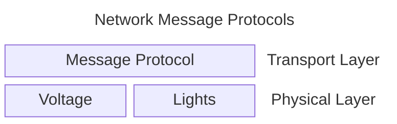
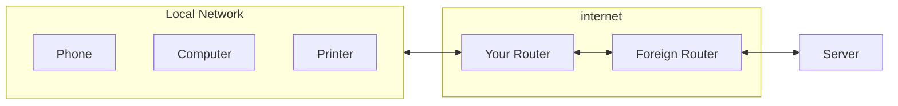

# Chapter 14: Python Programs as Network Clients

- [Notes](#notes)
  - [Computer Networking](#computer-networking)
    - [Network communication](#network-communication)
    - [Address Messages](#address-messages)
    - [Hosts and Ports](#hosts-and-ports)
    - [Send Network Messages with
      Python](#send-network-messages-with-python)
    - [Make Something Happen: Send a Network
      Message](#make-something-happen-send-a-network-message)
    - [Code Analysis: Sending Network
      Messages](#code-analysis-sending-network-messages)
    - [Send a Message to Another
      Computer](#send-a-message-to-another-computer)
    - [Route Packets](#route-packets)
    - [Connections and Datagrams](#connections-and-datagrams)
    - [Networks and Addresses](#networks-and-addresses)
  - [Consume the Web from Python](#consume-the-web-from-python)
    - [Read a Webpage](#read-a-webpage)
    - [Use Web-based Data](#use-web-based-data)
      - [XML Document Standard](#xml-document-standard)
      - [Code Analysis: The XML Document
        Format](#code-analysis-the-xml-document-format)
      - [The Python Element Tree](#the-python-element-tree)
      - [Make Something Happen: Work with Weather
        Data](#make-something-happen-work-with-weather-data)
- [Summary](#summary)
- [Questions and Answers](#questions-and-answers)

## Notes

- In this chapter we’ll look at the basics of computer networking
- These principles allow computers to talk to each other, including over
  the internet
- We’ll look at fetching information from web servers
- Discuss standards for data transfer between programs

### Computer Networking

- Networks let computers talk to each other

#### Network communication

- Some form of connection, e.g. wires, radio, fibre optics
- Communication takes place by sending “bits” over the network
  - A $0$ or $1$ which may be represented by a varying voltage, flashing
    light etc.
- Computer’s have to agree on the understanding of:
  - What a “bit” is
  - How to interpret a sequence of bits
- These are called protocols
- We refer to these sequence of protocols as layers
  - The physical layer is the protocol governing what a signal is
  - The transport layer is the protocol that tells us to interpret a
    message



#### Address Messages

- Often there are multiple computers on the network
- Need some way of specifying which computer we want to talk to
- Messages typically have two components
  1. Address message
      - Specifies which computer to send the message to
  2. Message contents
      - The actual specifics of the message being sent
- Networks may also have a broadcast address
  - Allows messages to be sent or received from anyone
- Other people can potentially eavesdrop on your network traffic!
  - Secure websites will communicate over networks by encrypting the
    network traffic

> [!CAUTION]
>
> **Be careful what you send out over unencrypted networks**
>
> Because anyone can potentially intercept and read what you send over
> an unencrypted network you should never send any secrets such as
> passwords over them.

#### Hosts and Ports

- What do we do if we want to send messages to talk to multiple people
  at the same address?
  - We need to improve the protocol
  - We could require an address to be *more* specific so that it can
    accurately identify the recipient
- A single computer might provide multiple different services
  - e.g. display webpages, provide video content, etc.
- Since it’s the same computer it has the same address
- Need some way of specifying which specific service we want
- The solution is called *ports*
  - A *port* is a number identifying a computer provided service
  - Port $80$ is traditionally reserved for serving webpages
  - ie. when connecting to a website, you connect to the computer, then
    port $80$ to get the webpage
- Computers typically have to tell a network what services they are
  offering and on what port
- Ports are effectively a way of allowing programs on different
  computers to talk to each other
- Many networks have *firewalls*
  - Firewalls are designed to restrict data packets to specific ports
  - Protect a network client from malicious programs

#### Send Network Messages with Python

- We’ll write a python program to send a message
- We first have to define the protocol we’ll use
  - We’ll use the *[User Data Protocol
    (UDP)](https://en.wikipedia.org/wiki/User_Datagram_Protocol)*
  - Part of the *internet protocol suite*
    - Set of standards describing how the internet works
    - Also called *TCP/IP*
      - *TCP* is the *Transmission Control Protocol* that defines how to
        link systems
      - *IP* is the *Internet Protocol* that defines communication
        between networks
- An individual message is called a *datagram*
- A sender can send the message, but does not intrinsically know that
  it’s received
  - A recipient must send an acknowledgement

#### Make Something Happen: Send a Network Message

*We’ll start by working through the basics in the python interpreter.
Start it up and work through the following steps to send a message*

1. *Import the* `socket` *module*

    ``` python
     import socket
    ```

    - The `socket` module provides Python with the classes and functions
      for communicating over a network

2. *Create a* `socket`

    - A `socket` is an object that manages a network connection

    - Create a socket that can receive a message by executing the
      statement below

      ``` python
        listen_socket = socket.socket(socket.AF_INET, socket.SOCK_DGRAM)
      ```

    - `socket` takes two arguments

      1. The address family
          - How the socket refers to host
          - `AF_INET` refers to the internet family
      2. The type of messages to send
          - We want to send *datagrams*
          - A datagram is a single, unacknowledged message sent from one
            system to another

3. *Define the address to connect to*

    - Need to define the address to connect to

    - A network address is defined as a `tuple`

      ``` python
        listen_address = ("localhost", 10001)
      ```

    - The tuple holds two values

      1. Address to connect to (as a string)
          - `"localhost"` refers to the current machine
      2. Port to connect to (as an integer)

4. *Bind the socket to the server address*

    - This a fancy way of assigning the address to the socket

    - Once bound the socket can listen for messages on this port

    - Enter the `bind` method as below

      ``` python
        listen_socket.bind(listen_address)
      ```

5. *Ask the socket to receive some data*

    - `recvfrom` is a method on a socket (short for *receive from*)

    - Fetches a single message from it

    - Enter the following,

      ``` python
        result = listen_socket.recvfrom(4096)
      ```

    - The interpreter should not return the prompt symbol `>>>`

    - It’s waiting to receive the datagram

6. *Create a transmitter*

    - We now need to set up a program to actually send the message

    - Start a second python interpreter instance (leave the old one
      running)

    - Now create a `socket` to send messages,

      ``` python
        import socket

        send_socket = socket.socket(socket.AF_INET, socket.SOCK_DGRAM)
      ```

    - So far everything looks the same

    - We’ve imported socket and setup a socket with the same address
      family and message type

7. *Bind the socket to the same port*

    - Our second socket needs to be bound to a network port which will
      act as the recipient

    - Our first socket is on `"localhost:10001"` so we do the same

      ``` python
        send_address = ("localhost", 10001)
      ```

8. *Send a message over a network*

    - Now to send the message

    - We saw that `recvfrom` told a socket to receive a message

    - `sendto` is the send counterpart, which sends a message over the
      network

    - Enter the following to send the message

      ``` python
        send_socket.sendto(b"hello from me", send_address)
      ```

          13

    - `sendto` returns the number of bytes sent

    - The `b` prefix to the string tells python to encode the string as
      bytes

      - By default python encodes strings using
        [unicode](https://home.unicode.org/)
      - Unicode can’t be sent over the network, so we need to decompose
        it into bytes

9. *Receive the message*

    - On the original listening interpreter the prompt should have
      returned

    - This means our message has been received

    - view the result

      ``` python
        print(result)
      ```

          b(b"hello from me", ("127.0.0.1", 51883))

    - The result is a tuple of two elements

      1. The actual message contents
      2. The address of the sender, broken down into a tuple of,
          1. Address
          2. Port

#### Code Analysis: Sending Network Messages

*Work through the following questions to clarify what we’ve just
explored*

1. *Can we send things other than text?*

    - Yes
    - A datagram sends byte streams
    - The bytes could represent any type of data
      - This could include complex objects
    - The receiver just has to know how to reconstruct the byte stream
      - Easier said than done

2. *What’s the largest thing you could send?*

    - `recvfrom` lets us specify the maximum size of an incoming message
    - A program can send up to $65,000$ bytes
      - Larger datasets must be broken down into multiple messages
    - There are network functions for splitting and recombining messages

3. *What happens if a message is sent but the listener is not
    listening?*

    - For a *datagram*, nothing
    - This is because there is no formal connection procedure
    - We simply send the messages out to a specified address
    - A listener if it exists can receive it
    - But as a sender, we don’t care what happens to the message once
      it’s sent

4. *Can the listener listen to messages from other computers?*

    - Yes
    - As long as another computer sends the message to the address and
      port that the socket is bound to it can receive it
    - Note that `"localhost"` is an alias for the computer’s own address
    - We’d actually have to specify the computer’s address on the
      external network

5. *How long would the listener wait before it heard anything?*

    - By default a listener, listens until anything is received
    - `Socket` provides the `setdefaulttiimeout` method
      - Sets the number of seconds that a `recvfrom` waits for a message
      - An exception is raised if the listener does not receive a
        message in this timeframe

6. *Can sockets generate exceptions?*

    - Yes
    - Network connections are some of the most common sources of
      exceptions since these services can be non-deterministic
      - The response time may vary
      - A system may go down
      - An address or port may change and not propagate through
    - A program should take care to catch exceptions that might occur
      when a network fails or disconnects

#### Send a Message to Another Computer

- `sendto` and `recvfrom` from can be used to communicate to other
  computers on a local network

  - e.g. two home computers

- You first need to obtain the IP (internet protocol) address of the
  receiving machine

- Python’s socket module provides methods to find the IP of the computer
  running the python program (see
  [Receiver.py](./Examples/01_Receiver/Receiver.py))

  ``` python
    """
    Example 14.1 Receiver

    Receive packets on port 10001 from another machine
    """

    import socket

    host_name = socket.gethostname()
    host_ip = socket.gethostbyname(host_name)
    print("The IP address of this computer is:", host_ip)
    port = 10002

    listen_socket = socket.socket(socket.AF_INET, socket.SOCK_DGRAM)
    listen_address = (host_ip, port)

    listen_socket.bind(listen_address)

    print("Listening...")
    while True:
        reply = listen_socket.recvfrom(4096)
        print(reply)
  ```

      The IP address of this computer is: 10.1.0.145
      Listening...

- Now we can write a program to send to the packets

  - This is on the sending machine

  ``` python
    """
    Example 14.2 Sender

    Send packets to specified port on another machine
    """

    import socket
    import time

    target_ip = "127.0.1.1"  # set this to whatever the target ip is from Receiver.py
    port = 10002

    send_socket = socket.socket(socket.AF_INET, socket.SOCK_DGRAM)
    destination_address = (target_ip, 10002)

    while True:
        print("Sending")
        send_socket.sendto(b"Hello from me", destination_address)
        time.sleep(1)
  ```

  ``` python
  ##| echo: false
  for i in range(0, 3):
      print("Sending")
  ```

      Sending
      Sending
      Sending

- You should see the [sender program](./Examples/02_Sender/Sender.py)
  periodically report that it is sending a message

- A corresponding received message should then appear on the receiving
  process

#### Route Packets

- Not everything is connected to the same network
  - Especially over the internet
- The internet is a connected series of local networks
- For inter-network messages we need *routing*
  - A message might have to cross through multiple members in the local
    network before it can pass it on to the external network
  - A machine on the local network must be configured to then
    communicate with the external network
    - Messages must first reach this machine
- A *router* is a specialised computer for managing sending and
  receiving messages using the internet protocols



- Messages between networks first go to our local router which then
  routes the message through the internet to the router of the target
  network. The target network’s router then send’s the message to the
  specific machine

#### Connections and Datagrams

- We’ve already seen datagrams
  - Simple messages send from one to another
  - No formal agreement
  - No confirmation of message receipt
- An alternative approach is to create connections
  - The *Transmission Control Protocol*
    ([TCP](https://en.wikipedia.org/wiki/Transmission_Control_Protocol))
- A connection can be thought of as a formal communication arrangement
- The connection needs to be managed
- When a message is sent, the recipient must confirm receipt of the
  message
  - Or an error that the message failed
- Connections are important when it’s important that an entire message
  is received
  - Ensure’s that any missing components are resent
- A connection can be thought of similar to a file
  - It is an object that can be managed
- Programs can call methods on connections to,
  1. Send messages
  2. Poll for received messages
  3. and more
- A connection remains open until something closes it

#### Networks and Addresses

- Previously we worked with address represented as numbers like
  `127.0.1.1`
  - These are called IP addresses
- However typically we want to work with something more semantically
  meaningful
  - e.g. a website url (called a hostname)
- Computer’s on the internet use a *name server*
  - Converts a host name into an IP address
  - This system is called the *Domain name system* (DNS)
- A DNS server collection passes names around until a match is resolved

### Consume the Web from Python

- Webpages are internet content
- When we want to browse a webpage, a browser has to request the content
  over a network
- Webpages are expressed in Hypertext Markup Language (HTML)
- Page content might contain text, images, links and other semantic
  elements
  - A browser will download these too, and put it all together to render
    the output

#### Read a Webpage

- It is possible to write socket based code to read websites from
  scratch

  - We could estalish a TCP connection to a web server then request data

- Python contains the inbuilt `urllib` that simplifies this process with
  a useful API

  ``` python
    """
    Example 14.3 Webpage Reader

    A simple program to demonstrate fetching content from a URL
    """

    import urllib.request

    url = "https://www.robmiles.com"

    req = urllib.request.urlopen(url)
    for line in req:
        print(line)
  ```

      b'<!doctype html>\n'
      b'<html xmlns:og="http://opengraphprotocol.org/schema/" xmlns:fb="http://www.facebook.com/2008/fbml" lang="en-GB" >\n'
      b'  <head>\n'
      b'\t  \n'
      b'\t  <meta name="viewport" content="width=device-width, initial-scale=1">\n'
      b'\t  \n'
      b'    <!-- This is Squarespace. --><!-- rob-miles -->\n'
      b'<base href="">\n'
      b'<meta charset="utf-8" />\n'
      b'<title>robmiles.com</title>\n'
      b'<meta http-equiv="Accept-CH" content="Sec-CH-UA-Platform-Version, Sec-CH-UA-Model" /><link rel="icon" type="image/x-icon" href="https://assets.squarespace.com/universal/default-favicon.ico"/>\n'

- The above show’s the result of reading from Rob Miles Blog

  - The output is truncated to the first couple of output lines

- You might not recognise this output but it is HTML

- Effectively a plain-text format for specifying webpage contents

- `urlopen` uses HTTP to request the webpage

  - The result is an iterator over the page contents

#### Use Web-based Data

- Reading from the web isn’t just restricted to standard websites
- Many services exist to provide data over a web API
- RSS (Really Simple Syndication / Rich Site Summary) is a format for
  specifying web articles and blog posts
  - It is common for websites to provide RSS feeds of their content
  - Programs can connect to and consume RSS feeds
- e.g. if we rerun the program above aimed at the link
  <https://www.robmiles.com/journal/rss.xml>
- Returns an XML document containing recent blog posts
  - See the first few lines below

  ``` python
    """
    Example 14.3 Webpage Reader

    A simple program to demonstrate fetching content from a URL
    """

    import urllib.request

    url = "https://www.robmiles.com/journal/rss.xml"

    req = urllib.request.urlopen(url)
    for line in req:
        print(line)
  ```

      b'<?xml version="1.0" encoding="UTF-8"?>\n'
      b'<!--Generated by Site-Server v@build.version@ (http://www.squarespace.com) on Thu, 05 Mar 2026 22:09:14 GMT\n'
      b'--><rss xmlns:content="http://purl.org/rss/1.0/modules/content/" xmlns:wfw="http://wellformedweb.org/CommentAPI/" xmlns:itunes="http://www.itunes.com/dtds/podcast-1.0.dtd" xmlns:dc="http://purl.org/dc/elements/1.1/" xmlns:media="http://www.rssboard.org/media-rss" version="2.0"><channel><title>robmiles.com</title><link>https://www.robmiles.com/</link><lastBuildDate>Thu, 05 Mar 2026 22:05:42 +0000</lastBuildDate><language>en-GB</language><generator>Site-Server v@build.version@ (http://www.squarespace.com)</generator><description><![CDATA[]]></description><item><title>Instax Film Holders</title><category>3D printing</category><category>large format cameras</category><dc:creator>Rob Miles</dc:creator><pubDate>Thu, 05 Mar 2026 22:08:13 +0000</pubDate><link>https://www.robmiles.com/journal/2026/3/5/instax-film-holders</link><guid isPermaLink="false">5019271be4b0807297e8f404:52c5bcfce4b0c4bcc9121347:69a9fe369cbcb14be246b532</guid><description><
  also fetches an XML document from the internet
  - Here it represents weather data

##### XML Document Standard

- XML is a standard for defining documents with structured data

- Designed to be easy for both computers and humans to read

  - These days JSON and YAML are more human-readable alternatives in
    common use

- XML documents are useful for sending information between computers

- XML documents are made up of elements

- Elements may have attributes

  - Analogous to python class data attributes

- Elements can be defined in a tree-like structure

  - i.e. elements may contain elements

- See the [XML Wikipedia page](https://en.wikipedia.org/wiki/XML) for
  more information

- Below shows a simplified example of an XML document one might receive
  from a website

  ``` xml
    <rss version="2.0"> <!--RSS element in the document-->
        <channel>   <!--channel sub element of RSS element -->
            <title> <!--title element of channel sub element -->
                robmiles.com <!--value of the title element-->
            </title> <!-- end of title element-->
            <item>
                <title>
                    Water Meter Day
                </title>
                <category>Life</category>
                <description>
                    <![CDATA[ We had a new water meter installed yay!]]>
                </description>
            </item>
            <item>
                <title>
                    Python now in Visual Studio 2017
                </title>
                <category>Python</category>
                <category>Visual Studio</category>
                <description>
                    <![CDATA[ Python is now available in Visual Studio 2017 yay! ]]>
                </description>
            </item>
        </channel>
    </rss>
  ```

- Document is broken down into elements

- Element has a name

- May contain attributes

- e.g. the `RSS` element has an attribute `version`

  - In the above example, the version is `2.0`

- Elements may contain other elements

- An element is denoted by the `<name>` opening tag, `</name>` closing
  tag

  - Any elements contained within these delimiters is a sub element of
    the outer scope element

- In the above example, the `channel` element contains two `item`
  elements

  - Each `item` contains a `title` and `description` element

##### Code Analysis: The XML Document Format

*Let’s look at some questions about the XML format*

1. *How do parent and child elements work in XML?*

    - Elements contained in another element are called *child* elements
    - Child elements are just a type of XML attribute
    - You can think of it as composition of classes

2. *What does* `CDATA` *mean?*

    - `CDATA` is used to delimit an extended string
    - Everything between `<![CDATA][` and `]]>` is treated as text of
      the element
    - This lets us contain entire blog posts in one XML section

3. *Why does the second item in the XML document contain two*
    `category` *elements?*

    - XML doesn’t enforce a standard for how to layout attributes
    - You can use something called a *schema* to do this
    - Here a category can be thought of as similar to a tag
      - Multiple different categories can be associated to an individual
        document

##### The Python Element Tree

- A fully-specified XML parser is difficult to implement
- Fortunately python has the `xml` library for parsing XML
- The `ElementTree` class is designed to working with XML documents
- XML documents can be loaded into an `ElementTree` instance
  - We can then use methods on the class to navigate the document

  ``` python
    """
    Example 14.4 Python ElementTree

    Shows a simple example of using the XML library's ElementTree to handle
    an XML Document
    """

    import xml.etree.ElementTree as ElementTree

    rss_text = """
    <rss version="2.0">
        <channel>
            <title>
                robmiles.com
            </title>
            <item>
                <title>
                    Water Meter Day
                </title>
                <category>Life</category>
                <description>
                    <![CDATA[ We had a new water meter installed yay!]]>
                </description>
            </item>
            <item>
                <title>
                    Python now in Visual Studio 2017
                </title>
                <category>Python</category>
                <category>Visual Studio</category>
                <description>
                    <![CDATA[ Python is now available in Visual Studio 2017 yay! ]]>
                </description>
            </item>
        </channel>
    </rss>
    """

    doc = ElementTree.fromstring(rss_text)

    for item in doc.iter("item"):
        title: str = item.find("title").text  # type: ignore
        print(title.strip())
        description: str = item.find("description").text  # type: ignore
        print("    ", description.strip())
  ```

      Water Meter Day
           We had a new water meter installed yay!
      Python now in Visual Studio 2017
           Python is now available in Visual Studio 2017 yay!
- `ElementTree` provides several methods for manipulating the through
  XML documents
- `iter` is given an element name
  - Generates an iterator over all the instances of that element in the
    XML
- `find` searches for a given element in the child elements of a
  selected element
- The `text` attribute is the text payload associated with an element
- You can even use `ElementTree` to
  1. Edit the contents of an XML document
  2. Create new elements
  3. Remove elements

We can combine the url request code and the RSS walk code into one
program that fetches an XML RSS feed from a site, then parses its
contents. You can see it in
[RSSFeed.py](./Examples/05_RSSFeed/RSSFeed.py)

##### Make Something Happen: Work with Weather Data

*We used weather snaps in Chapter to decode an XML document from the U.S
weather Service. The code to get the temperature for a given location is
as follows*

``` python
    def get_weather_temp(latitude, longitude):
        address = "http://forecast.weather.gov/MapClick.php"
        query = "?lat={0}&lon={1}&unit=0&lg=english&FcstType=dwml".format(latitude, longitude)
        req = urllib.request.urlopen(address + query)
        page = req.read()
        doc = xml.etree.ElementTree.fromstring(page)
        for d in doc.iter("temperature"):
            if d.get("type") == "apparent":
                text_temp_value = d.find("value").text
                return int(text_temp_value)
```

*Modify the method so that you get the maximum, minimum and forecast
temperature values*

We’ll stick with our typical example of Seattle for now. If we look at
the appropriate URL for
[Seattle](https://forecast.weather.gov/MapClick.php?lat=47.61&lon=-122.33&unit=0&lg=english&FcstType=dwml)

We can see the full XML document. Searching for temperature. We can find
the following temperature elements.

1. Under the `data` element with type `forecast` we find,

    ``` xml
    <temperature type="minimum" units="Fahrenheit" time-layout="k-p24h-n7-1">
        <name>Daily Minimum Temperature</name>
        <value>48</value>
        <value>47</value>
        <value>37</value>
        <value>35</value>
        <value>40</value>
        <value>43</value>
        <value>40</value>
    </temperature>
    <temperature type="maximum" units="Fahrenheit" time-layout="k-p24h-n7-2">
        <name>Daily Maximum Temperature</name>
        <value>55</value>
        <value>52</value>
        <value>46</value>
        <value>46</value>
        <value>48</value>
        <value>49</value>
        <value>49</value>
    </temperature>
    ```

    - This gives the seven day forecast maximum and minimum temperatures

2. Under the `data` element with type `current observation` we see,

    ``` xml
     <temperature type="apparent" units="Fahrenheit" time-layout="k-p1h-n1-1">
         <value>51</value>
     </temperature>
     <temperature type="dew point" units="Fahrenheit" time-layout="k-p1h-n1-1">
         <value>47</value>
     </temperature>
    ```

- A caveat for the first point is that we can see the XML tags have an
  attribute `time-layout`

  - This seems to tell us how to map the sequence of temperature values
    back to the days of the week

  ``` xml
    <time-layout time-coordinate="local" summarization="12hourly">
        <layout-key>k-p24h-n7-1</layout-key>
        <start-valid-time period-name="Overnight">2026-03-07T02:00:00-08:00</start-valid-time>
        <start-valid-time period-name="Saturday Night">2026-03-07T18:00:00-08:00</start-valid-time>
        <start-valid-time period-name="Sunday Night">2026-03-08T18:00:00-07:00</start-valid-time>
        <start-valid-time period-name="Monday Night">2026-03-09T18:00:00-07:00</start-valid-time>
        <start-valid-time period-name="Tuesday Night">2026-03-10T18:00:00-07:00</start-valid-time>
        <start-valid-time period-name="Wednesday Night">2026-03-11T18:00:00-07:00</start-valid-time>
        <start-valid-time period-name="Thursday Night">2026-03-12T18:00:00-07:00</start-valid-time>
    </time-layout>
  ```

  - We can see the pattern appears to be that it starts with the current
    date, then counts forward

  - So we need to include this mapping into our code

  - We’ll write a little bit of code that generates the correct ordering

    ``` python
      day_label_tuple = (
          "Monday",
          "Tuesday",
          "Wednesday",
          "Thursday",
          "Friday",
          "Saturday",
          "Sunday",
      )


      def order_day_labels(start_date):
          """
          Get the days of the week ordered by the current day

          Parameters
          ----------
          start_date : int
              Day of the week returned by a datetime object

          Returns
          -------
          tuple[str, str, str, str, str, str, str]
              Tuple containing the days of the week such that the current day
              is the first index, and the days follow sequentially
          """
          return day_label_tuple[start_date:] + day_label_tuple[:start_date]
    ```

  - We predefine a tuple with the days of the week in the order expected
    by `datetime` objects

  - We then define a function `order_day_labels` which reorders this

    - The syntax `container_object[a:b:c]` means to “slice” from `a` to
      `b` taking every `c` elements
    - If `c` is excluded then every element is taken
    - `b` is the exclusive upper bound

  - So here we slice from the current index to the end of the tuple,
    this is the start of the new tuple

  - We then shift the remaining elements to the end by slicing from the
    start up to the current date

- With our mapping set up we can define a function that will convert a
  sequence of temperatures into a dictionary mapping the weekdays to the
  temperature values

  - This will implicitly rely on the fact that a dictionary stores it’s
    keys in insertion order (i.e. we can print them out in the order we
    inserted them)

  > [!IMPORTANT]
  >
  > **Dictionaries may not be Insertion Ordered**
  >
  > For several version of python 3, dictionaries were not guaranteed to
  > preserve their insertion ordering. If you use a modern version of
  > python this should not be an issue, but on older versions it may not
  > work as expected. It’s also work noting that custom sub-types of
  > dictionary may not preserve the insertion ordering too

- Our `get_weather_temp` function then becomes

  ``` python
    def get_weather_temp(latitude, longitude):
        """
        Return the weather temperature data at a given latitude and longitude

        Relies on US weather data, so should not be expected to work for
        latitude and longitude values outside of the US

        Parameters
        ----------
        latitude : int | float
            latitude of the location to get the weather data for
        longitude : int | float
            longitude of the location to get the weather data for

        Returns
        -------
        Forecast
            7 day forecast for the maximum temperature
            in Fahrenheit, with the current day as the first
            value
        Forecast
            7 day forecast for the minimum temperature
            in Fahrenheit, with the current day as the first
            value
        int | float
            Most recent apparent temperature value
        int | float
            Most recent dew point temperature
        """
        address = "http://forecast.weather.gov/MapClick.php"
        query = "?lat={0}&lon={1}&unit=0&lg=english&FcstType=dwml".format(
            latitude, longitude
        )
        req = urllib.request.urlopen(address + query)
        page = req.read()
        doc = xml.etree.ElementTree.fromstring(page)

        def get_temp_list(e):
            """
            Convert value subelements of an element e
            into a list of temperatures

            Parameters
            ----------
            e : XML Element
                Temperature element

            Returns
            -------
            list[int]
                list of integers corresponding to temperatures.
                If none found, then the list is empty
            """
            res = []
            for d in e.iter("value"):
                res.append(int(d.text))  # type: ignore
            return res

        def get_temp_val(e):
            """
            Convert a temperature value subelement of a
            temperature element to its value

            Parameters
            ----------
            e : XML Element
                Temperature element

            Returns
            -------
            int
                temperature value in Fahrenheit
                as an int
            """
            return get_temp_list(e)[0]

        for d in doc.iter("temperature"):
            if d.get("type") == "apparent":
                apparent_temp = get_temp_val(d)
            elif d.get("type") == "dew point":
                dew_point = get_temp_val(d)
            elif d.get("type") == "maximum":
                max_temp = get_temp_list(d)
            elif d.get("type") == "minimum":
                min_temp = get_temp_list(d)

        today = datetime.datetime.today().weekday()
        return (
            make_seven_day_forecast(today, max_temp),  # type: ignore
            make_seven_day_forecast(today, min_temp),  # type: ignore
            apparent_temp,  # type: ignore
            dew_point,  # type: ignore
        )
  ```

  - This function returns a tuple containing four elements
    1. A forecast for maximum temperature
        - i.e. a dictionary mapping days of the week to the predicted
          max temperature
    2. A forecast for minimum temperature
        - Same as above
    3. The current apparent temperature observation
    4. The current dew point temperature
  - We have to consider that for the min and max temperature we have to
    parse a sequence of `value` elements
    - We want to store this in a sequence
  - For apparent and dew point we have a single value
  - We would like to write code that can handle both of these cases
    without repetition
  - The core is the `get_temp_list` function
    - Given an XML element corresponding to a temperature, we iterate
      over all the `value` sub-elements
    - Convert them to integers and append them to a list
  - For apparent and dew point we define a `get_temp_value` this uses
    `get_temp_list` to do the parsing, then extracts the single value
  - Finally in the body of our main function we iterate over the
    temperature elements
  - We check the appropriate type and dispatch as required
  - Finally package everything into a tuple and return the result

- The last step is then to simply format the output

  ``` python
    if __name__ == "__main__":
        latitude = 47.61
        longitude = -122.33

        max_t, min_t, apparent_t, dew_p = get_weather_temp(latitude, longitude)

        days_table_hdr = "\t".join(
            map(lambda a: str(a)[:2], max_t)
        )  # slice of the first two characters of the day of the week
        max_t_str = "\t".join(map(str, max_t.values()))
        min_t_str = "\t".join(map(str, min_t.values()))

        forecast = days_table_hdr + "\n" + max_t_str + "\n" + min_t_str

        observation_t_str = "Apparent temperature: {0}\nDew point temperature: {1}".format(
            apparent_t, dew_p
        )

        print("Temperature Information for Seattle")
        print(forecast + "\n" + observation_t_str)
  ```

- This little main script sets up the latitude and longitude and then
  calls the function

- We then format the result as follows

  - Create a header for the days consisting of the first two letters of
    each day e.g. Sunday -\> Su as a tab-separated list
  - Report the max and min forecast in the same tab-separated format

- Then we print out the apparent and dew point temperature

- You may like the example output below

      Temperature Information for Seattle
      Su    Mo  Tu  We  Th  Fr  Sa
      50    46  46  48  48  48  48
      47    36  35  39  42  39  38
      Apparent temperature: 53
      Dew point temperature: 47

## Summary

- Computers can communicate to each other over networks
- A protocol describes how systems can communicate to each other
- The internet defines different layers of protocol to define different
  layers of functionality
- Information is sent in messages called datagrams
- An IP address locates a machine on a network
- The internet can be considered a series of connected local networks
  - A router routes traffic between these local networks
- Communication on a network can take place via individual
  unacknowledged communications or by establishing a connection
- Connections can be exposed on one or more *ports*
  - When a program wants to accept connections, it will bind a software
    *socket* to a port
- Large amounts of data are transferred as multiple datagrams
- Python provides the socket class to handle network connections
- The `urllib` in python simplifies the process of connecting to and
  working with web servers
- The eXtensible Markup Language (XML) is a language for specifying the
  form of data being sent over a network
  - Python provides the `xml` library for working with XML
  - The `ElementTree` class lets us work with and manipulate the XML
    element tree

## Questions and Answers

1. *Do wireless devices use a different version of the Internet from
    wired ones?*

    - The communication medium is different
    - But the connection works the same
    - Recall that the internet protocols seperate the protocol for the
      mechanism of transport from the protocol for communication
    - This is analogous to how we had a GUI and Shell-based class for
      our Fashion Shop program in [Chapter
      13](../13_PythonAndGraphicalUserInterfaces/Chapter_13.qmd#code-analysis-complete-fashion-shop-program)
      - Different applications for getting the user to interact
      - Both exposed the same API, so could be run by the same main
        program

2. *How big can a datagram get?*

    - It depends on the network and transmission medium
    - It is defined as the Maximum Transmission Unit (MTU)

3. *Do all datagrams follow the same route from one computer to
    another?*

    - Not necessarily
    - Network routes typically update very quickly in response to load
      on various parts of the network
    - This has some side effects
      - Messages can arrive *before* a message they were sent *after*
    - Using a proper connection helps us handle this

4. *Do all datagrams get to their destination?*

    - No
    - UDP data packets are not guaranteed to arrive
    - TCP packets are part of a session
      - Must confirm they are received
      - Must resend them if they are not

5. *What is the difference between XML and HTML?*

    - They are both markup languages
    - They use similar syntax for specifying elements and attributes
    - XML is a standard for defining any kind of document
    - HTML is specifically for telling web browsers how to render a
      webpage
    - HTML elements tend to refer to the styling and content of a page
      - HTML can be thought of as specialised XML

6. *What is the difference between HTML and HTTP?*

    - HTML is the language that describes how to display a web page
    - HTTP (HyperText Transfer Protocol) is how the server and browser
      get that webpage onto your browser from a server
      - i.e it is the protocol for communicating
