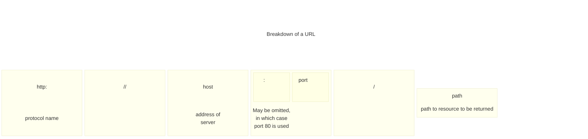

# Chapter 15: Python Programs as Network Servers

- [Notes](#notes)
  - [Create a Web Server in Python](#create-a-web-server-in-python)
    - [A Tiny Socket-based Server](#a-tiny-socket-based-server)
      - [Make Something Happen: Connect to a Simple
        Server](#make-something-happen-connect-to-a-simple-server)
      - [Code Analysis: Web Server
        Program](#code-analysis-web-server-program)
    - [Python Web Server](#python-web-server)
      - [Code Analysis: Python Server
        Program](#code-analysis-python-server-program)
    - [Serve Webpages from Files](#serve-webpages-from-files)
- [Summary](#summary)
- [Questions and Answers](#questions-and-answers)

## Notes

### Create a Web Server in Python

- The web works via socket connections as seen in [Chapter
  14](../14_PythonProgramsAsNetworkClients/Chapter_14.qmd#consume-the-web-from-python)
- Consider a browser
  - The browser sends a request to server
  - The server receives this on a socket connection
  - Send’s back the request response
- We previously saw that web pages are formatted in HTML and the process
  of requesting a webpage is governed by HTTP
- We’ll examine how these communication processes work through creating
  a small web server

#### A Tiny Socket-based Server

- The [below
  program](./Examples/01_TinySocketServer/TinySocketServer.py) provides
  a basic socket connection

- You should be able to navigate to, and request the page via a browser

- A tiny webpage should be seen

  ``` python
    """
    Example 15.1 Tiny Web Socket Server

    A very basic web server implementation
    """

    import socket

    host_ip = "localhost"
    host_socket = 8080
    full_address = "http://{0}:{1}".format(host_ip, host_socket) #setup our url


    print("Open your browser and connect to: ", full_address)

    listen_socket = socket.socket(socket.AF_INET, socket.SOCK_STREAM)
    listen_address = (host_ip, host_socket) #set up the socket and address

    listen_socket.bind(listen_address) #bind the server to listen
    listen_socket.listen()

    connection, address = listen_socket.accept()
    print("Got connection from: ", address) # accept an incoming request

    network_message = connection.recv(1024)
    request_string = network_message.decode() #receive the request
    print(request_string) #display it

    #build a response
    status_string = "HTTP/1.1 200 OK"

    header_string = """Content-Type: text/html; charset=UTF-8
    Connection: close

    """

    content_string = """<html>
    <body>
    <p>hello from our tiny server</p>
    </body>
    </html>

    """
    # send the response
    response_string = status_string + header_string + content_string
    response_byte = response_string.encode()
    connection.send(response_byte)

    # terminate the connection
    connection.close()
  ```

##### Make Something Happen: Connect to a Simple Server

*Use the socket server example to explore how the web works. Open the
program and work through the following activity*

When the program is run, it will display the web server’s host address,
you should see

    Open your browser and connect: http://localhost:8080

Opening the browser and connecting to the address should show a basic
webpage


The terminal should now show the output containing the contents of the
request

``` shell
Got connection from:  ('127.0.0.1', 36172)
GET / HTTP/1.1
Host: localhost:8080
Connection: keep-alive
Upgrade-Insecure-Requests: 1
User-Agent: Mozilla/5.0 (Windows NT 10.0; Win64; x64) AppleWebKit/537.36 (KHTML, like Gecko) Code/1.110.0 Chrome/142.0.7444.265 Electron/39.6.0 Safari/537.36
Accept: text/html,application/xhtml+xml,application/xml;q=0.9,image/avif,image/webp,image/apng,*/*;q=0.8,application/signed-exchange;v=b3;q=0.7
Sec-Fetch-Site: none
Sec-Fetch-Mode: navigate
Sec-Fetch-User: ?1
Sec-Fetch-Dest: document
Accept-Encoding: gzip, deflate, br, zstd
Accept-Language: en-US
```

The first word of the actual request is the `GET`. This tells the server
that the connection is requesting a webpage. The rest of the block
provides information to the server that tells it what kind of responses
the browser can accept

##### Code Analysis: Web Server Program

*Let’s work through the following questions to make sure we understand
the above example*

1. *Previous sockets that we created have used a socket type of*
    `socket.SOCK_DGRAM`*. Why is this program using*
    `socket.SOCK_STREAM`*?*

    The previous programs used the UDP protocol. There was no
    expectation of a conversation over the network, we just sent
    datagrams into the void that may or may not have been received. If
    we want to be able to confirm that messages have been received we
    have to form *connections* using TCP. This guarantees that a message
    is received, to indicate that we want the socket to be a connection
    is to use `socket.SOCK_STREAM`

2. *What are the* `status_string`*,* `header_string`*, and*
    `content_string` *variables in the program used for?*

    HTTP defines how servers and browsers interact. The browser sends a
    `GET` command to ask the server for a webpage. The server sends
    three items as part of a response.

    1. A status response
        - A successful return is indicated by `200`
        - If a page is not found then a `404` is returned
    2. A header string
        - Gives the browser information about the response
        - In our example `header_string` tells the browser to expect
          UTF-8 encoded html text, and that the connection will be be
          closed on receipt of message
    3. The content string
        - An HTML document describing the webpage to be displayed

3. *What are the* `encode` *and* `decode` *methods used for?*

    `encode` takes a string of text and converts that to a block of
    bytes for transmission over the network. `encode` is a method
    available on strings. We use this to encode the response string that
    the server sends to the browser

    ``` python
        response_bytes = response_string.encode()
    ```

    The bytes type then provides a method `decode` that returns the
    contents of the bytes as a text string. The program uses this method
    to decode the command that the server receives from the browser

    ``` python
        request_string = network_message.decode()
    ```

    The `network_message` contains the bytes received over the network,
    we then convert this into a string. Our basic server always provides
    the same response. A more advanced program could use the request
    string to decide which page to serve the browser

4. *Could browser clients connect to this server via the internet?*

    We could if this computer was directly connected to the internet.
    However, this is likely not true. The computer likely lives on a
    local network, which connects to the internet via a router. All
    machines connected on the same local network could potentially
    connect to the server, but you would need to configure the router to
    allow your computer to serve messages to the internet. Typically
    this is not enabled because it can make your computer vulnerable to
    malicious systems

5. *How does the statement that gets the connection work?*

    The following statement gets the connection to a socket

    ``` python
        connection, address = listen_socket.accept()
    ```

    This function returns a tuple (See the discussion in [Chapter
    8](../../01_ProgrammingFundamentals/08_StoringCollectionsOfData/Chapter_08.qmd#tuples))
    holding the connection object and the address. The `connection` is
    analogous to a file object, it has methods we can call to read
    messages from the other end of the connection. We can also all
    methods to send messages

6. *How could I make the sample program above into a proper web
    server?*

    You would have to wrap the code that serves a webpage in a loop.
    Once a request has been dealt with the program would then return to
    a waiting state to receive future connection requests. A full web
    server would be able to accept multiple connections at the same
    time. We can make a socket that can accept multiple connections, and
    python also supports threads that allow multiple simultaneous lines
    of effort to run on a computer at the same time. However creating a
    full web server is complicated, and we can utilise existing standard
    library support

#### Python Web Server

- A web server is a program that uses a network to listen for requests
  from clients
- We could expand our tiny server into a more complete
  [server](./Examples/02_PythonWebServer/PythonWebServer.py)
  - However python provides the builtin `http` module which contains a
    web server
- `HTTPserver` lets us create objects that will accept connections on a
  network socket and dispatch them to a class
  - The class can then decode and act on them
- `BaseHTTPRequestHandler` provides the base implementation of a handler
  for incoming web requests
- We can use the `HTTPserver` and `BaseHTTPRequestHandler` to create a
  web server
  - Can then connect to it with with our browser as before
- This server does not stop after one request but runs a loop
  - Continues to accept connections and serve out requests until the
    program stops

  ``` python
    """
    Example 15.2 Python Web Server

    A small python web server implementation using the html library
    """

    import http.server


    class WebServerHandler(http.server.BaseHTTPRequestHandler):
        """
        A basic example Web Server Handler to accept and serve requests
        """

        def do_GET(self):
            """
            Respond to a `GET` request

            This method is called when the server receives a GET request from
            the client. It sends back a fixed message back to the client
            """
            self.send_response(200)
            self.send_header("Content-type", "text/html")
            self.end_headers()

            message_text = """<html>
    <body>
    <p>hello from the Python server</p>
    </body>
    </html>
    """

            message_bytes = message_text.encode()
            self.wfile.write(message_bytes)
            return


    host_socket = 8080
    host_ip = "localhost"
    host_address = (host_ip, host_socket)

    my_server = http.server.HTTPServer(host_address, WebServerHandler)
    print("Starting server of http://{0}:{1}".format(host_ip, host_socket))
    my_server.serve_forever()
  ```

##### Code Analysis: Python Server Program

*Work through the following questions to understand the above example*

1. *How does this work?*

    The `HTTPServer` class is the dispatcher for incoming requests. When
    we create it we pass it a `WebServerHandler`. This can be thought of
    as the template for how to respond. When a request comes in, the
    server creates an `WebServerHandler` and passes the details of the
    request. The Server then sees that the request is a `GET` request
    and forwards that on to the `do_GET` method of the handler

2. *What does the* `WebServerHandler` *class do?*

    The `WebServerHandler` class is a subclass of
    `BaseHTTPRequestHandler`. A subclass of a superclass inherits all of
    its attributes. Our `WebServerHandler` contains one attribute which
    is the `do_GET` method. The `do_GET` method runs when a browser
    tries to get a webpage from our server. The `do_GET` method returns
    the webpage requested by the browser. Changing the `do_GET` method
    lets us change how our server responds to `GET` requests

3. *How does the server program send the page back to the host?*

    The host connection acts like a file connection. When the
    `WebServerHandler` instance is created, it is given an attribute
    called `wfile` which is the write file for this web request. The
    `do_GET` method can use the `wfile` attribute to write back to the
    message server

    ``` python
        self.wfile.write(message_bytes)
    ```

    `message_bytes` is the message the server is returning. By just
    using an arbitrary file as a write source means that we can send
    many different types of binary data

4. *How is the* `WebServerHandler` *class disconnected to the server?*

    When we create a server we pass the server a reference to the class
    that it will use to respond to incoming web requests

    ``` python
        my_server = http.server.HTTPServer(host_address,  WebServerHandler)
    ```

    We can see that the `WebServerHandler` is passed as an argument to
    the web server. When a request is received, the created instance of
    `WebServerHandler` then calls methods to handle the request

#### Serve Webpages from Files

- A single web server can send out many pages
- A *Uniform Resource Locator* or *URL* identifies destinations
  - Includes a *path* to the resource that will be provided



An example url is shown below,


- This provides the file `htmlweb.html` in the folder `WD-html40-970917`
  which itself is in the folder `TR`

- Observe that we do not specify the port

  - Default $80$ is assumed
  - $80$ is the port associated with the web
  - $8080$ is associated with web servers on a local machine

- A server can extract the path from a `GET` request

  - Can then send back that resource

- If a path is left out, a site sends back the home page

- Below is a [file-serving
  server](./Examples/03_PythonFileServer/PythonFileServer.py)

  ``` python
    class WebServerHandler(http.server.BaseHTTPRequestHandler):
        """
        A simple web handler that can serve pages in response to a `GET` request
        """

        def do_GET(self):
            """
            Handle a `GET` request

            This method is called when the server receives a `GET`
            request from the client. It opens a file with the requested
            path and sends back the contents
            """
            self.send_response(200)
            self.send_header("Content-type", "text/html")
            self.end_headers()

            file_path = self.path[1:]
            with open(file_path, "r") as input_file:
                message_text = input_file.read()

            message_bytes = message_text.encode()
            self.wfile.write(message_bytes)

            return
  ```

-

## Summary

## Questions and Answers
