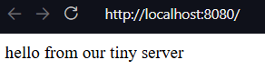
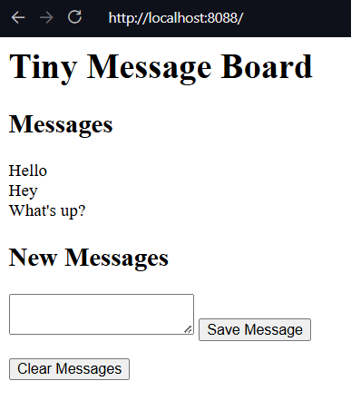

## Notes

### Create a Web Server in Python

- The web works via socket connections as seen in [Chapter 14](../14_PythonProgramsAsNetworkClients/Chapter_14.qmd#consume-the-web-from-python)
- Consider a browser
    - The browser sends a request to server
    - The server receives this on a socket connection
    - Send's back the request response
- We previously saw that web pages are formatted in HTML and the process of requesting a webpage is governed by HTTP
- We'll examine how these communication processes work through creating a small web server

#### A Tiny Socket-based Server

- The [below program](./Examples/01_TinySocketServer/TinySocketServer.py) provides a basic socket connection
- You should be able to navigate to, and request the page via a browser
- A tiny webpage should be seen

  ```python
    """
    Example 15.1 Tiny Web Socket Server

    A very basic web server implementation
    """

    import socket

    host_ip = "localhost"
    host_socket = 8080
    full_address = "http://{0}:{1}".format(host_ip, host_socket) #setup our url


    print("Open your browser and connect to: ", full_address)

    listen_socket = socket.socket(socket.AF_INET, socket.SOCK_STREAM)
    listen_address = (host_ip, host_socket) #set up the socket and address

    listen_socket.bind(listen_address) #bind the server to listen
    listen_socket.listen()

    connection, address = listen_socket.accept()
    print("Got connection from: ", address) # accept an incoming request

    network_message = connection.recv(1024)
    request_string = network_message.decode() #receive the request
    print(request_string) #display it

    #build a response
    status_string = "HTTP/1.1 200 OK"

    header_string = """Content-Type: text/html; charset=UTF-8
    Connection: close

    """

    content_string = """<html>
    <body>
    <p>hello from our tiny server</p>
    </body>
    </html>

    """
    # send the response
    response_string = status_string + header_string + content_string
    response_byte = response_string.encode()
    connection.send(response_byte)

    # terminate the connection
    connection.close()
  ```

##### Make Something Happen: Connect to a Simple Server

*Use the socket server example to explore how the web works. Open the program and work through the following activity*

When the program is run, it will display the web server's host address, you should see

```{python}
#| echo: false
print("Open your browser and connect: http://localhost:8080")
```

Opening the browser and connecting to the address should show a basic webpage



The terminal should now show the output containing the contents of the request

```shell
Got connection from:  ('127.0.0.1', 36172)
GET / HTTP/1.1
Host: localhost:8080
Connection: keep-alive
Upgrade-Insecure-Requests: 1
User-Agent: Mozilla/5.0 (Windows NT 10.0; Win64; x64) AppleWebKit/537.36 (KHTML, like Gecko) Code/1.110.0 Chrome/142.0.7444.265 Electron/39.6.0 Safari/537.36
Accept: text/html,application/xhtml+xml,application/xml;q=0.9,image/avif,image/webp,image/apng,*/*;q=0.8,application/signed-exchange;v=b3;q=0.7
Sec-Fetch-Site: none
Sec-Fetch-Mode: navigate
Sec-Fetch-User: ?1
Sec-Fetch-Dest: document
Accept-Encoding: gzip, deflate, br, zstd
Accept-Language: en-US
```

The first word of the actual request is the `GET`. This tells the server that the connection is requesting a webpage. The rest of the block provides information to the server that tells it what kind of responses the browser can accept


##### Code Analysis: Web Server Program

*Let's work through the following questions to make sure we understand the above example*

1. *Previous sockets that we created have used a socket type of* `socket.SOCK_DGRAM`*. Why is this program using* `socket.SOCK_STREAM`*?*

    The previous programs used the UDP protocol. There was no expectation of a conversation over the network, we just sent datagrams into the void that may or may not have been received. If we want to be able to confirm that messages have been received we have to form *connections* using TCP. This guarantees that a message is received, to indicate that we want the socket to be a connection is to use `socket.SOCK_STREAM`

2. *What are the* `status_string`*,* `header_string`*, and* `content_string` *variables in the program used for?*

    HTTP defines how servers and browsers interact. The browser sends a `GET` command to ask the server for a webpage. The server sends three items as part of a response.

    1. A status response
        - A successful return is indicated by `200`
        - If a page is not found then a `404` is returned
    2. A header string
        - Gives the browser information about the response
        - In our example `header_string` tells the browser to expect UTF-8 encoded html text, and that the connection will be be closed on receipt of message
    3. The content string
        - An HTML document describing the webpage to be displayed

3. *What are the* `encode` *and* `decode` *methods used for?*

    `encode` takes a string of text and converts that to a block of bytes for transmission over the network. `encode` is a method available on strings. We use this to encode the response string that the server sends to the browser

    ```python
        response_bytes = response_string.encode()
    ```

    The bytes type then provides a method `decode` that returns the contents of the bytes as a text string. The program uses this method to decode the command that the server receives from the browser

    ```python
        request_string = network_message.decode()
    ```

    The `network_message` contains the bytes received over the network, we then convert this into a string. Our basic server always provides the same response. A more advanced program could use the request string to decide which page to serve the browser

4. *Could browser clients connect to this server via the internet?*

    We could if this computer was directly connected to the internet. However, this is likely not true. The computer likely lives on a local network, which connects to the internet via a router. All machines connected on the same local network could potentially connect to the server, but you would need to configure the router to allow your computer to serve messages to the internet. Typically this is not enabled because it can make your computer vulnerable to malicious systems

5. *How does the statement that gets the connection work?*

    The following statement gets the connection to a socket

    ```python
        connection, address = listen_socket.accept()
    ```

    This function returns a tuple (See the discussion in [Chapter 8](../../01_ProgrammingFundamentals/08_StoringCollectionsOfData/Chapter_08.qmd#tuples)) holding the connection object and the address. The `connection` is analogous to a file object, it has methods we can call to read messages from the other end of the connection. We can also all methods to send messages

6. *How could I make the sample program above into a proper web server?*

    You would have to wrap the code that serves a webpage in a loop. Once a request has been dealt with the program would then return to a waiting state to receive future connection requests. A full web server would be able to accept multiple connections at the same time. We can make a socket that can accept multiple connections, and python also supports threads that allow multiple simultaneous lines of effort to run on a computer at the same time. However creating a full web server is complicated, and we can utilise existing standard library support

#### Python Web Server

- A web server is a program that uses a network to listen for requests from clients
- We could expand our tiny server into a more complete [server](./Examples/02_PythonWebServer/PythonWebServer.py)
    - However python provides the builtin `http` module which contains a web server
- `HTTPserver` lets us create objects that will accept connections on a network socket and dispatch them to a class
    - The class can then decode and act on them
- `BaseHTTPRequestHandler` provides the base implementation of a handler for incoming web requests
- We can use the `HTTPserver` and `BaseHTTPRequestHandler` to create a web server
    - Can then connect to it with with our browser as before
- This server does not stop after one request but runs a loop
    - Continues to accept connections and serve out requests until the program stops

  ```python
    """
    Example 15.2 Python Web Server

    A small python web server implementation using the html library
    """

    import http.server


    class WebServerHandler(http.server.BaseHTTPRequestHandler):
        """
        A basic example Web Server Handler to accept and serve requests
        """

        def do_GET(self):
            """
            Respond to a `GET` request

            This method is called when the server receives a GET request from
            the client. It sends back a fixed message back to the client
            """
            self.send_response(200)
            self.send_header("Content-type", "text/html")
            self.end_headers()

            message_text = """<html>
    <body>
    <p>hello from the Python server</p>
    </body>
    </html>
    """

            message_bytes = message_text.encode()
            self.wfile.write(message_bytes)
            return


    host_socket = 8080
    host_ip = "localhost"
    host_address = (host_ip, host_socket)

    my_server = http.server.HTTPServer(host_address, WebServerHandler)
    print("Starting server of http://{0}:{1}".format(host_ip, host_socket))
    my_server.serve_forever()
  ```

##### Code Analysis: Python Server Program

*Work through the following questions to understand the above example*

1. *How does this work?*

    The `HTTPServer` class is the dispatcher for incoming requests. When we create it we pass it a `WebServerHandler`. This can be thought of as the template for how to respond. When a request comes in, the server creates an `WebServerHandler` and passes the details of the request. The Server then sees that the request is a `GET` request and forwards that on to the `do_GET` method of the handler

2. *What does the* `WebServerHandler` *class do?*

    The `WebServerHandler` class is a subclass of `BaseHTTPRequestHandler`. A subclass of a superclass inherits all of its attributes. Our `WebServerHandler` contains one attribute which is the `do_GET` method. The `do_GET` method runs when a browser tries to get a webpage from our server. The `do_GET` method returns the webpage requested by the browser. Changing the `do_GET` method lets us change how our server responds to `GET` requests

3. *How does the server program send the page back to the host?*

    The host connection acts like a file connection. When the `WebServerHandler` instance is created, it is given an attribute called `wfile` which is the write file for this web request. The `do_GET` method can use the `wfile` attribute to write back to the message server

    ```python
        self.wfile.write(message_bytes)
    ```

    `message_bytes` is the message the server is returning. By just using an arbitrary file as a write source means that we can send many different types of binary data

4. *How is the* `WebServerHandler` *class disconnected to the server?*

    When we create a server we pass the server a reference to the class that it will use to respond to incoming web requests

    ```python
        my_server = http.server.HTTPServer(host_address,  WebServerHandler)
    ```

    We can see that the `WebServerHandler` is passed as an argument to the web server. When a request is received, the created instance of `WebServerHandler` then calls methods to handle the request

#### Serve Webpages from Files

- A single web server can send out many pages
- A *Uniform Resource Locator* or *URL* identifies destinations
    - Includes a *path* to the resource that will be provided

```{mermaid}
block-beta
    columns 7

    classDef BG stroke:transparent, fill:transparent


    space
    space
    title["Breakdown of a URL"]:3
    space
    space

    class title BG

    block:Protocol
    columns 1
        protocol["http:"]
        protocolDescr["protocol name"]
    end

    class protocol BG
    class protocolDescr BG

    block:DoubleSlash
    columns 1
        slash["//"]
        slashDescr[" "]
    end

    class slash BG
    class slashDescr BG

    block:Host
    columns 1
        host["host"]
        hostDescr["address of\nserver"]
    end

    class host BG
    class hostDescr BG

    block:Optional
        columns 2
        block:Colon
            columns 1
            colon[":"]
            colonDescr[" "]
        end
        block:Port
            columns 1
            port["port"]
            portDescr[" "]
        end
        optional["May be omitted,\nin which case\nport 80 is used"]:2
    end

    class colon BG
    class colonDescr BG
    class port BG
    class portDescr BG
    class optional BG

    block:SingleSlash
        columns 1
        singleslash["/"]
        singleslashDescr[" "]
    end

    class singleslash BG
    class singleslashDescr BG

    block:Path
        columns 1
        path["path"]
        pathDescr["path to resource to be returned"]
    end

    class path BG
    class pathDescr BG
```

An example url is shown below,

```{mermaid}
block-beta

columns 5

protocol["http:"]

doubleSlash["//"]
host["www.w3.org"]
singleSlash["/"]
path["TR/WD-html40-970917/htmlweb.html"]
```

- This provides the file `htmlweb.html` in the folder `WD-html40-970917` which itself is in the folder `TR`
- Observe that we do not specify the port
    - Default $80$ is assumed
    - $80$ is the port associated with the web
    - $8080$ is associated with web servers on a local machine
- A server can extract the path from a `GET` request
    - Can then send back that resource
- If a path is left out, a site sends back the home page
- Below is a [file-serving server](./Examples/03_PythonFileServer/PythonFileServer.py)

  ```python
    class WebServerHandler(http.server.BaseHTTPRequestHandler):
        """
        A simple web handler that can serve pages in response to a `GET` request
        """

        def do_GET(self):
            """
            Handle a `GET` request

            This method is called when the server receives a `GET`
            request from the client. It opens a file with the requested
            path and sends back the contents
            """
            self.send_response(200)
            self.send_header("Content-type", "text/html")
            self.end_headers()

            file_path = self.path[1:]
            with open(file_path, "r") as input_file:
                message_text = input_file.read()

            message_bytes = message_text.encode()
            self.wfile.write(message_bytes)

            return
  ```

##### Extract Slices from a Collection

- The above code uses *slicing*
- You see me previously use this in one of the exercises

```{mermaid}
block-beta
    columns 6

    classDef BG stroke:transparent, fill:transparent


    space
    title["Breakdown of a Slice"]:4
    space

    class title BG

    block:Collection
    columns 1
        collection["collection"]
        collectionDescr["collection to be sliced"]
    end

    class collection BG
    class collectionDescr BG

    block:openBracket
    columns 1
        openbracket["["]
        openbracketDescr[" "]
    end

    class openbracket BG
    class openbracketDescr BG

    block:Start
    columns 1
        start["start"]
        startDescr["start of slice"]
    end

    class start BG
    class startDescr BG

    block:Optional
    columns 1
        colon[":"]
        colonDescr[" "]
    end

    class colon BG
    class colonDescr BG

    block:Stop
    columns 1
        stop["stop"]
        stopDescr[" "]
    end

    class stop BG
    class stopDescr BG

    block:End
        columns 1
        end_block["]"]
        endDescr[" "]
    end

    class end_block BG
    class endDescr BG
```

- Start and stop are written in square brackets separated by a colon

  ```{python}
    "Robert"[0:3]
  ```

- The terminating character is not included in the slice

  ```{python}
    "Robert"[1:2 ]
  ```

- Omitting the start, implicitly slices from the start of the collection

  ```{python}
    "Robert"[:3]
  ```

- If the end is omitted, implicitly slices to the end of the collection

  ```{python}
    "Robert"[3:]
  ```

- You can use negative indices for slices
- Negative indices slice from the end of the collection

  ```{python}
    "Robert"[-2:-1]
  ```

    - The above slices from the the second last character through to the last character
- Slicing can be used on any python collection
- A slice doesn't impact the original item
- The program above uses slicing to remove a leading `/` on the `path` attribute

##### Make Something Happen: Connect to a File Server

*We can use the web server to browse a small website. Open and run the example program [PythonFileServer.py](./Examples/03_PythonFileServer/PythonFileServer.py). There are two html files in the same directory ([index.html](./Examples/03_PythonFileServer/index.html) and [page.html](./Examples/03_PythonFileServer/page.html)). Work through the following steps to understand how it works*

1. *Connect to the website*

    - The website should be running on http://localhost:8080/index.html
    - You should see the rendered index page, which contains some basic text and a link to another page

      ```html
        <html>
        <body>
        <p> This is the index page for our tiny site.</p>
        <a href="page.html">This is another page</a>
        </body>
        </html>
      ```
2. *Navigate the page*

    - Click on the link and the browser should load the second page

      ```html
        <html>
        <body>
        <p>This is another page in our tiny web site.</p>
        <a href="index.html">This takes us back to the index</a> </body>
        </html>
      ```

    - Click on the link on the new page and you should return to the original first page

- Nothing restricts a web server to just serving HTML files
- We could extend the web server to serve out image files etc.
- A good idea is to also include the case when a requested file does not exist
- Python provides the `SimpleHTTPRequestHandler` to serve out files
- Below demonstrates using this inbuilt class (see [FullPythonServer.py](./Examples/04_FullPythonServer/FullPythonServer.py))

- This program is basically the same but also contains a link on `page.html` that takes us to a picture. The server is still able to serve this image

#### Get Information from Web Users

- So far our programs have only sent information to a client
- We would like to the client to be able to send information to our program
- We'll create a very primitive message board program

  

##### Make Something Happen: Use a Message Board

*Find the example [MessageBoard.py](./Examples/05_MessageBoard/MessageBoard.py). Start the server and then navigate to the exposed url. It should be http:/localhost:8080/index.html*

*You should see the user interface demonstrated above. Enter a new message into the text box and then save it using the* **Save Message** *button. The page should refresh with your new message now visible. Any subsequent messages should appear after the first. Press the* **Clear Messages** *button and you should see the messages all disappear*

##### The HTTP POST Request

- We've previously only worked with HTTP `GET` requests
- These request resources from a server
- A counterpart is the `POST` request
    - Here the browser is sending some information to the server

  ```html
    <form method="post">
        <textarea name="message"></textarea>
        <button id="save" type="submit">Save Message</button>
    </form>
  ```

- The above creates the HTML elements for submitting a new message
- We can see that we create a `form` element which has a `method` given the value `"post"`
    - This tells the browser that the form should send a post request when the form is submitted
- The form has two elements
    - A `textarea` called message
        - It's contents are sent on submission
    - a `button` called `save`
        - The `button` has the `type` `"submit"` to denote that it submits the form
    - When the button is pressed the form is submitted
- To handle a `POST` request, we need a `do_POST` method in our HTTP Handler

  ```python
    def do_POST(self):
        """
        Handle a `POST` request

        Returns
        -------
        None
        """
        length = int(self.headers["Content-Length"])
        post_body_bytes = self.rfile.read(length)
        post_body_text = post_body_bytes.decode()
        query_strings = urllib.parse.parse_qs(post_body_text, keep_blank_values=True)

        if "clear" in query_strings:
            messages.clear()
        elif "message" in query_strings:
            message = query_strings["message"][0]
            messages.append(message)

        self.send_response(200)
        self.send_header("Content-type", "text/html")
        self.end_headers()

        message_text = self.make_page()
        message_bytes = message_text.encode()

        self.wfile.write(message_bytes)
  ```

##### Code Analysis: POST Handler

*Let's work through the* `do_POST` *handler method from before. It's not long but it takes a little bit of understanding. Recall that it is invoked after the client has decided to save message whose contents are in a text box. The browser has sent that to us as a POST request. Work through the following questions*

1. *How does* `do_POST` *read the information sent by the browser?*

    - The message is read via the file connection
    - We first determine the size of the file by reading `Content-Length`

      ```python
        length = int(self.headers["Content-Length"])
      ```

    - headers are provided in `WebServerHandler` (via `BaseHTTPRequestHandler`) as a dictionary called `headers`
    - headers can then be loaded by name
    - We then use this to read from the read file (`rfile`)

      ```python
        post_body_bytes = self.rfile.read(length)
      ```

    - This gives us the raw bytes, which then need to be converted into text

      ```python
        post_body_text = post_body_bytes.decode()
      ```

    - The resulting text is represented as a *query string*
        - This is the HTTP method for encoding named items
        - Items have the key-value form `name=item`
    - For our form we have the name of the text area and it's content
        - `message=content`
    - We can use `urllib` to parse query strings

      ```python
        query_strings = urllib.parse.parse_qs(post_body_text, keep_blank_values=True)
      ```

    - `parse_qs` method converts the query string into a dictionary
    - The `keep_blank_values` parameter tells the parser to add blank query string values to the dictionary
        - Useful for the `clear` button
    - We can then extract the content with a key-value lookup

      ```python
        message = query_strings["message"][0]
      ```

    - `parse_qs` creates a list of content for all the names
    - Since we only want one message, we just take the first element
    - This gives us the message content that we can then add to our list of messages

      ```python
        messages.append(message)
      ```

    - `messages` is a global list containing each of the entered messages
    - `make_page` uses the contents of `messages` to create a webpage which is then served back to the browser

2. *How does the* `do_POST` *method generate the webpage that contains the messages the user entered?*

    - `do_POST` extracts the message from the `POST` request and adds it to the list of messages
    - `make_page` is then called to generate the expected webpage
    - This webpage is then served back to the browser

- A server must send a webpage as a response to a `POST` command
- This could be an acknowledgement or update the page contents
- Here we need to redraw the page with the new message
- We define a method `make_page` that encapsulates making this page

  ```python
    def make_page(self):
        """
        Generates the HTML page for a message board containing all messages

        Returns
        -------
        str
            the webpage as an html string
        """
        all_messages = "<br>\n".join(messages)
        page = """<html>
  <body>
      <h1>Tiny Message Board</h1>
    <h2>Messages</h2>
    <p> {0} </p>
    <h2>New Messages</h2>
    <form method="post">
        <textarea name="message"></textarea>
        <button id="save" type="submit">Save Message</button>
    </form>
    <form method="post">
        <button name="clear" type="submit">Clear Messages</button>
    </form>
  </body>
  </html>"""
        return page.format(all_messages)
  ```

##### Code Analysis: Make a Webpage from Python

A web server can send the contents of a file back to the browser client. We've also seen that we can send raw html as a text string. There's nothing that then prevents us writing an entire page as a HTML string and sending that back. The `make_page` method does this, to display all the messages to the user.

*Work through the following questions*

1. *How does this method create a list of messages?*

    - The HTML needs to define when to end a line to then display the next method
    - The HTML command `<br>` indicates a line break
    - We use `join` to convert the contents of the `messages` list into an HTML list
    - Each message is separated by the `<br>` HTML command
2. *How does this method insert the message list into the HTML that describes the page?*

    - The method uses python's string formatting
    - We use a multi-line string to write out the static HTML template and indicate a format directive `{0}` where the list of messages should go
    - We then use `format` to inject the joined string and return the final result

- Finally need to implement a clear button to remove all messages
- We can add a clear button

  ```HTML
    <form method="post">
        <button name="clear" type="submit">Clear Messages</button>
    </form>
  ```

- In the `do_POST` method we then add code to distinguish between a new message and a clear message

  ```python
    if "clear" in query_strings:
        messages.clear()
    elif "message" in query_strings:
        message = query_strings["message"][0]
        messages.append(message)
  ```

- `in` operator returns `True` if a key is in a dictionary
- We check if we have a `clear` key
    - Indicates the clear button was clicked
- Else check if we have a `message` key
    - Indicates that a new message was submitted

#### Exercise: Improve the Message Board

For the following exercise we'll make the following improvements to the message board. First we'll add data persistence, so that if the server goes down, messages can be reloaded. Second, we'll add a timestamp to each message indicating when it was posted.

The full implementation is given in [01_PersistentMessageBoard](./Exercises/01_PersistentMessageBoard/MessageBoard.py)

We implement persistence using the standard pickle approach,

```python
datafile = "messages.pkl"


def load_messages(file):
    """
    Load the messages database from a file

    Parameters
    ----------
    file : str
        path to a file storing the messages database

    Returns
    -------
    list[(message, time)]
        A list of time-stamped messages
    """
    try:
        with open(file, "rb") as f:
            messages = pickle.load(f)
    except:  # noqa: E722
        print("Datafile missing, creating new log")
        messages = []
    return messages


def save_messages(file):
    """
    Save the messages into the database

    Parameters
    ----------
    file : path
        path to the file

    Returns
    -------
    None
    """
    with open(file, "wb") as f:
        pickle.dump(messages, f)


messages = load_messages(datafile)
```

We write `load` and `save` methods, define a `datafile` and then when the server starts up attempt to load from the data file. If it doesn't exist we create a new message list. Save is also just a standard pickle dump.

However since this program is supposed to be always running the question is then when to implement the call to save. In theory we could do this when the program ends, but in theory it shouldn't. It might end unexpectedly at which point there's no guarantee the save would take place. So instead we want to `save` the state of the message list every time it gets updated.

Here are the changes in `do_POST`
```python
        if "clear" in query_strings:
            messages.clear()
            save_messages(datafile)
        elif "message" in query_strings:
            message = query_strings["message"][0]
            messages.append((message, datetime.datetime.now()))
            save_messages(datafile)
```

Next we want to add a timestamp. You can already see from above that this is achieved by instead of just storing the message contents in the `messages` list we store a tuple. This tuple contains the contents and the current date and time.

When we want to return the page we then adjust our `join` to,

```python
        all_messages = "<br>\n".join(
            map(lambda a: "Posted: {0}<br>\n{1}".format(a[1], a[0]), messages)
        )
```

We write a lambda that maps a message tuple `(contents, time)` to the form

```text
    Posted YYYY-MM-DD etc..
    Message contents
```

We then use `map` to apply the transform to all the elements of the `messages` list, then `join` as before to create one string that is embedded into the HTML template

### Host Python Applications on the Web

- So far we've hosted our programs on our local machines
- In theory we could host our programs on computers connected to the internet
    - Then anyone could use them
- There are much better techniques for making advanced web applications
    - Python has several frameworks to simplify this process, common ones being
        1. [Flask](https://flask.palletsprojects.com/en/stable/)
        2. [Django](https://www.djangoproject.com/)
    - These frameworks hide low level complexity and simplify integrating additional layers e.g. databases
- Once you've created a web app you then need to find a hosting service, common ones are
    1. Microsoft Azure
    2. Amazon Web Servers

## Summary

- We've created python projects to serve web pages as web servers
- We've seen that the HTTP protocol specifies requests of different types
    - GET requests indicate a client wants a resource
    - POST requests are used to submit information to a client
- A server response contains
    1. A status code
    2. A header
    3. Message contents
- Python provides the `HTTP` library for supporting web servers
    - The `HTTPServer` helps us run a web server
    - The `BaseHTTPRequestHandler` helps us write classes to handle web requests
- We created a simple message board program
    - Responds to `GET` and `POST` requests

## Questions and Answers

1. *Is this how webpages work?*

    - Yes
    - However, modern browsers are more complicated and more featurefull
    - Modern webpages can contain program code (typically JavaScript)
        - This code interacts with the user and sends requests to a server
    - Layout and appearance is controlled using style sheets that are acted on by a browser when a page loads

2. *Can a server determine what kind of client program is reading the webpage?*

    - Yes
    - The header identifies the browser type, the kind of computer and OS
    - and more...

3. *Can a web server have a conversation with a client?*

    - It is closer to a question
    - The server is asked for something and provides a response
    - Each question and answer is an individual transaction
        - By default there is no maintained state
    - Websites can use "cookies"
        - Small pieces of data given by a web server and stored by a browser
        - The server can then request a cookie to load some knowledge of state associated with a given cookie
        - Example uses for cookies include
            - Shopping Carts
            - User identity
        - Cookies can also be malicious especially as they are used for recording what people do on their personal devices including for the purposes of advertising
4. *How can I make my website secure?*

    - Our webpages are insecure
    - They send their responses and receive requests as plain text
    - Anybody could read these messages
    - [Wireshark](https://www.wireshark.org/) is an open source tool that lets you capture and view network messages
    - Modern browsers encrypt the data they transfer
        - This uses the `https` protocol
        - Connect via port $443$ rather than $80$
    - Using a framework such as the two shown earlier helps handle a lot of this complexity for you
        - Including user authentication
