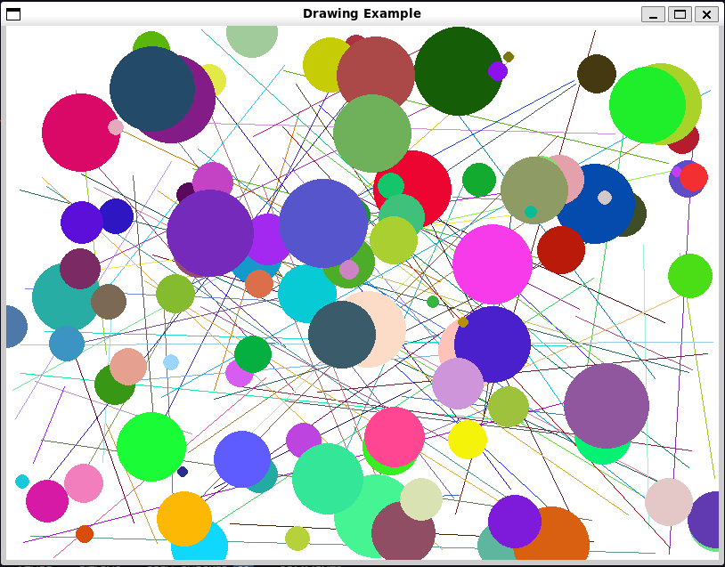
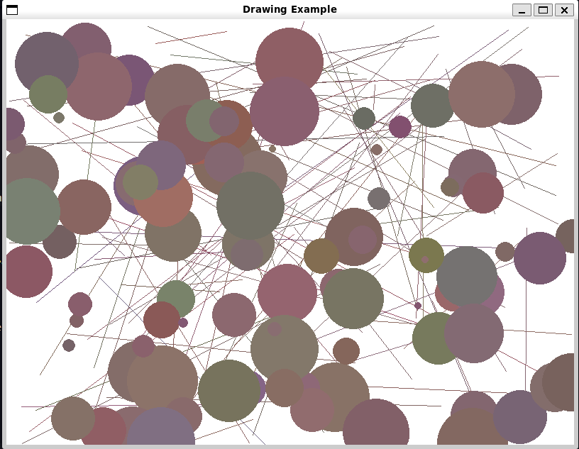
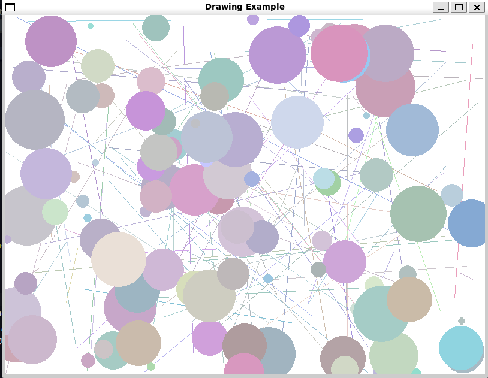
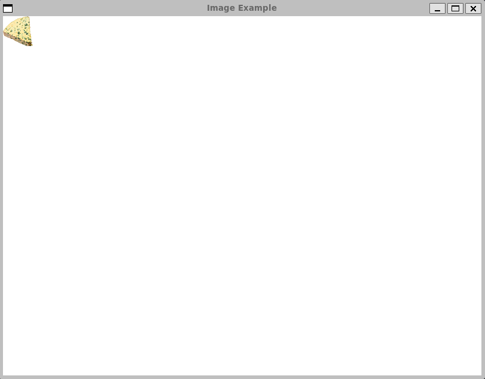
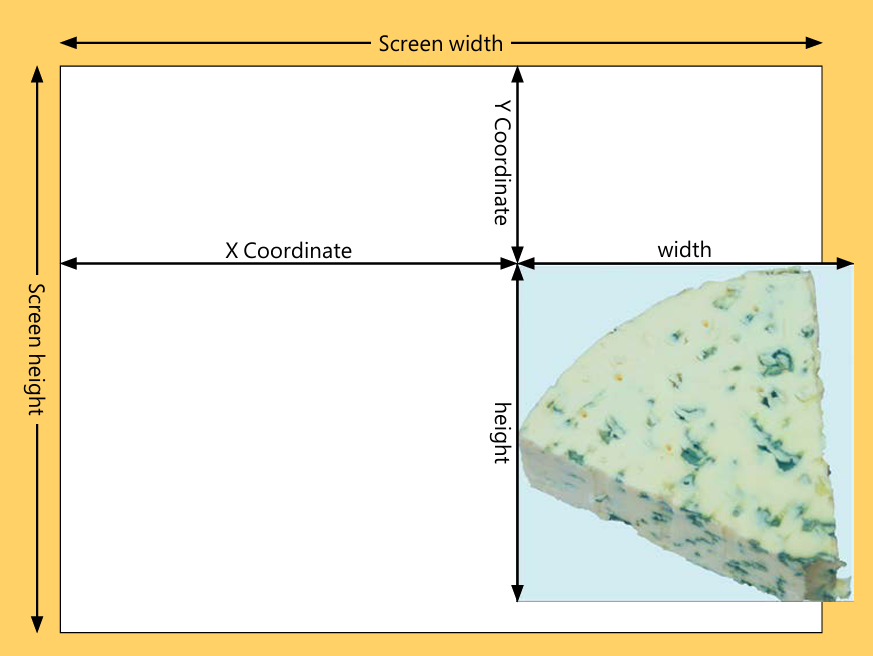
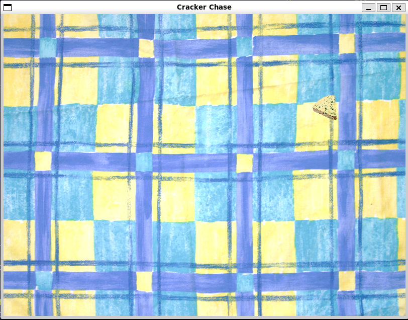

## Notes

### Getting Started with PyGame

- PyGame is a module for creating games
- This means that it includes support for graphics, sound, shapes etc.
- We've already seen this, pygame powered the [snaps module](../../01_ProgrammingFundamentals/03_PythonProgramStructure/Chapter_03.qmd#adding-some-snaps)
- pygame uses tuples to create items that contain colours and coordinates
    - Make sure you're familiar with tuples (see [Chapter 8](../../01_ProgrammingFundamentals/08_StoringCollectionsOfData/Chapter_08.qmd#tuples))

#### Make Something Happen: Start PyGame and Draw Some Lines

*The best way to learn is to dive right in. Open up the python interpreter and work through the following steps*

1. *load* `pygame`

    - This is done through the usual import

      ```python
        import pygame
      ```

    - We can now use pygame's functions and classes

2. *Initialise pygame*

    - The pygame framework needs to be initialised
    - This handles setting everything up
    - do so as follows

      ```python
        pygame.init()
      ```

    - This sets up the pygame elements for handling various tasks
    - This includes,
        1. Reading user input
        2. Making sounds
        3. and more...

    - `init` returns a tuple indicating how many elements have initialised and how many have failed
    - If an element fails to initialise it can indicate that pygame hasn't installed correctly
        1. The first element of the tuple is the number of successfully initialised elements
        2. The second element of the tuple is the number of failed elements

3. *Create a drawing surface*

    - To draw objects we first need to define a drawing surface
    - Drawing surface has a fixed size
        - Set at the time of creation
        - Size is specified in pixels
        - More pixels give a better quality display

      ```python
        size = (800, 600)
      ```

    - We can then use this size tuple to create our display

      ```python
        surface = pygame.display.set_mode(size)
      ```

    - This creates a drawing surface, references it with the variable `surface`
    - The result is then displayed

4. *Set the title*

    - Like with `tkinter` these windows have methods for changing how they display
    - We can change the title
    - Do so as follows,

      ```python
        pygame.display.set_caption("An awesome game")
      ```

5. *Draw something on the canvas*

    - Now we can draw on the canvas
    - For example we can draw a line
    - This takes four arguments
        1. The surface to draw on
        2. The drawing colour
        3. The start position of the line
        4. The end position of the line

    - We already have our surface
    - Next define a colour
        - This is a 3-tuple containing red, green, blue values from $0$ to $255$
            - The lowest level is $0$
            - The highest level is $255$
      ```python
        red = (255, 0, 0)
      ```

    - Now we need to define the start and end coordinates
    - Like with tkinter
        - $x$ coordinate measures from the left of the screen to the right
        - $y$ coordinate measures from the top of the screen to the bottom
    - We then represent a coordinate with a tuple `(x, y)`
    - Define our coordinates as below

      ```python
        start = (0,0)
        end = (500, 300)
      ```

    - Now we just have to issue our actual drawing command

      ```python
        pygame.draw.line(surface, red, start, end)
      ```

      ```{python}
      #| echo: false
      print("<rect(0, 0, 501, 301)>")
      ```

    - This returns a rectangle object enclosing the line
    - You can ignore this

6. *Render the line*

    - Looking at the window we can see that no line has appeared
    - Draw operations end up on the *back buffer*
        - Managed by pygame
    - We don't draw directly on the screen for every draw command
        - In the context of a video game we don't want to do every draw immediately
        - This is quite slow
        - We also might want to only show the final result rather than the immediate states
    - Instead all operations are drawn to the back buffer
        - When drawing is done this copy can be drawn over the display memory to replace it
        - The memory then used to display becomes the new back buffer
        - We then repeat
    - The `flip` function is used to swap the display and back buffer memory
    - Call it now

      ```python
        pygame.display.flip()
      ```

7. *Change the background*

    - Currently the background is black
    - We can use the `fill` function to change the background colour
    - The below creates a tuple with the colour white, paints the background, then applies this

      ```python
        white = (255, 255, 255)
        surface.fill(white)
        pygame.display.flip()
      ```
    - You'll notice this has erased the red line

- We can use these functions to create some images
- We'll create a function to draw $100$ randomly coloured and positioned lines and dots


```python
"""
Example 16.2 Pygame Drawing Functions

Demonstrates the use of pygame's drawing functionality to create
some artwork
"""

import random

import pygame


class DrawDemo:
    """
    Draws an image of randomly coloured and positioned lines and dots
    """

    @staticmethod
    def do_draw_demo():
        """
        Create a demonstration display
        """
        init_result = pygame.init()
        if init_result[1] != 0:
            print("Failed to initialise all elements, check pygame installation")

        width = 800
        height = 600
        size = (width, height)

        def get_random_coordinates():
            """
            Generates a random (X,Y) coordinate tuple

            Returns
            -------
            tuple[int, int]
                X,Y coordinates
            """
            X = random.randint(0, width - 1)
            Y = random.randint(0, height - 1)

            return (X, Y)

        def get_random_colour():
            """
            Generate a random (R,G,B) colour tuple

            Returns
            -------
            tuple[int, int, int]
                R,G,B colour tuple
            """
            red = random.randint(0, 255)
            green = random.randint(0, 255)
            blue = random.randint(0, 255)

            return (red, green, blue)

        surface = pygame.display.set_mode(size)
        pygame.display.set_caption("Drawing Example")

        red = (255, 0, 0)  # noqa: F841
        green = (0, 255, 0)  # noqa: F841
        blue = (0, 0, 255)  # noqa: F841
        black = (0, 0, 0)  # noqa: F841
        yellow = (255, 255, 0)  # noqa: F841
        magenta = (255, 0, 255)  # noqa: F841
        cyan = (0, 255, 255)  # noqa: F841
        white = (255, 255, 255)
        gray = (128, 128, 128)  # noqa: F841

        surface.fill(white)

        for count in range(100):
            start = get_random_coordinates()
            stop = get_random_coordinates()
            colour = get_random_colour()
            pygame.draw.line(surface, colour, start, stop)

        for count in range(100):
            pos = get_random_coordinates()
            colour = get_random_colour()
            radius = random.randint(5, 50)
            pygame.draw.circle(surface, colour, pos, radius)

        pygame.display.flip()


DrawDemo.do_draw_demo()
```

- The output should look similar (but slightly different) to the below

  

- As a personal aside, since we're implemented `do_draw_demo` as a static method there isn't really a need for there to be a class here
- We could really just write `do_draw_demo` as a standalone function

#### Make Something Happen: Making Art

*Create a program that varies a displayed pattern. Use the time of day and the weather to adjust the colours. Use bright primary colours in the morning and more mellow dark colours in the evening. If the weather is warm, the colours could have a red tinge, and if it's colder, you could create colours with more blues. Remember that you can create any colour you like for you graphics by modifying the amount of red, green and blue*

This one is quite a fun little program. We'll use the core implementation from [the previous example](#make-something-happen-start-pygame-and-draw-some-lines). The basic idea is to wrap the drawing code in a loop that will periodically redraw the image. The second step is to add code that will adjust the weighting of the generated colour in response to the time of day and the current weather.

Lets plan out how we generate out colours first. Before we generated a colour by randomly generating red, green, blue colour values from $0$ to $255$ using a uniform distribution. This means that each colour value is equally likely. We could tune the uniform distribution, e.g. by limiting it to a subrange of a colour value, then shifting this up and down the spectrum, but we'll instead use another distribution, the *gaussian*. A guassian distribution also called the normal distribution, lets us define a mean point, then the standard deviation (or spread) for our colour value. We can then clip the values to ensure they remain in the $0$ to $255$ range. The advantage of this is that we can then easily shift the mean to weight towards specific colours, but we still have a chance of generating any possible colour.

The code implementing this is given below

```python
    def get_random_colour(means):
        """
        Generate a random (R,G,B) colour tuple

        Parameters
        ----------
        means : tuple[int, int, int]
            Tuple containing the mean values in RGB space for the generated
            colours

        Returns
        -------
        tuple[int, int, int]
            R,G,B colour tuple
        """

        def random_single_colour_channel(mean, sigma):
            """
            Generate a random single colour value from 0 to 255

            Number is generated using a clipped gaussian

            Parameters
            ----------
            mean : int | float
                mean generated colour value
            sigma : int | float
                standard deviation in generated colour

            Returns
            -------
            int
                colour channel value between 0 and 255 inclusive
            """
            return int(max(0, min(255, random.gauss(mean, sigma))))

        sigma = 20
        red = random_single_colour_channel(means[0], sigma)
        green = random_single_colour_channel(means[1], sigma)
        blue = random_single_colour_channel(means[2], sigma)

        return (red, green, blue)
```

- We set our standard deviation to $20$
    - This was chosen through trial and error, to give a decent spread of colours
- `random_single_colour_channel` takes a mean and sigma (standard deviation), then generates a colour value using a Gaussian distribution
    - We then clip the value to the range $0$ to $255$
- `get_random_colour` wraps the above function
    - It defines the standard deviation
    - Then generates colour values for red, green and blue
    - It accepts a tuple of means corresponding to the mean red, green and blue component
        - This lets us shift the mean amount of each individual colour individually
- We then want to add code to shift these means based on the temperature and time of day
- For temperature, we want to increase the amount of red when it is hot, and increase the amount of blue when it is cold
- We first need to get the temperature data, which we do by using the Weather Data program from [Chapter 14](../14_PythonProgramsAsNetworkClients/Chapter_14.qmd#make-something-happen-work-with-weather-data) as a module
- We then want to convert the temperature to celsius (because I intuitively understand those values)
    - We then use a basic formula for shifting the mean, we use the formula,

      $$
        \left(R, G, B\right) = \text{scale} \times \left(\text{temperature} - \text{offset}\right)
      $$

    - The idea is we define a *hot* threshold, and then increase the red the more the temperature is above this threshold
    - We then scale this by a scale factor to ensure the appropriate impact on the mean
    - We define a similar setup for a *cold* threshold to increase the blue
    - We want to return the final result as a tuple of R,G,B shift, because this will be easier to work with and means we don't need to denote which colour value we are adjusted

  ```python
    def fahrenheit_to_celsius(temperature):
        """
        Convert fahrenheit to celsius

        Parameters
        ----------
        temperature : int | float
            the temperature in fahrenheit

        Returns
        -------
        int | float
            temperature in celsius
        """
        return (temperature - 32.0) * (5 / 9)


    def convert_temperature_to_colour_shift(temperature):
        """
        Convert the given temperature into an RGB colour shift

        Low temperatures give a blue shift, high temperatures give a red shift

        Parameters
        ----------
        temperature : int | float
            the current temperature

        Returns
        -------
        tuple[int, int, int]
            tuple giving the colour shift in RGB
        """
        scale_factor = 10
        # if hot increase the amount of red (more heat = more red)
        if temperature > 25:
            return (scale_factor * (int(temperature) - 25), 0, 0)
        # if cold increase the amount of blue (lower temp = more blue)
        elif temperature < 10:
            return (0, 0, -scale_factor * (temperature - 10))  # i.e. 10 -> 0, -10 -> 20
        else:
            return (0, 0, 0)
  ```

- We then want to use the same idea for the time. However in this case we want higher saturation colours early in the morning, and low saturation colours late in the day
    - A high saturation colour has high values across $(R,G,B)$
    - A low saturation colour has low values across $(R,G,B)$
        - So we want to adjust the mean across all three colours

  ```python
    def convert_hour_to_colour_shift(hour):
        """
        Convert the given time into an RGB colour shift

        Night times give a shift towards smaller RGB values, morning times
        give a shift towards larger RGB values

        Parameters
        ----------
        hour : int
            the current hour

        Returns
        -------
        tuple[int, int, int]
            RGB colour tuple giving the colour shift in RGB space
        """

        scale_factor = 20
        offset = 12

        if 6 <= hour <= 12:
            # want morning to increase the average
            shift = scale_factor * (offset - hour) # shift range: (0 - 120)
        elif 18 <= hour or hour < 6:
            # want evening to decrease the range
            shift = -(scale_factor * abs(offset - hour)) # shift range (0 - 120)
        else:
            shift = 0

        return (shift, shift, shift)
  ```

- We use the same kind of formula as before, however this time we shift the mean for all three colours
- We have two cases
    - Morning, in which case we can use the simple formula before (We define morning as between $6$ and $12$)
    - Evening, here we want to get more mellow as we get close to midnight, then progressively less mellow
    - So we can use the same idea as before but we want to use `abs` or absolute value to effectively measure the distance of the current hour to midnight
- The drawing code is then given as

  ```python
    def draw_art(surface, width, height, hour, temperature):
        """
        Draw an artwork with time and temperature dependent colouring

        Parameters
        ----------
        surface : surface
            pygame surface to draw on
        width : int
            width of the image in pixels
        height : int
            height of the image in pixels
        hour : int
            The current hour
        temperature : int | float
            The current temperature
        """

        def get_random_coordinates():
            """
            Generates a random (X,Y) coordinate tuple

            Returns
            -------
            tuple[int, int]
                X,Y coordinates
            """
            X = random.randint(0, width - 1)
            Y = random.randint(0, height - 1)

            return (X, Y)

        def get_random_colour(means):
            """
            Generate a random (R,G,B) colour tuple

            Parameters
            ----------
            means : tuple[int, int, int]
                Tuple containing the mean values in RGB space for the generated
                colours

            Returns
            -------
            tuple[int, int, int]
                R,G,B colour tuple
            """

            def random_single_colour_channel(mean, sigma):
                """
                Generate a random single colour value from 0 to 255

                Number is generated using a clipped gaussian

                Parameters
                ----------
                mean : int | float
                    mean generated colour value
                sigma : int | float
                    standard deviation in generated colour

                Returns
                -------
                int
                    colour channel value between 0 and 255 inclusive
                """
                return int(max(0, min(255, random.gauss(mean, sigma))))

            sigma = 20
            red = random_single_colour_channel(means[0], sigma)
            green = random_single_colour_channel(means[1], sigma)
            blue = random_single_colour_channel(means[2], sigma)

            return (red, green, blue)

        white = (255, 255, 255)
        surface.fill(white)

        mean = 128
        means = (mean, mean, mean)
        hour_shift = convert_hour_to_colour_shift(hour)
        temperature_shift = convert_temperature_to_colour_shift(temperature)

        new_means = []
        for i in range(len(means)):
            new_means.append(means[i] + hour_shift[i] + temperature_shift[i])
        means = tuple(new_means)

        for count in range(100):
            start = get_random_coordinates()
            stop = get_random_coordinates()
            colour = get_random_colour(means)
            pygame.draw.line(surface, colour, start, stop)

        for count in range(100):
            pos = get_random_coordinates()
            colour = get_random_colour(means)
            radius = random.randint(5, 50)
            pygame.draw.circle(surface, colour, pos, radius)

        pygame.display.flip()


    def update_artwork_mainloop():
        """
        Create an art work that updates hourly
        """
        init_result = pygame.init()
        if init_result[1] != 0:
            print("Failed to initialise all elements, check pygame installation")

        width = 800
        height = 600
        size = (width, height)

        surface = pygame.display.set_mode(size)
        pygame.display.set_caption("Drawing Example")

        while True:
            hour = time.localtime().tm_hour
            latitude = 47.61
            longitude = -122.33

            _, _, temperature, _ = WeatherData.get_weather_temp(
                latitude=latitude, longitude=longitude
            )
            temperature = fahrenheit_to_celsius(temperature)
            print(
                "Updating artwork, it is {0} and the temperature is {1}C".format(
                    hour, temperature
                )
            )
            draw_art(surface, width, height, hour, temperature)
            time.sleep(60 * 30) # update every 30 minutes


    update_artwork_mainloop()

  ```

- This program will redraw the artwork every half an hour
- When it does it pulls the current time and temperature (We're sticking with Seattle here)
- Then redraws the image
- Two example images are shown below, the first later at night, the second earlier in a cold morning

  
  

### Draw Images using Pygame

- Pygame can draw images on the screen
- Images are loaded from files

#### Image File Types

- There are many different image formats
- For pygame you should use one of the following

    1. PNG
        - This format is lossless
        - An exact version of the image is always stored
        - PNG can also have transparent sections
            - Allows images to be drawn on top of each other
    2. JPEG
        - This format is *lossy*
        - The program stores a compressed version of the image
        - Smaller, but less precise

- You should use JPEG for large background images and PNG for items drawn over the top

:::{.callout-tip}
**You can use an image manipulation program to convert image file types**

Most image programs will let you load a png or jpeg and export it as a different format. Some common examples include paint (bundled with Windows), paint.net (a free download) or GIMP (a free heavy duty image manipulation program similar to photoshop)
:::

#### Load an Image into a Game

- The pygame `image` module handles displayed images
- Images are loaded by providing the file path using the `load` function
    - The path can be relative to the directly that the program is running from
- For example below loads an image and assigns it to a variable

  ```python
    cheeseImage = pygame.image.load("cheese.png")
  ```

- Loading an image is separate to actually drawing the image
- Drawing is the process of actually copying the image into the display memory
- `blit` is the method that performs this action
- `blit` requires
    1. The image to be drawn
    2. The coordinates on the screen where the image is to be blitted
- To put `cheeseImage` at the top left corner we can write,

  ```python
    cheesePos = (0, 0)
    surface.blit(cheeseImage, cheesePos)
  ```

- This assume `surface` is the display window as discussed in the [previous section](#make-something-happen-start-pygame-and-draw-some-lines)
- The [complete program](./Examples/03_DrawImage/DrawImage.py) can be seen below

  ```python
    """
    Example 16.3 Draw Image

    Demonstrates drawing an image with pygame
    """

    import time

    import pygame


    def do_image_demo():
        """
        Demonstrate loading and drawing an image using pygame

        Returns
        -------
        None
        """
        init_result = pygame.init()
        if init_result[1] != 0:
            print(
                "pygame failed to load {0} elements. Please verify installation".format(
                    init_result[1]
                )
            )

        width = 800
        height = 600
        size = (width, height)

        surface = pygame.display.set_mode(size)
        pygame.display.set_caption("Image Example")

        white = (255, 255, 255)
        surface.fill(white)

        cheeseImage = pygame.image.load("cheese.png")
        cheesePos = (0, 0)
        surface.blit(cheeseImage, cheesePos)
        pygame.display.flip()


    if __name__ == "__main__":
        do_image_demo()
        time.sleep(10)
  ```

- The screen should look like below

  

#### Make an Image Move

- `blit` draws an image
- If we want to make an image move we can repeatedly call `blit`
- See the [example below](./Examples/04_MovingImage/MovingImage.py), you should see the image move from the top left corner towards the botttom right

  ```python
    """
    Example 16.4 Moving Image

    Demonstrates using `blit` to make an image move in pygame
    """

    import time

    import pygame


    def show_moving_image():
        """
        Demonstrate a moving image in pygame

        Returns
        -------
        None
        """
        init_result = pygame.init()
        if init_result[1] != 0:
            print(
                "Failed to initialise {0} elements, verify pygame installation".format(
                    init_result[1]
                )
            )

        def setup_pygame_window(caption):
            """
            Setup a pygame window with the specified caption

            Parameters
            ----------
            caption : str
                caption for the window

            Returns
            -------
            Surface
                the window
            """
            width = 800
            height = 600
            size = (width, height)
            surface = pygame.display.set_mode(size)
            pygame.display.set_caption(caption)

            return surface

        surface = setup_pygame_window("Moving Image Example")
        cheeseImage = pygame.image.load("cheese.png")

        cheeseX = 40
        cheeseY = 60

        clock = pygame.time.Clock()

        for i in range(1, 100):
            clock.tick(30)  # pause the game to 30 frames per second
            surface.fill((255, 255, 255))
            cheeseX = cheeseX + 1
            cheeseY = cheeseY + 1
            cheesePos = (cheeseX, cheeseY)
            surface.blit(cheeseImage, cheesePos)
            pygame.display.flip()


    if __name__ == "__main__":
        show_moving_image()
        time.sleep(10)

  ```

##### Make Something Happen: Move an Image

Lets work through the previous example in some detail to understand some of the intricacies around handling a moving image. When you run the program you should see the cheese image move diagonally down the screen. The speed is controlled by the *frame rate*. The frame rate is the rate at which the screen is updated or redrawn. Pygame provides the `Clock` class which contains the `tick` method. This can be passed the target frame rate. We start by creating a clock before moving the sprite

```python
clock = pygame.time.Clock()
```

`Clock` contains other methods for controlling how time progresses. We'll stick with using `tick` for now, which makes the game run at a constant speed. By default the program will try to update as fast as python can execute

```python
clock.tick(30)
```

`tick` pauses the game until the next "slot". Effectively the next frame. If you updated the argument from $30$ to $60$ the program will now target $60$ frames per second and should run twice as fast. If you instead changed the argument to $5$ the program will run much slower. Typically games target frame rates between $30$ and $60$.

### Get User Input from Pygame

- We've seen how to display and update images on a screen
- Now we need to add interactivity
- Much like [tkinter](../13_PythonAndGraphicalUserInterfaces/Chapter_13.qmd#tkinter-events), pygame updates in response to *events*
    - An event is a user action
        - Like pushing a button
        - Clicking the mouse etc
- In tkinter, we saw that we bound events to components
- Pygame instead uses a queue
    - The queue is polled regularly for events to respond to

#### Make Something Happen: Investigate Events in Pygame

*Work through the basics of events in pygame by opening an interpreter and following the steps below*

1. *Create a pygame window*

    - This should be straightforward by now

      ```python
        import pygame
        pygame.init()
        size = (800, 600)
        surface = pygame.display.set_mode(size)

2. *Capture events in pygame*

    - Clicking the mouse and pressing keys will generate events
    - First step to responding to events is to capture them
    - Execute the following,

      ```python
        for e in pygame.event.get():
            print(e)
      ```

    - This should print out the events you issued previously
    - `get` method returns a collection of events
    - The loop then lets us iterate over the events in the collection
    - Some sample is displayed below

      ```python
      #| echo: false
        print("<Event(768-KeyDown {'unicode': 'h', 'key': 104, 'mod': 4096, 'scancode': 11, 'window': None})")
        print("<Event(771-TextInput {'text': 'i', 'window': None})>")
        print("<Event(769-KeyUp {'unicode': 'i', 'key': 105, 'mod': 4096, 'scancode': 12, 'window': None})>")
        print("<Event(1024-MouseMotion {'pos': (440, 253), 'rel': (-7, 4), 'buttons': (0, 0, 0), 'touch': False, 'window': None})>")
        print("<Event(1024-MouseMotion {'pos': (425, 263), 'rel': (-15, 10), 'buttons': (0, 0, 0), 'touch': False, 'window': None})>")
      ```
    - Each event is described by a dictionary holding information about the event
    - Above we can see a mix of mouse moves combined with key presses and text input

- We need to periodically check the event queue for events
- If these events should cause some state update then we have to respond to them
- For example, we might want our moving image to be controlled by the arrow keys
- Below shows an [example](./Examples/05_ControllableImage/ControllableImage.py) and has the added functionality that pressing ESC closes the game

  ```python
    def show_moving_image():
        """
        Demonstrate a moving image in pygame

        Returns
        -------
        None
        """
        surface = setup_pygame_window("Controllable Image")
        image = pygame.image.load("cheese.png")

        cheeseX = 40
        cheeseY = 60
        cheeseSpeed = 2
        cheeseMovingUp = False
        cheeseMovingDown = False

        clock = pygame.time.Clock()

        while True:
            clock.tick(60)
            for e in pygame.event.get():
                if e.type == pygame.KEYDOWN:
                    if e.key == pygame.K_ESCAPE:
                        pygame.quit()
                        return
                    if e.key == pygame.K_UP:
                        cheeseMovingUp = True
                    elif e.key == pygame.K_DOWN:
                        cheeseMovingDown = True
                elif e.type == pygame.KEYUP:
                    if e.key == pygame.K_UP:
                        cheeseMovingUp = False
                    elif e.key == pygame.K_DOWN:
                        cheeseMovingDown = False
            if cheeseMovingDown:
                cheeseY = cheeseY + cheeseSpeed
            if cheeseMovingUp:
                cheeseY = cheeseY - cheeseSpeed

            cheesePos = (cheeseX, cheeseY)
            surface.fill((255, 255, 255))
            surface.blit(image, cheesePos)
            pygame.display.flip()
  ```

- See the full example for all the rest of the setup


#### Code Analysis: Game Loops

*The above provides a very basic example of whats called a game loop. Consider the following questions*

1. *What is the variable* `e` *used for in the program?*

    - `e`contains the current event being examined
    - We only care about events corresponding to key presses (`KEYDOWN`) and releases (`KEYUP`)
    - When a key is pressed, we
        - Check if an arrow key is pressed
        - If it's an up arrow, we set the flag to indicate that we should move up
        - If it's a down arrow we set the flag to indicate tthat we should move down
        - We then have a matching pair that resets the flag when the corresponding key is released

2. *Why does the cheese move when a key is held down?*

    - Statements are updated every $60$ times
    - If a key is down, then the cheese moves every iteration of the loop

3. *How do you change the speed of the image?*
    - This is stored in the variable `cheeseSpeed`
    - We just have to change the value of this variable
    - We could make this a more complicated function, for example adding acceleration

4. *Why do we increase the value of y to move the cheese down the screen?*

    - This is because the y coordinates on a pixel display increase as we go down the screen

5. *What would happen if the player pressed both the up and down arrows at the same time?*

    - Cheese would move both up and down
    - Net result would be that the cheese doesn't move at all

6. *What would happen if the player moved the cheese right off the screen?*

    - The program disappears off the screen and is no longer visible
    - Nothing in the code restricts it to the visible screen

7. *What does the* `pygame.quit()` *method do?*

    - It closes pygame and causes the window to be closed
    - Makes sure that all the proper clean up is carried out

### Create Game Sprites

- Our game will display three sprites
    1. **Cheese**
        - Steered by the player around the screen
    2. **Crackers**
        - The goal, a player tries to catch the crackers
    3. **Tomatoes**
        - Enemies, the tomato will chase the cheese
- Screen objects are typically called *sprites*
    - A sprite is an image part of the game display
- We can encapsulate the basic behaviour of all our sprites in a base class `Sprite`
- A `Sprite` will have
    - The image to draw
    - A position on the screen,
    - a set of behaviours
        - Draw itself on the screen
        - Update itself
            - E.g. `Cheese` will move in response to player input
            - `Tomato` chases the player
        - Reset itself
            - When starting the game, we have to reset the sprites

  ```python
    class Sprite:
        """
        Base class for a game Sprite

        Attributes
        ----------
        image : surface
            The sprite image
        game :
        """

        def __init__(self, image, game):
            """
            Create a new `Sprite`

            Parameters
            ----------
            image : pygame.Surface
                image to draw
            game :
            """
            self.image = image
            self.position = (0, 0) #list so it's mutable
            self.game = game
            self.reset()

        def update(self):
            """
            Update the sprite

            Called in the game loop to update the status of the sprite. Does
            nothing in the superclass
            """
            pass

        def draw(self):
            """
            Draw the sprite on the screen

            The sprite is drawn at it's current position
            """
            self.game.surface.blit(self.image, self.position)

        def reset(self):
            """
            Reset the sprite

            Called at the start of the game
            """
            pass
  ```

#### Code Analysis: Sprite Superclass

*Work through the following questions to understand how the* `Sprite` *campaign works*

1. *What is the* `game` *parameter used for in the initializer?*

    - New sprites have no knowledge of which game they belong to
    - But they need to know this so they can use game information
    - e.g. if the cheese captures a cracker, score is updated, and the sprites might change
    - This *tightly couples* the `Sprite` class and the `Game` class
        - Changes in the game may flow through to our sprite representations
        - Generally want to avoid tight coupling
            - Means changes in the game will have to be propagated to the sprite

2. *Why are the* `update` *and* `reset` *methods empty?*

    - `Sprite` as a base class is a template for subclasses
    - By default there's not a need for every sprite to change, e.g. a background
        - Subclasses probably want to have very specific `update` and `reset`
    - So in the base class we put the most generic / basic behaviour
        - Let more complex subclasses overwrite them
    - The advantage is that this gives us a generic interface that we can use to refer to *any* sprite

3. *How does the* `draw` *method work?*

    - The `draw` method asks the sprite to draw itself on screen

      ```python
        def draw(self):
            self.game.surface.blit(self.image, self.position)
      ```

    - `game` contains an attribute `surface`
        - This is the window to draw on
    - We use the internally stored `image` and `position` to draw the image

- The base `Sprite` class doesn't do much
- Can be used to implement a generic background
- Here we'll use a tablecloth
- Can be thought of as a big sprite that covers the entire screen
- We just need to add the basic game loop

  ```python
    class CrackerChase:
        """
        CrackerChase game

        Runs a simple game loop to display a background sprite
        """

        def play_game(self):
            """
            Load the game and start the game loop

            Returns
            -------
            None
            """
            init_result = pygame.init()
            if init_result[1] != 0:
                print("Failed to initialise {0} elements, verify pygame installation".format(init_result))

            width = 800
            height = 600
            self.size = (height, width)

            self.surface = pygame.display.set_mode(self.size)
            pygame.display.set_caption("Cracker Chase")
            self.background_sprite = Sprite(pygame.image.load("background.png"), self)

            clock = pygame.time.Clock()
            while True:
                clock.tick(60)
                for e in pygame.event.get():
                    if e.type == pygame.KEYDOWN:
                        if e.key == pygame.K_ESCAPE:
                            pygame.quit()
                            return
                self.background_sprite.draw()
                pygame.display.flip()

  ```

#### Code Analysis: `Game` Class

*The above class is the shell of our the final class we'll use to implement our game. Work through the following questions to make sure you understand how the class works*

1. *How does the game pass a reference to itself to the sprite constructor?*

    - `self` references the object within which a method is running
    - `self` can be passed around like any other variable, including as a function argument

      ```python
        self.background_sprite = Sprite(image=pygame.image.load("background.png"),  game=self)
      ```

    - Above creates a new `Sprite` instance, and passes the game's `self` reference so the `Sprite` references the current game

2. *Why does the game call the* `draw` *method on the sprite to draw it? Can't the game just draw the image held inside the sprite?*

    - This is a question of responsibility
    - Should the sprite draw itself, or should the game draw the sprite?
        - Generally making a sprite draw itself gives us more flexibility
    - We could make sprites composable
        - e.g. letting a sprite draw a smoke sub-sprite behind it
        - We could add this logic to smoke sprites
        - Making the game track all this composition would get complex fast
    - The game needing to only keep track of which sprites are in existence then call the draw method is a much cleaner interface

3. *Does this mean when the game is run the entire screen is redrawn each time, even if nothing is on the screen?*

    - Yes
    - This is how most games work, it is often quicker to just redraw an entire screen then first spend all the time recalculating what has changed

- With our two classes, we can then start the game

  ```python
    game = CrackerChase()
    game.play_game()
  ```

The full code is given in [Sprite.py](./Examples/06_Sprite/Sprite.py)


#### Add a Player Sprite

- We've already seen the basic idea behind the player sprite with the [steerable cheese](#make-an-image-move)
- The trick here is to implement this into our sprite framework

  :::{.callout-note}
  **Structure your code as you go**

  Before we just had everything in the one file. This was good because we only had the basic sprite and a pretty simple game. Now I'll separate the sprites out into one file and the game logic into another. This is a good way to develop, we split out the functionality as it gets to the appropriate size.
  :::

- We'll create a `Cheese` class to handle the player sprite class

  ```python
    class Cheese(Sprite):
        """
        Player controlled cheese sprite

        Steerable cheese sprite controllable by the player
        """
        def reset(self):
            """
            Reset the player sprite

            Stops the sprite moving and returns it to it's starting position

            Returns
            -------
            None
            """
            self.movingUp = False
            self.movingDown = False
            self.movingLeft = False
            self.movingRight = False

            self.position = [(self.game.width - self.image.get_width())/2, (self.game.height - self.image.get_height())/2]
            self.speed = [5,5]


        def update(self):
            """
            Update the cheese position

            Notes
            -----
            Ensures the player is restricted to the play screen

            Returns
            -------
            None
            """
            if self.movingUp:
                self.position[1] = self.position[1] - self.speed[1]
            if self.movingDown:
                self.position[1] = self.position[1] + self.speed[1]
            if self.movingLeft:
                self.position[0] = self.position[0] - self.speed[0]
            if self.movingRight:
                self.position[0] = self.position[0] + self.speed[0]

            # bound movement to the game space
            if self.position[0] < 0:
                self.position[0] = 0
            if self.position[1] < 0:
                self.position[1] = 0
            if self.position[0] + self.image.get_width() > self.game.width:
                self.position[0] = self.game.width - self.image.get_width()
            if self.position[1] + self.image.get_height() > self.game.height:
                self.position[1] = self.game.height - self.image.get_height()

        def startMovingUp(self):
            """
            Start the cheese moving up

            Returns
            -------
            None
            """
            self.movingUp = True

        def stopMovingUp(self):
            """
            Stop the cheese moving up

            Returns
            -------
            None
            """
            self.movingUp = False

        def startMovingDown(self):
            """
            Start the cheese moving down

            Returns
            -------
            None
            """
            self.movingDown = True

        def stopMovingDown(self):
            """
            Stop the cheese moving down

            Returns
            -------
            None
            """
            self.movingDown = False

        def startMovingLeft(self):
            """
            Start the cheese moving left

            Returns
            -------
            None
            """
            self.movingLeft = True

        def stopMovingLeft(self):
            """
            Stop the cheese moving left

            Returns
            -------
            None
            """
            self.movingLeft = False

        def startMovingRight(self):
            """
            Start the cheese moving right

            Returns
            -------
            None
            """
            self.movingRight = True

        def stopMovingRight(self):
            """
            Stop the cheese moving right

            Returns
            -------
            None
            """
            self.movingRight = False
  ```

##### Code Analysis: Player Sprite

*Our* `Cheese` *sprite encapsulates the player functionality. You can find the example code in [Sprite.py](./Examples/07_GameWithPlayer/Sprite.py). Work through the following questions*

1. *Why does the* `Cheese` *class not have an* `__init__` *or* `draw` *method?*

    - The `Cheese` class subclasses `Sprite`
    - It inherits the `__init__` and `draw` methods from `Sprite`
    - We don't need to overwrite those so we can just leave them implicit

2. *What do the* `get_width` *and* `get_height` *methods do?*

    - They are provided by the pygame image class
    - Let us determine the width and height of an image
    - We use it to properly bound the player sprite to the window

     

    - Program knows the position of the cheese
        - Position being the top left corner of the sprite
    - So we can make sure the cheese is in on the left of the screen by just checking the current position
        - To check the right, we have to check that the current position plus the image's width is within the window width

          ```python
            if self.position[0] + self.image.get_width() > self.game.width:
                self.position[0] = self.game.width - self.image.get_width()
          ```

        - Identical logic follows for the $y$ axis
    - We store the position in a list so that we can mutate the position
        - Rather than a tuple as we've used for positions before
        - This is because a tuple is *immutable*
    - Restricting a sprite to the screen is also called *clamping*
    - We also start the cheese at the centre of the screen

      ```python
        self.position[0] = (self.game.width - self.image.get_width()) / 2
        self.position[1] = (self.game.height - self.image.get_height()) / 2
      ```

#### Control the Player Sprite

- We then have to update the `Game` class to add the player sprite in

  ```python
    """
    Example 16.7a Game

    Contains the main game loop class for our cracker chasing game
    """
    import pygame

    import Sprite

    class CrackerChase:
        """
        CrackerChase game

        Runs a simple game loop to display a background sprite

        Attributes
        ----------
        size : tuple[int, int]
            The size of the game screen in pixels
        surface : pygame.Surface
            The game window
        background_sprite : Sprite
            Sprite representing the background of the game
        """

        def play_game(self):
            """
            Load the game and start the game loop

            Returns
            -------
            None
            """
            init_result = pygame.init()
            if init_result[1] != 0:
                print("Failed to initialise {0} elements, verify pygame installation".format(init_result))

            self.width = 800
            self.height = 600
            self.size = (self.width, self.height)

            self.surface = pygame.display.set_mode(self.size)
            pygame.display.set_caption("Cracker Chase")

            self.background_sprite = Sprite.Sprite(pygame.image.load("Images/background.png"), self)
            self.player_sprite = Sprite.Cheese(pygame.image.load("Images/cheese.png"), self)


            clock = pygame.time.Clock()
            while True:
                clock.tick(60)
                for e in pygame.event.get():
                    if e.type == pygame.KEYDOWN:
                        if e.key == pygame.K_ESCAPE:
                            pygame.quit()
                            return
                        elif e.key == pygame.K_UP:
                            self.player_sprite.startMovingUp()
                        elif e.key == pygame.K_DOWN:
                            self.player_sprite.startMovingDown()
                        elif e.key == pygame.K_LEFT:
                            self.player_sprite.startMovingLeft()
                        elif e.key == pygame.K_RIGHT:
                            self.player_sprite.startMovingRight()
                    elif e.type == pygame.KEYUP:
                        if e.key == pygame.K_UP:
                            self.player_sprite.stopMovingUp()
                        elif e.key == pygame.K_DOWN:
                            self.player_sprite.stopMovingDown()
                        elif e.key == pygame.K_LEFT:
                            self.player_sprite.stopMovingLeft()
                        elif e.key == pygame.K_RIGHT:
                            self.player_sprite.stopMovingRight()

                self.background_sprite.draw()
                self.background_sprite.update()
                self.player_sprite.draw()
                self.player_sprite.update()
                pygame.display.flip()

    if __name__ == "__main__":
        game = CrackerChase()
        game.play_game()
  ```

- This allows the player sprite to be controlled with the arrow keys
- Running this code ([Game.py](./Examples/07_GameWithPlayer/Game.py)) will show a screen with the player that can be moved around the screen
    - You should be unable to move off the screen


  

#### Add a Cracker Sprite

- We now need to add targets for the player
- This is a new sprite type, *Crackers*
    - The player must try to catch these crackers
- When a player captures a cracker their score increases
    - The cracker then moves elsewhere
- `Cracker` again subclasses `Sprite`
- The class itself inherits most of its functionality from `Sprite`
    - Only need to update the `reset` method

## Summary


## Questions and Answers
